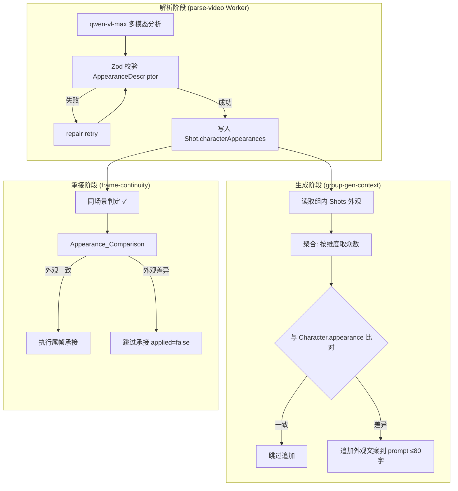
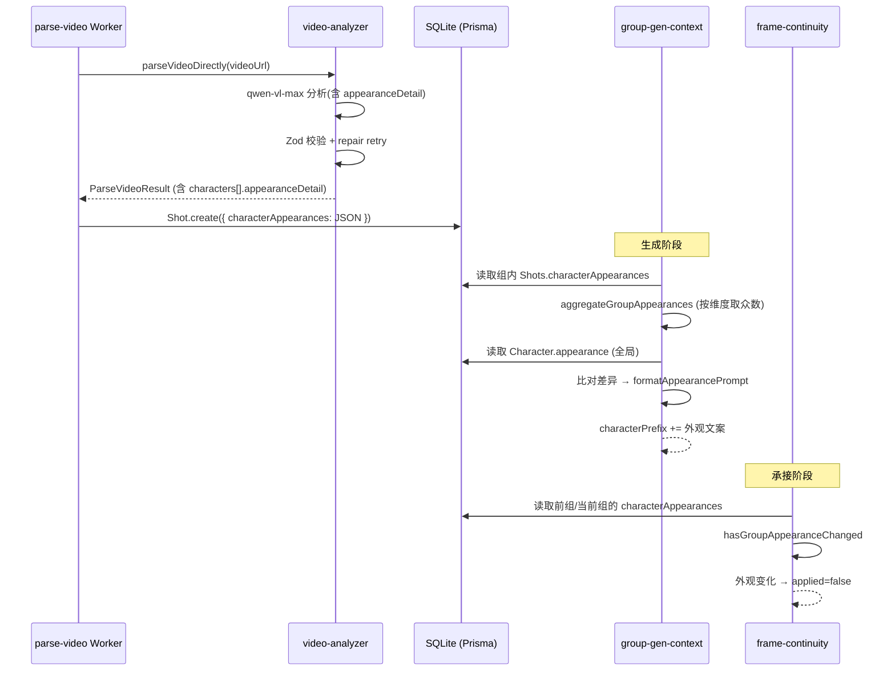

# Design Document: AI 角色外观状态变化自动识别

## Overview

本功能在现有视频解析→生成链路中嵌入角色外观感知层，实现全自动的角色造型变化适配。核心流程：

1. **解析阶段**：在 `video-analyzer.ts` 的多模态分析中，扩展系统提示词要求 qwen-vl-max 输出每位角色的四维外观描述（发型、服装、配饰、妆容）
2. **持久化**：在 Shot 表新增 `characterAppearances` JSON 字段存储外观数据
3. **生成阶段**：`group-gen-context.ts` 读取组级聚合外观，与全局 Character.appearance 比对，差异时追加描述到 Seedance prompt
4. **承接阶段**：`frame-continuity.ts` 在同场景判定后追加外观比对，差异时跳过尾帧承接

全流程零用户操作，失败时优雅降级（外观设为空数组继续主流程）。

## Architecture



## Components and Interfaces

### 1. AppearanceDescriptor 数据结构

```typescript
/** 角色外观描述，四个维度均为文本描述，无法识别时为空字符串 */
export interface AppearanceDescriptor {
  /** 发型描述（如"黑色长发马尾"） */
  hair: string
  /** 服装描述（如"白色衬衫搭配深蓝色西裤"） */
  clothing: string
  /** 配饰描述（如"金色耳环、黑框眼镜"） */
  accessories: string
  /** 妆容描述（如"淡妆、红色口红"） */
  makeup: string
}
```

### 2. Zod Schema 扩展（shot-schema.ts）

```typescript
import { z } from 'zod/v4'

/** 外观描述 Schema：四个维度均为可空字符串（空字符串表示无法识别） */
export const AppearanceDescriptorSchema = z.object({
  hair: z.string().default(''),
  clothing: z.string().default(''),
  accessories: z.string().default(''),
  makeup: z.string().default(''),
})

/** 扩展 characters 数组中的角色 Schema */
export const CharacterWithAppearanceSchema = z.object({
  name: z.string(),
  appearance: z.string(),
  appearanceDetail: AppearanceDescriptorSchema.optional(),
})
```

### 3. appearance-comparator.ts（新增模块）

```typescript
/** src/lib/appearance-comparator.ts */

export interface AppearanceDescriptor {
  hair: string
  clothing: string
  accessories: string
  makeup: string
}

/**
 * 文本规范化：去除首尾空白、统一小写、移除标点符号
 * 纯函数，用于外观比对前的噪声消除
 */
export function normalizeAppearanceText(text: string): string

/**
 * 比对两个 AppearanceDescriptor 是否存在差异。
 * 规则：
 * - 逐维度比对（hair, clothing, accessories, makeup）
 * - 某维度在任一侧为空字符串时忽略该维度
 * - 比对前执行 normalizeAppearanceText 规范化
 * - 任一非空维度存在差异即返回 true（外观变化）
 */
export function hasAppearanceChanged(
  prev: AppearanceDescriptor,
  next: AppearanceDescriptor
): boolean

/**
 * 比对两组中所有共有角色的外观是否发生变化。
 * - 提取两组中共有的角色名集合
 * - 对每个共有角色调用 hasAppearanceChanged
 * - 任一角色外观变化即返回 true
 * - 无共有角色时返回 false（不影响承接决策）
 */
export function hasGroupAppearanceChanged(
  prevAppearances: Map<string, AppearanceDescriptor>,
  nextAppearances: Map<string, AppearanceDescriptor>
): boolean

/**
 * 从一组 Shot 的 characterAppearances 中聚合出每位角色的代表外观。
 * 按维度取众数（出现频率最高的非空描述），平局时取首次出现。
 */
export function aggregateGroupAppearances(
  shotAppearances: Array<Array<{ name: string; appearance: AppearanceDescriptor }>>
): Map<string, AppearanceDescriptor>

/**
 * 格式化外观差异文案，控制在 maxLength 字以内。
 * 格式：「本镜头中{角色名}的造型：{各维度描述拼接}」
 * 超长时从末尾截断并加省略号。
 */
export function formatAppearancePrompt(
  characterName: string,
  appearance: AppearanceDescriptor,
  maxLength?: number // 默认 80
): string
```

### 4. video-analyzer.ts 扩展

- 在 `SYSTEM_PROMPT` 中追加 `appearanceDetail` 字段要求，指导模型按四维度输出
- `ShotSchema` 的 `characters` 数组扩展为包含 `appearanceDetail` 对象
- 失败时 `appearanceDetail` 设为空对象（各维度为空字符串），不阻塞解析

### 5. frame-continuity.ts 扩展

```typescript
/** 扩展 applySameSceneContinuation：在同场景判定后追加外观比对 */
export async function applySameSceneContinuation(
  params: ApplySameSceneContinuationParams
): Promise<ApplySameSceneContinuationResult> {
  // ... 现有同场景判定逻辑 ...

  // 新增：同场景时追加外观比对
  // 读取前一组和当前组的 characterAppearances
  // 调用 hasGroupAppearanceChanged 判定
  // 若外观变化：返回 { applied: false }，即使同场景也不承接
}
```

### 6. group-gen-context.ts 扩展

```typescript
/** 扩展 buildGroupGenReference：追加外观描述到 characterPrefix */
export async function buildGroupGenReference(shotGroupId: string): Promise<GroupGenReference> {
  // ... 现有参考数据构建 ...

  // 新增：读取组内 shots 的 characterAppearances
  // 调用 aggregateGroupAppearances 获取组级代表外观
  // 对每个角色：与 Character.appearance 比对
  // 差异时调用 formatAppearancePrompt 生成文案
  // 拼接到 characterPrefix 末尾
}
```

## Data Models

### Prisma Schema 变更

```prisma
model Shot {
  // ... 现有字段 ...
  
  /** 角色外观描述 JSON，格式: [{name: string, appearance: AppearanceDescriptor}] */
  characterAppearances String? @map("character_appearances") // SQLite 无 JSON 类型，存为 JSON 字符串
}
```

### characterAppearances JSON 结构

```typescript
type CharacterAppearanceRecord = Array<{
  name: string
  appearance: AppearanceDescriptor
}>

// 示例存储值：
// [
//   { "name": "主角", "appearance": { "hair": "黑色短发", "clothing": "白色T恤牛仔裤", "accessories": "", "makeup": "" } },
//   { "name": "女主", "appearance": { "hair": "棕色卷发", "clothing": "红色连衣裙", "accessories": "珍珠项链", "makeup": "淡妆红唇" } }
// ]
```

### 数据流



## Correctness Properties

*A property is a characteristic or behavior that should hold true across all valid executions of a system-essentially, a formal statement about what the system should do. Properties serve as the bridge between human-readable specifications and machine-verifiable correctness guarantees.*

### Property 1: AppearanceDescriptor Schema 验证

*For any* JSON 对象，当且仅当它包含 `hair`、`clothing`、`accessories`、`makeup` 四个字符串字段（可为空字符串）时，AppearanceDescriptorSchema.safeParse 应返回 success=true；否则应返回 success=false。

**Validates: Requirements 1.1, 1.2, 1.4**

### Property 2: 组级外观聚合取众数

*For any* 一组 Shots 中同一角色的外观描述集合（每个维度有多个描述值），`aggregateGroupAppearances` 函数对每个维度应返回出现频率最高的非空描述；若所有值均为空字符串，则该维度结果为空字符串。

**Validates: Requirements 2.3**

### Property 3: Prompt 外观追加决策

*For any* 角色，当其组级聚合外观与全局 `Character.appearance` 经规范化后完全一致时，生成的 prompt 中不应包含该角色的外观文案；当存在差异时，prompt 中应包含格式为「本镜头中{角色名}的造型：{外观描述}」的文案。

**Validates: Requirements 3.2, 3.3**

### Property 4: 外观文案长度约束

*For any* AppearanceDescriptor 和角色名，`formatAppearancePrompt` 生成的文案字符串长度应 ≤ 80 字符。

**Validates: Requirements 3.4**

### Property 5: 外观比对算法正确性

*For any* 两个 AppearanceDescriptor（prev 和 next），`hasAppearanceChanged` 返回 true 当且仅当存在至少一个维度 D 使得：prev[D] 和 next[D] 在规范化（trim + lowercase + 去标点）后均非空且不相等。若某维度任一侧为空字符串，该维度不参与比对判定。

**Validates: Requirements 5.1, 5.2, 5.3, 5.4**

### Property 6: 基于外观变化的承接跳过决策

*For any* 相邻两个分镜组，当它们满足同场景判定条件时：若任一共有角色的外观描述存在变化（由 `hasAppearanceChanged` 判定），则尾帧承接应被跳过（applied=false）；若所有共有角色外观一致或无共有角色，承接决策不受外观比对影响。

**Validates: Requirements 4.2, 4.3, 4.4**

## Error Handling

| 错误场景 | 处理策略 | 依据 |
|---------|---------|------|
| AI 模型未返回 appearanceDetail | Zod `.optional()` + `.default('')`，各维度设为空字符串 | Req 1.2 |
| AI 模型返回结构不合法 | 触发 repair retry（与现有机制一致） | Req 1.4 |
| repair retry 后仍不合法 | `characterAppearances` 设为空数组，继续主解析流程 | Req 6.4 |
| AI 模型超时/网络异常 | `characterAppearances` 设为空数组，不阻塞解析 | Req 6.4 |
| `characterAppearances` 读取时 JSON 解析失败 | 视为空数组，跳过外观追加/比对逻辑 | 防御性编码 |
| 组内所有 Shot 的 characterAppearances 均为空 | 视同无外观数据，不追加 prompt、不影响承接判定 | Req 6.2, 6.3 |

**设计原则：**
- 外观提取是增强功能，其失败不应阻塞核心视频解析/生成流程
- 外观数据缺失时所有下游模块回退到「无外观感知」模式（即现有行为不变）
- 错误不静默吞没：通过 `console.warn` 记录真实原因，但不抛错中断

## Testing Strategy

### 属性测试（Property-Based Testing）

使用 **fast-check** 库，每个属性测试最少 100 次迭代。文件命名为 `*.property.test.ts`。

| Property | 测试文件 | 生成器策略 |
|----------|---------|-----------|
| Property 1: Schema 验证 | `appearance-descriptor.property.test.ts` | 生成随机 4 字段对象（含有效/无效/部分为空的变体） |
| Property 2: 聚合取众数 | `appearance-aggregation.property.test.ts` | 生成 N 个 Shot 的外观列表，预计算期望众数 |
| Property 3: Prompt 追加决策 | `appearance-prompt.property.test.ts` | 生成 (全局外观, 组外观) 对，验证追加/跳过逻辑 |
| Property 4: 长度约束 | `appearance-prompt.property.test.ts` | 生成随机长度的中文/英文描述文本 |
| Property 5: 比对算法 | `appearance-comparator.property.test.ts` | 生成两个 AppearanceDescriptor，含空/非空/大小写/标点变体 |
| Property 6: 承接跳过决策 | `appearance-continuity.property.test.ts` | 生成相邻组的角色外观数据（有/无共有角色，一致/差异） |

**标签格式：** `Feature: ai-character-appearance-detection, Property N: {property_text}`

### 单元测试

| 测试范围 | 具体用例 |
|---------|---------|
| `normalizeAppearanceText` | 中文标点移除、英文混合大小写、全角半角空白 |
| `formatAppearancePrompt` | 边界值：空描述、超长描述截断、正好 80 字 |
| `SYSTEM_PROMPT` 静态检查 | 包含 `appearanceDetail` 结构说明 |
| Zod 校验 repair retry | 模拟首次失败、repair 成功的流程 |

### 集成测试

| 测试范围 | 验证点 |
|---------|-------|
| parse-video Worker | 解析后 Shot.characterAppearances 非空且结构正确 |
| group-gen-context | 外观差异时 prompt 含外观文案 |
| frame-continuity | 同场景+外观差异时 applied=false |

### 测试配置

```typescript
// vitest.config.ts 中已有的配置即可使用
// fast-check 最少 100 次迭代
fc.assert(fc.property(...), { numRuns: 100 })
```
