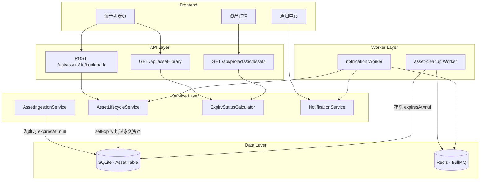

# Design Document: Asset Expiry Policy

## Overview

本功能为资产系统引入"永久资产"与"临时资产"双轨生命周期策略。核心目标：

1. **永久资产保护**：入库到资产库（category 有值）的资产标记 `expiresAt=null`，不受 cleanup worker 清理
2. **临时资产过期**：项目级产物保持 14 天过期策略，到期自动清理
3. **状态可感知**：前端展示 permanent/expiring_soon/active/expired 四种过期状态
4. **升级路径**：用户可通过"收藏"操作将临时资产升级为永久资产
5. **数据迁移**：修正历史数据中 category 有值但 expiresAt 不为 null 的不一致记录

### 设计原则

- **最小改动**：复用现有 Asset 模型字段（expiresAt、category），无需新增表或字段
- **防御性编程**：AssetLifecycleService 在 setExpiry/renewExpiry 时主动检查 category，多层保护
- **幂等安全**：数据迁移脚本和 bookmark 操作均为幂等设计

## Architecture



### 数据流

1. **入库流程**：AssetIngestionService → 创建 Asset（category='CHARACTER', expiresAt=null）
2. **项目生成流程**：项目解析 → AssetLifecycleService.setExpiry() → 检查 category → 若有值则跳过
3. **清理流程**：cleanup Worker → getExpiredAssets() 查询条件增加 `expiresAt IS NOT NULL` → 仅清理临时资产
4. **收藏升级流程**：Bookmark API → 设置 expiresAt=null + 设置 category → 资产变为永久

## Components and Interfaces

### 1. ExpiryStatusCalculator（新增纯函数模块）

负责根据 Asset 的 expiresAt 字段计算过期状态，作为独立纯函数便于测试和复用。

```typescript
// src/lib/expiry-status.ts

export type ExpiryStatus = 'permanent' | 'expiring_soon' | 'active' | 'expired'

export interface ExpiryStatusResult {
  status: ExpiryStatus
  remainingDays: number | null  // permanent 和 expired 时为 null
}

/**
 * 计算资产过期状态
 * @param expiresAt 过期时间，null 表示永久资产
 * @param now 当前时间（可注入，便于测试）
 */
export function computeExpiryStatus(
  expiresAt: Date | null,
  now: Date = new Date()
): ExpiryStatusResult
```

**状态判定规则**：
| 条件 | 状态 | remainingDays |
|------|------|---------------|
| expiresAt === null | permanent | null |
| expiresAt <= now | expired | null |
| expiresAt - now <= 3天 | expiring_soon | 向上取整天数 |
| expiresAt - now > 3天 | active | 向上取整天数 |

### 2. AssetLifecycleService（修改）

修改现有 `setExpiry` 和 `renewExpiry` 方法，增加永久资产保护逻辑。

```typescript
// 修改 setExpiry：增加 category 检查
export async function setExpiry(assetId: string, days: number = 14): Promise<void> {
  const asset = await prisma.asset.findUnique({ where: { id: assetId } })
  if (!asset) throw new Error(`资产不存在: ${assetId}`)

  // 永久资产保护：category 有值则跳过
  if (asset.category) {
    logger.info('永久资产，跳过过期设置', { assetId, category: asset.category })
    return
  }

  // 原有 AI_GENERATED 类型检查保留
  if (asset.type !== 'AI_GENERATED') { ... }

  // 设置过期时间
  const expiresAt = new Date(asset.createdAt.getTime() + days * 24 * 60 * 60 * 1000)
  await prisma.asset.update({ where: { id: assetId }, data: { expiresAt } })
}

// 修改 renewExpiry：增加 category 检查
export async function renewExpiry(assetId: string, days: number = 14): Promise<void> {
  const asset = await prisma.asset.findUnique({ where: { id: assetId } })
  // ... 原有校验 ...

  // 永久资产无需续期
  if (asset.category) {
    logger.info('永久资产，跳过续期', { assetId, category: asset.category })
    return
  }

  // ... 原有续期逻辑 ...
}
```

### 3. asset-cleanup Worker（修改）

修改 `getExpiredAssets` 查询条件，确保只扫描有明确过期时间的资产。

```typescript
// 修改 getExpiredAssets 查询条件
export async function getExpiredAssets(batchSize: number = 100) {
  const now = new Date()
  const assets = await prisma.asset.findMany({
    where: {
      expiresAt: {
        not: null,   // 排除永久资产
        lte: now,    // 已过期
      },
      status: { not: 'EXPIRED' },
    },
    take: batchSize,
    orderBy: { expiresAt: 'asc' },
  })
  return assets
}
```

### 4. Bookmark API（新增）

```typescript
// POST /api/assets/[id]/bookmark
// 请求体：{ category?: string }  默认 'CHARACTER'
// 响应：{ success: true, asset: AssetWithExpiryStatus }

export async function POST(request: NextRequest, { params }: { params: { id: string } })
```

**业务逻辑**：
1. 鉴权：校验 x-user-id 与 asset.userId 一致
2. 校验：asset.status !== 'EXPIRED'，否则返回 400
3. 更新：设置 `expiresAt = null`、`category = body.category || 'CHARACTER'`
4. 返回：更新后的 asset 附带 expiryStatus

### 5. notification Worker（修改）

修改过期提醒通知内容，增加 bookmark 操作入口链接。

```typescript
// 修改 createAssetExpiringNotification 的 meta 字段
const meta: Record<string, string> = {
  assetId: assetInfo.assetId,
  projectId: assetInfo.projectId,
  link: `/dashboard/projects/${assetInfo.projectId}`,
  bookmarkLink: `/api/assets/${assetInfo.assetId}/bookmark`,  // 收藏操作入口
  expiresAt: assetInfo.expiresAt.toISOString(),
}
```

### 6. 数据迁移脚本（新增）

```typescript
// prisma/migrations/fix-permanent-asset-expiry.ts
// 一次性修复脚本：将 category 有值且 expiresAt 不为 null 的记录修正

async function migrate() {
  const result = await prisma.asset.updateMany({
    where: {
      category: { not: null },
      expiresAt: { not: null },
    },
    data: { expiresAt: null },
  })
  console.log(`修正了 ${result.count} 条永久资产的过期时间`)
}
```

### 7. 前端过期状态展示组件（新增）

```typescript
// src/components/asset/expiry-badge.tsx
// 使用 shadcn/ui Badge 组件展示四种状态
interface ExpiryBadgeProps {
  status: ExpiryStatus
  remainingDays: number | null
}
```

| 状态 | 样式 | 文案 |
|------|------|------|
| permanent | Badge variant="secondary" (绿) | 永久 |
| expiring_soon | Badge variant="destructive" (红) | {N}天后过期 |
| active | Badge variant="outline" (默认) | 剩余{N}天 |
| expired | Badge variant="muted" (灰) | 已过期 |

## Data Models

### Asset 模型（无变更，复用现有字段）

```prisma
model Asset {
  id           String    @id @default(cuid())
  projectId    String?   @map("project_id")
  userId       String    @map("user_id")
  type         String    // CHARACTER_IMAGE | UPLOADED_IMAGE | AI_GENERATED
  category     String?   @map("category")       // 资产库分类: CHARACTER | MATERIAL | AUDIO
  displayName  String?   @map("display_name")
  url          String
  thumbUrl     String?   @map("thumb_url")
  fileName     String?   @map("file_name")
  fileSize     Int?      @map("file_size")
  isCharImage  Boolean   @default(false)
  sortOrder    Int       @default(0)
  status       String    @default("PENDING")    // PENDING | UPLOADED | FAILED | EXPIRED | ...
  rejectReason String?   @map("reject_reason")
  expiresAt    DateTime? @map("expires_at")     // null=永久资产，有值=临时资产
  createdAt    DateTime  @default(now())
  // ... relations
}
```

**双轨语义**：
- `category != null && expiresAt == null` → 永久资产（资产库入库）
- `category == null && expiresAt != null` → 临时资产（项目级产物，14天过期）

### API 响应扩展类型

```typescript
// 资产列表响应中附带 expiryStatus
interface AssetWithExpiry {
  id: string
  // ... 原有字段 ...
  expiryStatus: ExpiryStatus        // 'permanent' | 'expiring_soon' | 'active' | 'expired'
  remainingDays: number | null      // 剩余天数
}
```

### Zustand Store 扩展

```typescript
// src/stores/asset-store.ts 中增加 bookmark action
interface AssetStore {
  // ... 原有状态 ...
  bookmarkAsset: (assetId: string, category?: string) => Promise<void>
}
```


## Correctness Properties

*A property is a characteristic or behavior that should hold true across all valid executions of a system—essentially, a formal statement about what the system should do. Properties serve as the bridge between human-readable specifications and machine-verifiable correctness guarantees.*

### Property 1: ExpiryStatus 计算正确性

*For any* `expiresAt` 值（null 或任意 Date）和 *any* 参考时间 `now`，`computeExpiryStatus(expiresAt, now)` 的返回值必须满足以下分区规则：
- expiresAt === null → status='permanent', remainingDays=null
- expiresAt <= now → status='expired', remainingDays=null
- 0 < (expiresAt - now) <= 3天 → status='expiring_soon', remainingDays=ceil(diff/天)
- (expiresAt - now) > 3天 → status='active', remainingDays=ceil(diff/天)

**Validates: Requirements 3.1, 3.2, 3.3, 3.4**

### Property 2: setExpiry 跳过永久资产

*For any* Asset，若该 Asset 的 category 字段有值，调用 `setExpiry(assetId, days)` 后，该 Asset 的 expiresAt 字段保持不变（仍为 null）。

**Validates: Requirements 1.3, 6.2**

### Property 3: renewExpiry 跳过永久资产

*For any* Asset，若该 Asset 的 category 字段有值，调用 `renewExpiry(assetId, days)` 后，该 Asset 的 expiresAt 字段保持不变。

**Validates: Requirements 6.3**

### Property 4: Bookmark 升级为永久资产

*For any* 状态非 EXPIRED 的临时资产（expiresAt 有值），执行 Bookmark 操作后，该 Asset 的 expiresAt 变为 null 且 category 有值，即 `computeExpiryStatus(asset.expiresAt)` 返回 'permanent'。

**Validates: Requirements 4.1, 4.2, 4.3**

### Property 5: getExpiredAssets 排除永久资产

*For any* 资产集合，`getExpiredAssets()` 返回的结果中不包含任何 expiresAt 为 null 的资产，且返回的所有资产的 expiresAt 均 <= 当前时间。

**Validates: Requirements 1.2**

### Property 6: 数据迁移不变量

*For any* 资产集合，执行数据迁移后，不存在任何 Asset 同时满足 category != null 且 expiresAt != null。即：`category 有值 → expiresAt 为 null` 是系统全局不变量。

**Validates: Requirements 1.4, 6.1**

### Property 7: setExpiry 对临时资产正确计算过期时间

*For any* type='AI_GENERATED' 且 category 为 null 的 Asset，调用 `setExpiry(assetId, days)` 后，该 Asset 的 expiresAt 等于 `createdAt + days * 24 * 60 * 60 * 1000`。

**Validates: Requirements 2.1**

### Property 8: 过期提醒通知幂等性

*For any* 资产，在同一天内多次执行过期提醒流程，该 Asset 最多只产生一条 ASSET_EXPIRING 类型的通知记录。

**Validates: Requirements 5.4**

### Property 9: 通知内容完整性

*For any* 即将过期的资产及其关联项目，生成的过期提醒通知内容必须包含：资产名称（或所属项目名称）、项目名称、和剩余过期天数。

**Validates: Requirements 5.2**

## Error Handling

### API 错误处理

| 场景 | HTTP Status | 错误码 | 用户提示 |
|------|-------------|--------|----------|
| 资产不存在 | 404 | ASSET_NOT_FOUND | 资产不存在或已被删除 |
| 已过期资产执行 Bookmark | 400 | ASSET_EXPIRED | 该资产已过期清理，无法收藏 |
| 非本人资产操作 | 403 | FORBIDDEN | 无权操作该资产 |
| 参数校验失败 | 400 | VALIDATION_ERROR | 请求参数无效 |
| 内部错误 | 500 | INTERNAL_ERROR | 服务异常，请稍后重试 |

### Worker 错误处理

- **cleanup Worker**：单个资产 OSS 删除失败不阻断整批处理，记录错误日志，下次扫描时仍可重试（状态已标记为 EXPIRED 所以不会重复清理）
- **notification Worker**：单个通知创建失败不阻断其他通知，记录错误日志

### 数据迁移错误处理

- 迁移脚本使用 `updateMany` 批量操作，失败时记录影响行数
- 迁移为幂等操作，可安全重复执行

## Testing Strategy

### 属性测试（Property-Based Testing）

使用 **fast-check** 库，每个 property 至少运行 100 次迭代。

**重点测试纯函数 `computeExpiryStatus`**：
- 生成随机 Date（过去、未来各范围）和 null
- 验证 Property 1 的所有分区规则

**Service 层属性测试**（使用 Prisma mock）：
- Property 2/3：生成随机 category 值的 Asset，验证 setExpiry/renewExpiry 幂等跳过
- Property 5：生成混合 expiresAt 的资产集合，验证查询结果过滤正确
- Property 6：生成随机数据，验证迁移后不变量成立
- Property 7：生成随机 createdAt 和 days，验证计算结果

**每个测试标记格式**：
```
// Feature: asset-expiry-policy, Property {N}: {property_text}
```

### 单元测试（Example-Based）

- Bookmark API 的边界情况（已过期资产、重复收藏、无权操作）
- notification 内容格式验证
- ExpiryBadge 组件渲染不同状态

### 集成测试

- cleanup Worker 完整流程（含 OSS mock）
- notification Worker 完整流程
- Bookmark API 端到端（含数据库操作）

### 测试配置

```typescript
// vitest.config.ts 中 property test 配置
// fast-check 默认 numRuns: 100
import fc from 'fast-check'
fc.configureGlobal({ numRuns: 100 })
```
