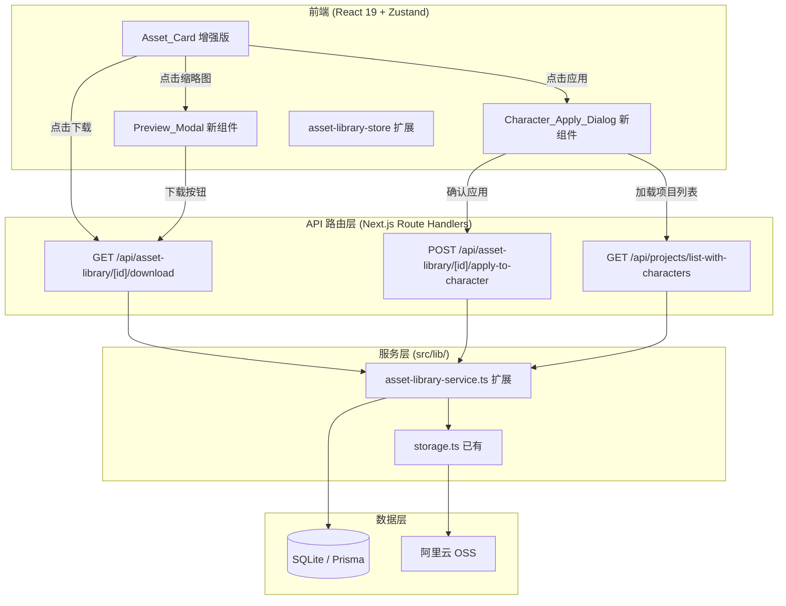

# Design Document: 资产库增强 (Asset Library Enhancements)

## Overview

在现有资产库基础上增加三大交互能力：全屏预览/缩放查看、文件下载、角色图跨项目应用。本设计遵循项目现有架构模式（Next.js App Router → `src/lib/` 服务层 → Prisma ORM）扩展，前端使用 shadcn/ui + Zustand，后端新增 2 个 API 路由并扩展现有资产库服务。

**核心设计决策：**
- 跨项目应用通过直接引用同一 OSS URL 实现，不复制文件（节省存储、保持一致性）
- 下载通过 OSS 签名 URL 实现（10 分钟有效期，私有 Bucket 兼容）
- Preview Modal 内部使用 CSS transform 实现缩放平移，不依赖第三方图片查看库

## Architecture



## Components and Interfaces

### 前端组件

#### 1. Preview_Modal（新组件）

```typescript
// src/components/asset-library/preview-modal.tsx
interface PreviewModalProps {
  asset: AssetLibraryItem | null  // null 时关闭
  onClose: () => void
  onDownload: (assetId: string) => void
}

// 内部状态
interface ViewTransform {
  scale: number   // 0.5 ~ 3.0
  panX: number    // 像素偏移
  panY: number    // 像素偏移
}
```

**功能：**
- 全屏模态框展示资产原图（通过 `/api/media/{key}` 鉴权路径加载）
- 顶部工具栏：资产名称、缩放比例显示、缩放按钮（+/-/重置）、下载按钮、关闭按钮
- 底部信息栏：分类徽章、创建日期、文件大小
- 支持鼠标滚轮缩放（以鼠标位置为缩放中心）
- 支持拖拽平移（仅当图片超出视口时启用）
- Escape 键 / 点击遮罩关闭
- 图片加载失败显示错误占位 + 重试按钮

**缩放逻辑（纯函数，可属性测试）：**
```typescript
function clampScale(raw: number): number {
  return Math.min(3.0, Math.max(0.5, raw))
}

function clampPan(
  panX: number, panY: number,
  scale: number,
  imageWidth: number, imageHeight: number,
  viewportWidth: number, viewportHeight: number
): { panX: number; panY: number } {
  // 当 scale * imageSize <= viewportSize 时，居中（pan = 0）
  // 否则限制 pan 使图片边缘不超出视口
}
```

#### 2. Character_Apply_Dialog（新组件）

```typescript
// src/components/asset-library/character-apply-dialog.tsx
interface CharacterApplyDialogProps {
  assetId: string
  assetUrl: string
  open: boolean
  onOpenChange: (open: boolean) => void
  onSuccess: (projectName: string, characterName: string) => void
}

// 两级选择器数据结构
interface ProjectWithCharacters {
  id: string
  name: string
  characterCount: number
  updatedAt: string
}

interface CharacterOption {
  id: string
  name: string
  imageUrl: string | null
}
```

**交互流程：**
1. 打开时加载项目列表（skeleton 过渡）
2. 用户选择项目 → 加载该项目角色列表（skeleton 过渡）
3. 用户选择角色 → 显示确认区域
4. 若目标角色已有 imageUrl → 显示覆盖警告（需二次确认）
5. 确认后调用 apply API → 成功 toast / 失败 toast

#### 3. Asset_Card 增强

在现有 `AssetCard` 组件基础上扩展：

```typescript
// 修改 src/components/asset-library/asset-grid.tsx 中的 AssetCard 组件
interface AssetCardProps {
  item: AssetLibraryItem
  onPreview: (item: AssetLibraryItem) => void
  onDownload: (assetId: string) => void
  onDelete: (assetId: string) => void
  onApplyToCharacter?: (item: AssetLibraryItem) => void // 仅 CHARACTER 类别
}
```

**操作叠层 (Hover Overlay)：**
- 所有类别：预览（Eye 图标）、下载（Download 图标）、删除（Trash2 图标）
- CHARACTER 类别额外：应用到角色（UserPlus 图标）
- 点击缩略图区域 → 触发预览
- 每个按钮带 tooltip 提示文字
- 操作进行中对应按钮显示 Loader2 旋转 + disabled

### 后端 API 接口

#### API 1: 下载签名 URL

```
GET /api/asset-library/[id]/download
```

**请求：** 无请求体，鉴权通过 `x-user-id` header

**响应 200：**
```json
{
  "downloadUrl": "https://bucket.oss-cn-shanghai.aliyuncs.com/...?OSSAccessKeyId=...&Expires=...&Signature=...",
  "fileName": "character-avatar.png"
}
```

**错误：**
- 404: 资产不存在
- 403: 无权访问该资产

**实现逻辑：**
1. 验证 asset.userId === requestUserId
2. 从 asset.url 提取 OSS key（`extractKeyFromUrl`）
3. 调用 `getSignedObjectUrl(key, 600)` 生成 10 分钟签名 URL
4. 返回 downloadUrl + 原始文件名

#### API 2: 角色图跨项目应用

```
POST /api/asset-library/[id]/apply-to-character
```

**请求体：**
```json
{
  "targetProjectId": "cuid...",
  "targetCharacterId": "cuid..."
}
```

**响应 200：**
```json
{
  "character": {
    "id": "cuid...",
    "name": "主角",
    "imageUrl": "https://bucket.oss.../characters/xxx.png",
    "projectId": "cuid..."
  }
}
```

**错误：**
- 403: `{ "error": "无权访问该资产" }` 或 `{ "error": "无权操作该项目" }`
- 404: `{ "error": "目标角色不存在" }`

**实现逻辑：**
1. 验证 asset.userId === requestUserId → 403
2. 验证 targetProject.userId === requestUserId → 403
3. 验证 character 存在且属于 targetProject → 404
4. 在 Prisma 事务中更新 character.imageUrl = asset.url
5. 返回更新后的 Character

#### API 3: 项目列表（含角色计数）

```
GET /api/projects/list-with-characters?projectId=xxx
```

**无 projectId 参数时** - 返回项目列表：
```json
{
  "projects": [
    { "id": "cuid...", "name": "项目A", "characterCount": 3, "updatedAt": "2025-..." },
    ...
  ]
}
```

**有 projectId 参数时** - 返回该项目角色列表：
```json
{
  "characters": [
    { "id": "cuid...", "name": "主角", "imageUrl": "https://..." },
    { "id": "cuid...", "name": "配角", "imageUrl": null },
    ...
  ]
}
```

## Data Models

本功能 **不需要修改 Prisma schema**。所有数据操作基于现有模型：

- **Asset**: 已有 `userId`、`url`、`category`、`displayName`、`fileName`、`fileSize` 等字段
- **Character**: 已有 `imageUrl` 字段，直接更新即可
- **Project**: 已有 `userId`、`name`、`updatedAt` 字段

数据流：
```
Asset.url ──(apply)──→ Character.imageUrl
                       （直接引用，不复制文件）
```

**关键约束：**
- 删除 Asset 时已有检查 Character.imageUrl 引用的逻辑（不删除 OSS 文件），与跨项目应用互不冲突
- Character.imageUrl 可被多次覆盖，最新一次应用的 URL 生效

## Correctness Properties

*A property is a characteristic or behavior that should hold true across all valid executions of a system—essentially, a formal statement about what the system should do. Properties serve as the bridge between human-readable specifications and machine-verifiable correctness guarantees.*

### Property 1: 缩放比例始终在有效范围内

*For any* sequence of zoom operations (wheel scroll, button click combinations) applied to the Preview_Modal, the resulting scale value SHALL always be within the range [0.5, 3.0] (inclusive).

**Validates: Requirements 1.3**

### Property 2: 平移偏移始终保证图片可见

*For any* zoom level within [0.5, 3.0] and any pan offset attempt, the clamped pan values SHALL ensure that the visible viewport area never extends beyond the scaled image boundaries (when the scaled image exceeds the viewport).

**Validates: Requirements 1.5**

### Property 3: 跨项目应用正确设置 imageUrl 且不复制文件

*For any* valid asset (owned by user, category=CHARACTER) and any valid target character (in a project owned by the same user), after a successful apply operation, the target Character.imageUrl SHALL equal the asset's original URL exactly (byte-identical, no transformation or copy).

**Validates: Requirements 3.4, 3.5, 5.2, 5.6**

### Property 4: "应用到角色"按钮仅在 CHARACTER 类别可见

*For any* asset item rendered in the Asset_Card grid, the "应用到角色" action button SHALL be visible if and only if the asset's category equals "CHARACTER".

**Validates: Requirements 3.8, 4.2**

### Property 5: 所有权验证——非法访问始终返回 403

*For any* apply-to-character request where the requesting user does NOT own either the source asset OR the target project, the service SHALL return a 403 error and SHALL NOT modify any Character record.

**Validates: Requirements 5.1, 5.3, 5.5**

### Property 6: 项目列表按更新时间降序排列

*For any* set of projects belonging to a user, the returned project list SHALL be sorted by `updatedAt` in descending order (newest first), such that for every adjacent pair (projects[i], projects[i+1]), projects[i].updatedAt >= projects[i+1].updatedAt.

**Validates: Requirements 6.1**

### Property 7: 成功应用后 toast 消息包含项目名和角色名

*For any* successful cross-project apply operation with target project name P and target character name C, the success toast message SHALL contain both P and C as substrings.

**Validates: Requirements 3.6**

### Property 8: 操作卡片叠层按钮组合规则

*For any* asset item, the action overlay SHALL contain exactly the following buttons: {preview, download, delete} when category ≠ CHARACTER, and {preview, download, delete, apply-to-character} when category = CHARACTER.

**Validates: Requirements 4.1, 4.2**

## Error Handling

| 场景 | 处理方式 | 用户反馈 |
|------|----------|----------|
| 预览图片加载失败 | 捕获 img onError | 显示"图片加载失败"占位 + 重试按钮 |
| 下载签名 URL 生成失败 | API 返回 500 | Toast: "下载链接生成失败，请重试" |
| 下载时 OSS 未配置 | `getSignedObjectUrl` 抛错 | Toast: "下载服务暂不可用" |
| 应用到角色 - 无权资产 | 403 | Toast: "无权访问该资产" |
| 应用到角色 - 无权项目 | 403 | Toast: "无权操作该项目" |
| 应用到角色 - 角色不存在 | 404 | Toast: "目标角色不存在" |
| 项目/角色列表加载失败 | fetch 异常 | Dialog 内显示错误提示 + 重试按钮 |
| 网络超时 | fetch timeout | Toast: "网络请求超时，请重试" |

**设计原则：**
- 不使用静默降级：所有失败都显式反馈给用户
- 不阻断主流程：下载/应用失败不影响资产库浏览
- 按钮防重复：操作进行中禁用按钮，避免重复请求

## Testing Strategy

### 属性测试 (Property-Based Testing)

使用 **fast-check** 库（项目已有依赖），每个属性测试至少运行 100 次迭代。

**适用范围：**
- 缩放/平移计算的纯函数逻辑（Properties 1, 2）
- 跨项目应用的服务层逻辑（Properties 3, 5, 6）
- 按钮可见性条件判断（Properties 4, 8）
- Toast 消息格式化（Property 7）

**属性测试文件：**
- `src/lib/__tests__/asset-library-enhancements.property.test.ts`
  - 缩放边界测试：生成随机缩放操作序列，验证 scale ∈ [0.5, 3.0]
  - 平移边界测试：生成随机 zoom + pan 组合，验证可见区域不超出图片
  - 所有权验证测试：生成随机用户/资产/项目所有权组合，验证正确返回 403 或通过
  - 项目列表排序测试：生成随机项目集合，验证返回结果按 updatedAt DESC 排列

**测试配置：**
- 最小 100 iterations
- 标签格式：`Feature: asset-library-enhancements, Property N: {property_text}`

### 单元测试 (Example-Based)

- `src/lib/__tests__/asset-library-service.test.ts`（扩展已有）
  - 下载签名 URL 生成（happy path + 无权限 + 资产不存在）
  - 跨项目应用 happy path
  - 覆盖已有 imageUrl 场景

### 集成测试

- 下载 API 路由端到端（需 mock OSS）
- 应用 API 路由端到端（需 mock Prisma 事务）

### 组件测试

- Preview_Modal 交互测试（jsdom 环境）
- Character_Apply_Dialog 两级选择流程测试
- Asset_Card hover overlay 按钮渲染测试
