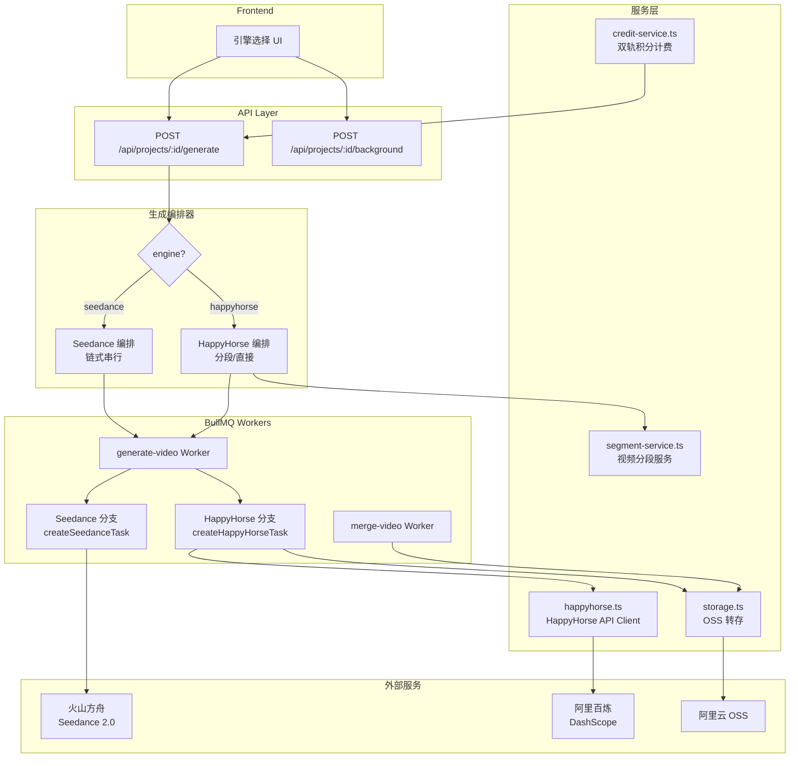
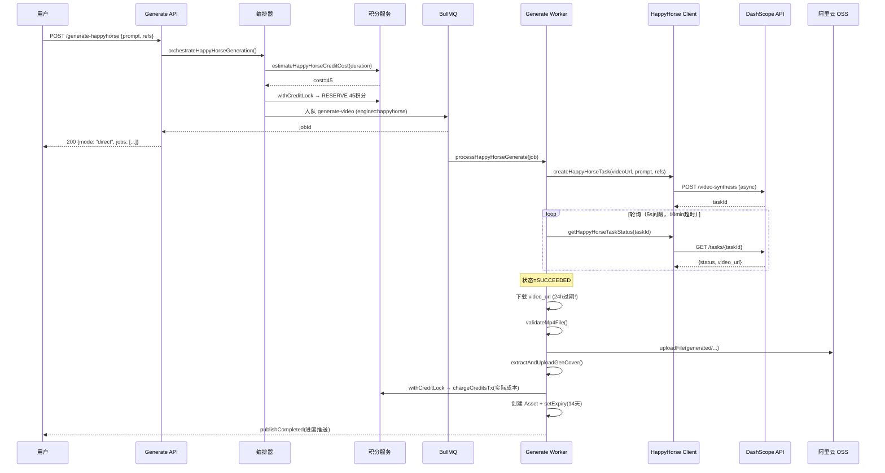
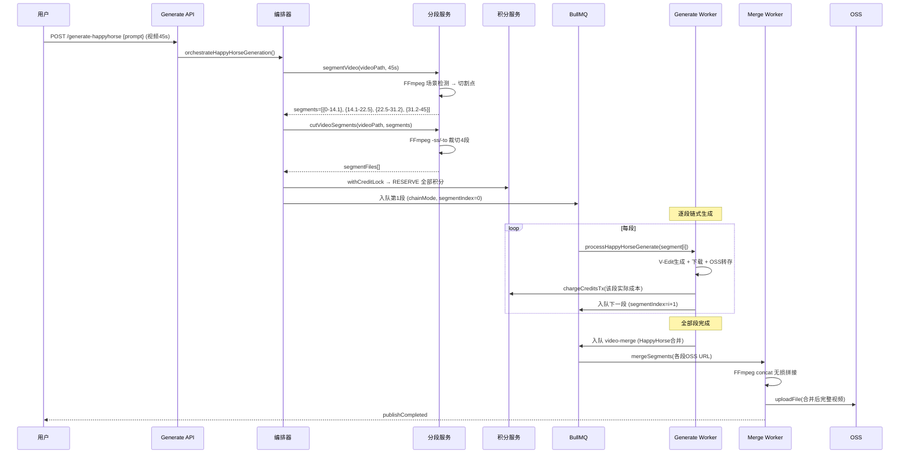
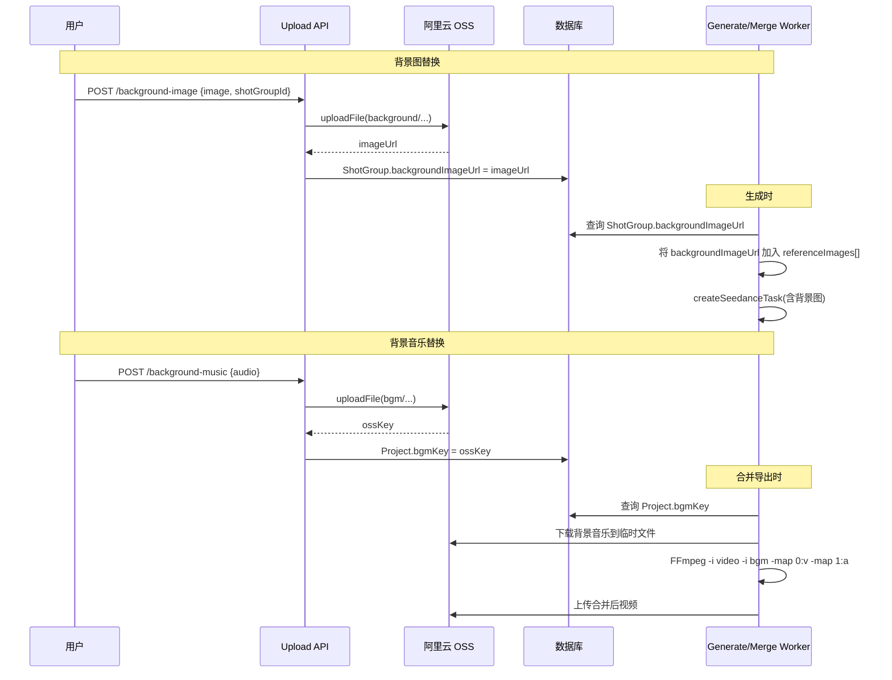

# Design Document: 双模型生成引擎 (Dual Model Generation)

## Overview

本设计将视频生成管线从单一 Seedance 2.0 模型扩展为支持 Seedance 2.0 和 HappyHorse 双引擎可选架构。核心设计决策：

1. **引擎抽象层**：在生成编排器和 Worker 中引入 engine 分支路由，根据 Project/Job 的 engine 字段选择不同管线
2. **HappyHorse V-Edit 管线**：短视频（3-15s）直接生成，长视频（>15s）先由 Segment_Service 智能分段再逐段生成后合并
3. **积分双轨计费**：Seedance 继续按 token 计费，HappyHorse 按视频秒数计费，复用现有 RESERVE→CHARGE→REFUND 模型
4. **统一资产管理**：HappyHorse 生成结果即时从 DashScope 下载转存 OSS，共享 14 天过期策略
5. **Seedance 增强**：新增背景图/背景音乐替换功能，复用现有 reference_image 机制和 FFmpeg 合并管线

关键约束：
- 失败必须抛错，不做 fallback/静默降级
- 积分操作必须走 Redis 分布式锁串行化（`withCreditLock`）
- DashScope 结果 URL 24 小时过期，生成成功后必须立即下载转存

## Architecture



## Components and Interfaces

### 1. HappyHorse API 客户端 (`src/lib/happyhorse.ts`)

```typescript
/** HappyHorse V-Edit 任务创建参数 */
export interface HappyHorseCreateParams {
  /** 原视频 OSS URL（公网可访问） */
  videoUrl: string
  /** 编辑指令 prompt */
  prompt: string
  /** 参考图 URL 列表（0-5 张） */
  referenceImages?: string[]
  /** 分辨率，固定 720P */
  resolution?: '720P'
  /** 音频处理：origin=保留原声 */
  audioSetting?: 'origin' | 'auto'
}

/** HappyHorse 任务状态返回 */
export interface HappyHorseTaskStatus {
  status: 'PENDING' | 'RUNNING' | 'SUCCEEDED' | 'FAILED'
  videoUrl?: string
  /** 实际输出视频时长（秒） */
  outputDuration?: number
  /** 输入视频时长（秒） */
  inputDuration?: number
  error?: { code: string; message: string }
}

/** 创建 HappyHorse V-Edit 任务 */
export async function createHappyHorseTask(
  params: HappyHorseCreateParams
): Promise<{ taskId: string }>

/** 查询 HappyHorse 任务状态 */
export async function getHappyHorseTaskStatus(
  taskId: string
): Promise<HappyHorseTaskStatus>
```

**实现要点**：
- Endpoint: `POST https://dashscope.aliyuncs.com/api/v1/services/aigc/video-generation/video-synthesis`
- 必须请求头: `X-DashScope-Async: enable`, `Authorization: Bearer $DASHSCOPE_API_KEY`
- 请求体固定: `model: "happyhorse-1.0-video-edit"`, `watermark: false`, `resolution: "720P"`, `audio_setting: "origin"`
- media 数组: 1 个 `type: "video"` + 0-5 个 `type: "reference_image"`
- 轮询: `GET https://dashscope.aliyuncs.com/api/v1/tasks/{task_id}`
- 状态映射: `PENDING/RUNNING → processing`, `SUCCEEDED → succeeded`, `FAILED → failed`
- 环境变量 `DASHSCOPE_API_KEY` 缺失时直接抛错

### 2. 视频分段服务 (`src/lib/segment-service.ts`)

```typescript
/** 单个视频分段信息 */
export interface VideoSegment {
  /** 分段序号（0-based） */
  index: number
  /** 起始时间（秒） */
  startTime: number
  /** 结束时间（秒） */
  endTime: number
  /** 分段时长（秒） */
  duration: number
  /** 分段视频临时文件路径 */
  filePath?: string
}

/**
 * 智能分段：基于 FFmpeg 场景检测将长视频分为 ≤15 秒的片段
 * 
 * 算法：
 * 1. FFmpeg 场景检测获取所有切割候选点
 * 2. 贪心选择：从当前位置起，找到距离 15 秒最近的场景切割点作为下一个切割位置
 * 3. 若 15 秒窗口内无场景切割点，强制在 15 秒处切割
 * 4. 最后一段若 < 3 秒，并入前一段（避免生成过短片段被 API 拒绝）
 */
export async function segmentVideo(
  videoPath: string,
  totalDuration: number,
  options?: { sceneThreshold?: number }
): Promise<VideoSegment[]>

/**
 * 按分段列表将视频裁切为多个临时文件
 * 使用 FFmpeg -ss/-to 精确裁切，不重新编码（-c copy）
 */
export async function cutVideoSegments(
  videoPath: string,
  segments: VideoSegment[],
  outputDir: string
): Promise<VideoSegment[]>

/**
 * 将多个生成后的视频段合并为完整视频
 * 使用 FFmpeg concat demuxer 无损拼接
 */
export async function mergeSegments(
  segmentPaths: string[],
  outputPath: string
): Promise<void>
```

**分段算法详细逻辑**：

```
输入: totalDuration=45s, sceneCutPoints=[5.2, 8.7, 14.1, 16.3, 22.5, 29.8, 31.2, 37.6, 44.0]
目标: 每段 ≤ 15s，优先在场景切割点切

步骤:
1. 从 0s 开始，寻找 (0, 15] 范围内最靠近 15s 的切割点 → 14.1s
   → 第一段: [0, 14.1] = 14.1s ✓

2. 从 14.1s 开始，寻找 (14.1, 29.1] 范围内最靠近 29.1s 的切割点 → 29.8s 超出，取 22.5s
   → 第二段: [14.1, 29.8] 超出 → 取 [14.1, 22.5] = 8.4s 
   实际：(14.1, 29.1] 内有 16.3, 22.5，取最靠近 29.1 的 → 22.5s
   → 第二段: [14.1, 22.5] = 8.4s ✓

3. 从 22.5s 开始，寻找 (22.5, 37.5] 范围内最靠近 37.5s 的切割点 → 37.6s 超出，取 31.2s
   实际：(22.5, 37.5] 内有 29.8, 31.2，取最靠近 37.5 的 → 31.2s
   → 第三段: [22.5, 31.2] = 8.7s ✓

4. 从 31.2s 开始，寻找 (31.2, 46.2] 范围内最靠近 46.2s 的切割点 → 44.0s
   → 第四段: [31.2, 44.0] = 12.8s ✓

5. 从 44.0s 到 45s，时长 1.0s < 3s → 并入前一段
   → 第四段调整: [31.2, 45.0] = 13.8s ✓

输出: 4 段 [14.1, 8.4, 8.7, 13.8]
```

### 3. 生成编排器扩展 (`src/lib/generation-orchestrator.ts`)

新增 `orchestrateHappyHorseGeneration` 函数：

```typescript
/** HappyHorse 编排参数 */
export interface HappyHorseOrchestrationParams {
  userId: string
  projectId: string
  /** 原视频 OSS URL */
  videoUrl: string
  /** 原视频时长（秒） */
  videoDuration: number
  /** 用户 prompt 指令 */
  prompt: string
  /** 参考图 URL 列表（0-5 张） */
  referenceImages?: string[]
  /** 用户等级 */
  tier: UserTier
}

/** HappyHorse 编排结果 */
export interface HappyHorseOrchestrationResult {
  mode: 'direct' | 'segmented'
  totalSegments: number
  totalCost: number
  jobs: Array<{ id: string; segmentIndex: number; status: string }>
}

/**
 * HappyHorse 编排入口
 * 
 * 短视频（3-15s）: 直接创建单个 GenerationJob 并入队
 * 长视频（>15s）: 分段后为每段创建 GenerationJob，链式串行入队第一段
 */
export async function orchestrateHappyHorseGeneration(
  params: HappyHorseOrchestrationParams
): Promise<HappyHorseOrchestrationResult>
```

**编排流程**：

1. 调用 `estimateHappyHorseCreditCost(videoDuration)` 计算预估总积分
2. `withCreditLock` 原子冻结全部积分（批量 RESERVE）
3. 若 `videoDuration ≤ 15`：创建单个 GenerationJob（engine='happyhorse'），直接入队
4. 若 `videoDuration > 15`：
   - 调用 `segmentVideo` 获取分段列表
   - 为每段创建 GenerationJob（engine='happyhorse', segmentIndex）
   - 链式串行：仅入队第一段，后续由 Worker 逐段触发

### 4. 生成 Worker 扩展 (`src/workers/generate-video.ts`)

在 `processVideoGenerate` 中增加 engine 分支：

```typescript
interface VideoGenerateJobData {
  // ... 现有字段 ...
  /** 生成引擎 */
  engine?: 'seedance' | 'happyhorse'
  /** HappyHorse 专用：原视频 OSS URL */
  sourceVideoUrl?: string
  /** HappyHorse 专用：参考图列表 */
  happyHorseReferenceImages?: string[]
  /** HappyHorse 专用：分段索引（长视频分段模式） */
  segmentIndex?: number
  /** HappyHorse 专用：总分段数 */
  totalSegments?: number
  /** HappyHorse 专用：分段视频 OSS URL（已裁切的片段） */
  segmentVideoUrl?: string
}
```

Worker 主流程新增分支：

```typescript
async function processVideoGenerate(job: Job<VideoGenerateJobData>) {
  const engine = job.data.engine || 'seedance'
  
  if (engine === 'happyhorse') {
    return processHappyHorseGenerate(job)
  }
  
  // 现有 Seedance 逻辑不变
  if (!job.data.shotGroupId) {
    return processProjectSegmentGenerate(job)
  }
  return processGroupVideoGenerate(job)
}
```

`processHappyHorseGenerate` 流程：

1. 获取分布式锁（按 jobId）
2. 调用 `createHappyHorseTask` 创建 V-Edit 任务
3. 轮询任务状态（复用现有轮询模式：5s 间隔，10 分钟超时）
4. 成功后：下载结果视频 → 验证 MP4 → 上传 OSS → 抽取封面帧
5. 原子化扣费（`withCreditLock` + `chargeCreditsTx`）
6. 创建 Asset（14 天过期）
7. 若为分段模式：触发下一段（链式续接）或检查全段完成后触发合并

### 5. 积分计费扩展 (`src/lib/credit-calc.ts`)

```typescript
/**
 * 估算 HappyHorse V-Edit 积分消耗
 * 
 * 计费规则（720P）:
 * - 输入视频秒数 × 0.9 元/秒 + 输出视频秒数 × 0.9 元/秒
 * - V-Edit 输出时长 = min(输入时长, 15)（API 限制）
 * - 积分换算: 1 积分 ≈ 1 元（平台定义）
 * 
 * 预估公式（生成前）: ceil((inputDuration + min(inputDuration, 15)) × HAPPYHORSE_CREDIT_COEFFICIENT)
 * 结算公式（生成后）: ceil((actualInputDuration + actualOutputDuration) × HAPPYHORSE_CREDIT_COEFFICIENT)
 * 
 * HAPPYHORSE_CREDIT_COEFFICIENT = 1.5（平台加成系数，可通过环境变量调整）
 */
export function estimateHappyHorseCreditCost(inputDuration: number): number {
  const outputDuration = Math.min(inputDuration, 15)
  const coefficient = parseFloat(process.env.HAPPYHORSE_CREDIT_COEFFICIENT || '1.5')
  return Math.ceil((inputDuration + outputDuration) * coefficient)
}

/**
 * 结算 HappyHorse 实际积分消耗（生成完成后）
 */
export function calculateHappyHorseActualCost(
  inputDuration: number,
  outputDuration: number
): number {
  const coefficient = parseFloat(process.env.HAPPYHORSE_CREDIT_COEFFICIENT || '1.5')
  return Math.ceil((inputDuration + outputDuration) * coefficient)
}
```

### 6. 合并导出扩展 (`src/workers/merge-video.ts`)

**背景音乐替换**（Seedance 模式）:

在现有合并逻辑中，检查 `Project.bgmKey`：
- 若存在：下载 OSS 背景音乐 → FFmpeg 替换原音轨（`-i bgm.mp3 -map 0:v -map 1:a -c:v copy -shortest`）
- 若不存在：保持现有合并逻辑不变

**HappyHorse 分段合并**:

入队 `video-merge` 队列时传入分段视频 URL 列表，复用现有的 concat 合并逻辑。区别在于：
- HappyHorse 分段合并不需要转场效果（原视频场景切割点已自然衔接）
- 合并后视频即最终结果，无需链式续接

### 7. 背景图/背景音乐上传接口

复用现有 OSS 上传逻辑，新增 API 路由：

```typescript
// POST /api/projects/:id/background-image
// 上传背景图，存入 ShotGroup.backgroundImageUrl（新增字段）
// 返回 { url: string }

// POST /api/projects/:id/background-music  
// 上传背景音乐，存入 Project.bgmKey
// 返回 { ossKey: string }
```

## Data Models

### Prisma Schema 变更

```prisma
model Project {
  // ... 现有字段 ...
  engine   String  @default("seedance") @map("engine")  // seedance | happyhorse
  bgmKey   String? @map("bgm_key")                      // 自定义背景音乐 OSS 键
}

model GenerationJob {
  // ... 现有字段 ...
  engine        String  @default("seedance") @map("engine")        // seedance | happyhorse
  segmentIndex  Int?    @map("segment_index")                      // HappyHorse 分段索引
  totalSegments Int?    @map("total_segments")                     // HappyHorse 总分段数
}

model ShotGroup {
  // ... 现有字段 ...
  backgroundImageUrl String? @map("background_image_url")  // 背景图 OSS URL
}
```

**迁移策略**：
- `engine` 字段默认值 `seedance`，现有数据自动填充，不影响已有项目
- `bgmKey`、`segmentIndex`、`totalSegments`、`backgroundImageUrl` 均为可空新增字段，无破坏性

## Correctness Properties

*A property is a characteristic or behavior that should hold true across all valid executions of a system — essentially, a formal statement about what the system should do. Properties serve as the bridge between human-readable specifications and machine-verifiable correctness guarantees.*

### Property 1: 引擎字段验证

*For any* 字符串输入作为 engine 值，引擎验证函数应当且仅当输入为 `"seedance"` 或 `"happyhorse"` 时返回 true，其余所有输入返回 false。

**Validates: Requirements 1.1**

### Property 2: HappyHorse 请求体不变量

*For any* 合法的 `HappyHorseCreateParams` 参数组合，构建的请求体必须满足: `model === "happyhorse-1.0-video-edit"` 且 `parameters.watermark === false` 且 `parameters.resolution === "720P"` 且 `parameters.audio_setting === "origin"` 且请求头包含 `X-DashScope-Async: enable`。

**Validates: Requirements 5.2, 5.3, 5.4, 7.6**

### Property 3: 参考图数量上限

*For any* 长度为 N 的参考图 URL 列表传入 HappyHorse 请求构建函数，实际发送到 API 的 `media` 数组中 `type: "reference_image"` 的项数应为 `min(N, 5)`。

**Validates: Requirements 5.5**

### Property 4: 分段算法 — 每段不超过 15 秒

*For any* 总时长 > 15 秒的视频和任意场景切割点列表，`segmentVideo` 返回的每个分段的 `duration` 应 ≤ 15 秒。

**Validates: Requirements 6.1**

### Property 5: 分段算法 — 覆盖完整时长

*For any* 总时长 > 15 秒的视频，`segmentVideo` 返回的分段列表应满足: 第一段 `startTime === 0`，最后一段 `endTime === totalDuration`，且相邻段首尾相接（无间隙、无重叠）。

**Validates: Requirements 6.1, 6.3**

### Property 6: 分段算法 — 最短段约束

*For any* 总时长 > 15 秒的视频，`segmentVideo` 返回的每个分段的 `duration` 应 ≥ 3 秒（HappyHorse API 最低输入时长要求）。

**Validates: Requirements 6.1**

### Property 7: 短视频路径选择

*For any* engine 为 `happyhorse` 且视频时长在 [3, 15] 秒范围内的输入，编排器应选择 `direct` 模式（单段直接生成），不进入分段逻辑。

**Validates: Requirements 5.1**

### Property 8: HappyHorse 积分计算公式正确性

*For any* 正数输入时长 `inputDuration`，`estimateHappyHorseCreditCost(inputDuration)` 应等于 `ceil((inputDuration + min(inputDuration, 15)) × coefficient)`，且结果为正整数。

**Validates: Requirements 8.2**

### Property 9: 余额不足必拒绝

*For any* 用户余额 < 预估消耗积分的组合，生成请求应被拒绝并抛出 `INSUFFICIENT_CREDITS` 错误。

**Validates: Requirements 8.4**

### Property 10: HappyHorse 错误响应解析

*For any* 包含 `code` 和 `message` 字段的失败响应体，`getHappyHorseTaskStatus` 返回的 `error` 对象应包含原始 `code` 和 `message`，不丢失信息。

**Validates: Requirements 7.4**

### Property 11: 背景图注入到 Seedance 请求

*For any* 设置了 `backgroundImageUrl` 的分镜组，构建的 Seedance 请求体 `content` 数组中应包含一个 `type: "image_url"` 且 `role: "reference_image"` 的项，其 URL 等于 `backgroundImageUrl`。

**Validates: Requirements 3.3**

### Property 12: 背景音乐替换合并命令

*For any* 设置了 `bgmKey` 的项目，合并导出构建的 FFmpeg 命令参数应包含 `-i {bgmPath}` 和音频映射参数，替代原视频音轨。

**Validates: Requirements 4.3**

## Error Handling

### HappyHorse API 错误

| 错误场景 | 处理策略 |
|---------|---------|
| `DASHSCOPE_API_KEY` 未配置 | 启动时/调用时直接抛 Error，不降级 |
| 创建任务返回 HTTP 4xx | 解析错误体，抛 Error（BullMQ 重试 2xx/5xx 类临时错误） |
| 创建任务返回 HTTP 5xx | 抛 Error，由 BullMQ backoff 重试（最多 3 次） |
| 轮询超时（10 分钟） | 抛 Error("生成超时")，标记 Job FAILED，退还积分 |
| 任务状态 FAILED | 提取 code/message，抛 Error，标记 Job FAILED，退还积分 |
| 结果视频下载失败 | 重试 3 次（间隔 2s），全部失败抛 Error |
| 结果视频非有效 MP4 | 抛 Error("下载的文件不是有效的 MP4 格式") |

### 分段生成错误

| 错误场景 | 处理策略 |
|---------|---------|
| FFmpeg 场景检测失败 | 回退到固定 15 秒均匀切割（不是静默降级，而是合理的算法降级） |
| 某一分段 V-Edit 失败 | 该段标记 FAILED，退还该段积分，整体项目标记 FAILED，退还所有未执行段积分 |
| 分段合并失败 | 标记项目 MERGE_FAILED，各段结果保留（用户可重新触发合并） |

### 积分错误

| 错误场景 | 处理策略 |
|---------|---------|
| 冻结时余额不足 | 拒绝生成请求，返回 402 |
| 生成成功但扣费事务失败 | 重试 3 次，仍失败则积分已在 RESERVE 扣减（等价已扣），由看门狗修复 |
| 生成失败需退款 | REFUND 退还对应 Job 的冻结积分，幂等操作 |

### 24 小时过期保护

DashScope 返回的 `video_url` 24 小时后失效。保护策略：
1. 轮询成功后**立即**（同一 Worker 上下文内）下载视频
2. 下载失败重试 3 次（间隔 2s），总耗时控制在 1 分钟内
3. 不将 DashScope 原始 URL 写入数据库（仅写 OSS URL）
4. Worker 异常重启后，若 Job 状态为 SUCCEEDED 但无 `resultVideoUrl`，看门狗标记异常

## Testing Strategy

### 属性测试（Property-Based Testing）

使用 `fast-check` 库，文件命名 `*.property.test.ts`，每个属性测试最少 100 次迭代。

**测试目标**：
- `segment-service.ts` 分段算法（Property 4, 5, 6）
- `happyhorse.ts` 请求构建（Property 2, 3, 10）
- `credit-calc.ts` HappyHorse 积分计算（Property 8）
- 引擎验证函数（Property 1）
- 编排路径选择（Property 7）
- 余额校验（Property 9）
- 背景图/音乐注入逻辑（Property 11, 12）

每个属性测试标注关联的设计属性：
```typescript
// Feature: dual-model-generation, Property 4: 分段算法 — 每段不超过 15 秒
```

### 单元测试

- HappyHorse 客户端：Mock HTTP 验证请求格式和响应解析
- 分段服务：固定场景切割点验证分段结果
- 积分计算：具体数值验证
- Worker 分支路由：验证 engine 字段正确分发

### 集成测试

- Seedance 管线回归：验证 engine=seedance 路径完全不受影响
- HappyHorse 端到端：Mock DashScope API，验证 创建→轮询→下载→OSS→扣费 完整链路
- 分段合并：准备真实视频片段，验证 FFmpeg concat 输出正确

## API 接口设计

### 新增接口

#### POST `/api/projects/:id/generate-happyhorse`

HappyHorse 模式生成入口。

**Request Body:**
```json
{
  "prompt": "将视频风格转换为动漫风格",
  "referenceImages": ["https://oss.../ref1.jpg"],
}
```

**Response (200):**
```json
{
  "mode": "direct | segmented",
  "totalSegments": 1,
  "totalCost": 45,
  "jobs": [{ "id": "job_xxx", "segmentIndex": 0, "status": "QUEUED" }]
}
```

**Error (402):**
```json
{ "error": "INSUFFICIENT_CREDITS", "message": "积分不足：生成需 45 积分，当前余额 30" }
```

#### POST `/api/projects/:id/background-image`

上传分镜组背景图（Seedance 模式）。

**Request:** `multipart/form-data`, field: `image` (JPEG/PNG/WEBP, ≤10MB), field: `shotGroupId`

**Response (200):**
```json
{ "url": "https://oss.../background/xxx.jpg" }
```

#### POST `/api/projects/:id/background-music`

上传项目背景音乐（Seedance 模式）。

**Request:** `multipart/form-data`, field: `audio` (MP3/WAV/AAC, ≤50MB)

**Response (200):**
```json
{ "ossKey": "bgm/project_xxx/music.mp3" }
```

#### PATCH `/api/projects/:id/engine`

切换项目默认引擎。

**Request Body:**
```json
{ "engine": "happyhorse" }
```

**Response (200):**
```json
{ "engine": "happyhorse" }
```

### 变更接口

#### POST `/api/projects/:id/generate`（现有）

新增 `engine` 参数支持（可选，默认使用 Project.engine）：

```json
{
  "engine": "seedance",
  "groups": [...]
}
```

若 `engine === "happyhorse"`，重定向到 HappyHorse 编排逻辑。

## 环境变量

| 变量名 | 说明 | 必须 | 默认值 |
|--------|------|------|--------|
| `DASHSCOPE_API_KEY` | 阿里云百炼 DashScope API Key | HappyHorse 模式必须 | 无（缺失抛错） |
| `HAPPYHORSE_CREDIT_COEFFICIENT` | HappyHorse 积分系数 | 否 | `1.5` |

## 关键流程时序图

### HappyHorse 短视频直接生成



### HappyHorse 长视频分段生成



### Seedance 背景图/音乐替换流程


