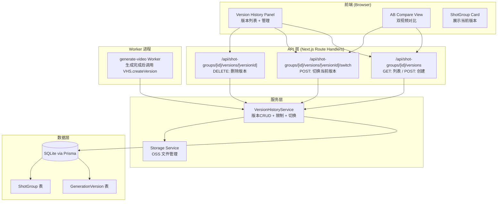
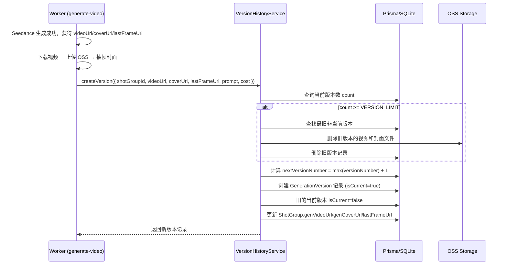
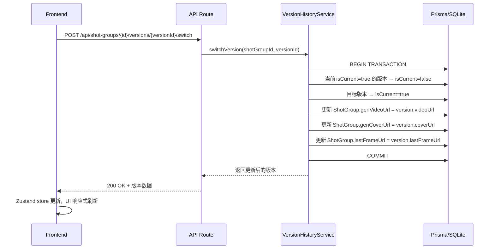

# Design Document: Generation Version History

## Overview

本设计为每个分镜组（ShotGroup）的视频生成结果提供版本历史管理能力。核心思路：

- **新增 GenerationVersion 模型**：每次生成成功后创建一条版本记录，保存完整快照（视频URL、封面URL、尾帧URL、prompt、积分消耗、时间戳）
- **ShotGroup 保持单一真相源**：`genVideoUrl`/`genCoverUrl`/`lastFrameUrl` 始终指向当前选中版本，合并导出无需感知版本系统
- **版本切换零消耗**：切换版本仅更新 ShotGroup 字段引用，不重新生成、不扣积分
- **版本数量上限**：每组最多保留 10 个版本，超限时自动淘汰最旧的非当前版本

该功能完全向后兼容：现有的合并导出流程（`segment-concat.ts`、`merge-video.ts`）仍直接读取 `ShotGroup.genVideoUrl`，无需任何修改。

## Architecture

### High-Level Design



### 数据流：生成完成自动创建版本



### 数据流：版本切换



## Components and Interfaces

### 1. VersionHistoryService（核心服务）

```typescript
// src/lib/version-history-service.ts

/** 版本数量上限，可通过环境变量配置 */
const VERSION_LIMIT = parseInt(process.env.VERSION_LIMIT ?? '10', 10)

interface CreateVersionInput {
  shotGroupId: string
  videoUrl: string       // OSS 上的视频 URL
  coverUrl?: string      // 封面 URL
  lastFrameUrl?: string  // 尾帧 URL
  promptSnapshot: string // 本次生成使用的 prompt
  costEstimate: number   // 本次生成消耗的积分
  generationJobId: string // 关联的 GenerationJob ID
}

interface VersionHistoryService {
  /**
   * 创建新版本（生成成功后调用）
   * - 超限时自动淘汰最旧非当前版本
   * - 新版本自动设为当前版本
   * - 同步更新 ShotGroup 字段
   */
  createVersion(input: CreateVersionInput): Promise<GenerationVersion>

  /**
   * 切换当前版本（用户手动操作）
   * - 不消耗积分
   * - 同步更新 ShotGroup 字段
   */
  switchVersion(shotGroupId: string, versionId: string): Promise<GenerationVersion>

  /**
   * 删除指定版本
   * - 禁止删除当前版本
   * - 同步删除 OSS 文件
   */
  deleteVersion(shotGroupId: string, versionId: string): Promise<void>

  /**
   * 获取版本列表（按版本号降序）
   */
  listVersions(shotGroupId: string): Promise<GenerationVersion[]>

  /**
   * 获取版本统计信息
   */
  getVersionStats(shotGroupId: string): Promise<{ count: number; limit: number }>
}
```

**设计决策**：
- 所有涉及 `isCurrent` 变更的操作在单一 Prisma 事务内完成，确保一致性
- 版本号使用 `MAX(versionNumber) + 1` 计算，不回收已删除的版本号（避免混淆）
- OSS 文件删除采用 best-effort：数据库记录先删除，OSS 删除失败只记录日志不回滚

### 2. Version History API Routes

```typescript
// GET /api/shot-groups/[id]/versions
// 返回版本列表 + 统计信息
interface ListVersionsResponse {
  versions: VersionItem[]
  stats: { count: number; limit: number }
}

interface VersionItem {
  id: string
  versionNumber: number
  videoUrl: string
  coverUrl: string | null
  lastFrameUrl: string | null
  promptExcerpt: string     // prompt 前 30 个字符
  promptSnapshot: string    // 完整 prompt
  costEstimate: number
  isCurrent: boolean
  createdAt: string         // ISO 8601
}

// POST /api/shot-groups/[id]/versions/[versionId]/switch
// 切换当前版本
interface SwitchVersionResponse {
  version: VersionItem
  shotGroup: { genVideoUrl: string; genCoverUrl: string | null; lastFrameUrl: string | null }
}

// DELETE /api/shot-groups/[id]/versions/[versionId]
// 删除版本（当前版本禁止删除）
// 返回 204 No Content 或 400 { error: "当前版本不可删除" }
```

### 3. Version History Store（前端状态）

```typescript
// src/stores/version-history-store.ts
import { create } from 'zustand'

interface VersionHistoryState {
  // 数据
  versions: VersionItem[]
  stats: { count: number; limit: number } | null
  isLoading: boolean
  error: string | null

  // 对比模式
  compareMode: boolean
  compareVersionIds: [string, string] | null

  // Actions
  fetchVersions: (shotGroupId: string) => Promise<void>
  switchVersion: (shotGroupId: string, versionId: string) => Promise<void>
  deleteVersion: (shotGroupId: string, versionId: string) => Promise<void>
  enterCompareMode: (versionA: string, versionB: string) => void
  exitCompareMode: () => void
}
```

**设计决策**：使用独立的 Zustand store 管理版本历史状态，与现有 `shot-store.ts` 分离。切换版本成功后需同步更新 `shot-store` 中对应 ShotGroup 的 `genVideoUrl`。

### 4. UI Components

```typescript
// src/components/editor/version-history-panel.tsx
// 版本历史侧边面板：版本列表 + 切换 + 删除

// src/components/editor/version-compare-view.tsx
// A/B 对比视图：两个同步播放的视频面板

// src/components/editor/version-item-card.tsx
// 单个版本卡片：缩略图 + 版本号 + prompt 摘要 + 时间 + 操作按钮
```

### 5. Prompt Excerpt 工具函数

```typescript
// src/lib/version-history-service.ts（内部工具函数）

/**
 * 获取 prompt 前 30 个字符作为摘要
 * - 如果原文超过 30 字符，截断并追加 "..."
 * - 如果原文为空/null，返回 "(无提示词)"
 */
function getPromptExcerpt(prompt: string | null): string
```

## Data Models

### GenerationVersion（新增 Prisma 模型）

```prisma
// 新增：生成版本记录表
// 每条记录对应一次成功的视频生成结果快照
model GenerationVersion {
  id              String   @id @default(cuid())
  shotGroupId     String   @map("shot_group_id")
  generationJobId String   @map("generation_job_id")
  versionNumber   Int      @map("version_number")    // 组内顺序号，从 1 开始递增
  videoUrl        String   @map("video_url")         // OSS 视频 URL
  coverUrl        String?  @map("cover_url")         // 封面 URL
  lastFrameUrl    String?  @map("last_frame_url")    // 尾帧 URL
  promptSnapshot  String   @map("prompt_snapshot")   // 生成时使用的完整 prompt
  costEstimate    Int      @map("cost_estimate")     // 本次生成消耗的积分
  isCurrent       Boolean  @default(false) @map("is_current") // 是否为当前使用版本
  createdAt       DateTime @default(now()) @map("created_at")

  shotGroup       ShotGroup      @relation(fields: [shotGroupId], references: [id], onDelete: Cascade)
  generationJob   GenerationJob  @relation(fields: [generationJobId], references: [id], onDelete: SetNull)

  @@unique([shotGroupId, versionNumber])
  @@index([shotGroupId])
  @@index([generationJobId])
  @@map("generation_versions")
}
```

**对现有模型的修改**：

```prisma
// ShotGroup 新增关系字段
model ShotGroup {
  // ... 现有字段不变 ...
  versions GenerationVersion[] // 新增反向关系
}

// GenerationJob 新增关系字段
model GenerationJob {
  // ... 现有字段不变 ...
  version GenerationVersion? // 新增反向关系（1:1，一个 job 最多产生一个 version）
}
```

### 字段关系说明

| ShotGroup 字段 | 来源 | 说明 |
|---|---|---|
| genVideoUrl | 当前版本的 videoUrl | 切换版本时同步更新 |
| genCoverUrl | 当前版本的 coverUrl | 切换版本时同步更新 |
| lastFrameUrl | 当前版本的 lastFrameUrl | 切换版本时同步更新 |

**设计决策**：
- 使用 `isCurrent` 布尔字段标记当前版本，而非在 ShotGroup 上增加 `currentVersionId` 外键。原因：避免循环依赖、简化查询、事务内更新更直观。
- `versionNumber` 使用 `@@unique([shotGroupId, versionNumber])` 约束，确保同一组内版本号唯一。
- `onDelete: Cascade`：删除 ShotGroup 时级联删除所有版本记录。
- `generationJobId` 使用 `onDelete: SetNull`：删除 Job 不影响已存在的版本记录。

## Correctness Properties

*A property is a characteristic or behavior that should hold true across all valid executions of a system—essentially, a formal statement about what the system should do. Properties serve as the bridge between human-readable specifications and machine-verifiable correctness guarantees.*

### Property 1: 单一当前版本不变式

*For any* ShotGroup with at least one GenerationVersion, there SHALL be exactly one version with `isCurrent = true`. After any createVersion or switchVersion operation, the target version SHALL be the sole current version.

**Validates: Requirements 1.2, 2.2, 5.1**

### Property 2: ShotGroup 字段与当前版本同步

*For any* ShotGroup, its `genVideoUrl`, `genCoverUrl`, and `lastFrameUrl` fields SHALL always equal the corresponding `videoUrl`, `coverUrl`, and `lastFrameUrl` of the version where `isCurrent = true`. This invariant holds after createVersion, switchVersion, and deleteVersion operations.

**Validates: Requirements 1.4, 5.2**

### Property 3: 版本号单调递增

*For any* ShotGroup, the sequence of `versionNumber` values across all its GenerationVersion records SHALL be strictly increasing in creation order, starting from 1, with no gaps caused by deletion (new versions always use `MAX(versionNumber) + 1`).

**Validates: Requirements 1.3**

### Property 4: 版本数量上限与淘汰

*For any* ShotGroup, the total count of GenerationVersion records SHALL never exceed `VERSION_LIMIT`. When the count equals `VERSION_LIMIT` and a new version is created, the oldest (smallest `versionNumber`) non-current version SHALL be evicted. Existing non-evicted versions remain unchanged.

**Validates: Requirements 2.1, 2.3, 8.2**

### Property 5: 失败任务不产生版本

*For any* GenerationJob with status FAILED, no GenerationVersion record SHALL be created. The version list and current version for the associated ShotGroup SHALL remain unchanged.

**Validates: Requirements 2.4**

### Property 6: 版本列表降序排列

*For any* ShotGroup with N versions, the `listVersions` function SHALL return all N versions sorted by `versionNumber` in descending order.

**Validates: Requirements 3.1**

### Property 7: Prompt 摘要截断

*For any* prompt string, `getPromptExcerpt(prompt)` SHALL return the first 30 characters followed by "..." if the string length exceeds 30, or the full string if length ≤ 30. For null/empty input, it SHALL return "(无提示词)".

**Validates: Requirements 3.2**

### Property 8: 当前版本不可删除

*For any* ShotGroup and any version where `isCurrent = true`, calling `deleteVersion` with that version's ID SHALL fail with an error, and the version SHALL remain in the database unchanged.

**Validates: Requirements 6.2**

### Property 9: 非当前版本可删除

*For any* ShotGroup and any version where `isCurrent = false`, calling `deleteVersion` with that version's ID SHALL succeed, removing the record from the database. The remaining versions and the current version SHALL be unaffected.

**Validates: Requirements 6.3**

### Property 10: 版本切换不消耗积分

*For any* switchVersion operation, no CreditLedger record SHALL be created as a result of the switch. The user's credit balance SHALL remain unchanged.

**Validates: Requirements 5.4**

## Error Handling

### 服务层错误

| 场景 | 处理策略 |
|------|----------|
| 删除当前版本 | 返回 400 错误: "当前版本不可删除，请先切换到其他版本" |
| 切换到不存在的版本 | 返回 404 错误: "版本不存在" |
| 切换到不属于该 ShotGroup 的版本 | 返回 400 错误: "版本不属于该分镜组" |
| 版本创建时 OSS 文件已不存在 | 仍创建版本记录（URL 可能临时不可访问），记录 warn 日志 |
| 版本删除时 OSS 删除失败 | 数据库记录已删除，OSS 清理记录错误日志，不回滚（避免孤儿记录） |
| 淘汰时所有非当前版本已删除 | 允许创建新版本（新版本成为当前版本后系统回归合规） |
| 事务冲突（并发切换） | Prisma 事务重试一次，仍失败则返回 409 |

### API 层错误

| HTTP Status | 场景 |
|-------------|------|
| 400 | 删除当前版本、无效参数 |
| 401 | 未登录 |
| 403 | 操作不属于自己的项目 |
| 404 | ShotGroup 或版本不存在 |
| 409 | 并发操作冲突 |
| 500 | 内部错误（数据库异常等） |

### Worker 层集成

`generate-video.ts` 中 `atomicSuccessUpdate` 成功后调用 `createVersion`：
- `createVersion` 失败不应回滚已成功的生成结果（best-effort）
- 失败时记录 error 日志，ShotGroup 的 genVideoUrl 仍由 `atomicSuccessUpdate` 保证正确
- 后续可通过管理后台手动补录版本

## Testing Strategy

### Property-Based Testing (PBT)

使用 `fast-check` 库，每个 property 测试最少运行 100 次迭代。

**适用的 property 测试**：
- 单一当前版本不变式（Property 1）：生成随机的 createVersion/switchVersion 操作序列，验证任意时刻恰好一个 isCurrent=true
- ShotGroup 字段同步（Property 2）：任意操作后验证 ShotGroup 三个字段与当前版本一致
- 版本号单调递增（Property 3）：随机创建+删除序列后，验证版本号始终递增
- 版本数量上限（Property 4）：随机数量的版本创建，验证不超过 VERSION_LIMIT
- 失败任务不产生版本（Property 5）：随机 FAILED job 数据，验证版本列表不变
- 版本列表排序（Property 6）：随机版本集合，验证排序正确性
- Prompt 摘要截断（Property 7）：随机字符串，验证截断逻辑
- 当前版本不可删除（Property 8）：随机选中当前版本删除，验证失败
- 非当前版本可删除（Property 9）：随机选中非当前版本删除，验证成功
- 版本切换不消耗积分（Property 10）：随机切换操作，验证无积分变动

**PBT 测试标签格式**：
```
// Feature: generation-version-history, Property 1: 单一当前版本不变式
```

### Unit Tests（示例和边界测试）

- 首次生成创建版本号为 1 的版本
- 版本上限为 10 时，第 11 次生成触发淘汰
- 只有当前版本存在时仍可创建新版本（边界：8.5）
- A/B 对比模式下视频播放同步
- 版本切换后 UI 立即更新（无需刷新）
- 导出流程读取 ShotGroup.genVideoUrl 而非查询版本表
- genVideoUrl 为 null 时导出跳过该组

### Integration Tests

- Worker 生成成功 → 版本记录创建 → ShotGroup 字段更新（端到端）
- 版本切换 → 导出使用切换后的视频
- 版本删除 → OSS 文件被清理
- 并发版本切换的正确性
- 数据库迁移后现有 ShotGroup 数据兼容性
