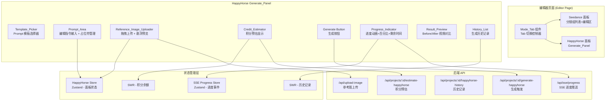
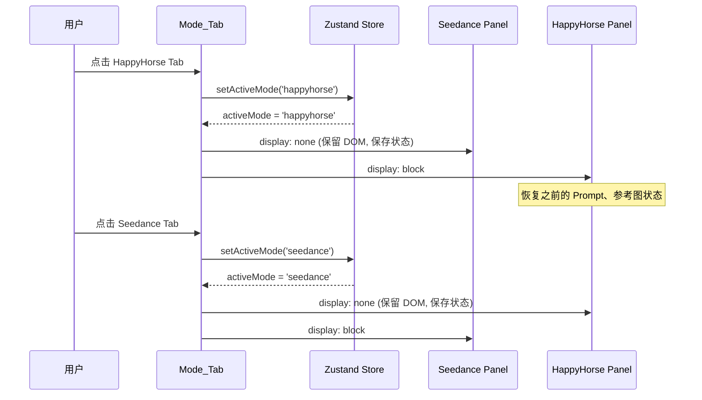
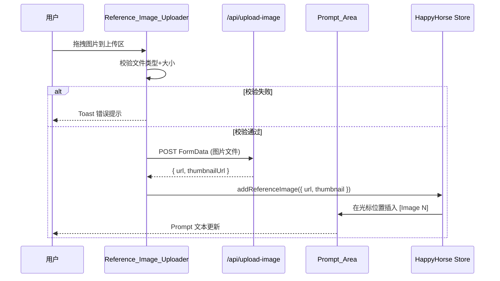

# Design Document: HappyHorse UI Enhancement

## Overview

本设计对 HappyHorse V-Edit 前端界面进行全面 UI/UX 优化，将现有朴素的按钮式引擎切换和基础生成面板升级为专业级创作工具体验。核心改造点：

1. **引擎选择器卡片化 + Tab 布局重构**：将引擎切换从平铺按钮升级为 Tab 标签页，实现 Seedance 与 HappyHorse 面板的互斥显示
2. **参考图拖拽上传增强**：支持 Drag & Drop 上传、悬浮放大预览、自动插入 `[Image N]` 占位符
3. **Prompt 模板快捷填充**：预置风格模板一键填入，降低用户编写指令的门槛
4. **积分预估与余额校验**：调用后端接口实时展示生成成本，余额不足时禁用生成
5. **进度动画升级**：脉冲环动画 + 百分比进度条 + 预估剩余时间（复用现有 SSE 推送系统）
6. **结果预览对比**：Before/After 并排视频对比，同步播放
7. **历史记录列表**：按项目展示生成历史，支持多版本对比

技术核心原则：
- 所有新组件为 Client Component（需要交互），遵循 `'use client'` 标记
- 状态管理使用 Zustand（面板本地状态）+ SWR（服务端数据如积分、历史记录）
- 进度推送复用现有 `sse-progress-store` + `use-sse-progress` Hook
- 积分预估调用后端 API，不在前端本地计算（但纯函数 `credit-calc.ts` 可供 UI 做乐观预估）
- UI 组件基于 shadcn/ui + Tailwind CSS v4，暗色主题

## Architecture



### Tab 切换与面板生命周期



### 参考图上传与占位符同步



## Components and Interfaces

### 1. ModeTab — Tab 切换控制器

```typescript
// src/components/editor/mode-tab.tsx
interface ModeTabProps {
  projectId: string
  currentEngine: 'seedance' | 'happyhorse'
  onEngineChange: (engine: 'seedance' | 'happyhorse') => void
}
```

**职责**：
- 渲染 Seedance / HappyHorse 两个 Tab，展示引擎图标、名称、功能简介
- HappyHorse Tab 展示"推荐"角标
- 每个 Tab 展示功能对比 Tag（如"支持真人脸""风格化转换"等）
- 切换时调用后端 PATCH 引擎接口，加载中禁用 Tab 交互
- 使用 CSS `display: none` 隐藏非活跃面板（保留 DOM 以保持输入状态）

### 2. ReferenceImageUploader — 参考图拖拽上传组件

```typescript
// src/components/editor/reference-image-uploader.tsx
interface ReferenceImageUploaderProps {
  images: ReferenceImage[]
  maxCount?: number           // 默认 5
  onImagesChange: (images: ReferenceImage[]) => void
  onError: (message: string) => void
  disabled?: boolean
}

interface ReferenceImage {
  id: string                  // 唯一标识 (nanoid)
  file?: File                 // 上传前的文件对象
  url: string                 // OSS 公网 URL (上传后)
  thumbnailUrl?: string       // 缩略图 URL
  status: 'uploading' | 'success' | 'error'
}
```

**职责**：
- 支持拖拽（Drag & Drop）和点击上传两种方式
- dragenter/dragover 时展示高亮边框反馈
- 文件校验：类型 JPEG/PNG/WEBP、大小 ≤ 20MB
- 上传中展示进度，上传成功后显示缩略图
- 鼠标悬停缩略图时展示放大预览浮层（Popover/Portal，固定 320px 宽）
- 点击 X 移除图片，触发占位符重编号

### 3. PromptArea — 编辑指令文本区（增强版）

```typescript
// src/components/editor/prompt-area.tsx
interface PromptAreaProps {
  value: string
  onChange: (value: string) => void
  onCursorChange?: (position: number) => void
  placeholder?: string
  maxLength?: number          // 默认 2500
  disabled?: boolean
}
```

**职责**：
- 基于 `<textarea>` 的增强输入框
- 跟踪光标位置（通过 selectionStart）
- 暴露 `insertAtCursor(text: string)` 方法（通过 ref）
- 支持 `[Image N]` 占位符高亮显示（通过 overlay 或 highlight 层）

### 4. TemplatePicker — Prompt 模板选择器

```typescript
// src/components/editor/template-picker.tsx
interface TemplatePickerProps {
  onSelectTemplate: (template: PromptTemplate) => void
  hasExistingContent: boolean  // Prompt 是否有内容（决定是否弹确认）
}

interface PromptTemplate {
  id: string
  name: string                // 如 "动漫风"
  icon?: string               // emoji 或 lucide icon name
  prompt: string              // 模板 Prompt 文本
}
```

**职责**：
- 以标签组（Tag Group）形式展示在 Prompt_Area 上方
- 内置至少 3 种预置模板：动漫风、赛博朋克、水墨国风
- 点击时，若 Prompt 已有内容则弹 `AlertDialog` 确认是否替换
- 确认后将模板文本写入 Prompt_Area

### 5. CreditEstimator — 积分预估模块

```typescript
// src/components/editor/credit-estimator.tsx
interface CreditEstimatorProps {
  projectId: string
  videoDuration: number       // 输入视频时长（秒）
  segmentCount?: number       // 分段数量（> 15秒时拆段）
}
```

**职责**：
- 调用 `GET /api/projects/:id/estimate-happyhorse` 获取后端预估值
- 展示格式："预估消耗 ~N 积分"
- 通过 SWR 缓存积分余额（`/api/credits/balance`）
- 余额不足时：文本变红、显示⚠️图标、禁用生成按钮
- 视频时长变化时触发 SWR revalidation

### 6. ProgressIndicator — 进度动画组件

```typescript
// src/components/editor/progress-indicator.tsx
interface ProgressIndicatorProps {
  taskId: string              // 任务 ID，从 SSE store 读取进度
  taskType: 'generation'      // 固定为 generation
}
```

**职责**：
- 从 `useSSEProgressStore` 订阅指定 taskId 的进度事件
- 展示脉冲环 CSS 动画（`animate-pulse` + 自定义 keyframes）
- 渲染百分比进度条（shadcn/ui `<Progress />`）
- 格式化并展示预估剩余时间（`estimatedRemainingSeconds` → "约 N 分 M 秒"）
- 终态（completed/failed）时停止动画，展示成功✓或错误✗图标

### 7. ResultPreview — 结果预览与对比组件

```typescript
// src/components/editor/result-preview.tsx
interface ResultPreviewProps {
  originalVideoUrl: string    // 原视频 URL
  generatedVideoUrl?: string  // 生成视频 URL
  segments?: GeneratedSegment[] // 多分段视频列表
}

interface GeneratedSegment {
  index: number
  videoUrl: string
  duration: number
}
```

**职责**：
- 单视频模式：展示生成结果视频播放器
- Before/After 对比模式：并排两个 `<video>` 元素，同步 `currentTime`
- 同步机制：监听一个视频的 `timeupdate` 事件，同步设置另一个视频的 `currentTime`
- 基本控制：播放/暂停、进度拖拽、音量调节
- 多分段模式：列表展示所有分段，点击切换当前预览分段

### 8. HistoryList — 历史记录列表组件

```typescript
// src/components/editor/history-list.tsx
interface HistoryListProps {
  projectId: string
}

interface HistoryRecord {
  id: string
  createdAt: string           // ISO 时间戳
  prompt: string              // 使用的 Prompt
  status: 'pending' | 'running' | 'succeeded' | 'failed'
  thumbnailUrl?: string
  videoUrl?: string
  creditCost?: number
}
```

**职责**：
- 通过 SWR 从 `GET /api/projects/:id/happyhorse-history` 获取数据
- 按时间倒序排列，每条显示缩略图、时间、Prompt 摘要（截断 50 字）、状态
- 点击记录 → 在 ResultPreview 中加载对应视频
- 支持 checkbox 多选（最多 2 条）进入对比模式
- 超过 20 条时分页加载（SWR + cursor 分页）

### 9. HappyHorseStore — Zustand 面板状态

```typescript
// src/stores/happyhorse-store.ts
interface HappyHorseState {
  // 面板输入状态（Tab 切换时保留）
  prompt: string
  cursorPosition: number
  referenceImages: ReferenceImage[]
  
  // 生成状态
  isGenerating: boolean
  currentTaskId: string | null
  
  // 结果状态
  latestResult: GenerationResult | null
  
  // Actions
  setPrompt: (text: string) => void
  setCursorPosition: (pos: number) => void
  addReferenceImage: (img: ReferenceImage) => void
  removeReferenceImage: (id: string) => void
  insertPlaceholderAtCursor: (imageIndex: number) => void
  removePlaceholderAndRenumber: (removedIndex: number) => void
  setGenerating: (status: boolean, taskId?: string) => void
  setLatestResult: (result: GenerationResult | null) => void
  reset: () => void
}
```

## Data Models

### 新增 API 端点

| 端点 | 方法 | 用途 | 请求体/参数 | 响应 |
|------|------|------|-------------|------|
| `/api/projects/:id/estimate-happyhorse` | GET | 积分预估 | query: `?duration=N` | `{ estimatedCredits: number, balance: number, sufficient: boolean }` |
| `/api/projects/:id/happyhorse-history` | GET | 历史记录 | query: `?cursor=X&limit=20` | `{ records: HistoryRecord[], nextCursor?: string }` |

### 数据库（复用现有 Schema）

无需新增 Prisma Model。历史记录基于现有 `GenerationJob` 表（engine = 'happyhorse' 过滤），结果视频 URL 从 `GenerationJob.resultUrl` 获取。

### Prompt 模板数据结构

```typescript
// src/constants/prompt-templates.ts
export const PROMPT_TEMPLATES: PromptTemplate[] = [
  {
    id: 'anime',
    name: '动漫风',
    icon: '🎨',
    prompt: '将视频转换为日系动漫风格，保持人物动作和表情不变，色彩鲜明，线条流畅，背景简化为动漫场景',
  },
  {
    id: 'cyberpunk',
    name: '赛博朋克',
    icon: '🌆',
    prompt: '将视频转换为赛博朋克风格，添加霓虹灯光效果、暗色调科技感、数字化UI元素叠加，保持人物主体不变',
  },
  {
    id: 'ink-painting',
    name: '水墨国风',
    icon: '🖌️',
    prompt: '将视频转换为中国水墨画风格，笔触飘逸写意，黑白为主淡彩点缀，背景化为山水意境，人物保持辨识度',
  },
]
```

### 占位符管理纯函数

```typescript
// src/lib/placeholder-utils.ts

/**
 * 在指定位置插入占位符
 * @param text 原始文本
 * @param position 插入位置（光标位置，-1 表示末尾）
 * @param imageIndex 图片序号 (1-based)
 * @returns 插入后的文本
 */
export function insertPlaceholder(text: string, position: number, imageIndex: number): string

/**
 * 移除指定序号的占位符并重新编号
 * @param text 包含占位符的文本
 * @param removedIndex 被移除的图片序号 (1-based)
 * @returns 重编号后的文本
 */
export function removePlaceholderAndRenumber(text: string, removedIndex: number): string

/**
 * 校验文件是否满足上传条件
 * @param file 文件元数据
 * @returns { valid: boolean, reason?: string }
 */
export function validateReferenceImage(file: { type: string; size: number }): { valid: boolean; reason?: string }

/**
 * 格式化剩余时间秒数为可读文本
 * @param seconds 剩余秒数
 * @returns 格式化文本，如 "约2分30秒"
 */
export function formatRemainingTime(seconds: number): string
```

### 剩余时间格式化规则

| 输入范围 | 输出格式 |
|---------|----------|
| 0-59 秒 | "约 N 秒" |
| 60-3599 秒 | "约 M 分 N 秒" |
| ≥ 3600 秒 | "约 H 小时 M 分" |

## Correctness Properties

*A property is a characteristic or behavior that should hold true across all valid executions of a system—essentially, a formal statement about what the system should do. Properties serve as the bridge between human-readable specifications and machine-verifiable correctness guarantees.*

### Property 1: Tab 状态切换 Round-Trip

*For any* Prompt 文本和参考图列表状态，切换 Tab（从 HappyHorse → Seedance → HappyHorse）后，恢复的状态应与切换前完全一致（Prompt 文本、参考图数组长度和内容均不变）。

**Validates: Requirements 2.4**

### Property 2: 参考图文件校验正确性

*For any* 文件类型字符串和文件大小数值的组合，`validateReferenceImage` 函数应满足：当且仅当类型属于 `['image/jpeg', 'image/png', 'image/webp']` 且大小 ≤ 20MB 时返回 `valid: true`，否则返回 `valid: false` 并包含具体 reason。

**Validates: Requirements 3.3, 3.6**

### Property 3: 占位符插入位置正确性

*For any* Prompt 文本、光标位置（0 到 text.length）和图片序号 N，`insertPlaceholder(text, position, N)` 的结果应满足：1) 原文本在插入位置前后的内容不变；2) 插入位置处恰好包含 `[Image N]`；3) 总长度 = 原长度 + `[Image N]`.length。当 position 为 -1 时，占位符出现在末尾。

**Validates: Requirements 4.1, 4.3**

### Property 4: 占位符移除与重编号一致性

*For any* 包含 N 个连续编号占位符 `[Image 1]` 到 `[Image N]` 的文本（N ≥ 2），移除第 K 个（1 ≤ K ≤ N）后，结果文本应包含恰好 N-1 个占位符，且编号为连续的 `[Image 1]` 到 `[Image N-1]`，原 Prompt 文本（非占位符部分）不变。

**Validates: Requirements 4.2**

### Property 5: Prompt 非空时模板填入需确认

*For any* 非空字符串作为当前 Prompt 内容，当用户触发模板填入时，系统应先展示确认对话框，而非直接替换。确认后 Prompt 内容等于模板文本；取消后 Prompt 保持原内容不变。

**Validates: Requirements 5.3**

### Property 6: 积分预估公式一致性

*For any* 输入视频时长 duration（3 ≤ duration ≤ 60，整数秒），前端显示的预估积分应等于 `estimateHappyHorseCreditCost(duration)` 的计算结果，即 `ceil((duration + min(duration, 15)) × coefficient)`。

**Validates: Requirements 6.2**

### Property 7: 余额不足时禁用生成按钮

*For any* 用户积分余额 balance 和预估消耗 estimate 的组合（均为非负整数），当 balance < estimate 时生成按钮应处于禁用状态（disabled = true），当 balance ≥ estimate 时按钮应可用（disabled = false）。

**Validates: Requirements 6.3**

### Property 8: 进度百分比映射正确性

*For any* 进度值 progress（0 ≤ progress ≤ 100），进度条组件的 aria-valuenow 应等于 progress，视觉宽度应为 `progress%`。

**Validates: Requirements 7.2**

### Property 9: 剩余时间格式化正确性

*For any* 非负整数秒数 seconds，`formatRemainingTime(seconds)` 应满足：1) seconds < 60 → 输出包含"秒"且不包含"分"；2) 60 ≤ seconds < 3600 → 输出包含"分"；3) seconds ≥ 3600 → 输出包含"小时"。且格式化后的数值解析回来应与原始秒数在同一量级（舍入误差 ≤ 59 秒）。

**Validates: Requirements 7.3**

### Property 10: Before/After 视频同步播放

*For any* seek 操作将视频 A 的 currentTime 设置为 t（0 ≤ t ≤ duration），同步机制应确保视频 B 的 currentTime 与 t 的差值绝对值 < 0.5 秒。

**Validates: Requirements 8.3**

### Property 11: 历史记录排序与完整性

*For any* 包含 N 条历史记录的列表（每条有不同的 createdAt 时间戳），渲染结果应满足：1) 记录按 createdAt 严格降序排列；2) 每条记录的渲染输出包含缩略图占位/图片、时间文本、Prompt 摘要文本和状态标识。

**Validates: Requirements 9.1, 9.2**

## Error Handling

### 文件上传错误

| 场景 | 处理策略 |
|------|----------|
| 文件类型不支持 | Toast 提示"仅支持 JPEG/PNG/WEBP 格式"，文件不进入上传队列 |
| 文件大小超限（> 20MB） | Toast 提示"文件大小不能超过 20MB"，文件不进入上传队列 |
| 上传数量超限（> 5张） | Toast 提示"最多上传 5 张参考图"，超出部分忽略 |
| OSS 上传失败 | 标记该图为 error 状态，允许重试或移除 |
| 网络中断 | 上传中的图片标记为 error，Toast 提示网络错误 |

### 积分相关错误

| 场景 | 处理策略 |
|------|----------|
| 预估接口请求失败 | 使用前端 `estimateHappyHorseCreditCost` 纯函数做乐观预估，显示"~"标记表示为预估值 |
| 余额查询失败 | 不阻止生成操作（后端会做最终校验），但提示"余额查询失败，如余额不足将在生成时提示" |
| 生成时后端返回 402 | 显示余额不足弹窗，引导充值 |

### 生成过程错误

| 场景 | 处理策略 |
|------|----------|
| SSE 连接断开 | 复用现有 SSE 重连机制（3秒自动重连），降级为轮询 |
| 生成任务失败 | Progress_Indicator 展示错误图标 + 失败原因文本，允许重新生成 |
| 生成超时（无进度推送 > 5 分钟） | 显示"生成超时，请稍后在历史记录中查看结果" |
| 生成结果视频 URL 过期（24h） | 历史记录中过期视频显示"已过期"标记，不允许播放 |

### Tab 切换错误

| 场景 | 处理策略 |
|------|----------|
| 引擎切换 API 失败 | Toast 提示"切换失败"，Tab 恢复到之前状态 |
| 切换中网络中断 | 恢复 Tab 状态，显示重试按钮 |

## Testing Strategy

### Property-Based Testing (PBT)

使用 `fast-check` 库（项目已安装），每个 property 测试最少运行 100 次迭代。

**测试文件**：`src/__tests__/happyhorse-ui.property.test.ts`

**适用的 property 测试**：
- Property 2: 文件校验纯函数（`validateReferenceImage`）
- Property 3: 占位符插入纯函数（`insertPlaceholder`）
- Property 4: 占位符移除重编号纯函数（`removePlaceholderAndRenumber`）
- Property 6: 积分预估公式一致性（`estimateHappyHorseCreditCost`）
- Property 7: 余额/预估比较逻辑
- Property 9: 剩余时间格式化（`formatRemainingTime`）
- Property 11: 历史记录排序逻辑

**PBT 测试标签格式**：
```typescript
// Feature: happyhorse-ui-enhancement, Property 2: 参考图文件校验正确性
```

**配置**：每个 property 最少 100 次迭代：
```typescript
fc.assert(fc.property(...), { numRuns: 100 })
```

### Unit Tests（示例和边界测试）

**测试文件**：`src/__tests__/happyhorse-ui.test.ts`

- ModeTab 初始渲染正确性（两个 Tab 存在，高亮正确）
- HappyHorse Tab 推荐角标存在
- Drag & Drop 高亮反馈（dragenter → className 变化）
- 悬浮放大预览浮层出现/消失
- 模板列表至少包含 3 个选项
- 积分余额充足时生成按钮可用
- 进度动画在 generating 状态时渲染
- 生成完成后自动展示 ResultPreview
- 历史记录分页：超过 20 条时显示"加载更多"
- 对比模式选择 2 条记录时并排展示

### Integration Tests

- 完整生成流程：上传参考图 → 填写 Prompt → 获取预估 → 点击生成 → SSE 进度 → 结果预览
- Tab 切换状态保留：填写内容 → 切 Seedance → 切回 → 内容仍在
- 历史记录加载与点击回放
- 多用户隔离：不同用户的 SSE 事件互不干扰（复用 realtime-progress-push 的测试）
