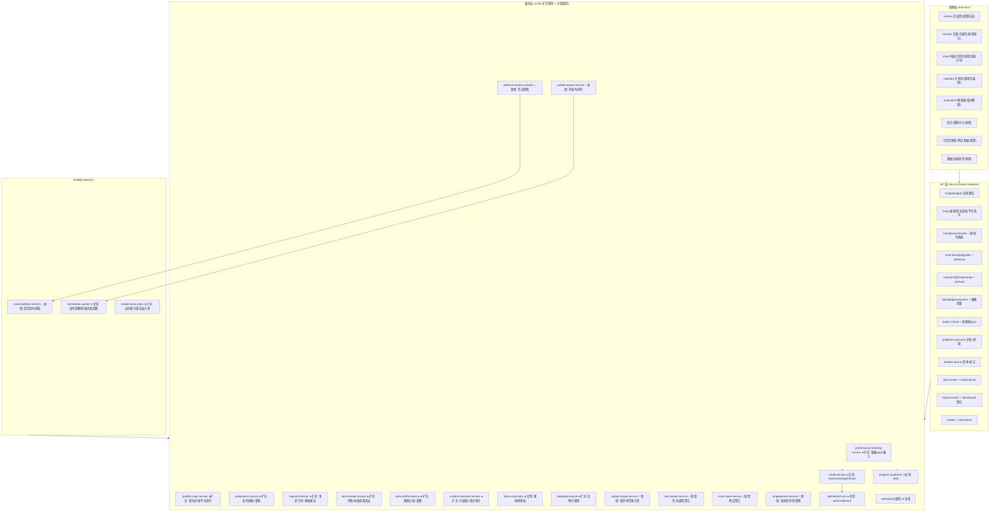
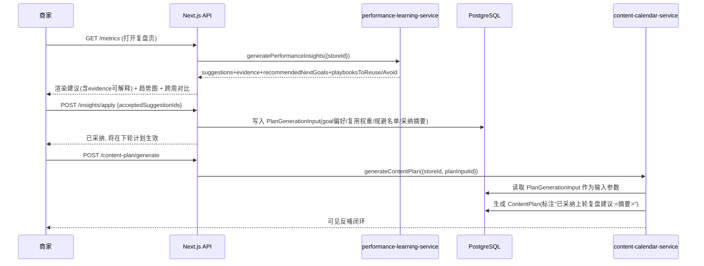
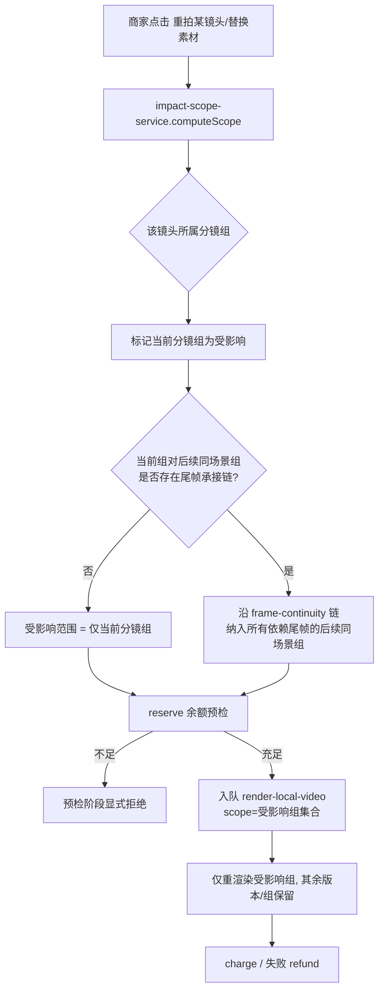
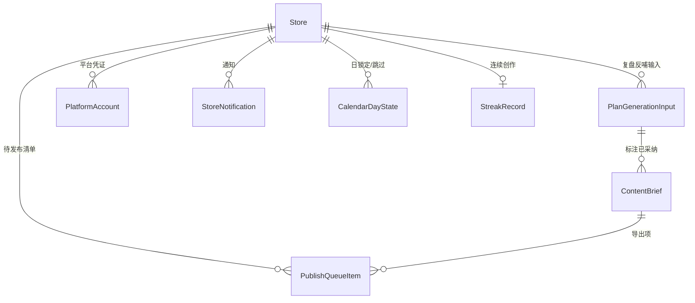

# Design Document: 本地生活深化改造（三件套反馈控制回路）

## Overview

本设计在已上线的「本地生活营销平台」（`local-life-marketing-platform`）之上做**深度改造**，核心目标只有一个：

> 把平台里所有「AI 输出但只读」的终点，统一改造为「可解释 / 可干预 / 可反哺」的反馈控制回路（简称「三件套」）。

本 spec **不新建业务体系**，而是对既有服务层（`performance-learning-service` / `playbook-engine` / `compliance-service` / `capture-director` / `local-render-service` / `store-profile-service` / `content-calendar-service` / `privilege-engine`）做**扩充式增强**：补齐前端未渲染的产物、把只读检测接上「改写/重做/规避」动作、把每一步的结果回灌到下一步的生成输入。

### 设计基线（贯穿全文，对应需求 0 全局约束）

- **小白老板默认体验**：所有深化动作默认提供「AI 自动决策 + 一键完成」路径，专业可调参数一律收纳进「高级」抽屉/渐进式展开，默认隐藏且不影响一键路径。
- **真实接口、无静默降级**：Seedance、OSS、支付、AI 文案/分析、平台数据抓取全部走真实接口；任一外部依赖失败时显式报错或显式提示，禁止 mock / fallback / 假数据掩盖。
- **积分写操作统一串行**：本 spec 新增的所有触发外部推理且消耗积分的 AI 动作（重新生成文案 / 按平台改写 / 一键改写规避 / 生成镜头参考图 / 单版本重生成 / 局部重拍），统一复用既有 `credit-service`（reserve→charge/refund）+ `withCreditLock` 全局锁，先做余额预检，禁止新建并行计费路径、禁止 `withCreditLock` 重入。
- **加法式数据库变更**：所有 schema 变更采用 additive-only（新增可空列 / 新表），不破坏既有数据与查询。
- **中文注释与文案**：全部新增逻辑保持简体中文注释与用户文案。

### 三件套统一实现范式

| 维度 | 实现手段（贯穿所有需求） |
|---|---|
| 可解释 Explainable | 每条 AI 产物随附 `evidence`/`provenance`（溯源结构体），前端用通俗话术展示「这条用了你的招牌『现熬8小时骨汤』」，不暴露字段名 |
| 可干预 Actionable | 每个只读展示旁挂「一键完成」主动作（小白）+「高级抽屉」细调（运营型），动作经服务层落库并触发后续流程 |
| 可反哺 Feedback Loop | 本步结果写入下一步生成的**输入参数**（复盘建议→content-plan 输入；合规结果→文案改写→重跑合规；质检失败→重拍建议；画像调整→后续生成生效），并在产物上标注「已采纳上轮…」形成可见闭环 |

### 改造范围与既有资产映射

| 需求 | 改造对象（既有） | 改造手段（本 spec 新增） |
|---|---|---|
| 需求 1 数据复盘闭环 | `performance-learning-service` 已算出但前端未渲染 | 前端渲染 + `应用建议`→写入 plan 输入 + 趋势图/跨周对比 + 反哺标注 |
| 需求 2 文案与合规可操作 | `compliance-service` 只读检测 | 文案就地编辑 + 重新生成/按平台改写 + 一键改写规避（改写后重跑合规）|
| 需求 3 拍摄事中引导 | `capture-director` 质检在事后 | 拍摄前可视化引导 + 量化达标阈值 + 失败维度重拍建议 + 参考图生成 |
| 需求 4 生成可控性 | `local-render-service` 整条生成 | 单版本重生成 + 局部重拍 + 受影响范围（分镜组+尾帧承接链）重算 |
| 需求 5 画像溯源 | `playbook-engine` 实例化无记录 | 实例化时记录画像引用 + 前端溯源展示 + 画像调整仅对后续生效 |
| 需求 6 计划可编辑 | `content-calendar-service` 全只读 | 改期/换 goal/换 playbook/增删 + 重实例化 + 锁定/跳过尊重 |
| 需求 7 自动数据抓取 | `metrics-ingestor` 仅手动 | 平台凭证授权 + BullMQ 受控抓取 Worker + 来源标注 |
| 需求 8 发布闭环 | 导出后无后续 | 待发布清单 + 超时提醒（notification-worker）+ 手动标记回填 |
| 需求 9 任务/通知中心 | 分散在各页 | 门店作用域聚合 + SSE 实时 + 已读/未读 |
| 需求 10 多门店切换 | 单店视角 | 门店切换器（受 maxStores 权益约束）+ 跨店看板聚合 |
| 需求 11 激励留存 | 无 | 连续创作统计 + 里程碑徽章 + 真实效果对比 + 进阶引导 |

## Architecture

### 整体架构（扩充既有，不新建体系）



★ = 扩充既有服务；☆ = 本 spec 新增的薄服务（仅承载新职责，底层仍复用既有基础设施）。

### 三件套数据流（以需求 1「复盘→下周计划」为范例）



### 需求 4「局部重渲染」受影响范围数据流



### 关键架构决策

1. **薄服务 + 扩充优先**：新增动作尽量作为既有服务的新导出函数，仅当职责完全独立（抓取、清单、聚合、激励）时新建薄服务文件，避免重建。
2. **计费链路单一**：所有消耗积分的 AI 动作都走 `credit-service.reserve→charge/refund` 且经 `withCreditLock`；新增动作不得自行写余额。
3. **加法式 schema**：通过新增可空列（如 `ContentBrief.copyEditedFlag`、`provenance` JSON）与新表（`PlanGenerationInput`、`PlatformAccount`、`PublishQueueItem`、`Notification`、`StreakRecord`）承载新状态，旧查询不受影响。
4. **作用域一致性**：任务中心、通知中心、跨店看板统一以「当前所选门店」为作用域键，与门店切换器共享 `currentStoreId`，不跨店混合聚合。
5. **抓取受控**：平台数据抓取为「增强」，手动录入永远保留为兜底；抓取失败显式标记需重新关联并回退手动，绝不伪造数据。
6. **周期口径统一**：需求 1/8/11 的「内容周期/周」统一对齐 `StoreProfile.weeklyCadence`（默认自然周周一至周日），由 `period-service` 单点提供，禁止各页另立口径。

## Components and Interfaces

> 约定：以下接口以 TypeScript 描述。`★扩充` 表示在既有文件中新增导出；`☆新增` 表示新建文件。所有消耗积分的函数签名都包含 `userId`，内部经 `withCreditLock` 串行并先做余额预检。

### 0. period-service（内容周期口径单点）☆新增

**文件**: `src/lib/period-service.ts`

统一「内容周期/周」的计算，供需求 1（跨周对比）、需求 8（发布提醒时长基准）、需求 11（连续创作/效果对比）引用，杜绝各页另立口径。

```typescript
/** 周期边界（左闭右开） */
export interface PeriodRange {
  index: number        // 周期序号（0 = 含基准日的当前周期）
  startDate: Date      // 周期开始（含）
  endDate: Date        // 周期结束（不含）
  label: string        // 通俗标签，如 "本周(1.6-1.12)"
}

/**
 * 基于门店 weeklyCadence 解析周期。
 * 默认自然周（周一 00:00 至下周一 00:00）；weeklyCadence 另有配置时以其为准。
 */
export function resolvePeriods(input: {
  weeklyCadence: unknown      // StoreProfile.weeklyCadence
  referenceDate: Date
  count: number               // 需要回溯的周期数
}): PeriodRange[]

/** 判断某日期归属哪个周期序号（相对 referenceDate） */
export function periodIndexOf(date: Date, ranges: PeriodRange[]): number | null
```

### 1. performance-learning-service ★扩充（需求 1）

既有 `generatePerformanceInsights` 已产出 `suggestions/recommendedNextGoals/playbooksToReuse/playbooksToAvoid`，但前端未渲染、且无「应用」通道。新增：

```typescript
/**
 * 将商家采纳的复盘建议固化为下一轮内容计划的生成输入（可反哺）。
 * 写入 PlanGenerationInput 新表，供 content-calendar-service 读取。
 * 不消耗积分（纯写库）。
 */
export async function applyInsights(input: {
  storeId: string
  acceptedNextGoals?: ContentGoal[]        // 来自 recommendedNextGoals
  reusePlaybookIds?: string[]              // 来自 playbooksToReuse → 提升复用权重
  avoidPlaybookIds?: string[]              // 来自 playbooksToAvoid → 规避名单
  acceptedSuggestionSummaries: string[]    // 用于计划上的"已采纳"标注
}): Promise<PlanGenerationInput>

/**
 * 指标趋势查询：返回门店历史多条 brief 在指定指标上的时间序列（需求 1.4）。
 */
export async function getMetricTrend(input: {
  storeId: string
  metric: 'views' | 'likes' | 'comments' | 'shares' | 'saves' | 'linkClicks' | 'orders' | 'redemptions' | 'conversion'
}): Promise<{ briefId: string; date: Date; value: number }[]>

/**
 * 跨周对比：按 period-service 周期聚合关键指标，返回本周 vs 上周增减（需求 1.5）。
 * 已结束周期 < 2 时返回 { available: false }，不伪造。
 */
export async function getPeriodComparison(input: {
  storeId: string
}): Promise<
  | { available: false; reason: string }
  | { available: true; current: PeriodMetricSummary; previous: PeriodMetricSummary; deltas: Record<string, number> }
>
```

**门控（需求 1.6）**：前端打开 metrics 页时，若带 metrics 的 brief 数 <3，API 返回 `{ unlocked: false, remaining: N }`，前端显式提示「再录入 N 条即可解锁优化建议」，不调用建议渲染、不伪造。

### 2. publish-copy-service ★扩充 + compliance-service ★扩充（需求 2）

```typescript
// publish-copy-service.ts ★扩充

/**
 * 就地保存人工编辑的平台文案（需求 2.1, 2.8）。
 * 写回 ContentBrief.platformCopies，并置 copyEditedFlag=true（人工修改标记）。
 * 不消耗积分。
 */
export async function saveManualCopy(input: {
  contentBriefId: string
  platform: PublishPlatform
  copy: PlatformCopy
}): Promise<void>

/**
 * 重新生成文案（需求 2.2）。基于 StoreProfile + brief 上下文调用 LLM 产出新文案供预览采纳。
 * 消耗积分 → 经 credit-service + withCreditLock，先做余额预检。
 * 若目标文案存在 copyEditedFlag，调用方必须先经二次确认（confirmOverwrite=true）。
 */
export async function regenerateCopy(input: {
  contentBriefId: string
  platform: PublishPlatform
  userId: string
  confirmOverwrite: boolean          // 覆盖人工修改的显式确认（需求 2.3）
}): Promise<{ preview: PlatformCopy }>

/**
 * 按平台调性改写（需求 2.4）。针对抖音/小红书/视频号差异产出适配文案。
 * 消耗积分；覆盖人工修改同样需 confirmOverwrite。
 */
export async function rewriteForPlatform(input: {
  contentBriefId: string
  platform: PublishPlatform
  userId: string
  confirmOverwrite: boolean
}): Promise<{ preview: PlatformCopy }>
```

```typescript
// compliance-service.ts ★扩充

/**
 * 一键改写规避（需求 2.5, 2.6, 2.7）。
 * 1) 读取最近一次 ComplianceCheck 命中的违禁词/风险点(evidence)
 * 2) 调用文案生成去除违禁表达，产出合规候选文案
 * 3) 用候选文案自动重新跑一次 runComplianceCheck（可反哺）
 * 4) 若仍未通过(riskLevel ∈ {HIGH,BLOCKED})，显式返回剩余风险点，绝不标记通过
 * 消耗积分 → credit-service + withCreditLock + 余额预检。
 */
export async function rewriteToCompliant(input: {
  contentBriefId: string
  videoVariantId: string
  userId: string
}): Promise<{
  rewrittenCopy: PlatformCopy
  recheck: ComplianceCheck     // 改写后重跑结果
  stillBlocked: boolean        // true 时前端必须显示剩余风险，不得标记通过
}>
```

**可解释**：`ComplianceCheck.issues[].matchedText + reason` 已具备 evidence，前端在 BLOCKED/HIGH 时展示命中词与原因，并挂「一键改写规避」按钮。

**人工修改标记保护（需求 2.3, 2.8）**：`regenerateCopy` / `rewriteForPlatform` / `rewriteToCompliant` 在目标 `copyEditedFlag=true` 时，API 层先返回需确认状态；仅当 `confirmOverwrite=true` 才以新文案替换并清除标记。后续自动流程（如导出前处理）绝不静默覆盖人工文案。

### 3. capture-director ★扩充（需求 3）

```typescript
/**
 * 生成某 ShotTask 的拍摄前可视化引导（需求 3.1, 3.2, 3.3, 3.6）。
 * 将 framingGuide 结构化为可视化引导 + 明示量化质检阈值（可解释）。
 * 纯计算，不消耗积分。
 */
export function buildCaptureGuide(input: {
  shotTask: ShotTaskWithGuide
}): CaptureGuide

export interface CaptureGuide {
  /** 构图示意：竖屏框 + 主体位置（结构化，前端绘制） */
  framing: { aspect: '9:16'; subjectPosition: string; movement: string }
  /** 参考图/示例片段 URL（若已生成） */
  referenceUrls: string[]
  /** 关键要点清单（日常语言，小白默认全展开） */
  checklist: string[]
  /** 硬性质检阈值（量化、可判定）—— 需求 3.3 */
  qualityThresholds: {
    aspectRatio: { target: 0.5625; tolerancePct: 2 }   // 竖屏 9:16 ±2%
    minShortSidePx: 720                                  // 短边 ≥720p
    durationSec: { min: number; max: number }            // 该 ShotTask 目标区间
    minAvgBrightness: 60                                 // 亮度直方图均值 0-255，≥60
    needsAudio: boolean                                  // 是否需口播音轨
  }
  /** 用通俗语言转述的达标条件（不暴露技术术语） */
  plainLanguageTips: string[]
}

/**
 * 质检失败时针对失败维度产出具体重拍建议（需求 3.4，可反哺）。
 * 入参为既有 inspectRawAsset 的 QualityInspectionResult。
 */
export function buildReshootAdvice(input: {
  report: QualityInspectionResult['report']
  thresholds: CaptureGuide['qualityThresholds']
}): ReshootAdvice[]

export interface ReshootAdvice {
  dimension: 'orientation' | 'resolution' | 'duration' | 'brightness' | 'audio'
  failedValue: string
  advice: string   // 如「光线偏暗(亮度48)，建议靠近窗边或开灯重拍」
}
```

```typescript
// store-profile-service.ts 或 capture-director 协作 ★扩充

/**
 * 基于 StoreProfile + 镜头脚本生成该镜头参考画面（需求 3.5）。
 * 复用既有人物/图像生成能力（Flux）。
 * 消耗积分 → credit-service + withCreditLock + 余额预检。
 */
export async function generateShotReferenceImage(input: {
  shotTaskId: string
  userId: string
}): Promise<{ referenceUrl: string }>
```

### 4. local-render-service ★扩充 + impact-scope-service ☆新增（需求 4）

```typescript
// impact-scope-service.ts ☆新增

/**
 * 计算「重拍某镜头」的受影响范围（需求 4.4, 4.5）。
 *
 * 受影响范围定义：
 *   1) 被重拍镜头所属的分镜组（ShotGroup，生成最小单位）；
 *   2) 当该镜头属于某场景且其所在分镜组对后续同场景分镜组存在尾帧承接
 *      (frame-continuity) 时，沿尾帧链纳入所有依赖该尾帧的后续同场景分镜组。
 *
 * 复用 frame-continuity 的承接关系判定，纯计算，不消耗积分。
 */
export async function computeReshootScope(input: {
  contentBriefId: string
  shotTaskId: string
}): Promise<{
  affectedGroupIds: string[]    // 需重渲染的分镜组集合（含承接链）
  hasContinuityChain: boolean   // 是否触发了尾帧承接链扩散
}>
```

```typescript
// local-render-service.ts ★扩充

/**
 * 单版本重生成（需求 4.2）：仅重生成指定 VideoVariant，保留其它版本。
 * 复用既有渲染管线与计费链路（reserve→charge/refund, withCreditLock, 余额预检）。
 */
export async function regenerateSingleVariant(input: {
  videoVariantId: string
  userId: string
  advancedParams?: RenderAdvancedParams   // 运营型用户高级抽屉参数（需求 4.6, 4.7）
}): Promise<VideoVariant>

/**
 * 局部重拍重合成（需求 4.3, 4.5）：替换某 ShotTask 素材后，
 * 仅基于 computeReshootScope 返回的受影响分镜组集合重新合成，
 * 不要求其它镜头重传。承接链上的后续同场景组一并重算，保证画面不断裂。
 * 复用计费链路。
 */
export async function rerenderAffectedScope(input: {
  contentBriefId: string
  shotTaskId: string
  userId: string
}): Promise<VideoVariant[]>

/** 运营型用户高级可调参数（默认隐藏，需求 4.6） */
export interface RenderAdvancedParams {
  style?: string
  durationSec?: number
  templateId?: string
}
```

**一键路径（需求 4.1）**：默认生成 3 版无需任何参数；高级参数仅在运营型用户展开抽屉时可见，且会在结果 `VideoVariant.renderParams` 标注本次使用参数（需求 4.7 可解释）。

**计费一致性（需求 4.8, 4.9）**：所有重生成/局部重拍统一复用 `local-render-service` 既有计费链路，余额不足在 `reserve` 前的预检阶段显式拒绝，不先扣后退、不静默失败。

### 5. playbook-engine ★扩充 + store-profile-service ★扩充（需求 5）

```typescript
// playbook-engine.ts ★扩充：实例化时记录画像引用（溯源）

export interface BriefProvenance {
  /** 本条 brief 引用的画像依据（需求 5.1, 5.2） */
  references: {
    field: 'sellingPoint' | 'hookKeyword' | 'persona' | 'cta'
    value: string                 // 实际引用的画像内容，如「现熬8小时骨汤」
    usedIn: 'hook' | 'caption' | 'title' | 'cta' | 'shot'
    plainText: string             // 通俗话术，如「这条用了你的招牌『现熬8小时骨汤』」
  }[]
  /** 无任何画像引用时为 true → 前端显示「通用模板」（需求 5.6），不伪造 */
  isGenericTemplate: boolean
}

/** instantiatePlaybook 扩充：返回 draft 同时返回 provenance，落库到 ContentBrief.provenance */
export async function instantiatePlaybookWithProvenance(input: {
  /* ...既有入参... */
}): Promise<{ draft: ContentBriefDraft; provenance: BriefProvenance }>
```

```typescript
// store-profile-service.ts ★扩充：画像调整（可干预 + 可反哺）

/**
 * 调整画像依据（需求 5.3）：剔除钩子词 / 修改卖点等。
 * 仅对调整之后发起的生成生效，不回溯重写既有 brief 的脚本/文案/溯源（需求 5.4）。
 * 纯写库，不消耗积分。
 */
export async function adjustStoreProfile(input: {
  storeId: string
  patch: {
    removeHookKeywords?: string[]
    updateSellingPoints?: { from: string; to: string }[]
    updatePersona?: string
    updateCta?: string[]
  }
}): Promise<StoreProfile>
```

**不回溯保证（需求 5.4）**：画像调整只更新 `StoreProfile` 当前值；既有 brief 的 `provenance` 为生成时快照，不被改写。后续 `instantiatePlaybookWithProvenance` 读取调整后的画像。

### 6. content-calendar-service ★扩充（需求 6）

```typescript
/**
 * 编辑单条 brief（需求 6.1）：改期 / 换 goal / 换 playbook / 删除 / 新增。
 * 换 goal/playbook 时重实例化镜头脚本与文案草稿（需求 6.3，基于 StoreProfile，可反哺）。
 * 纯写库，不消耗积分（重实例化为规则+模板，文案草稿为本地生成）。
 */
export async function editContentBrief(input: {
  briefId: string
  op: 'RESCHEDULE' | 'CHANGE_GOAL' | 'CHANGE_PLAYBOOK' | 'DELETE'
  payload: {
    newDate?: Date
    newGoal?: ContentGoal
    newPlaybookId?: string
  }
}): Promise<{ brief: ContentBrief | null; reinstantiated: boolean; assetWarning?: string }>

/** 某天新增 brief（需求 6.1, 6.2） */
export async function addContentBrief(input: {
  storeId: string
  date: Date
  goal: ContentGoal
  playbookId?: string
}): Promise<ContentBrief>

/**
 * 锁定/跳过某天（需求 6.5）：下一轮自动生成尊重该状态，不覆盖用户决定。
 */
export async function setDayLockState(input: {
  storeId: string
  date: Date
  state: 'LOCKED' | 'SKIPPED' | 'NORMAL'
}): Promise<void>
```

**单日上界（需求 6.2）**：每天默认允许多条 brief，上界默认 3 条（可由 `StoreProfile.weeklyCadence` 配置覆盖）。改期/新增超过上界时显式拒绝并提示，与「允许某天空缺」（需求 6.7）保持一致。

**已拍素材保护（需求 6.4）**：换 goal/playbook 且该 brief 已有已拍素材时，保留原素材不自动丢弃，返回 `assetWarning`「选题已变更，原素材可能与新脚本不匹配，请确认是否重拍」，由商家决定。

**撤销/确认（需求 6.6）**：编辑操作经前端「保存确认」或提供撤销，避免误操作；空缺如实展示不自动填充（需求 6.7）。

### 7. platform-metrics-crawler ☆新增 + crawl-platform-metrics Worker ☆新增（需求 7）

```typescript
// platform-metrics-crawler.ts ☆新增

/**
 * 关联平台账号前的风险告知 + 授权确认（需求 7.2）。
 * 未确认不得进入凭证获取流程。
 */
export async function requestAccountLink(input: {
  storeId: string
  platform: PublishPlatform
}): Promise<{ tosNotice: string; risks: string[]; authToken: string }>

/**
 * 保存平台会话凭证（需求 7.3, 7.4）：加密存储，仅用于抓取商家本人账号数据。
 */
export async function saveCredential(input: {
  storeId: string
  platform: PublishPlatform
  encryptedCookie: string        // 服务端加密后存储
  authConfirmed: true            // 必须已确认授权
}): Promise<PlatformAccount>/**
 * 执行一次抓取（由 Worker 调用）：抓取本人账号作品表现 → 写入对应 brief 的 PublishMetric，
 * source=API_SYNC。失败(凭证失效/改版/反爬)时显式标记 needsRelink，回退手动录入提示（需求 7.6）。
 * 绝不伪造数据。
 */
export async function crawlAccountMetrics(input: {
  platformAccountId: string
}): Promise<{ updatedBriefIds: string[]; failed?: { reason: string; needsRelink: boolean } }>
```

**抓取频率约束（需求 7.5）**：默认每账号每 24 小时一次，系统级最小间隔 ≥6 小时（可在 6–24h 内配置）。由 `crawl-platform-metrics` BullMQ 重复任务调度，按账号 `lastCrawledAt` 门控。

**来源冲突标注（需求 7.8）**：`PublishMetric.source` 区分 `MANUAL`/`API_SYNC`；自动与手动冲突时不静默覆盖，前端标注来源由商家选择采用。

**手动兜底（需求 7.1）**：手动录入 `recordManualMetrics` 永久保留；自动抓取仅为增强。产品内明示抓取脆弱性边界（需求 7.7）。

**凭证加密密钥**：cookie 的对称加密密钥取自环境变量（如 `PLATFORM_CRED_ENC_KEY`），缺失时直接抛错（遵循 AGENTS.md「环境变量缺失直接抛错」），禁止明文存储、禁止入 Git。

### 8. publish-queue-service ☆新增（需求 8）

```typescript
// publish-queue-service.ts ☆新增

/**
 * VideoVariant 导出成功后加入待发布清单（需求 8.1）。
 * 记录目标平台维度的发布状态。
 */
export async function enqueueForPublish(input: {
  videoVariantId: string
  contentBriefId: string
}): Promise<PublishQueueItem>

/** 待发布清单视图（需求 8.2）：每条已导出内容的发布状态（未发布/已发布到 X 平台） */
export async function listPublishQueue(input: { storeId: string }): Promise<PublishQueueItem[]>

/**
 * 手动标记已发布（需求 8.4）：记录平台与时间，纳入后续数据回填/复盘范围（可反哺）。
 */
export async function markPublished(input: {
  publishQueueItemId: string
  platform: PublishPlatform
  publishedAt: Date
}): Promise<void>
```

**超时提醒（需求 8.3）**：导出成功后默认 24 小时（可配置）未标记发布即触发一次提醒，复用既有 `notification-worker` + 通知机制。

**引导而非代发（需求 8.5, 8.6）**：提供复制文案/下载视频/跳转平台发布入口；本阶段明确为「清单+提醒+手动标记」，不伪装一键自动分发。

### 9. task-center-service ☆新增（需求 9）

```typescript
// task-center-service.ts ☆新增

/**
 * 聚合当前所选门店作用域下的进行中任务（需求 9.1）。
 * 状态: 待拍摄/渲染中/待导出/待发布。作用域与门店切换器一致，不跨店混合。
 * 仅反映真实状态，不展示占位/伪造任务（需求 9.5）。
 */
export async function getTaskCenter(input: { storeId: string }): Promise<TaskCenterItem[]>

export interface TaskCenterItem {
  type: 'SHOOT' | 'RENDER' | 'EXPORT' | 'PUBLISH'
  briefId: string
  variantId?: string
  status: string
  /** 直达可操作页面的路由（需求 9.4） */
  actionHref: string
}
```

**实时反映（需求 9.2）**：渲染等状态变化复用既有 `progress-publisher`（SSE）近实时刷新任务中心。

**通知中心（需求 9.3）**：承接过期/发布/抓取失效提醒，支持已读/未读；按当前所选门店作用域展示，与任务中心、门店切换器作用域一致。已读切换经 `PATCH /api/stores/[storeId]/notifications/[notificationId]/read` 写入 `StoreNotification.read=true`（满足 Property 33）。该端点挂在门店作用域路径下，与既有 user 作用域通知端点 `/api/notifications/[id]/read` 区分，避免 Next.js 同层动态段不同 slug 名（`[id]` vs `[notificationId]`）的构建冲突。

**里程碑通知生产者**：`StoreNotification.type` 的 `MILESTONE` 由 engagement-service 在 `checkMilestones` 检测到新达成里程碑时写入一条 `MILESTONE` 通知（`actionHref` 指向激励页），使里程碑在通知中心可见；既有的 EXPIRY 由资产生命周期产生、PUBLISH_REMINDER 由 notification-worker 产生、CRAWL_FAILED 由抓取 Worker 产生。

### 10. cross-store-service ☆新增（需求 10）

```typescript
// cross-store-service.ts ☆新增

/**
 * 门店切换器数据（需求 10.1, 10.4）：仅当会员权益 maxStores>1 且拥有多店时提供。
 * 否则隐藏切换器与跨店看板（不展示空壳）。privilege-engine 提供 maxStores。
 */
export async function getStoreSwitcher(input: { userId: string }): Promise<
  | { multiStore: false }
  | { multiStore: true; stores: { storeId: string; name: string }[] }
>

/**
 * 跨店看板聚合（需求 10.3, 10.5）：真实聚合查询，不占位。
 * 汇总各门店本周内容完成度/最佳视频表现/待办数。
 */
export async function getCrossStoreDashboard(input: { userId: string }): Promise<StoreKpiSummary[]>
```

**上下文保持（需求 10.2）**：切换门店时保持当前功能上下文加载目标门店数据；`currentStoreId` 为任务中心/通知中心/看板的统一作用域键。

### 11. engagement-service ☆新增（需求 11）

```typescript
// engagement-service.ts ☆新增

/**
 * 连续创作统计（需求 11.1）：基于 period-service 周期，统计连续发布天数/周数。
 * 真实历史数据驱动，不伪造（需求 11.5）。
 */
export async function getStreak(input: { storeId: string }): Promise<{ days: number; weeks: number }>

/**
 * 里程碑检测（需求 11.2）：完成某周全部任务或达成里程碑时返回可见激励（徽章/进度/鼓励文案）。
 */
export async function checkMilestones(input: { storeId: string }): Promise<Milestone[]>

/**
 * 效果对比（需求 11.3）：基于真实历史展示「本月最佳 vs 上月最佳」，体现可解释。
 * 数据不足时返回 available:false，不制造虚假成长感。
 */
export async function getGrowthComparison(input: { storeId: string }): Promise<
  | { available: false }
  | { available: true; thisBest: BestContent; lastBest: BestContent; evidence: string }
>

/** 新手进阶引导任务（需求 11.4）：渐进式逐步解锁/介绍更深功能 */
export async function getOnboardingProgress(input: { storeId: string }): Promise<OnboardingTask[]>
```

### API 端点总览（新增，均在既有 `/api` 下，遵循 Route Handler 只做校验+调用服务+返回）

| Method | Path | 需求 | 消耗积分 |
|---|---|---|---|
| GET | /api/stores/[storeId]/insights | 1 | 否 |
| POST | /api/stores/[storeId]/insights/apply | 1.3,1.7 | 否 |
| GET | /api/stores/[storeId]/metrics/trend | 1.4 | 否 |
| GET | /api/stores/[storeId]/metrics/period-comparison | 1.5 | 否 |
| PUT | /api/content-briefs/[briefId]/copy | 2.1 | 否 |
| POST | /api/content-briefs/[briefId]/copy/regenerate | 2.2,2.3 | 是 |
| POST | /api/content-briefs/[briefId]/copy/rewrite-platform | 2.4 | 是 |
| POST | /api/content-briefs/[briefId]/compliance/rewrite | 2.5-2.7 | 是 |
| GET | /api/shot-tasks/[shotTaskId]/guide | 3.1-3.3,3.6 | 否 |
| POST | /api/shot-tasks/[shotTaskId]/reference-image | 3.5 | 是 |
| GET | /api/shot-tasks/[shotTaskId]/reshoot-advice | 3.4 | 否 |
| POST | /api/video-variants/[variantId]/regenerate | 4.2 | 是 |
| POST | /api/content-briefs/[briefId]/reshoot | 4.3-4.5 | 是 |
| GET | /api/content-briefs/[briefId]/provenance | 5.1,5.2,5.6 | 否 |
| PATCH | /api/stores/[storeId]/profile/adjust | 5.3,5.4 | 否 |
| POST/PATCH/DELETE | /api/content-briefs (+/[briefId]) | 6.1-6.4 | 否 |
| PUT | /api/stores/[storeId]/calendar/day-lock | 6.5 | 否 |
| POST | /api/stores/[storeId]/platform-accounts | 7.2-7.4 | 否 |
| GET | /api/stores/[storeId]/publish-queue | 8.2 | 否 |
| POST | /api/publish-queue/[itemId]/mark-published | 8.4 | 否 |
| GET | /api/stores/[storeId]/task-center | 9.1,9.2 | 否 |
| GET | /api/stores/[storeId]/notifications | 9.3 | 否 |
| PATCH | /api/stores/[storeId]/notifications/[notificationId]/read | 9.3 | 否 |
| GET | /api/stores/switcher | 10.1 | 否 |
| GET | /api/stores/dashboard | 10.3 | 否 |
| GET | /api/stores/[storeId]/engagement | 11.1-11.4 | 否 |

**消耗积分端点的统一前置**：API 层 → 服务层在执行外部推理前调用 `credit-service` 做余额预检（不足则 4xx 显式拒绝，需求 0.7）；积分写经 `withCreditLock`（需求 0.8）。

## Data Models

### Prisma Schema 变更（additive-only，不修改/删除既有表）

#### 既有表新增可空列

```prisma
// ContentBrief 新增列
model ContentBrief {
  // ...既有字段...
  provenance      Json?     // BriefProvenance：生成时的画像引用快照（需求 5.1,5.2,5.4）
  copyEdited      Boolean   @default(false)  // 人工修改文案标记（需求 2.3,2.8）
  planInputId     String?   // 关联采纳的复盘建议输入（需求 1.7 反哺标注）
}

// PublishMetric.source 既有为 MANUAL|API_SYNC，本 spec 复用，无需新增

// VideoVariant 新增列（局部重渲染追溯）
model VideoVariant {
  // ...既有字段...
  regenScope      Json?     // 上次局部重渲染的受影响分镜组集合（需求 4.5 追溯）
}
```

#### 新增表

```prisma
// 复盘建议固化为下一轮计划生成输入（需求 1.3,1.7）
model PlanGenerationInput {
  id                  String   @id @default(cuid())
  storeId             String
  acceptedNextGoals   Json?    // ContentGoal[]
  reusePlaybookIds    Json?    // string[]：提升复用权重
  avoidPlaybookIds    Json?    // string[]：规避名单
  acceptedSummaries   Json     // string[]：用于计划"已采纳上轮复盘建议:<摘要>"
  consumedAt          DateTime?  // 被某次 content-plan 生成消费的时间（一次性）
  createdAt           DateTime @default(now())

  @@index([storeId])
  @@index([consumedAt])
}

// 平台账号会话凭证（需求 7.3,7.4）—— cookie 加密存储
model PlatformAccount {
  id              String          @id @default(cuid())
  storeId         String
  platform        PublishPlatform
  encryptedCookie String          // 服务端加密后的会话凭证，禁止明文/禁止入 Git
  authConfirmed   Boolean         @default(false)  // 风险告知后的授权确认（需求 7.2）
  status          String          @default("ACTIVE")  // ACTIVE | NEEDS_RELINK（需求 7.6）
  lastCrawledAt   DateTime?       // 抓取频率门控（需求 7.5）
  crawlIntervalH  Int             @default(24)         // 6-24h 可配置
  createdAt       DateTime        @default(now())
  updatedAt       DateTime        @updatedAt

  @@unique([storeId, platform])
  @@index([status])
  @@index([lastCrawledAt])
}

// 待发布清单（需求 8.1,8.2,8.4）
model PublishQueueItem {
  id              String    @id @default(cuid())
  storeId         String
  contentBriefId  String
  videoVariantId  String
  exportedAt      DateTime  @default(now())
  remindAfterH    Int       @default(24)   // 超时提醒时长（需求 8.3 可配置）
  reminded        Boolean   @default(false)
  publishedPlatforms Json   @default("[]") // { platform, publishedAt }[]（需求 8.4）
  createdAt       DateTime  @default(now())
  updatedAt       DateTime  @updatedAt

  @@index([storeId])
  @@index([contentBriefId])
  @@index([reminded, exportedAt])
}

// 门店作用域通知中心（需求 9.3）—— 已读/未读
// 注：与既有 user 作用域 Notification 表区分，实际 Prisma 模型名为 StoreNotification（映射表 store_notifications）
model StoreNotification {
  id          String    @id @default(cuid())
  storeId     String
  type        String    // EXPIRY | PUBLISH_REMINDER | CRAWL_FAILED | MILESTONE
  title       String
  body        String
  actionHref  String?
  read        Boolean   @default(false)
  createdAt   DateTime  @default(now())

  @@index([storeId, read])
  @@index([createdAt])
  @@map("store_notifications")
}

// 计划某天锁定/跳过状态（需求 6.5）
model CalendarDayState {
  id        String   @id @default(cuid())
  storeId   String
  date      DateTime
  state     String   @default("NORMAL")  // NORMAL | LOCKED | SKIPPED
  createdAt DateTime @default(now())
  updatedAt DateTime @updatedAt

  @@unique([storeId, date])
  @@index([storeId])
}

// 连续创作/里程碑记录（需求 11.1,11.2）
model StreakRecord {
  id            String   @id @default(cuid())
  storeId       String   @unique
  currentDays   Int      @default(0)
  currentWeeks  Int      @default(0)
  lastActiveDate DateTime?
  milestones    Json     @default("[]")  // 已达成里程碑标识[]
  updatedAt     DateTime @updatedAt
}
```

**说明**：所有新增列均可空或带默认值，所有新增表为独立新表，迁移仅含 `CREATE TABLE` / `ADD COLUMN ... DEFAULT` / `CREATE INDEX`，不含 `DROP`/`ALTER COLUMN TYPE`，满足需求 0.10 加法式约束。

### 关键实体关系（增量）



## Correctness Properties

*属性（Property）是系统在所有有效执行下都应成立的特征或行为——是对「系统应当做什么」的形式化陈述。属性是人类可读规格与机器可验证正确性保证之间的桥梁。*

> 说明：本 spec 大量动作属于「触发外部推理（LLM/图像/Seedance）」或「UI 渲染」，这类按测试分类归为 INTEGRATION / EXAMPLE / SMOKE，不写属性（详见各服务的测试策略）。以下属性聚焦**可计算的纯逻辑与状态不变式**，已按 Property Reflection 去重合并。

### Property 1: 额度预检与守恒

*For any* 消耗积分的 AI 动作（重新生成文案 / 按平台改写 / 一键改写规避 / 生成参考图 / 单版本重生成 / 局部重拍），给定任意余额 `balance` 与成本 `cost`：当 `balance < cost` 时该动作必在预检阶段被拒绝且不发生任何 reserve/扣减；当 `balance >= cost` 时执行结果必恰为 RESERVE 后跟随 CHARGE（成功）或 RESERVE 后跟随 REFUND（失败/超时）之一，绝不出现无 RESERVE 的 CHARGE 或同一 reservation 的双重 CHARGE。

**Validates: Requirements 0.7, 4.8, 4.9**

### Property 2: additive-only 迁移

*For any* 本 spec 产生的数据库迁移，其语句集合 SHALL 仅包含 `CREATE TABLE` / `ADD COLUMN`（带默认或可空）/ `CREATE INDEX`，且 SHALL NOT 包含针对既有表的 `DROP TABLE` / `DROP COLUMN` / `ALTER COLUMN TYPE` / `DROP CONSTRAINT`。

**Validates: Requirements 0.10**

### Property 3: 每条建议必带 evidence

*For any* 门店历史 metrics 数据集，`generatePerformanceInsights` 返回的每一条 `suggestion` SHALL 携带非空 `evidence`（可解释）。

**Validates: Requirements 1.2**

### Property 4: 复盘建议应用保真

*For any* 商家采纳的建议集合（goals / reusePlaybookIds / avoidPlaybookIds / summaries），`applyInsights` 写入的 `PlanGenerationInput` SHALL 与采纳集合逐项一致（无丢失、无新增）。

**Validates: Requirements 1.3**

### Property 5: 指标趋势有序且完整

*For any* 门店与任一指标，`getMetricTrend` 返回的序列 SHALL 按 `date` 升序排列，且该门店每个含该指标的 brief 在序列中恰出现一次。

**Validates: Requirements 1.4**

### Property 6: 跨周对比差值一致性

*For any* 至少 2 个已结束内容周期的门店，`getPeriodComparison` 返回的每个 `delta` SHALL 等于本周期聚合值减去上周期聚合值；当已结束周期 <2 时 SHALL 返回 `available:false`，不伪造对比。

**Validates: Requirements 1.5**

### Property 7: 复盘解锁门槛

*For any* 带 metrics 的 brief 数量 `n`，当 `n < 3` 时系统 SHALL 返回空建议并提示剩余 `3 - n` 条，绝不伪造建议。

**Validates: Requirements 1.6**

### Property 8: 反哺标注可见性（一次性消费）

*For any* 被某次 content-plan 生成消费的 `PlanGenerationInput`，生成的计划 SHALL 携带包含该输入 `acceptedSummaries` 的「已采纳上轮复盘建议」标注，且该 `PlanGenerationInput.consumedAt` SHALL 被置位恰一次（不重复消费）。

**Validates: Requirements 1.7**

### Property 9: 文案就地编辑往返

*For any* 平台文案 `copy`，`saveManualCopy` 保存后再读取 `ContentBrief.platformCopies[platform]` SHALL 等于 `copy`，且 `copyEdited` SHALL 置为 `true`。

**Validates: Requirements 2.1**

### Property 10: 人工修改标记保护

*For any* `(copyEdited, confirmOverwrite)` 组合，`regenerateCopy` / `rewriteForPlatform` / `rewriteToCompliant`：当 `copyEdited=true AND confirmOverwrite=false` 时 SHALL NOT 替换文案、SHALL NOT 清除标记（返回需确认）；仅当 `confirmOverwrite=true` 或 `copyEdited=false` 时方可替换并在替换后清除标记。任何自动流程 SHALL NOT 静默覆盖人工文案。

**Validates: Requirements 2.3, 2.8**

### Property 11: 改写后未通过不得标记通过

*For any* `rewriteToCompliant` 的重跑结果 `recheck`，当 `recheck.riskLevel ∈ {HIGH, BLOCKED}` 时 `stillBlocked` SHALL 为 `true` 且系统 SHALL NOT 将该文案标记为合规通过，并 SHALL 显式返回剩余风险点。

**Validates: Requirements 2.7**

### Property 12: 拍摄指导阈值映射一致

*For any* `ShotTask`，`buildCaptureGuide` 输出的 `qualityThresholds.durationSec` 区间 SHALL 来源于该 ShotTask 设定的目标区间，且固定阈值 SHALL 取值为：宽高比 0.5625（±2%）、短边 ≥720、亮度均值 ≥60。

**Validates: Requirements 3.3**

### Property 13: 重拍建议对应失败维度

*For any* 质检 `report`，`buildReshootAdvice` 返回建议覆盖的维度集合 SHALL 恰等于 `report` 中 `pass=false` 的维度集合（不为通过维度产出建议，不遗漏失败维度）。

**Validates: Requirements 3.4**

### Property 14: 单版本重生成隔离性

*For any* 含 N 个 VideoVariant 的 brief 与被选中重生成的版本 `v`，`regenerateSingleVariant` 执行后版本总数 SHALL 仍为 N，`v` 之外的所有版本的 id 与内容 SHALL 保持不变，仅 `v` 被替换。

**Validates: Requirements 4.2**

### Property 15: 受影响范围闭包不变式

*For any* 分镜组结构、场景划分与尾帧承接关系，`computeReshootScope(shotTask)` 返回的受影响分镜组集合 SHALL 恰等于 {被重拍镜头所属分镜组} 并上 {沿 frame-continuity 尾帧链依赖该尾帧的所有后续同场景分镜组}；该集合 SHALL 在承接关系下闭合（不含无关组，亦无悬挂的未纳入后续承接组）。

**Validates: Requirements 4.3, 4.4, 4.5**

### Property 16: 高级参数可解释标注

*For any* 携带 `advancedParams` 的重生成，结果 `VideoVariant.renderParams` SHALL 记录本次实际使用的全部高级参数。

**Validates: Requirements 4.7**

### Property 17: 溯源引用来自画像

*For any* 由 `instantiatePlaybookWithProvenance` 产出的 `BriefProvenance`，其 `references` 中每条 `value` SHALL 属于 `StoreProfile` 对应字段（卖点/钩子词/人设/CTA）的取值集合。

**Validates: Requirements 5.1, 5.2**

### Property 18: 画像调整仅对后续生效且不回溯

*For any* 画像调整 `adjustStoreProfile`：调整后新发起的实例化 SHALL 采用调整后的画像（如被剔除的钩子词不再出现于新 provenance）；既有 brief 的 `provenance` 快照 SHALL 在调整前后保持不变。

**Validates: Requirements 5.3, 5.4**

### Property 19: 无引用即通用模板

*For any* 无任何画像引用记录的 brief，其 `provenance.isGenericTemplate` SHALL 为 `true`（显示「通用模板」），绝不伪造溯源。

**Validates: Requirements 5.6**

### Property 20: 单日 brief 数量上界

*For any* 改期/新增操作序列，任意一天的 brief 数量 SHALL NOT 超过单日上界（默认 3，或 `weeklyCadence` 配置值）；超过上界的操作 SHALL 被显式拒绝且该天的 brief 集合保持不变。

**Validates: Requirements 6.2**

### Property 21: 换选题重实例化

*For any* 更换 goal/playbook 的 brief，重实例化后该 brief 的 `shotTasks` 类型集合 SHALL 与新 playbook 的 `requiredShots` 相符（脚本与文案草稿基于新 playbook 重建）。

**Validates: Requirements 6.3**

### Property 22: 换选题保留已拍素材

*For any* 已含 RawAsset 的 brief，更换 goal/playbook 后原 RawAsset SHALL 全部保留（计数不减），且 SHALL 返回 `assetWarning` 提示，不自动丢弃。

**Validates: Requirements 6.4**

### Property 23: 锁定/跳过被尊重

*For any* 标记为 `LOCKED` 或 `SKIPPED` 的日期，下一轮自动计划生成 SHALL NOT 覆盖或改写该天，亦不在 `SKIPPED` 天填充内容。

**Validates: Requirements 6.5, 6.7**

### Property 24: 授权确认前置

*For any* `saveCredential` 调用，当 `authConfirmed=false` 时 SHALL 被拒绝（不进入凭证存储）；仅 `authConfirmed=true` 时方可保存平台凭证。

**Validates: Requirements 7.2**

### Property 25: 凭证加密往返

*For any* 平台会话凭证 `cookie`，存储值 SHALL 不等于明文 `cookie`，且 `decrypt(encrypt(cookie))` SHALL 等于 `cookie`。

**Validates: Requirements 7.4**

### Property 26: 抓取频率门控

*For any* `lastCrawledAt` 与配置间隔 `interval`（`interval ∈ [6, 24]` 小时），抓取被允许 当且仅当 `now - lastCrawledAt >= interval`。

**Validates: Requirements 7.5**

### Property 27: 抓取失败不伪造

*For any* 抓取失败（凭证失效/改版/反爬），系统 SHALL 将账号标记为 `NEEDS_RELINK` 且 SHALL NOT 写入任何 `PublishMetric`，回退到手动录入提示。

**Validates: Requirements 7.6**

### Property 28: 来源共存不覆盖

*For any* 已存在 `source=MANUAL` 的指标记录，写入 `source=API_SYNC` 数据 SHALL 使两条记录共存（各带正确 `source` 标注），SHALL NOT 静默删除或覆盖手动记录。

**Validates: Requirements 7.8**

### Property 29: 导出与清单一一对应

*For any* 成功导出的 VideoVariant 序列，待发布清单中 SHALL 为每个已导出 variant 恰存在一个 `PublishQueueItem`。

**Validates: Requirements 8.1**

### Property 30: 超时提醒恰一次

*For any* 导出后时间推进，当超过 `remindAfterH` 仍未标记发布时 SHALL 触发恰一次发布提醒（`reminded` 置位后不再重复）。

**Validates: Requirements 8.3**

### Property 31: 发布标记往返

*For any* `markPublished(platform, time)`，`PublishQueueItem.publishedPlatforms` SHALL 包含该平台与时间，且该内容 SHALL 被纳入后续数据回填/复盘范围。

**Validates: Requirements 8.4**

### Property 32: 任务中心作用域、真实性与可跳转

*For any* 门店 `storeId` 与多店混合数据，`getTaskCenter(storeId)` 返回的每一项 SHALL 属于该 store、状态 SHALL ∈ {待拍摄, 渲染中, 待导出, 待发布}、且 SHALL 携带指向对应可操作页面的非空 `actionHref`；结果 SHALL 仅来自真实状态，不含占位/伪造项。

**Validates: Requirements 9.1, 9.4, 9.5**

### Property 33: 通知作用域与已读切换

*For any* 通知集合与门店作用域，通知中心 SHALL 仅返回当前门店的通知；标记已读后该通知 `read` SHALL 为 `true`。

**Validates: Requirements 9.3**

### Property 34: 切换器可见性等价

*For any* `maxStores` 与门店数量 `storeCount`，门店切换器（及跨店看板）可见 当且仅当 `maxStores > 1 AND storeCount > 1`；否则 SHALL 隐藏，不展示空壳。

**Validates: Requirements 10.1, 10.4**

### Property 35: 跨店看板真实聚合

*For any* 多门店数据，跨店看板中每个门店的 KPI（如待办数、本周完成度、最佳视频表现）SHALL 等于对该门店独立真实聚合查询的结果，不占位。

**Validates: Requirements 10.3, 10.5**

### Property 36: 连续创作计算正确

*For any* 发布日期集合（按 period-service 口径），`getStreak` 返回的 `currentDays`/`currentWeeks` SHALL 等于以当前周期为终点的最大连续发布段长度；统计 SHALL 仅基于真实发布数据。

**Validates: Requirements 11.1, 11.5**

### Property 37: 里程碑触发等价

*For any* 周期完成度数据，`checkMilestones` 返回某里程碑 当且仅当 其达成条件成立。

**Validates: Requirements 11.2**

### Property 38: 效果对比取真实最佳

*For any* 门店历史，`getGrowthComparison` 的 `thisBest` 与 `lastBest` SHALL 分别等于对应周期内的真实最佳内容（按所选指标取最大值）；历史不足时 SHALL 返回 `available:false`，不制造虚假成长。

**Validates: Requirements 11.3**

## Error Handling

遵循 AGENTS.md：外部服务失败即抛错/显式提示，禁止 fallback、禁止静默降级、禁止伪造数据；Worker 内失败抛错由 BullMQ 重试；临时文件 finally 清理。

### 服务层错误

| 服务/动作 | 失败场景 | 处理策略 |
|---|---|---|
| applyInsights | 写库失败 | 抛错，不写入半成品 PlanGenerationInput；前端提示重试 |
| getPeriodComparison | 已结束周期 <2 | 返回 `available:false`（非错误，显式提示数据不足），不伪造 |
| regenerateCopy / rewriteForPlatform | 余额不足 | 预检阶段抛 `INSUFFICIENT_CREDITS`，不 reserve（需求 0.7） |
| regenerateCopy / rewriteForPlatform | 目标含人工修改且未确认 | 返回 `NEEDS_CONFIRM`，不覆盖（需求 2.3） |
| regenerateCopy / rewriteForPlatform / rewriteToCompliant | LLM 接口失败 | 抛错，REFUND（若已 reserve），不保存部分结果，显式提示 |
| rewriteToCompliant | 改写后仍 HIGH/BLOCKED | 返回 `stillBlocked:true` + 剩余风险点，绝不标记通过（需求 2.7） |
| generateShotReferenceImage | 图像生成失败 | 抛错 + REFUND，显式提示，不返回假图 |
| regenerateSingleVariant / rerenderAffectedScope | Seedance/FFmpeg 失败或超时 | REFUND + 状态回滚，brief/variant 标记失败，保留其它版本 |
| computeReshootScope | 承接关系数据缺失 | 抛错（不静默缩小范围），避免产出接不上的结果 |
| adjustStoreProfile | 写库失败 | 抛错；既有 brief provenance 不受影响（天然不回溯） |
| editContentBrief | 超单日上界 | 返回 `DAY_LIMIT_EXCEEDED`，该天 brief 集合不变（需求 6.2） |
| saveCredential | authConfirmed=false | 拒绝并提示需先完成授权确认（需求 7.2） |
| crawlAccountMetrics | 凭证失效/反爬/改版 | 标记 `NEEDS_RELINK`，回退手动录入提示，不写任何 metric（需求 7.6） |
| cross-store-service | maxStores≤1 或单店 | 返回 `multiStore:false`，前端隐藏，不抛错、不空壳 |

### Worker 层错误

| Worker | 失败场景 | 处理策略 |
|---|---|---|
| crawl-platform-metrics | 单账号抓取失败 | 失败隔离：标记该账号 NEEDS_RELINK + 触发 CRAWL_FAILED 通知，不影响其它账号；不重试伪造 |
| crawl-platform-metrics | 频率未到 | 跳过（非错误），等待下次调度 |
| render-local-video（扩充入参） | 局部重渲染范围内某组失败 | REFUND + 标记失败，承接链整体回滚以免画面断裂 |
| notification-worker（复用） | 发送失败 | BullMQ 重试；reminded 仅在成功后置位，保证「恰一次」语义 |

### 前端错误

| 场景 | 处理策略 |
|---|---|
| 余额不足 | 显示升级/充值提示，不隐藏操作按钮 |
| 覆盖人工文案 | 弹出二次确认对话框（需求 2.3） |
| 抓取失效 | 通知中心 + 账号页显示「需重新关联」入口 |
| 局部重拍范围提示 | 当触发承接链扩散时，明示「为保证画面连贯，将一并重算 N 个后续镜头组」 |
| 数据不足（复盘/对比/激励） | 显式提示门槛，不展示伪造数字 |

## Testing Strategy

### 双轨测试方法

- **属性测试（PBT）**：验证上文 Correctness Properties 中的通用不变式，使用 `fast-check`，每个属性最少 100 次迭代，文件名 `*.property.test.ts`，测试环境 Node。
- **单元测试**：验证具体示例、边界与错误条件（Vitest）。
- **集成测试**：验证触发外部推理与基础设施接线的端到端行为（少量代表性样例）。

### 属性测试映射

每个属性测试以注释标注：`// Feature: local-life-depth-enhancements, Property {N}: {属性标题}`，并复用既有 fast-check 生成器风格。

| Property | 测试文件 | 关键生成器 |
|---|---|---|
| P1 额度预检守恒 | `credit-precheck.property.test.ts` | 随机 balance/cost + 成功/失败/超时路径 |
| P2 additive 迁移 | `migration-additive.property.test.ts` | 解析迁移 SQL，断言无破坏性语句 |
| P3 建议带 evidence | `performance-learning.property.test.ts` | 随机 metrics 数据集 |
| P4 应用保真 | `apply-insights.property.test.ts` | 随机采纳集合 |
| P5 趋势有序完整 | `metric-trend.property.test.ts` | 随机 brief + 指标 |
| P6 跨周对比差值 | `period-comparison.property.test.ts` | 随机周期数据 |
| P7 解锁门槛 | `insights-unlock.property.test.ts` | n∈[0,2] metrics |
| P8 反哺标注一次性 | `plan-input-consume.property.test.ts` | 随机摘要 + 重复消费尝试 |
| P9 文案往返 | `manual-copy.property.test.ts` | 随机 PlatformCopy |
| P10 人工修改保护 | `copy-overwrite-guard.property.test.ts` | (copyEdited, confirmOverwrite) 组合 |
| P11 改写未通过不标记 | `rewrite-compliance.property.test.ts` | 随机 riskLevel |
| P12 阈值映射 | `capture-guide.property.test.ts` | 随机 ShotTask 时长区间 |
| P13 重拍建议维度 | `reshoot-advice.property.test.ts` | 随机质检 report |
| P14 单版本隔离 | `regen-variant.property.test.ts` | 随机多版本集合 |
| P15 受影响范围闭包 | `impact-scope.property.test.ts` | 随机分镜组+场景+承接链 |
| P16 参数标注 | `render-params.property.test.ts` | 随机 advancedParams |
| P17 溯源来自画像 | `provenance.property.test.ts` | 随机 profile + playbook |
| P18 调整不回溯 | `profile-adjust.property.test.ts` | 随机剔除/修改 + 既有快照 |
| P19 通用模板 | `provenance-generic.property.test.ts` | 无引用 brief |
| P20 单日上界 | `calendar-day-limit.property.test.ts` | 随机改期/新增序列 |
| P21 换选题重实例化 | `brief-reinstantiate.property.test.ts` | 随机 playbook 切换 |
| P22 保留素材 | `brief-asset-preserve.property.test.ts` | 带素材 brief + 换选题 |
| P23 锁定尊重 | `day-lock.property.test.ts` | 随机锁定/跳过 + 生成 |
| P24 授权前置 | `credential-auth.property.test.ts` | 随机 authConfirmed |
| P25 凭证加密往返 | `credential-crypto.property.test.ts` | 随机 cookie 串 |
| P26 抓取频率门控 | `crawl-throttle.property.test.ts` | 随机 lastCrawledAt + interval |
| P27 抓取失败不伪造 | `crawl-failure.property.test.ts` | 注入失败 |
| P28 来源共存 | `metric-source.property.test.ts` | MANUAL + API_SYNC |
| P29 清单对应 | `publish-queue.property.test.ts` | 随机导出序列 |
| P30 提醒恰一次 | `publish-reminder.property.test.ts` | 时间推进 |
| P31 发布标记往返 | `mark-published.property.test.ts` | 随机平台 |
| P32 任务中心作用域 | `task-center.property.test.ts` | 多店混合数据 |
| P33 通知作用域已读 | `notification.property.test.ts` | 随机通知 |
| P34 切换器可见性 | `store-switcher.property.test.ts` | 随机 maxStores/storeCount |
| P35 跨店聚合 | `cross-store-dashboard.property.test.ts` | 多店随机数据 |
| P36 连续创作 | `streak.property.test.ts` | 随机发布日期集合 |
| P37 里程碑等价 | `milestones.property.test.ts` | 随机完成度 |
| P38 效果对比真实 | `growth-comparison.property.test.ts` | 随机历史 |

### 单元测试重点（示例 / 边界）

- 复盘页 <3 条 metrics 的解锁提示文案与 remaining 计算（需求 1.6）。
- 合规 BLOCKED/HIGH 命中词与 evidence 展示（需求 2.5）。
- 拍摄引导结构化渲染与小白通俗话术（需求 3.1/3.2/3.6）。
- 计划删空某天后空缺展示（需求 6.7 边界）。
- 溯源通俗话术不含字段名（需求 5.5）。

### 集成测试（少量代表性样例，外部推理/接线）

- 文案重新生成 / 按平台改写 / 一键改写规避：走真实 LLM 接口，验证计费链路 reserve→charge/refund 与 `withCreditLock`（需求 2.2/2.4/2.6, 0.6/0.8）。
- 生成镜头参考图：真实图像生成 + 计费（需求 3.5）。
- 单版本重生成 / 局部重拍：真实 Seedance + FFmpeg，验证受影响范围重渲染与承接不断裂（需求 4.2/4.3/4.5）。
- 平台账号关联与抓取：真实凭证流程 + BullMQ 受控抓取写入 PublishMetric，失败标记 NEEDS_RELINK（需求 7.3/7.5/7.6）。
- 任务中心 SSE 实时刷新（需求 9.2）；门店切换上下文保持（需求 10.2）。

### 测试约束

- 属性测试统一最小 100 次迭代；不实现自研属性测试框架，使用 fast-check。
- 不 mock 关键外部业务流程；集成测试针对真实接口的代表性样例，纯逻辑属性测试通过参数化输入隔离业务逻辑。
- 测试中产生的临时文件在 finally 清理。

---

> 设计完成。本设计严格基于 `requirements.md`，遵循 AGENTS.md 与全局约束（真实接口、无 fallback/静默降级、积分经 withCreditLock 串行、加法式 schema、简体中文）。所有「AI 输出但只读」处均已接上「可解释 / 可干预 / 可反哺」三件套，无验收标准退化为只读展示。
