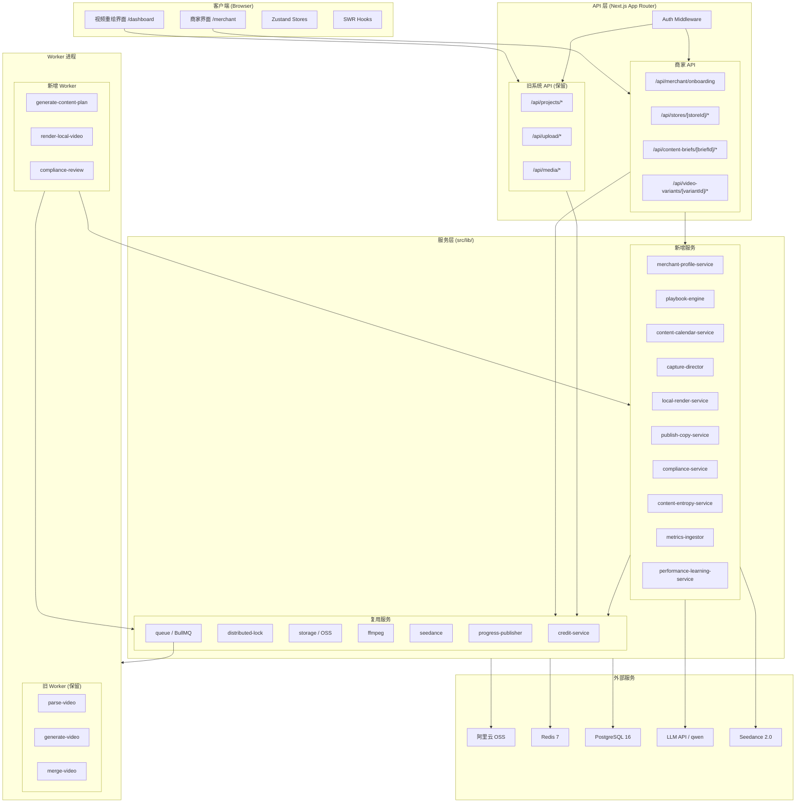
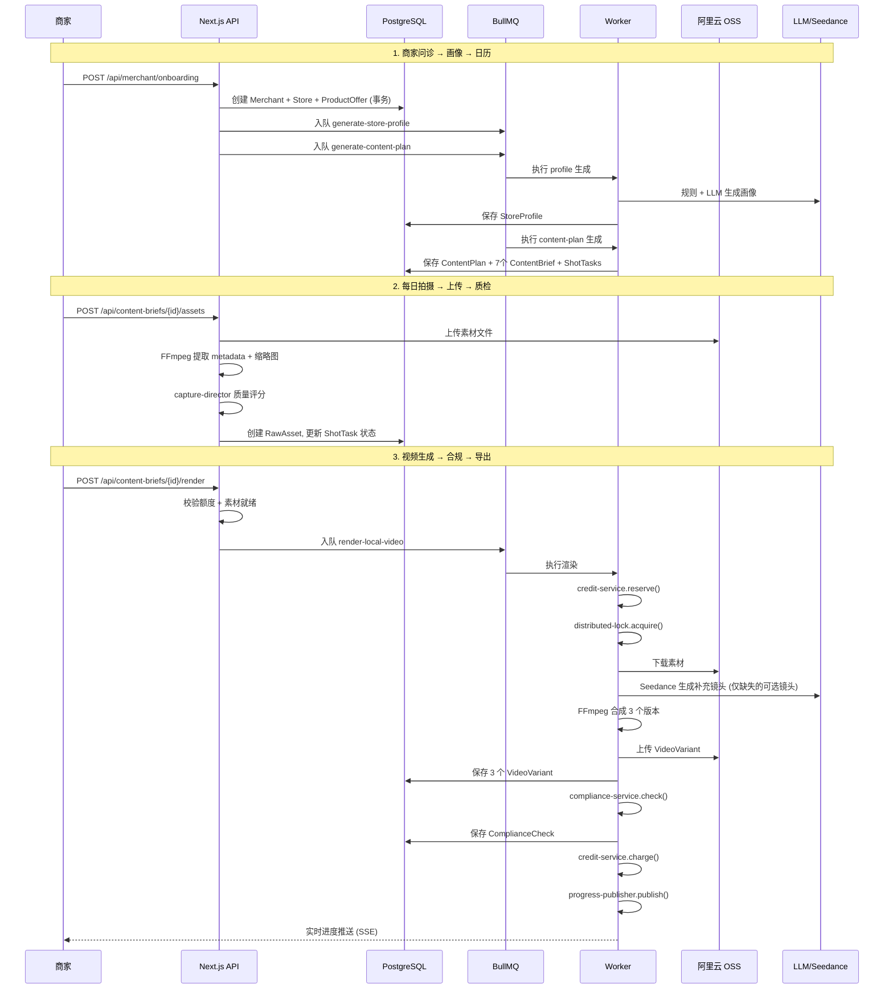
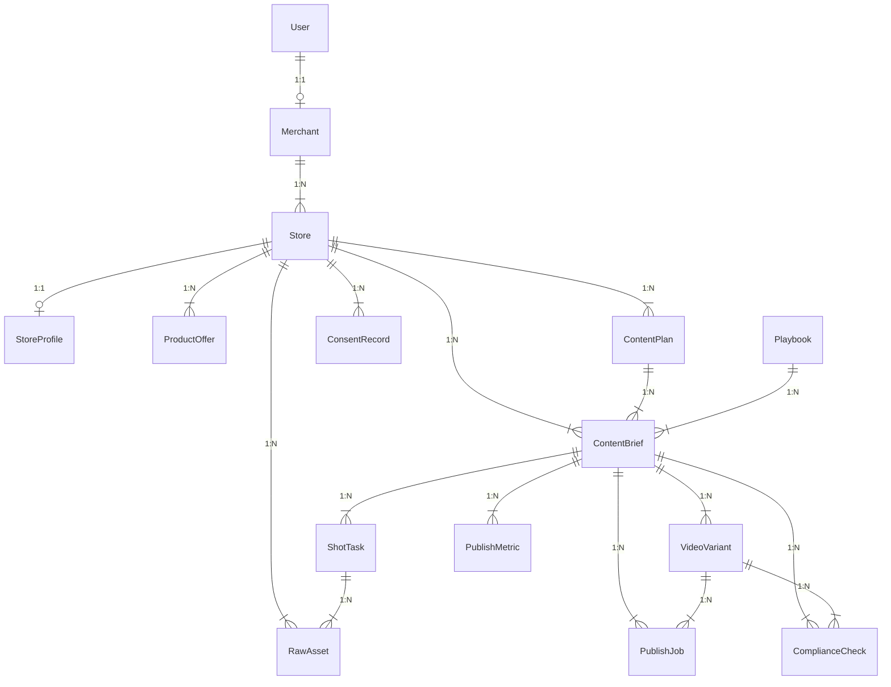
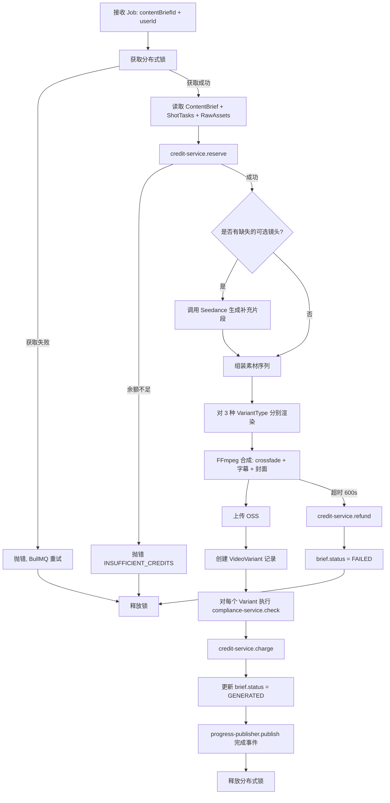

# Design Document: 本地生活营销平台

## Overview

将现有 AI 视频重绘 SaaS 平台扩展为面向本地生活实体门店（第一阶段：餐饮行业）的 AI 短视频营销代运营系统。采用增量改造策略：保留现有视频生成、FFmpeg、OSS、BullMQ、积分、订阅等底层能力不变，在其上层新增商家问诊、内容策划、拍摄指引、自动成片、合规检查、数据复盘的完整业务闭环。

核心设计原则：
- **增量扩展**：新增模型和路由，不修改/删除现有表结构和 API
- **路径隔离**：商家界面 `/merchant`、旧系统 `/dashboard`，两套界面共享认证
- **服务复用**：credit-service、distributed-lock、OSS storage、BullMQ 基础设施直接复用
- **规则优先**：门店画像、合规检查等以规则引擎为主，LLM 仅用于润色和文案生成
- **无静默降级**：所有外部调用（Seedance、OSS、LLM）失败即抛错，由 BullMQ 重试机制兜底

## Architecture



### 核心数据流



## Components and Interfaces

### 1. Onboarding Service（商家问诊服务）

**文件**: `src/app/api/merchant/onboarding/route.ts`

**职责**: 接收商家问诊表单，在单个数据库事务中创建 Merchant、Store、ProductOffer 记录，然后异步触发画像和日历生成。

```typescript
// 请求体 schema (Zod v4)
const MerchantOnboardingSchema = z.object({
  merchantName: z.string().min(1).max(50),
  contactName: z.string().max(30).optional(),
  phone: z.string().max(20).optional(),
  store: z.object({
    name: z.string().min(1).max(50),
    industry: z.enum([
      'RESTAURANT', 'DRINK', 'BAKERY', 'CAFE',
      'HOTPOT', 'BBQ', 'FAST_FOOD', 'OTHER_LOCAL'
    ]),
    city: z.string().max(20).optional(),
    district: z.string().max(20).optional(),
    businessArea: z.string().max(30).optional(),
    address: z.string().max(100).optional(),
    avgTicket: z.number().int().positive().max(100000).optional(),
    openingHours: z.string().max(50).optional(),
    mainProducts: z.array(z.string().max(30)).min(1).max(20),
    mainSellingPoints: z.array(z.string().max(50)).min(1).max(10),
    targetCustomers: z.array(z.string().max(30)).max(10).optional(),
    canShootKitchen: z.boolean().default(false),
    canShootStaff: z.boolean().default(true),
    canShootCustomers: z.boolean().default(false),
    hasGroupBuying: z.boolean().default(false),
    hasReservation: z.boolean().default(false),
  }),
  offers: z.array(z.object({
    name: z.string().min(1).max(30),
    description: z.string().max(200).optional(),
    originalPrice: z.number().int().min(0).optional(),
    salePrice: z.number().int().min(0).optional(),
    sellingPoints: z.array(z.string().max(50)).max(5).optional(),
    usageRules: z.string().max(200).optional(),
  })).max(20).optional(),
})

// 响应体
interface OnboardingResponse {
  merchantId: string
  storeId: string
  message: string
}
```

**处理流程**:
1. 通过 middleware 获取 userId（`x-user-id` header）
2. 检查该 userId 是否已有 Merchant 记录（有则返回 409）
3. 在 Prisma `$transaction` 中创建 Merchant → Store → ProductOffer[]
4. 事务提交后，通过 BullMQ 入队 `generate-store-profile` 和 `generate-content-plan` 任务
5. 返回 201 + merchantId + storeId

### 2. Store Profile Service（门店画像生成服务）

**文件**: `src/lib/store-profile-service.ts`

**职责**: 基于门店基础信息，使用规则引擎 + LLM 生成内容策略画像。

```typescript
export async function createStoreProfile(input: {
  storeId: string
  industry: MerchantIndustry
  mainProducts: string[]
  mainSellingPoints: string[]
  targetCustomers?: string[]
  avgTicket?: number
  hasGroupBuying?: boolean
  canShootKitchen?: boolean
  canShootStaff?: boolean
  canShootCustomers?: boolean
}): Promise<StoreProfile>
```

**规则引擎逻辑**:
- `contentPositioning`: 根据行业 + 客单价区间规则映射（如 HOTPOT + avgTicket > 80 → "品质火锅体验种草"）
- `recommendedPersona`: 根据 canShootStaff/canShootKitchen 决定人设（老板/厨师/第三人称）
- `hookKeywords`: 行业关键词库 + mainProducts 组合（5-15 个）
- `forbiddenClaims`: 固定违禁词库 + 行业特定违禁词
- `preferredCta`: 根据 hasGroupBuying/hasReservation 选择 CTA 模板（3-5 个）
- `weeklyCadence`: 固定 7 天节奏模板
- `contentDos/contentDonts`: 根据拍摄能力和行业生成

**LLM 调用**: 仅用于 `aiSummary` 字段（对规则输出做自然语言总结），调用 qwen 系列模型，OpenAI 兼容接口。

### 3. Playbook Engine（行业剧本引擎）

**文件**: `src/lib/playbook-engine.ts`

```typescript
/** 根据门店画像和内容目标选择合适的剧本集 */
export async function selectPlaybooks(input: {
  industry: MerchantIndustry
  goals: ContentGoal[]
  storeProfile: StoreProfile
  offers: ProductOffer[]
  days: number
  excludePlaybookIds?: string[]  // 来自 performance-learning 的避免列表
}): Promise<Playbook[]>

/** 将剧本模板实例化为具体的 ContentBrief 数据 */
export async function instantiatePlaybook(input: {
  playbook: Playbook
  store: Store
  profile: StoreProfile
  offer?: ProductOffer
  scheduledDate: Date
}): Promise<ContentBriefDraft>

interface ContentBriefDraft {
  title: string
  goal: ContentGoal
  hook: string
  mainMessage: string
  suggestedTitle: string
  suggestedCoverTitle: string
  suggestedCaption: string
  suggestedCta: string
  platformCopies: Record<PublishPlatform, string>
  tags: string[]
  aiReasoning: string
  shotTasks: ShotTaskDraft[]
}

interface ShotTaskDraft {
  order: number
  type: ShotTaskType
  title: string
  instruction: string
  durationSec: number
  required: boolean
  framingGuide?: Record<string, unknown>
  qualityRules?: Record<string, unknown>
}
```

**选择算法**:
1. 从 DB 查询 `industry` + `isActive=true` 的所有 Playbook
2. 按 ContentGoal 分组
3. 过滤掉需要不可用拍摄能力的剧本（如 canShootKitchen=false 时过滤 COOKING_PROCESS 必选镜头）
4. 按 scoreWeight 加权排序
5. 确保同一剧本不连续使用超过 3 次（查最近 3 个 ContentBrief 的 playbookId）
6. 如指定 goal 无匹配，fallback 到最高分可用剧本

**实例化逻辑**:
- 模板变量替换：`{storeName}`, `{productName}`, `{price}`, `{cta}`, `{location}`
- LLM 润色 hook 和 caption（使用 qwen 模型），确保自然且不违规
- 生成 ShotTask 时使用日常用语描述（不用专业术语）

### 4. Content Calendar Service（内容日历服务）

**文件**: `src/lib/content-calendar-service.ts`

```typescript
export async function generateContentPlan(input: {
  storeId: string
  startDate: Date
  days: number
  preferredGoals?: ContentGoal[]
}): Promise<{ contentPlan: ContentPlan; briefs: ContentBrief[] }>
```

**每日目标分配规则**:

| 星期 | ContentGoal | 中文主题 |
|------|-------------|----------|
| 周一 | TRAFFIC | 工作日午餐引流 |
| 周二 | NEW_PRODUCT | 招牌产品 / 新品 |
| 周三 | TRUST_BUILDING | 老板/厨师人设 |
| 周四 | BRAND_STORY | 门店环境 / 体验 |
| 周五 | WEEKEND_BOOST | 周末聚餐预热 |
| 周六 | PROMOTION | 爆品/套餐促销 |
| 周日 | REPEAT_PURCHASE | 家庭/朋友聚餐 |

**流程**:
1. 读取 Store + StoreProfile + active ProductOffers
2. 如无 StoreProfile 或 StoreProfile.contentPositioning 为空 → 抛错
3. 如有 performance-learning 数据 → 读取 recommendedNextGoals 和 playbooksToAvoid
4. 创建 ContentPlan 记录
5. 对每一天：selectPlaybook → instantiatePlaybook → 创建 ContentBrief + ShotTasks
6. 设置 ContentBrief.status = READY_TO_SHOOT

### 5. Capture Director（拍摄指导服务）

**文件**: `src/lib/capture-director.ts`

```typescript
/** 基于 Playbook 结构生成拍摄任务列表 */
export function buildShotTasksFromPlaybook(
  playbook: Playbook,
  store: Store,
  profile: StoreProfile,
  offer?: ProductOffer
): ShotTaskDraft[]

/** 检测上传素材质量 */
export async function inspectRawAsset(input: {
  filePath: string       // 本地临时文件路径（从 OSS 下载或直接上传）
  mimeType: string
  shotTask: { durationSec: number; type: ShotTaskType; required: boolean }
}): Promise<QualityInspectionResult>

interface QualityInspectionResult {
  qualityScore: number  // 0-100
  passed: boolean       // score >= 60 且无 critical issue
  critical: boolean     // 是否有致命问题（需拒绝）
  report: {
    orientation: { value: string; pass: boolean; message?: string }
    resolution: { value: string; pass: boolean; message?: string }
    duration: { value: number; pass: boolean; message?: string }
    fileSize: { value: number; pass: boolean; message?: string }
    brightness: { value: number; pass: boolean; message?: string }
    audio: { value: boolean; pass: boolean; message?: string }
  }
  warnings: string[]
}
```

**质量评分规则**:

| 维度 | 权重 | 通过条件 | 致命条件 |
|------|------|----------|----------|
| orientation | 20 | height > width (竖屏) | - |
| resolution | 25 | 短边 ≥ 720px | 短边 < 480px |
| duration | 20 | shotTask.durationSec ±50% | < 1s |
| fileSize | 10 | 1B ~ 300MB | > 300MB |
| brightness | 15 | 平均亮度 > 15 | - |
| audio | 10 | 有音轨 (OWNER_TALKING 类型必须) | - |

**FFmpeg 命令**:
- 元数据提取: `ffprobe -v quiet -print_format json -show_streams -show_format {file}`
- 亮度检测: `ffmpeg -i {file} -vf "fps=1,signalstats" -f null -` (取 YAVG 平均值)
- 缩略图: `ffmpeg -i {file} -vf "select=eq(n\\,0)" -vframes 1 -f image2 {output}`

### 6. Local Render Service（本地视频渲染服务）

**文件**: `src/lib/local-render-service.ts`

```typescript
export async function renderLocalVideoVariants(input: {
  contentBriefId: string
  userId: string
}): Promise<VideoVariant[]>
```

**渲染流程**:
1. 读取 ContentBrief + ShotTasks + RawAssets
2. 对 3 种 VariantType 分别组装素材序列
3. 对缺失的可选镜头（required=false 且无 RawAsset），调用 Seedance 生成补充片段（每种版本最多 3 个补充片段，每个 ≤ 5s）
4. 使用 FFmpeg 合成：
   - 统一编码为 H.264 / AAC / 9:16 / 720p+
   - 片段间 0.5s crossfade 转场
   - 字幕叠加（ASS 格式）
   - 从第 1 秒提取封面帧
5. 上传到 OSS（key: `merchant/{storeId}/variants/{variantId}.mp4`）
6. 创建 VideoVariant 记录

**三种版本的素材编排差异**:

| VariantType | 素材顺序策略 | 字幕风格 | 节奏 |
|-------------|-------------|----------|------|
| PROMOTION | 钩子(价格) → 产品 → 优惠 → CTA | 大字价格 + 利益点 | 快切 |
| ATMOSPHERE | 环境 → 产品 → 制作过程 → 氛围 | 轻文案 + 标签 | 慢移 |
| OWNER_TALKING | 口播(人) → 产品 → 推荐 → CTA | 字幕跟随语音 | 自然 |

**FFmpeg 合成命令模板**:
```bash
ffmpeg -i input1.mp4 -i input2.mp4 -i input3.mp4 \
  -filter_complex "[0:v][1:v]xfade=transition=fade:duration=0.5:offset={t1}[v01]; \
  [v01][2:v]xfade=transition=fade:duration=0.5:offset={t2}[vout]; \
  [0:a][1:a]acrossfade=d=0.5[a01]; \
  [a01][2:a]acrossfade=d=0.5[aout]" \
  -map "[vout]" -map "[aout]" \
  -vf "ass=subtitles.ass" \
  -c:v libx264 -preset medium -crf 23 \
  -c:a aac -b:a 128k \
  -movflags +faststart \
  output.mp4
```

### 7. Publish Copy Service（发布文案生成服务）

**文件**: `src/lib/publish-copy-service.ts`

```typescript
export async function generatePublishCopy(input: {
  contentBriefId: string
  variantType: VideoVariantType
  platforms: PublishPlatform[]
  store: Store
  profile: StoreProfile
  offer?: ProductOffer
}): Promise<Record<PublishPlatform, PlatformCopy>>

interface PlatformCopy {
  title: string       // max 30 chars
  coverTitle: string  // max 15 chars
  caption: string     // 平台限制见下
  tags: string[]      // 3-10 个
  cta: string         // 从 profile.preferredCta 选取
}
```

**平台文案约束**:

| 平台 | caption 最大字数 | 风格要求 |
|------|-----------------|----------|
| DOUYIN | 300 | 短平快，带同城标签，突出价格 |
| XIAOHONGSHU | 1000 | 体验分享，避免硬广，种草口吻 |
| WECHAT_CHANNELS | 200 | 简洁可信，熟人推荐语气 |
| KUAISHOU | 300 | 接地气，价格利益点前置 |

**实现**: 使用 LLM（qwen）按平台分别生成，prompt 中注入：
- Store 基本信息（name, industry, location）
- StoreProfile.forbiddenClaims（LLM 必须避免）
- StoreProfile.preferredCta（CTA 必须从中选取）
- ProductOffer 信息（仅 PROMOTION 版本必须包含）
- 生成后对 forbiddenClaims 做二次扫描过滤

### 8. Compliance Service（合规检查服务）

**文件**: `src/lib/compliance-service.ts`

```typescript
export async function runComplianceCheck(input: {
  contentBriefId: string
  videoVariantId: string
}): Promise<ComplianceCheck>

interface ComplianceIssue {
  dimension: 'ABSOLUTE_CLAIM' | 'FALSE_POPULARITY' | 'CONSENT' | 'AIGC' | 'ENTROPY'
  riskLevel: ComplianceRiskLevel
  field: string          // 问题出现的字段名
  matchedText?: string   // 匹配到的违规文本
  reason: string         // 人类可读的原因说明
}
```

**检查规则链**:

| 序号 | 检查项 | 扫描目标 | 触发条件 | 风险等级 |
|------|--------|----------|----------|----------|
| 1 | 绝对化用语 | title, caption, coverTitle, cta, subtitles | 匹配词库 | HIGH |
| 2 | 虚假火爆 | caption, title | 匹配词库且无证据支撑 | MEDIUM |
| 3 | AIGC 标识 | renderParams, generationLog | 含 Seedance 生成记录 | MEDIUM |
| 4 | 顾客出镜 | shotTask.type + canShootCustomers | CUSTOMER_REACTION 类镜头 + 无 ConsentRecord | HIGH |
| 5 | 同质化 | title, caption, shotSequence | 调用 entropy-service score < 40 → BLOCKED; < 60 → MEDIUM | MEDIUM/BLOCKED |

**词库示例**（绝对化用语）:
```typescript
const ABSOLUTE_CLAIMS = [
  '最好', '第一', '全网最低', '唯一', '必吃',
  '不吃后悔', '保证', '100%', '全城第一', '最便宜'
]
const FALSE_POPULARITY = [
  '全城排队', '每天卖爆', '全网疯抢', '万人好评'
]
```

**风险等级汇总规则**: 取所有 issues 中最高等级（BLOCKED > HIGH > MEDIUM > LOW），无 issues 时为 LOW。

### 9. Content Entropy Service（内容同质化检测）

**文件**: `src/lib/content-entropy-service.ts`

```typescript
export async function calculateContentEntropy(input: {
  contentBriefId: string
  storeId: string
}): Promise<EntropyResult>

interface EntropyResult {
  uniquenessScore: number  // 0-100, 越高越独特
  duplicateRisk: 'LOW' | 'MEDIUM' | 'HIGH'
  reasons: EntropyReason[]
}

interface EntropyReason {
  dimension: 'PLAYBOOK' | 'TEXT' | 'SHOT_ASSET'
  matchedContentId: string
  similarityValue: number
  description: string
}
```

**相似度计算**:
- **Playbook 维度**: 查最近 30 天 ContentBrief，统计连续使用同一 playbookId 的次数（≥ 4 次 → MEDIUM）
- **文本维度**: 使用 Dice coefficient 计算 bigram 相似度（title/caption 对比历史），阈值 0.8 → HIGH
- **素材维度**: 检查 shotTask 序列中 rawAsset ossKey 是否与历史完全一致（3+ 连续相同 → MEDIUM）

**判定规则**:
- score < 40 → 阻断生成（BLOCKED）
- score 40-60 → 警告但允许（MEDIUM）
- score > 60 → 通过（LOW）
- 历史记录 < 2 条时跳过检测，返回 score=100

### 10. Metrics & Performance Learning（数据录入与学习服务）

**文件**: `src/lib/metrics-ingestor.ts` + `src/lib/performance-learning-service.ts`

```typescript
// metrics-ingestor.ts
export async function recordManualMetrics(input: {
  contentBriefId: string
  platform: PublishPlatform
  metrics: MetricsInput
  userId: string
}): Promise<PublishMetric>

// performance-learning-service.ts
export async function generatePerformanceInsights(input: {
  storeId: string
  contentBriefId?: string
}): Promise<PerformanceInsights>

interface PerformanceInsights {
  suggestions: Suggestion[]
  recommendedNextGoals: ContentGoal[]
  playbooksToReuse: string[]
  playbooksToAvoid: string[]
}

interface Suggestion {
  category: 'hook' | 'CTA' | 'offer' | 'structure' | 'timing'
  action: string
  evidence: string
}
```

**学习规则引擎**:

| 条件 | 建议类别 | 推荐动作 |
|------|---------|---------|
| views TOP 30% + conversion BOTTOM 30% | CTA | 下次强化 CTA + 优惠表达 |
| saves/comments TOP 30% | structure | 复用该 Playbook 结构 |
| 同一 Playbook/hook 连续 3+ 低播放 | hook | 换钩子和封面风格 |
| linkClicks TOP 30% | offer | 复用标题和优惠结构 |
| 数据不足 (< 3 条有 metrics) | - | 返回空建议 |

## Data Models

### Prisma Schema 新增（增量添加，不修改现有表）

```prisma
// ============ 枚举 ============

enum MerchantIndustry {
  RESTAURANT
  DRINK
  BAKERY
  CAFE
  HOTPOT
  BBQ
  FAST_FOOD
  OTHER_LOCAL
}

enum ContentGoal {
  TRAFFIC
  PROMOTION
  NEW_PRODUCT
  TRUST_BUILDING
  BRAND_STORY
  CUSTOMER_TESTIMONIAL
  WEEKEND_BOOST
  REPEAT_PURCHASE
}

enum ContentBriefStatus {
  DRAFT
  READY_TO_SHOOT
  MATERIALS_UPLOADED
  RENDERING
  GENERATED
  COMPLIANCE_REVIEW
  READY_TO_EXPORT
  EXPORTED
  PUBLISHED
  FAILED
  ARCHIVED
}

enum ShotTaskType {
  STOREFRONT
  PRODUCT_CLOSEUP
  COOKING_PROCESS
  STAFF_ACTION
  CUSTOMER_REACTION
  OWNER_TALKING
  ENVIRONMENT
  OFFER_DISPLAY
  CTA_SCREEN
  AI_GENERATED_FILLER
}

enum VideoVariantType {
  PROMOTION
  ATMOSPHERE
  OWNER_TALKING
  TRUST
  PRODUCT
}

enum ComplianceRiskLevel {
  LOW
  MEDIUM
  HIGH
  BLOCKED
}

enum PublishPlatform {
  DOUYIN
  KUAISHOU
  XIAOHONGSHU
  WECHAT_CHANNELS
  MANUAL_EXPORT
}

enum PublishJobStatus {
  DRAFT
  READY
  EXPORTING
  EXPORTED
  PUBLISHING
  PUBLISHED
  FAILED
}

// ============ 商家与门店 ============

model Merchant {
  id          String            @id @default(cuid())
  userId      String            @unique  // 关联现有 User 表
  name        String
  contactName String?
  phone       String?
  industry    MerchantIndustry
  createdAt   DateTime          @default(now())
  updatedAt   DateTime          @updatedAt

  stores      Store[]

  @@index([userId])
  @@index([industry])
}

model Store {
  id                String            @id @default(cuid())
  merchantId        String
  name              String
  industry          MerchantIndustry
  city              String?
  district          String?
  businessArea      String?
  address           String?
  avgTicket         Int?              // 分为单位
  openingHours      String?
  phone             String?
  mainProducts      Json              // string[]
  mainSellingPoints Json              // string[]
  targetCustomers   Json?             // string[]
  brandTone         String?
  canShootKitchen   Boolean           @default(false)
  canShootStaff     Boolean           @default(true)
  canShootCustomers Boolean           @default(false)
  hasGroupBuying    Boolean           @default(false)
  hasReservation    Boolean           @default(false)
  status            String            @default("ACTIVE")  // ACTIVE | PROFILE_PENDING
  notes             String?
  createdAt         DateTime          @default(now())
  updatedAt         DateTime          @updatedAt

  merchant          Merchant          @relation(fields: [merchantId], references: [id], onDelete: Cascade)
  profile           StoreProfile?
  offers            ProductOffer[]
  contentPlans      ContentPlan[]
  contentBriefs     ContentBrief[]
  rawAssets         RawAsset[]
  consentRecords    ConsentRecord[]

  @@index([merchantId])
  @@index([industry])
  @@index([city, district])
}

// ============ 门店画像 ============

model StoreProfile {
  id                  String   @id @default(cuid())
  storeId             String   @unique
  contentPositioning  String?
  recommendedPersona  String?
  contentDos          Json?    // string[]
  contentDonts        Json?    // string[]
  visualStyle         String?
  hookKeywords        Json?    // string[]
  forbiddenClaims     Json?    // string[]
  preferredCta        Json?    // string[]
  weeklyCadence       Json?    // { day: number, theme: string, count: number }[]
  aiSummary           String?
  status              String   @default("COMPLETE")  // COMPLETE | INCOMPLETE
  createdAt           DateTime @default(now())
  updatedAt           DateTime @updatedAt

  store               Store    @relation(fields: [storeId], references: [id], onDelete: Cascade)
}

// ============ 商品/优惠 ============

model ProductOffer {
  id            String    @id @default(cuid())
  storeId       String
  name          String
  description   String?
  originalPrice Int?      // 分为单位
  salePrice     Int?      // 分为单位
  validFrom     DateTime?
  validTo       DateTime?
  sellingPoints Json?     // string[]
  usageRules    String?
  isActive      Boolean   @default(true)
  createdAt     DateTime  @default(now())
  updatedAt     DateTime  @updatedAt

  store         Store     @relation(fields: [storeId], references: [id], onDelete: Cascade)

  @@index([storeId])
  @@index([isActive])
}

// ============ 行业剧本库 ============

model Playbook {
  id                  String            @id @default(cuid())
  industry            MerchantIndustry
  name                String
  goal                ContentGoal
  description         String?
  structure           Json              // PlaybookSegment[]
  requiredShots       Json              // ShotTaskType[]
  optionalShots       Json?             // ShotTaskType[]
  hookTemplates       Json              // string[] (带 {变量} 占位符)
  captionTemplates    Json              // string[]
  coverTitleTemplates Json              // string[]
  ctaTemplates        Json              // string[]
  complianceRules     Json?             // 剧本级额外合规规则
  scoreWeight         Json?             // { views: number, conversion: number }
  tierRequired        String            @default("FREE")  // FREE | GROWTH
  isActive            Boolean           @default(true)
  createdAt           DateTime          @default(now())
  updatedAt           DateTime          @updatedAt

  contentBriefs       ContentBrief[]

  @@index([industry])
  @@index([goal])
  @@index([isActive])
}

// ============ 内容计划 ============

model ContentPlan {
  id        String   @id @default(cuid())
  storeId   String
  title     String
  startDate DateTime
  endDate   DateTime
  strategy  Json?    // 生成策略元数据
  status    String   @default("ACTIVE")  // ACTIVE | COMPLETED | CANCELLED
  createdAt DateTime @default(now())
  updatedAt DateTime @updatedAt

  store     Store    @relation(fields: [storeId], references: [id], onDelete: Cascade)
  briefs    ContentBrief[]

  @@index([storeId])
  @@index([startDate, endDate])
}

// ============ 内容任务 ============

model ContentBrief {
  id                  String             @id @default(cuid())
  storeId             String
  contentPlanId       String?
  playbookId          String?
  title               String
  goal                ContentGoal
  scheduledDate       DateTime
  status              ContentBriefStatus @default(DRAFT)
  hook                String?
  mainMessage         String?
  offerId             String?
  suggestedCaption    String?
  suggestedTitle      String?
  suggestedCoverTitle String?
  suggestedCta        String?
  platformCopies      Json?              // Record<PublishPlatform, PlatformCopy>
  tags                Json?              // string[]
  aiReasoning         String?
  createdAt           DateTime           @default(now())
  updatedAt           DateTime           @updatedAt

  store               Store              @relation(fields: [storeId], references: [id], onDelete: Cascade)
  contentPlan         ContentPlan?       @relation(fields: [contentPlanId], references: [id], onDelete: SetNull)
  playbook            Playbook?          @relation(fields: [playbookId], references: [id], onDelete: SetNull)
  shotTasks           ShotTask[]
  videoVariants       VideoVariant[]
  publishJobs         PublishJob[]
  complianceChecks    ComplianceCheck[]
  metrics             PublishMetric[]

  @@index([storeId])
  @@index([scheduledDate])
  @@index([status])
  @@index([contentPlanId])
}

// ============ 拍摄任务 ============

model ShotTask {
  id             String       @id @default(cuid())
  contentBriefId String
  order          Int
  type           ShotTaskType
  title          String       // max 20 chars, 日常用语
  instruction    String       // max 200 chars, 日常用语
  examplePrompt  String?      // Seedance prompt (仅 AI 补充时用)
  durationSec    Int          // 3-15
  required       Boolean      @default(true)
  framingGuide   Json?        // { angle: string, movement: string, tips: string }
  qualityRules   Json?        // { needsAudio: boolean, minBrightness: number }
  status         String       @default("PENDING")  // PENDING | CAPTURED | SKIPPED
  createdAt      DateTime     @default(now())
  updatedAt      DateTime     @updatedAt

  contentBrief   ContentBrief @relation(fields: [contentBriefId], references: [id], onDelete: Cascade)
  rawAssets      RawAsset[]

  @@index([contentBriefId])
  @@index([order])
}

// ============ 原始素材 ============

model RawAsset {
  id             String    @id @default(cuid())
  storeId        String
  shotTaskId     String?
  uploaderUserId String?
  type           String    // VIDEO | IMAGE
  ossKey         String
  url            String?   // 签名 URL (临时)
  filename       String?
  mimeType       String?
  sizeBytes      Int?
  durationSec    Float?
  width          Int?
  height         Int?
  thumbnailKey   String?
  qualityScore   Float?
  qualityReport  Json?     // QualityInspectionResult.report
  expiresAt      DateTime? // 14 天后过期
  createdAt      DateTime  @default(now())
  updatedAt      DateTime  @updatedAt

  store          Store     @relation(fields: [storeId], references: [id], onDelete: Cascade)
  shotTask       ShotTask? @relation(fields: [shotTaskId], references: [id], onDelete: SetNull)

  @@index([storeId])
  @@index([shotTaskId])
  @@index([expiresAt])
}

// ============ 视频版本 ============

model VideoVariant {
  id             String           @id @default(cuid())
  contentBriefId String
  type           VideoVariantType
  title          String
  description    String?
  ossKey         String?
  coverOssKey    String?
  durationSec    Float?
  width          Int?
  height         Int?
  subtitles      Json?            // { text: string, startSec: number, endSec: number }[]
  renderParams   Json?            // FFmpeg 参数记录
  generationLog  Json?            // Seedance 调用记录
  score          Float?           // AI 质量评分
  isSelected     Boolean          @default(false)
  createdAt      DateTime         @default(now())
  updatedAt      DateTime         @updatedAt

  contentBrief   ContentBrief     @relation(fields: [contentBriefId], references: [id], onDelete: Cascade)
  publishJobs    PublishJob[]
  complianceChecks ComplianceCheck[]

  @@index([contentBriefId])
  @@index([type])
}

// ============ 发布任务 ============

model PublishJob {
  id             String          @id @default(cuid())
  contentBriefId String
  videoVariantId String?
  platform       PublishPlatform
  status         PublishJobStatus @default(DRAFT)
  title          String?
  caption        String?
  tags           Json?           // string[]
  locationText   String?
  exportedOssKey String?
  errorMessage   String?
  createdAt      DateTime        @default(now())
  updatedAt      DateTime        @updatedAt
  publishedAt    DateTime?

  contentBrief   ContentBrief    @relation(fields: [contentBriefId], references: [id], onDelete: Cascade)
  videoVariant   VideoVariant?   @relation(fields: [videoVariantId], references: [id], onDelete: SetNull)

  @@index([contentBriefId])
  @@index([platform])
  @@index([status])
}

// ============ 发布数据指标 ============

model PublishMetric {
  id             String          @id @default(cuid())
  contentBriefId String
  platform       PublishPlatform
  publishJobId   String?
  views          Int             @default(0)
  likes          Int             @default(0)
  comments       Int             @default(0)
  shares         Int             @default(0)
  saves          Int             @default(0)
  profileVisits  Int             @default(0)
  linkClicks     Int             @default(0)
  messages       Int             @default(0)
  orders         Int             @default(0)
  redemptions    Int             @default(0)
  revenueCents   Int             @default(0)
  source         String          @default("MANUAL")  // MANUAL | API_SYNC
  capturedAt     DateTime        @default(now())
  createdAt      DateTime        @default(now())

  contentBrief   ContentBrief    @relation(fields: [contentBriefId], references: [id], onDelete: Cascade)

  @@index([contentBriefId])
  @@index([platform])
  @@index([capturedAt])
}

// ============ 合规检查 ============

model ComplianceCheck {
  id             String              @id @default(cuid())
  contentBriefId String
  videoVariantId String?
  riskLevel      ComplianceRiskLevel
  issues         Json                // ComplianceIssue[]
  suggestions    Json?               // string[]
  blockedReasons Json?               // string[]
  passed         Boolean             @default(false)
  acknowledgedAt DateTime?           // 用户确认时间 (HIGH 风险时)
  createdAt      DateTime            @default(now())

  contentBrief   ContentBrief        @relation(fields: [contentBriefId], references: [id], onDelete: Cascade)
  videoVariant   VideoVariant?       @relation(fields: [videoVariantId], references: [id], onDelete: SetNull)

  @@index([contentBriefId])
  @@index([videoVariantId])
  @@index([riskLevel])
}

// ============ 出镜授权 ============

model ConsentRecord {
  id          String    @id @default(cuid())
  storeId     String
  personName  String?
  personRole  String?   // CUSTOMER | STAFF | OWNER
  consentType String    // APPEARANCE | VOICE
  consentText String
  assetOssKey String?   // 签署授权书扫描件
  validFrom   DateTime  @default(now())
  validTo     DateTime?
  createdAt   DateTime  @default(now())

  store       Store     @relation(fields: [storeId], references: [id], onDelete: Cascade)

  @@index([storeId])
  @@index([validTo])
}
```

### 实体关系图



## API Design

### 端点总览

| Method | Path | 说明 | Req |
|--------|------|------|-----|
| POST | /api/merchant/onboarding | 商家问诊 | R1 |
| GET | /api/stores | 获取当前用户所有门店 | R15 |
| GET | /api/stores/[storeId] | 获取门店详情 | R15 |
| PUT | /api/stores/[storeId] | 更新门店信息 | R1 |
| GET | /api/stores/[storeId]/profile | 获取门店画像 | R2 |
| POST | /api/stores/[storeId]/profile/regenerate | 重新生成画像 | R2 |
| GET | /api/stores/[storeId]/offers | 获取优惠列表 | R1 |
| POST | /api/stores/[storeId]/offers | 创建优惠 | R1 |
| PUT | /api/stores/[storeId]/offers/[offerId] | 更新优惠 | R1 |
| POST | /api/stores/[storeId]/content-plan/generate | 生成内容计划 | R4 |
| GET | /api/stores/[storeId]/content-plan/current | 获取当前计划 | R4 |
| GET | /api/stores/[storeId]/today | 获取今日任务 | R5 |
| GET | /api/content-briefs/[briefId] | 获取内容任务详情 | R5 |
| GET | /api/content-briefs/[briefId]/shot-tasks | 获取拍摄任务列表 | R5 |
| POST | /api/content-briefs/[briefId]/assets | 上传素材 | R6 |
| DELETE | /api/content-briefs/[briefId]/assets/[assetId] | 删除素材（重新上传） | R6 |
| POST | /api/content-briefs/[briefId]/render | 触发视频生成 | R7 |
| GET | /api/content-briefs/[briefId]/variants | 获取视频版本 | R7 |
| POST | /api/content-briefs/[briefId]/compliance | 触发合规检查 | R9 |
| POST | /api/content-briefs/[briefId]/compliance/acknowledge | 确认 HIGH 风险 | R9 |
| POST | /api/content-briefs/[briefId]/metrics | 录入表现数据 | R11 |
| GET | /api/content-briefs/[briefId]/metrics | 获取表现数据 | R11 |
| GET | /api/content-briefs/[briefId]/insights | 获取优化建议 | R12 |
| POST | /api/video-variants/[variantId]/export | 导出视频 | R10 |
| GET | /api/merchant/subscription | 获取订阅与额度信息 | R14 |

### 关键端点详细设计

#### POST /api/content-briefs/[briefId]/render

**请求**: 无 body（从 briefId 获取所有信息）

**处理流程**:
1. 验证 briefId 归属当前用户
2. 验证 brief.status ∈ {READY_TO_SHOOT, MATERIALS_UPLOADED}
3. 检查必拍镜头是否全部有 qualityScore ≥ 60 的 RawAsset
4. 检查用户订阅额度（调用 credit-service）
5. entropy-service 计算同质化分数，< 40 则拒绝
6. credit-service.reserve(userId, 1, `render:${briefId}`)
7. 更新 brief.status = RENDERING
8. 入队 BullMQ job `render-local-video` { contentBriefId, userId }
9. 返回 202 + jobId

**响应**:
```json
{ "jobId": "job_xxx", "status": "RENDERING" }
```

#### POST /api/video-variants/[variantId]/export

**处理流程**:
1. 验证 variantId 归属当前用户
2. 检查 ComplianceCheck 存在且 riskLevel ≠ BLOCKED
3. 如 riskLevel = HIGH 且无 acknowledgedAt → 返回 403
4. 检查订阅 tier 是否支持导出
5. 确定输出分辨率（GROWTH+ → 1080x1920, 其他 → 720x1280）
6. FFmpeg 烧录字幕 + 重编码
7. 上传到 OSS (key: `merchant/{storeId}/exports/{jobId}.mp4`)
8. 创建 PublishJob(status=EXPORTED)
9. 返回签名下载 URL (24h 有效)

**响应**:
```json
{
  "publishJobId": "pj_xxx",
  "downloadUrl": "https://oss.../merchant/.../exports/xxx.mp4?sign=...",
  "expiresAt": "2025-01-02T00:00:00Z"
}
```

## Queue / Worker Architecture

### 新增 BullMQ 队列

| 队列名 | Worker 文件 | 并发数 | 重试 | 用途 |
|--------|------------|--------|------|------|
| `generate-store-profile` | generate-content-plan.ts | 3 | 3次, 指数退避 | 生成门店画像 |
| `generate-content-plan` | generate-content-plan.ts | 3 | 3次, 指数退避 | 生成 7 天内容计划 |
| `render-local-video` | render-local-video.ts | 2 | 2次, 指数退避 | 渲染 3 版视频 |
| `compliance-review` | compliance-review.ts | 5 | 2次, 固定间隔 | 合规检查 |

**注册方式**: 在 `src/lib/queue.ts` 中使用现有 `lazyQueue` 工厂模式注册，共享 Redis 连接。

### render-local-video Worker 流程



**超时控制**: 
- 整体任务 TTL: 720s（锁 TTL）
- 渲染超时: 600s（内部计时器）
- 超时后执行 refund + 状态回滚

**与旧 Worker 的隔离**:
- `render-local-video` 使用独立队列，不与旧的 `generate-video` / `merge-video` 共享并发槽位
- 在 `src/workers/index.ts` 中注册时设置独立 `concurrency` 参数
- 共享的 Redis 连接和 credit-service 通过分布式锁串行化关键操作

## Frontend Architecture

### 页面结构

```
src/app/merchant/
├── layout.tsx              # 商家布局（底部导航 + 极简 header）
├── onboarding/
│   └── page.tsx            # 问诊表单页
├── stores/
│   ├── page.tsx            # 门店列表（多门店时）
│   └── [storeId]/
│       ├── page.tsx        # 门店首页（今日卡片 + 周计划 + 数据概览）
│       ├── layout.tsx      # 门店级布局
│       ├── calendar/
│       │   └── page.tsx    # 内容日历完整视图
│       ├── today/
│       │   └── page.tsx    # 今日拍摄任务详情
│       ├── briefs/
│       │   └── [briefId]/
│       │       ├── page.tsx      # 内容任务详情
│       │       ├── shoot/
│       │       │   └── page.tsx  # 拍摄 + 上传页
│       │       ├── variants/
│       │       │   └── page.tsx  # 视频版本选择 + 导出
│       │       └── metrics/
│       │           └── page.tsx  # 数据录入 + 优化建议
│       └── settings/
│           └── page.tsx    # 门店设置 / 优惠管理
```

### 组件层次

```
src/components/merchant/
├── MerchantOnboardingForm.tsx    # 问诊表单（多步骤向导）
├── StoreProfileCard.tsx          # 门店画像展示卡片
├── TodayTaskCard.tsx             # 今日任务摘要卡片
├── WeeklyCalendar.tsx            # 7 天日历条
├── ContentBriefCard.tsx          # 内容任务卡片
├── ShotTaskCard.tsx              # 单个拍摄镜头卡片
├── ShotAssetUploader.tsx         # 素材上传组件（含质量反馈）
├── QualityReportBadge.tsx        # 质量检测结果徽章
├── RenderProgressPanel.tsx       # 渲染进度面板
├── VideoVariantCard.tsx          # 视频版本预览卡片
├── PublishCopyPanel.tsx          # 发布文案展示面板
├── ComplianceBadge.tsx           # 合规状态徽章
├── MetricsInputForm.tsx          # 数据录入表单
├── PerformanceInsightCard.tsx    # 优化建议卡片
├── SubscriptionQuotaBar.tsx      # 额度用量条
└── WorkflowStepper.tsx           # 5 步线性流程指示器
```

### 状态管理

```typescript
// src/stores/merchant-store.ts
interface MerchantState {
  currentStoreId: string | null
  merchant: Merchant | null
  stores: Store[]
  setCurrentStore: (id: string) => void
  setMerchant: (m: Merchant) => void
  setStores: (s: Store[]) => void
}

// src/stores/content-brief-store.ts
interface ContentBriefState {
  todayBrief: ContentBrief | null
  currentBrief: ContentBrief | null
  shotTasks: ShotTask[]
  variants: VideoVariant[]
  renderProgress: number | null  // 0-100 or null
  setTodayBrief: (b: ContentBrief | null) => void
  setCurrentBrief: (b: ContentBrief | null) => void
  setShotTasks: (tasks: ShotTask[]) => void
  setVariants: (v: VideoVariant[]) => void
  setRenderProgress: (p: number | null) => void
}
```

**SWR 数据获取策略**:
- 今日任务: `useSWR('/api/stores/{storeId}/today')` — 页面级缓存
- 内容日历: `useSWR('/api/stores/{storeId}/content-plan/current')` — 手动 revalidate
- 视频版本: `useSWR('/api/content-briefs/{briefId}/variants')` — 渲染完成后自动 revalidate
- 渲染进度: 通过 SSE 实时推送（复用现有 progress-publisher），降级为 3s 轮询

### 5 步线性工作流 UI

```
[1.看任务] → [2.拍摄] → [3.上传] → [4.生成] → [5.导出]
     ●          ○          ○          ○          ○
```

- 当前步骤高亮显示，已完成步骤打勾
- 每步只展示一个主操作按钮
- 点击未解锁步骤时展示 Toast 提示"请先完成上一步"

## Integration Points

### 与现有 credit-service 集成

```typescript
// 视频渲染前冻结额度
import { reserveCredits, chargeCredits, refundCredits } from '@/lib/credit-service'

// render-local-video worker 中:
const reservationId = await reserveCredits(userId, 1, `render:${contentBriefId}`)
// ... 渲染成功后:
await chargeCredits(userId, reservationId)
// ... 渲染失败后:
await refundCredits(userId, reservationId)
```

**额度映射**: 1 次视频渲染 = 1 个生成额度（生成 3 个版本算 1 次消耗）

### 与现有 distributed-lock 集成

```typescript
import { acquireLock, releaseLock } from '@/lib/distributed-lock'

// render-local-video worker 中:
const lockKey = `render:brief:${contentBriefId}`
const lock = await acquireLock(lockKey, 720_000)  // 720s TTL
try {
  // ... 渲染逻辑
} finally {
  await releaseLock(lock)
}
```

### 与现有 storage (OSS) 集成

```typescript
import { uploadBuffer, getSignedObjectUrl } from '@/lib/storage'

// 素材上传 key 命名空间: merchant/{storeId}/assets/{assetId}/{filename}
// 视频版本 key: merchant/{storeId}/variants/{variantId}.mp4
// 导出文件 key: merchant/{storeId}/exports/{jobId}.mp4
// 缩略图 key: merchant/{storeId}/thumbnails/{assetId}.jpg
```

**与旧系统 key 空间隔离**: 旧系统使用 `videos/`, `thumbnails/`, `characters/` 前缀，新系统统一使用 `merchant/` 前缀。

### 与现有 BullMQ queue 集成

```typescript
// src/lib/queue.ts 中新增队列注册
export const generateStoreProfileQueue = lazyQueue('generate-store-profile')
export const generateContentPlanQueue = lazyQueue('generate-content-plan')
export const renderLocalVideoQueue = lazyQueue('render-local-video')
export const complianceReviewQueue = lazyQueue('compliance-review')
```

### 与现有 progress-publisher 集成

```typescript
import { publishProgress } from '@/lib/progress-publisher'

// render-local-video worker 中发布进度:
await publishProgress(userId, 'render', contentBriefId, {
  taskId: contentBriefId,
  taskType: 'render',
  eventType: 'progress_update',
  timestamp: new Date().toISOString(),
  progress: 66,  // 2/3 variants done
  stage: 'RENDERING_VARIANT_2'
})
```

### 与现有 Auth 系统集成

- 商家路由 `/merchant/*` 使用相同的 JWT middleware
- middleware 注入 `x-user-id` header
- 新增 merchant 身份检查: 在 API handler 中验证 `userId → Merchant → Store` 的归属关系
- 不需要新的认证流程，同一用户登录后可同时访问 `/dashboard` 和 `/merchant`

### 与现有订阅系统集成

```typescript
import { getUserSubscription } from '@/lib/subscription-service'

// 新增额度检查函数
export async function checkMerchantQuota(userId: string, action: QuotaAction): Promise<{
  allowed: boolean
  current: number
  limit: number
  resetDate?: Date
}>

type QuotaAction = 
  | 'CREATE_STORE'
  | 'CREATE_CONTENT_PLAN' 
  | 'RENDER_VIDEO'
  | 'EXPORT_VIDEO'
  | 'ACCESS_INSIGHTS'
```

**订阅 tier 映射**:

| Tier | 门店数 | 月生成数 | 内容计划数 | 导出分辨率 | 剧本库 |
|------|--------|---------|-----------|-----------|--------|
| FREE | 1 | 3 (终身) | 1 | 720p | 基础 |
| BASIC | 1 | 30/月 | 10 | 720p | 基础 |
| GROWTH | 1 | 100/月 | 无限 | 1080p | 全部 |
| AGENCY | 20 | 500/月 | 无限 | 1080p | 全部 |

## Security & Auth

### 权限模型

```typescript
// 所有商家 API 的权限验证链:
// 1. JWT token 有效性 (middleware)
// 2. userId → Merchant 存在性
// 3. Merchant → Store 归属关系
// 4. Store → 目标资源归属关系

async function validateMerchantAccess(
  userId: string, 
  storeId: string
): Promise<{ merchant: Merchant; store: Store }>
```

### 数据隔离

- 每个 API handler 必须验证请求的 storeId/briefId/variantId 归属当前 userId
- 查询时强制 `where: { store: { merchant: { userId } } }` 条件
- 不依赖前端传参的 merchantId，始终从 JWT userId 推导

### OSS 访问安全

- 商家上传：服务端签发临时上传凭证（STS），限制 key 前缀为 `merchant/{storeId}/`
- 素材访问：通过签名 URL，有效期 1 小时
- 导出下载：通过签名 URL，有效期 24 小时
- 不暴露 OSS bucket 的公开读权限

## Correctness Properties

*A property is a characteristic or behavior that should hold true across all valid executions of a system—essentially, a formal statement about what the system should do.*

### Property 1: 问诊事务原子性

*For any* valid onboarding request, the database transaction SHALL either create ALL three records (Merchant, Store, ProductOffer[]) or NONE of them. There SHALL never exist a Merchant record without a corresponding Store record, or a Store record without its Merchant parent.

**Validates: Requirements 1.1, 1.6**

### Property 2: 内容计划日期不变式

*For any* generated Content_Plan with N days (N=7), the set of scheduled dates SHALL be exactly N consecutive calendar days starting from startDate, and no two Content_Briefs within the same plan SHALL share the same scheduledDate.

**Validates: Requirements 4.1, 4.5**

### Property 3: 内容目标唯一性

*For any* 7-day Content_Plan, the ContentGoal values assigned to the 7 Content_Briefs SHALL be pairwise distinct (no two days share the same goal).

**Validates: Requirements 4.2, 4.5**

### Property 4: 剧本连续使用上限

*For any* store's Content_Brief sequence ordered by scheduledDate, the same playbookId SHALL NOT appear in more than 3 consecutive entries.

**Validates: Requirements 3.5, 13.2**

### Property 5: 质量评分边界一致性

*For any* QualityInspectionResult, if `qualityScore >= 60 AND critical == false` then `passed == true`, and if `qualityScore < 60 OR critical == true` then `passed == false`. The qualityScore SHALL always be in range [0, 100].

**Validates: Requirements 6.2, 6.3, 6.4, 6.5**

### Property 6: 额度守恒（RESERVE/CHARGE/REFUND）

*For any* render-local-video execution, exactly one of the following outcomes SHALL hold: (a) RESERVE followed by CHARGE (success path), or (b) RESERVE followed by REFUND (failure/timeout path). A CHARGE without a preceding RESERVE, or a double-CHARGE on the same reservation, SHALL never occur.

**Validates: Requirements 7.4, 7.5, 7.6, 7.8**

### Property 7: 视频版本完整性

*For any* successful render operation on a Content_Brief, exactly 3 VideoVariant records SHALL be created with types {PROMOTION, ATMOSPHERE, OWNER_TALKING}, and the Content_Brief status SHALL transition to GENERATED.

**Validates: Requirements 7.1, 7.5**

### Property 8: 合规风险等级单调性

*For any* ComplianceCheck, the overall riskLevel SHALL equal the maximum severity among all individual issues. If issues is empty, riskLevel SHALL be LOW. The ordering is: BLOCKED > HIGH > MEDIUM > LOW.

**Validates: Requirements 9.9**

### Property 9: 合规阻断导出不变式

*For any* export request, if the associated ComplianceCheck has riskLevel=BLOCKED, the export SHALL be rejected. If riskLevel=HIGH and acknowledgedAt is null, the export SHALL be rejected. No video with BLOCKED compliance SHALL ever have an EXPORTED PublishJob.

**Validates: Requirements 9.6, 9.7, 10.2**

### Property 10: 同质化分数边界行为

*For any* store with fewer than 2 historical videos in the 30-day window, the Entropy_Service SHALL return uniquenessScore=100. For uniquenessScore < 40, generation SHALL be blocked. For uniquenessScore in [40, 60], generation proceeds with warning.

**Validates: Requirements 13.6, 13.7, 13.8**

### Property 11: 订阅额度月度重置

*For any* merchant on BASIC/GROWTH/AGENCY tier, at the start of each calendar month, the video generation counter SHALL reset to 0. For FREE tier, the counter SHALL NOT reset (lifetime limit).

**Validates: Requirements 14.2, 14.3, 14.4, 14.8**

### Property 12: 门店画像必填字段完整性

*For any* StoreProfile with status=COMPLETE, ALL of the following fields SHALL be non-null and non-empty: contentPositioning, recommendedPersona, visualStyle, hookKeywords (5-15 items), forbiddenClaims (≥5 items), preferredCta (3-5 items), weeklyCadence (7 entries).

**Validates: Requirements 2.1, 2.6**

### Property 13: 拍摄任务排序不变式

*For any* Content_Brief, its ShotTasks ordered by the `order` field SHALL form a contiguous sequence starting from 1 (no gaps, no duplicates).

**Validates: Requirements 5.1**

### Property 14: 分布式锁互斥性

*For any* Content_Brief ID, at most one render-local-video worker instance SHALL hold the lock at any given time. If lock acquisition fails, the job SHALL be retried by BullMQ, not silently skipped.

**Validates: Requirements 7.7**

### Property 15: 旧系统 API 向后兼容

*For any* existing API route under /api/projects/, /api/upload/, /api/media/, the request schema and response schema SHALL remain unchanged after the merchant workflow addition. No existing endpoint SHALL return different status codes or response structures.

**Validates: Requirements 16.1**

### Property 16: 数据库迁移增量性

*For any* database migration in this feature, it SHALL only contain additive operations (CREATE TABLE, ADD COLUMN with DEFAULT, CREATE INDEX). It SHALL NOT contain DROP TABLE, DROP COLUMN, ALTER COLUMN TYPE, or DROP CONSTRAINT on any pre-existing table.

**Validates: Requirements 16.6**

## Error Handling

### 服务层错误

| 服务 | 失败场景 | 处理策略 |
|------|---------|----------|
| store-profile-service | LLM API 超时/错误 | 抛错，Store.status = PROFILE_PENDING，允许重试 |
| content-calendar-service | StoreProfile 不存在 | 抛 ValidationError，返回 400 |
| playbook-engine | 无匹配剧本 | fallback 最高分剧本，记录 aiReasoning |
| capture-director | FFmpeg 崩溃/超时 | 返回 inconclusive，允许重试上传 |
| local-render-service | Seedance API 失败 | 抛错，触发 REFUND，brief.status = FAILED |
| local-render-service | 渲染超时 (>600s) | 中止进程，REFUND，brief.status = FAILED |
| publish-copy-service | LLM 生成不完整 | 抛错，不保存部分结果 |
| compliance-service | entropy-service 不可用 | 跳过同质化检查维度，其他维度正常执行 |
| metrics-ingestor | 验证失败 | 返回 400 + 具体字段错误 |

### Worker 层错误

| Worker | 失败场景 | 处理策略 |
|--------|---------|----------|
| render-local-video | 锁获取失败 | BullMQ 自动重试 (指数退避) |
| render-local-video | credit reserve 失败 | 抛 INSUFFICIENT_CREDITS，不重试 |
| render-local-video | FFmpeg 进程崩溃 | REFUND + FAILED + 日志 |
| generate-content-plan | DB 写入失败 | BullMQ 重试 |
| compliance-review | 数据读取失败 | BullMQ 重试 |

### 前端错误

| 场景 | 处理策略 |
|------|----------|
| 上传超时 | 显示重试按钮，保留已选文件 |
| 渲染失败 | 显示失败原因 + "重新生成"按钮 |
| 额度不足 | 显示升级提示（不隐藏操作按钮） |
| 网络断开 | SWR stale-while-revalidate + Toast 提示 |

## Testing Strategy

### Property-Based Testing (PBT)

使用 `fast-check` 库，每个 property 测试最少运行 100 次迭代。

**适用的 PBT 测试文件**:

| Property | 测试文件 | 生成器 |
|----------|---------|--------|
| P1: 事务原子性 | `onboarding-service.property.test.ts` | 随机合法/非法问诊数据 |
| P2: 日期不变式 | `content-calendar.property.test.ts` | 随机 startDate + days |
| P3: 目标唯一性 | `content-calendar.property.test.ts` | 随机 ContentGoal 组合 |
| P4: 剧本连续上限 | `playbook-engine.property.test.ts` | 随机剧本选择序列 |
| P5: 质量评分边界 | `capture-director.property.test.ts` | 随机视频 metadata |
| P6: 额度守恒 | `render-service.property.test.ts` | 随机成功/失败/超时路径 |
| P7: 版本完整性 | `render-service.property.test.ts` | 随机素材组合 |
| P8: 风险等级单调 | `compliance-service.property.test.ts` | 随机 issue 组合 |
| P9: 阻断导出 | `export-service.property.test.ts` | 随机合规状态 |
| P10: 同质化边界 | `entropy-service.property.test.ts` | 随机历史数据 |
| P11: 月度重置 | `subscription-quota.property.test.ts` | 随机日期跨月 |
| P12: 画像完整性 | `store-profile.property.test.ts` | 随机门店数据 |
| P13: 排序不变式 | `shot-task.property.test.ts` | 随机 ShotTask 列表 |
| P14: 锁互斥 | `distributed-lock.property.test.ts` | 并发模拟 |

### Unit Tests

- 各服务函数的正常路径和边界条件
- Zod schema 验证的有效/无效输入
- 合规检查词库匹配的精确度
- 相似度算法（Dice coefficient）的正确性
- FFmpeg 命令拼装的正确性

### Integration Tests

- 完整问诊 → 画像 → 日历的端到端流程
- 上传 → 质检 → 渲染 → 合规 → 导出的端到端流程
- 额度扣减在并发场景下的正确性
- Worker 失败重试后的状态一致性
