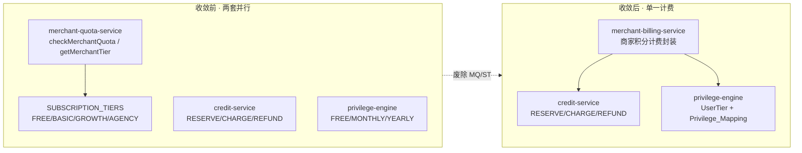
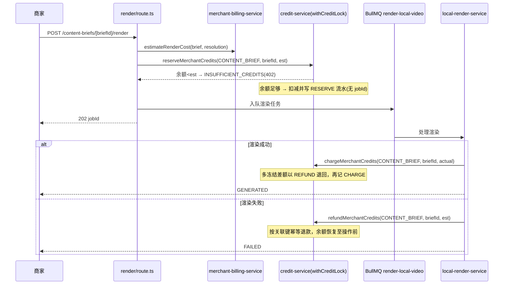

# Design Document: Merchant Billing Unification（商家计费体系收敛）

## Overview

本设计将本地生活营销平台（`/merchant`）自建的「额度（Quota）」体系收敛到视频重塑既有的「积分（Credit）+ 订阅（UserTier）」体系，使平台只保留一套计费实现。收敛后：

- 本地生活的全部可计费操作（视频渲染、内容计划生成、视频导出超分）统一消费 `User.creditBalance` 积分，经 `credit-service` 的 RESERVE / CHARGE / REFUND 流转，并全部经 Redis 全局写锁 `withCreditLock` 串行化。
- 本地生活的会员权益（导出分辨率、合规检测开关、数据洞察开关、门店数量上限、批量并发）由 `privilege-engine` 的 `UserTier`（FREE / MONTHLY / YEARLY）经一张新的 **Privilege_Mapping** 决定，不再由 `SUBSCRIPTION_TIERS`（FREE / BASIC / GROWTH / AGENCY）按套餐 `name` 解读。
- `merchant-quota-service.ts`、`SUBSCRIPTION_TIERS`、以及仅服务于额度体系的类型（`QuotaAction` / `QuotaCheckResult`）从生产代码中移除。

核心设计原则：

- **单一计费真相**：用户在两条产品线只看到一个积分余额、一个会员等级。
- **复用而非重建**：商家计费复用既有 `credit-service` 与 `privilege-engine`，不新建并行实现；账号、登录、JWT 注入（`x-user-id` / `x-user-role`）沿用现状。
- **无 `jobId` 外键陷阱**：商家操作没有对应的 `GenerationJob`，写 `CreditLedger` 时绝不写 `jobId`（否则触发 `credit_ledger_job_id_fkey` 外键违约），改用新增的可空、无外键的商家实体关联字段。
- **additive-only 迁移**：所有数据库变更仅新增可空列与索引，绝不修改或删除视频重塑工作流正在使用的既有列、表与约束。
- **无静默降级**：余额不足、外部服务失败一律抛错或显式返回错误码，绝不欠费、绝不扣至负数、绝不静默吞错。
- **不触碰生成链路**：parse-video、grouping、generate-video、merge、Seedance、HappyHorse 等生成逻辑保持原样，本 Spec 仅在「计费与权益」层做调整。

> 与 `subscription-membership` 设计保持一致：积分合并到 `User.creditBalance`、订阅状态机驱动 `UserTier`、关键积分写经 `withCreditLock` 串行化。本设计在此基线上把商家操作接入同一套积分与权益判定。

## Architecture

### 收敛前后对比



### 系统分层（收敛后）

```
┌──────────────────────────────────────────────────────────────┐
│  Presentation Layer                                            │
│  - /merchant 主框架（移动端）+ 进入 /dashboard 的导航入口        │
│  - 升级提示组件（门店上限 / 洞察未开放 / 积分不足）              │
├──────────────────────────────────────────────────────────────┤
│  API Layer (Next.js Route Handlers · 仅校验 + 调服务 + 返回)    │
│  - /api/content-briefs/[briefId]/render        （渲染计费）     │
│  - /api/stores/[storeId]/content-plan/generate （内容计划计费） │
│  - /api/video-variants/[variantId]/export      （导出/超分计费）│
│  - /api/content-briefs/[briefId]/insights      （洞察权益门控） │
│  - /api/stores (建店) + /api/merchant/subscription（权益汇总）  │
├──────────────────────────────────────────────────────────────┤
│  Service Layer (src/lib/)                                      │
│  - merchant-billing-service  ← 新增：商家积分计费封装           │
│  - credit-service            ← 复用：RESERVE/CHARGE/REFUND      │
│  - privilege-engine          ← 扩展：getMerchantPrivileges      │
│  - local-render-service      ← 改造：接入积分计费（去额度）     │
│  - merchant-quota-service    ← 删除                            │
├──────────────────────────────────────────────────────────────┤
│  Worker Layer (BullMQ)                                         │
│  - render-local-video / generate-content-plan（计费点接入）    │
├──────────────────────────────────────────────────────────────┤
│  Data Layer (Prisma 7.8 + PostgreSQL)                         │
│  - CreditLedger（additive：新增 bizRefType/bizRefId 可空无外键）│
│  - Merchant / Store / ContentBrief / VideoVariant（不变）      │
├──────────────────────────────────────────────────────────────┤
│  Infrastructure                                               │
│  - Redis 7：BullMQ 队列 + 全局积分写锁 withCreditLock          │
└──────────────────────────────────────────────────────────────┘
```

### 商家渲染计费时序（RESERVE → CHARGE / REFUND）



### 关键设计决策

| 决策点 | 方案 | 理由 |
|--------|------|------|
| 商家实体关联字段 | `CreditLedger` 新增 `bizRefType` + `bizRefId` 两个可空、无外键列 | 避免 `jobId` 外键违约；一对列即可表达 CONTENT_BRIEF / CONTENT_PLAN / STORE 多种实体；additive-only |
| 幂等键 | `(bizRefType, bizRefId, action)` 元组 | 单一商家操作的 RESERVE/CHARGE/REFUND 各自幂等，重试不重复 |
| 商家计费封装 | 新增 `merchant-billing-service.ts` 薄封装，内部仍调 `credit-service` | 复用既有 `withCreditLock` + 事务模型，不在 Route 内直接操作余额 |
| 渲染成本公式 | 复用 `estimateGroupCreditCost(groupDuration, resolution)`，对 3 个 VideoVariant 求和 | 与视频重塑「按组时长×分辨率」一致；每个版本视为一个分镜组 |
| 渲染冻结额 vs 实扣额 | 入队前按计划时长 RESERVE 估算额，成功后按实际渲染时长 CHARGE，多冻结差额退回 | 对齐生成阶段 RESERVE→CHARGE 模型，避免并发期间余额被花光 |
| 内容计划计费 | 固定单价 `CREDIT_COST_CONTENT_PLAN`，走 RESERVE→CHARGE/REFUND | 固定额仍套用补偿模型，失败可退款，避免为失败生成扣费 |
| 建店 / 洞察 | 不扣积分，改由 Privilege_Mapping 门控 | 符合 Req 3.4 / 3.6 / 5.5 / 5.6 |
| 导出超分 | 含超分才计费（复用导出超分公式），不含超分不扣 | 与视频重塑「合并导出不扣、仅超分扣」一致（Req 3.5）|
| 会员等级解读 | 仅 `determineTier(status, plan.type)` 一条路径 | 废除按 `plan.name` 解读 Merchant_Tier（Req 5.1）|
| AGENCY 专属权益 | 子账号 / 20 门店 / 批量并发 10 → 归并到 YEARLY 或标注范围外 | 三档 UserTier 无法表达，显式记录（Req 5.7）|

## Components and Interfaces

### 1. merchant-billing-service（商家积分计费封装，新增）

`src/lib/merchant-billing-service.ts`。统一承接所有商家可计费操作，内部复用 `credit-service` 与 `withCreditLock`，对外暴露以「商家实体关联键」为中心的接口。**绝不写 `jobId`**，关联字段使用新增的 `bizRefType` / `bizRefId`。

```typescript
// src/lib/merchant-billing-service.ts

/** 商家实体关联类型（写入 CreditLedger.bizRefType） */
export type MerchantBizRefType = 'CONTENT_BRIEF' | 'CONTENT_PLAN' | 'STORE'

/** 商家计费操作输入（关联键 = bizRefType + bizRefId） */
interface MerchantReserveInput {
  userId: string
  bizRefType: MerchantBizRefType
  bizRefId: string
  /** 冻结额度（估算值），必须 > 0 */
  amount: number
  /** 流水备注前缀，用于区分操作（如 '[MERCHANT_RENDER]'） */
  remarkTag: string
}

interface MerchantChargeInput {
  userId: string
  bizRefType: MerchantBizRefType
  bizRefId: string
  /** 实际应扣额度（≤ 已冻结额，多余部分退回） */
  actualAmount: number
}

interface MerchantRefundInput {
  userId: string
  bizRefType: MerchantBizRefType
  bizRefId: string
}

interface MerchantBillingService {
  /**
   * 估算渲染积分成本：对 ContentBrief 的全部分镜组（= 3 个 VideoVariant 的装配）
   * 按 estimateGroupCreditCost(groupDuration, resolution) 求和。
   * 纯函数，便于属性测试。
   */
  estimateRenderCost(groupDurations: number[], resolution: string): number

  /**
   * 冻结商家操作积分（RESERVE）。
   * - 经 withCreditLock 串行化 + Prisma 事务。
   * - 幂等键：(bizRefType, bizRefId, action='RESERVE')，已存在则跳过。
   * - 余额 < amount → 抛 ApiError('INSUFFICIENT_CREDITS', 402)，余额不变。
   * - 写 CreditLedger 时 jobId 恒为 null，关联字段写 bizRefType/bizRefId。
   */
  reserveMerchantCredits(input: MerchantReserveInput): Promise<void>

  /**
   * 正式扣费（CHARGE，基于已有 RESERVE）。
   * - 多冻结差额（reserved - actualAmount）以 REFUND 退回后再记 CHARGE。
   * - 幂等键：(bizRefType, bizRefId, action='CHARGE')，已存在则跳过。
   * - 可在外部事务中调用（tx 版本），与状态更新同事务。
   */
  chargeMerchantCredits(input: MerchantChargeInput): Promise<void>

  /**
   * 退款（REFUND），用于 CHARGE 之前失败的补偿。
   * - 幂等键：(bizRefType, bizRefId, action='REFUND')，已存在则跳过（不重复退款）。
   * - 退还额 = 该关联键已 RESERVE 的额度。
   */
  refundMerchantCredits(input: MerchantRefundInput): Promise<void>
}
```

> 这些函数是对 `credit-service` 现有 `freezeExportCredits` / `chargeCreditsTx` / `refundParseCredits` 模式的泛化：把幂等键从单一 `projectId` 抽象为 `(bizRefType, bizRefId)` 元组，从而既能避免 `jobId` 外键，又能区分不同商家实体。`credit-service` 内将新增以 `bizRef` 为键的内部实现（与既有 `projectId` 版本并存，不改动既有函数签名）。

### 2. privilege-engine 扩展（会员权益从 Merchant_Tier 收敛到 UserTier）

`src/lib/privilege-engine.ts` 新增 `getMerchantPrivileges`，复用既有 `determineTier` / `getUserPrivileges` 的订阅查询，返回本地生活专属权益项。**不新增订阅解读路径**。

```typescript
// src/lib/privilege-engine.ts 扩展

/** 本地生活会员权益（由 UserTier 经 Privilege_Mapping 决定） */
export interface MerchantPrivileges {
  /** 用户等级（FREE / MONTHLY / YEARLY） */
  tier: UserTier
  /** 导出最高分辨率（'720p' | '1080p'） */
  exportResolution: '720p' | '1080p'
  /** 是否启用合规检测 */
  complianceCheckEnabled: boolean
  /** 是否开放数据洞察 */
  insightsEnabled: boolean
  /** 名下门店数量上限 */
  maxStores: number
  /** 批量并发上限（复用 CONCURRENCY_LIMITS[tier].generate 语义） */
  batchConcurrency: number
}

/**
 * 纯函数：根据 UserTier 返回本地生活会员权益。
 * 直接查 MERCHANT_PRIVILEGE_MAPPING 常量表，可用于属性测试。
 */
export function determineMerchantPrivileges(tier: UserTier): MerchantPrivileges

/**
 * 异步：查询用户当前本地生活会员权益。
 * 复用 getUserPrivileges 的订阅查询路径得到 tier，再映射为 MerchantPrivileges。
 */
export function getMerchantPrivileges(userId: string): Promise<MerchantPrivileges>
```

### 3. Privilege_Mapping 常量（替换 SUBSCRIPTION_TIERS）

`src/constants/merchant.ts` 中移除 `SUBSCRIPTION_TIERS`，新增 `MERCHANT_PRIVILEGE_MAPPING`：

```typescript
// src/constants/merchant.ts

/** 内容计划生成固定积分单价（设计阶段确定，取值 ≥ 0） */
export const CREDIT_COST_CONTENT_PLAN = 10

/** UserTier → 本地生活会员权益映射（Privilege_Mapping） */
export const MERCHANT_PRIVILEGE_MAPPING: Record<UserTier, {
  exportResolution: '720p' | '1080p'
  complianceCheckEnabled: boolean
  insightsEnabled: boolean
  maxStores: number
}> = {
  FREE:    { exportResolution: '720p',  complianceCheckEnabled: false, insightsEnabled: false, maxStores: 1 },
  MONTHLY: { exportResolution: '1080p', complianceCheckEnabled: true,  insightsEnabled: true,  maxStores: 3 },
  YEARLY:  { exportResolution: '1080p', complianceCheckEnabled: true,  insightsEnabled: true,  maxStores: 10 },
} as const
```

原 Merchant_Tier → UserTier 权益归并对照（满足 Req 5.7 的显式记录要求）：

| 原 Merchant_Tier | 导出分辨率 | 合规检测 | 数据洞察 | 门店上限 | 归并到 UserTier |
|------------------|-----------|---------|---------|---------|-----------------|
| FREE | 720p | 否 | 否 | 1 | **FREE** |
| BASIC | 720p | 否 | 否 | 1 | 归并入 FREE 与 MONTHLY 之间，按订阅 `plan.type` 实际落到 MONTHLY（有有效订阅即享 1080p）|
| GROWTH | 1080p | 是 | 是 | 1 | **MONTHLY**（月卡）|
| AGENCY | 1080p | 是 | 是 | 20 + 子账号 50 + 批量并发 10 | **YEARLY**（门店上限取 10、批量并发取 `CONCURRENCY_LIMITS.YEARLY.generate`）|

**Req 5.7 范围外事项的显式声明**：原 AGENCY 的「子账号体系（最多 50 个）」无法用三档 UserTier 表达，**标注为本 Spec 范围之外的后续事项**，不在本次收敛中实现；「20 门店」收敛为 YEARLY 的 `maxStores=10`（如需更高上限由后续调整常量）；「批量并发 10」映射为 YEARLY 既有并发配置 `CONCURRENCY_LIMITS.YEARLY.generate`（当前为 5），作为统一并发语义的一部分。

### 4. 各 API Route 的改造点

所有 Route 仅做「校验 + 调服务 + 返回」，计费/权益逻辑全部下沉到服务层。

| Route | 收敛前 | 收敛后 |
|-------|--------|--------|
| `content-briefs/[briefId]/render` | `checkMerchantQuota(RENDER_VIDEO)` → 403 `QUOTA_EXCEEDED` | 入队前 `estimateRenderCost` + `reserveMerchantCredits`；余额不足 → 402 `INSUFFICIENT_CREDITS`（含 `required` / `balance`）|
| `stores/[storeId]/content-plan/generate` | `checkMerchantQuota(CREATE_CONTENT_PLAN)` | `reserveMerchantCredits`（固定 `CREDIT_COST_CONTENT_PLAN`）；余额不足 → 402 |
| `video-variants/[variantId]/export` | `getMerchantTier` + `SUBSCRIPTION_TIERS[tier].exportResolution` | `getMerchantPrivileges(userId).exportResolution`；含超分才 `reserveMerchantCredits`+导出超分公式，否则不扣 |
| `content-briefs/[briefId]/insights` | `checkMerchantQuota(ACCESS_INSIGHTS)` | `getMerchantPrivileges(userId).insightsEnabled`；未开放 → 403 升级提示 |
| `stores`（建店） | `checkMerchantQuota(CREATE_STORE)` | 不扣积分；`getMerchantPrivileges(userId).maxStores` 门控，超限 → 403 升级提示（含当前数/上限/最低解锁等级）|
| `merchant/subscription`（权益汇总） | 汇总 5 项 `checkMerchantQuota` + `SUBSCRIPTION_TIERS` | 返回 `getMerchantPrivileges` + `getBalance`（积分余额）|

### 5. local-render-service 改造

`src/lib/local-render-service.ts` 移除「按额度计费、不扣积分」的注释与逻辑，改为：

- 渲染成功（置 `GENERATED` 的同一事务内）调用 `chargeMerchantCredits({ CONTENT_BRIEF, briefId, actualAmount })`，`actualAmount` 按 3 个 VideoVariant 实际渲染时长经 `estimateGroupCreditCost` 求和。
- 渲染失败（置 `FAILED`）调用 `refundMerchantCredits({ CONTENT_BRIEF, briefId })`，幂等退还入队前冻结的积分。
- 反转此前「商家渲染只走额度不扣积分」的临时修法（Req 3.7）。

### 6. 主框架与模块导航（Req 8）

- 重新评估并解除 local-life-marketing-platform Req 15.5「`/merchant` 与 `/dashboard` 完全隔离、禁止跳转」的约束。
- `middleware.ts` 对 `/merchant` 与 `/dashboard` 注入同一套 `x-user-id` / `x-user-role`，已登录会话在两区间导航无需重新认证（仅确认现状，不改认证机制）。
- 在 `/merchant` 主框架提供进入 `/dashboard` 视频重塑模块的导航入口；视频重塑模块内部页面结构与交互保持不变，仅调整导航归属。

## Data Models

### CreditLedger additive 迁移（新增 2 个可空、无外键列 + 索引）

```prisma
model CreditLedger {
  // ===== 既有列保持不变（jobId/orderId/projectId/subscriptionOrderId 等）=====
  // ===== 新增：商家操作实体关联（可空、无外键，避免 jobId 外键违约）=====
  bizRefType String? @map("biz_ref_type") // CONTENT_BRIEF | CONTENT_PLAN | STORE
  bizRefId   String? @map("biz_ref_id")   // 对应商家实体的主键（无外键约束）

  // ===== 新增复合索引：按商家关联键查询/幂等检查 =====
  @@index([bizRefType, bizRefId])
}
```

迁移约束（Req 4.3 / 7.3）：

- 仅 `ALTER TABLE credit_ledger ADD COLUMN ...`（两列均 nullable）与 `CREATE INDEX`，不修改/删除任何既有列、约束（含 `credit_ledger_job_id_fkey`）。
- `bizRefType` / `bizRefId` **不建立外键**，因此商家实体（ContentBrief / ContentPlan / Store）被删除也不会阻塞流水写入。
- 历史额度数据不回填：收敛前按额度运行、无对应流水的历史操作不补记积分流水（Req 7.4）。

### 业务实体模型（保持不变，Req 2.5 / 7.1）

`Merchant` / `Store` / `ContentBrief` / `VideoVariant` 等模型不做任何字段变更，仅其计费相关的调用链改走积分体系。

### 商家操作 → 计费动作 → 关联键 映射

| Merchant_Operation | 计费动作 | bizRefType | bizRefId | 备注 |
|--------------------|---------|------------|----------|------|
| RENDER_VIDEO | RESERVE→CHARGE/REFUND | CONTENT_BRIEF | `contentBrief.id` | 成本 = Σ 分镜组 `estimateGroupCreditCost` |
| CREATE_CONTENT_PLAN | RESERVE→CHARGE/REFUND | CONTENT_PLAN | `contentPlan.id` | 固定 `CREDIT_COST_CONTENT_PLAN` |
| EXPORT_VIDEO（含超分） | RESERVE→CHARGE/REFUND | CONTENT_BRIEF | `contentBrief.id` | 仅超分计费，公式复用导出超分；无超分不扣 |
| CREATE_STORE | 无扣减 | — | — | 由 `maxStores` 门控 |
| ACCESS_INSIGHTS | 无扣减 | — | — | 由 `insightsEnabled` 门控 |

### 待删除清单（Req 2.1 / 2.2 / 2.4）

- `src/lib/merchant-quota-service.ts`（整文件，含 `checkMerchantQuota` / `getMerchantTier` / `MerchantTier`）。
- `src/constants/merchant.ts` 中 `SUBSCRIPTION_TIERS` 常量。
- `src/types/merchant.ts` 中 `QuotaAction` / `QuotaCheckResult` 在生产代码中的全部引用（类型本身可随引用一并清除）。
- 相关测试 `src/__tests__/property/subscription-quota.property.test.ts` 中复现额度逻辑的部分需同步移除/改写。

## Correctness Properties

*A property is a characteristic or behavior that should hold true across all valid executions of a system-essentially, a formal statement about what the system should do. Properties serve as the bridge between human-readable specifications and machine-verifiable correctness guarantees.*

下列属性由验收标准经测试性预分析（prework）推导而来。已对逻辑冗余项做合并：建店与洞察的「余额守恒」合并为一条；`Privilege_Mapping` 的 FREE/MONTHLY/YEARLY 合并为一条「for all tier」映射属性；门店上限与洞察门控合并为一条；流水「无 jobId」与「正确关联 bizRef」合并；各幂等项合并为一条；失败退款与冻结-退款往返合并为一条。

### Property 1: 渲染成本等于各分镜组积分之和

*For any* 分镜组时长数组 `groupDurations`（每项 > 0）与分辨率 `resolution`，`estimateRenderCost(groupDurations, resolution)` 的返回值 SHALL 恰好等于对每个时长调用 `estimateGroupCreditCost(duration, resolution)` 的求和；该值用于渲染入队前的 RESERVE 冻结额。

**Validates: Requirements 3.1, 3.7**

### Property 2: 余额不足必拒绝且余额不变

*For any* 用户初始余额 `balance` 与某可计费商家操作所需冻结额 `cost`，当 `balance < cost` 时，`reserveMerchantCredits` SHALL 抛出 `INSUFFICIENT_CREDITS`（HTTP 402），且用户 `creditBalance` 在调用前后保持不变、绝不为负、绝不欠费。

**Validates: Requirements 3.2, 3.3**

### Property 3: 无扣减操作余额守恒

*For any* 建店（CREATE_STORE）或数据洞察访问（ACCESS_INSIGHTS）操作（无论用户等级与操作输入），用户 `creditBalance` 在操作前后 SHALL 完全相等（这两类操作不写入任何积分流水）。

**Validates: Requirements 3.4, 3.6**

### Property 4: 商家流水不含 jobId 且正确关联商家实体

*For any* 商家可计费操作写入的全部 `CreditLedger` 流水条目，其 `jobId` SHALL 恒为 `null`，且 `bizRefType` ∈ {CONTENT_BRIEF, CONTENT_PLAN, STORE}、`bizRefId` SHALL 等于发起该操作的商家实体主键。

**Validates: Requirements 4.1, 4.2, 4.5**

### Property 5: 商家计费动作幂等

*For any* 商家操作关联键 `(bizRefType, bizRefId)` 与金额，重复调用 RESERVE、CHARGE 或 REFUND 任意次数 SHALL 与调用恰好一次产生相同的最终余额与相同数量的对应流水条目（`f(f(x)) = f(x)`），即重试不重复冻结、不重复扣费、不重复退款。

**Validates: Requirements 4.4, 6.2**

### Property 6: 冻结—退款往返一致

*For any* 用户初始余额与冻结额 `amount`（`amount ≤ balance`），对同一关联键先 `reserveMerchantCredits` 再 `refundMerchantCredits` 后，用户 `creditBalance` SHALL 恢复到该操作发生前的数值。

**Validates: Requirements 6.1, 6.4**

### Property 7: 差额退款使净扣等于实扣

*For any* 已冻结额 `reserved` 与实际应扣额 `actual`（`0 ≤ actual ≤ reserved`），对同一关联键先 RESERVE `reserved` 再 CHARGE `actual` 后，用户余额相对初始值的净减少量 SHALL 恰好等于 `actual`（多冻结的 `reserved - actual` 以 REFUND 退回）。

**Validates: Requirements 6.5**

### Property 8: 会员等级解读唯一且与套餐名无关

*For any* 订阅状态 `status`、套餐类型 `planType` 与套餐名 `planName`，`determineTier(status, planType)` 的结果 SHALL 只依赖 `status` 与 `planType`、与 `planName` 完全无关；当 `status !== 'ACTIVE'` 时为 FREE，`planType === 'yearly'` 时为 YEARLY，否则为 MONTHLY。

**Validates: Requirements 5.1, 7.2**

### Property 9: Privilege_Mapping 映射正确

*For any* 用户等级 `tier` ∈ {FREE, MONTHLY, YEARLY}，`determineMerchantPrivileges(tier)` 返回的权益 SHALL 与 `MERCHANT_PRIVILEGE_MAPPING[tier]` 一致：FREE 为 `exportResolution='720p'`、`insightsEnabled=false`；MONTHLY 与 YEARLY 为 `exportResolution='1080p'`、`insightsEnabled=true`；`maxStores` 等于映射表中对应等级的值。

**Validates: Requirements 5.2, 5.3, 5.4**

### Property 10: 权益门控在超限/未开放时拒绝并给出升级提示

*For any* 用户等级 `tier` 与名下门店数 `currentStores`，当 `currentStores >= MERCHANT_PRIVILEGE_MAPPING[tier].maxStores` 时建店 SHALL 被拒绝，且升级提示包含当前门店数、上限值与可解除限制的最低等级；*for any* `insightsEnabled=false` 的等级，数据洞察访问 SHALL 被拒绝并返回升级提示。

**Validates: Requirements 5.5, 5.6**

## Error Handling

### 积分计费异常

| 场景 | 处理策略 | 错误码 / HTTP |
|------|---------|---------------|
| 渲染/内容计划余额不足 | `reserveMerchantCredits` 抛错，余额不变，拒绝入队 | `INSUFFICIENT_CREDITS` / 402（含 `required`、`balance`）|
| 渲染失败（CHARGE 前） | `refundMerchantCredits` 按关联键幂等退还冻结额 | 置 ContentBrief `FAILED` |
| 重复回调/重试 | `(bizRefType, bizRefId, action)` 幂等检查命中则跳过 | 静默幂等（不重复变动余额）|
| 实扣 < 冻结额 | CHARGE 时将差额以 REFUND 退回 | 净扣 = 实扣 |
| 写流水误带 jobId | 设计层禁止：商家计费函数不接受 jobId 参数，关联恒走 bizRef | 杜绝 `credit_ledger_job_id_fkey` 违约 |

### 权益门控异常

| 场景 | 处理策略 | 错误码 / HTTP |
|------|---------|---------------|
| 门店数达上限 | 拒绝建店，返回当前数/上限/最低解锁等级 | `STORE_LIMIT_EXCEEDED` / 403 |
| 数据洞察未开放 | 拒绝访问，返回升级提示 | `INSIGHTS_NOT_AVAILABLE` / 403 |
| 导出分辨率 | 按 `getMerchantPrivileges().exportResolution` 决定 720p/1080p，不报错降级，分辨率由权益直接决定 | — |

### 并发与一致性

| 场景 | 处理策略 |
|------|---------|
| 同一用户并发计费写 | 全部经 `withCreditLock` 跨进程串行化，防 read-modify-write 丢失更新 |
| `withCreditLock` 不可重入 | 商家计费函数内部不得再嵌套调用 `withCreditLock`（与既有约束一致）|
| Worker 崩溃导致冻结未结算 | 复用既有看门狗/重试模型：失败路径退款解卡，BullMQ 重试幂等安全 |

### 外部依赖失败（无静默降级）

- Seedance 补充片段、FFmpeg、OSS、合规检查等外部调用失败一律抛错（让 BullMQ 重试或显式返回），不静默降级；渲染整体失败时退还冻结积分。

## Testing Strategy

### 属性测试（Property-Based Testing）

本特性的计费数学（成本求和、差额退款、余额守恒）、等级解读、权益映射与幂等/往返不变量均为纯逻辑或可隔离逻辑，**适用属性测试**。使用项目既有的 **fast-check**（Vitest 4，Node 环境），每个属性最少运行 **100** 次迭代。

**测试文件**：`src/__tests__/property/merchant-billing-unification.property.test.ts`

每个属性测试以注释关联设计属性：

```typescript
// Feature: merchant-billing-unification, Property 1: 渲染成本等于各分镜组积分之和
```

| 属性 | 被测对象 | 测试要点 |
|------|---------|---------|
| Property 1 | `estimateRenderCost` 纯函数 | 随机时长数组+分辨率，断言 == Σ `estimateGroupCreditCost` |
| Property 2 | `reserveMerchantCredits` | 随机 `balance < cost`，断言抛 402 且余额不变、非负 |
| Property 3 | 建店/洞察路径 | 随机输入，断言操作前后余额相等、无新增流水 |
| Property 4 | 商家流水写入 | 随机商家操作，断言所有流水 `jobId===null` 且 `bizRefType/bizRefId` 正确 |
| Property 5 | RESERVE/CHARGE/REFUND | 随机金额，重复调用 N 次，断言余额与流水条数等同单次 |
| Property 6 | reserve→refund | 随机初始余额+冻结额，断言往返后余额 == 初始 |
| Property 7 | reserve→charge | 随机 `reserved>=actual`，断言净扣 == actual |
| Property 8 | `determineTier` 纯函数 | 随机 status/planType/planName，断言结果与 planName 无关 |
| Property 9 | `determineMerchantPrivileges` 纯函数 | for all tier，断言权益项与映射表一致 |
| Property 10 | 门店/洞察门控纯逻辑 | 随机 tier+currentStores，断言超限/未开放拒绝并含提示要素 |

> 涉及余额/流水的属性（2-7）在测试中对 `credit-service` 的 Prisma 写入使用受控的内存/事务回滚夹具隔离 DB 副作用，但被测的仍是真实计费逻辑（非 mock 业务规则），符合「不 mock 业务流程」约束。

### 单元测试（Unit Tests）

**测试文件**：`src/__tests__/merchant-billing-service.test.ts`

- 内容计划固定单价：断言扣费额 == `CREDIT_COST_CONTENT_PLAN`（Req 3.3 EXAMPLE）。
- 导出含超分扣减 / 不含超分余额不变（Req 3.5 两个代表用例）。
- 升级提示文案三要素（当前数/上限/最低等级）格式正确。

### 集成测试（Integration Tests）

**测试文件**：`tests/integration/merchant-billing-flow.test.ts`

- 真实 PostgreSQL 写入一笔商家流水，断言 **不触发 `credit_ledger_job_id_fkey` 外键违约**（Req 4.5）。
- 渲染端到端：reserve → 渲染成功 → charge（差额退回）/ 渲染失败 → refund。
- 各 Route 改造后走积分/权益路径，不再引用额度逻辑（Req 2.3）。
- 同一 JWT 会话访问 `/merchant` 与 `/dashboard` 均放行（Req 8.2）。
- 既有 Merchant/Store/ContentBrief/VideoVariant 记录读写正常（Req 7.1）。

### 结构 / 冒烟检查（Smoke & Migration）

- 静态检查：生产代码无 `merchant-quota-service` / `SUBSCRIPTION_TIERS` / `QuotaAction` / `QuotaCheckResult` 引用，构建通过（Req 2.1/2.2/2.4）。
- 迁移检查：`credit_ledger` 仅新增 `biz_ref_type` / `biz_ref_id` 可空列与复合索引；Merchant/Store/ContentBrief/VideoVariant 表结构无变更（Req 2.5/4.3/7.3）。
- 确认无历史额度数据回填脚本（Req 7.4）。

### 范围外（不在本 Spec 测试范围）

- 视频重塑生成链路（parse/generate/merge/Seedance/HappyHorse）的生成行为与产物效果（Req 9.1-9.4）保持原状，本 Spec 不为其新增测试。
