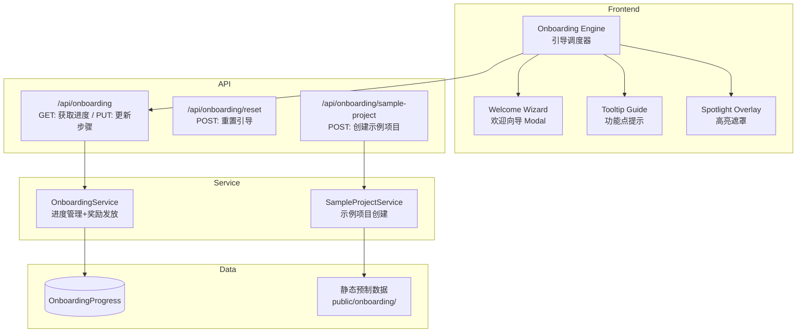

# Design Document: Onboarding Guide (新手引导流程)

## Overview

为新注册用户提供轻量级、非阻塞的引导体验流程。核心设计：

- **数据库持久化引导进度**：新增 OnboardingProgress 模型，存储每个步骤的完成/跳过状态
- **预制示例项目**：使用静态数据创建 Sample_Project，不消耗 AI 资源
- **前端引导引擎**：Tooltip/Spotlight 组件系统，按步骤序列展示
- **完成奖励**：全部完成后发放 20 积分（通过 CreditLedger TOPUP）

设计原则：引导不阻塞用户操作、轻量渲染、进度跨设备同步。

## Architecture



## Components and Interfaces

### 1. OnboardingService (`src/lib/onboarding-service.ts`)

```typescript
type OnboardingStepId = 'WELCOME_WIZARD' | 'SAMPLE_PROJECT_CREATED' | 'DASHBOARD_TOOLTIP' | 'EDITOR_GUIDE' | 'FIRST_PROJECT_GUIDE'
type StepStatus = 'NOT_COMPLETED' | 'COMPLETED' | 'SKIPPED'

interface OnboardingProgress {
  userId: string
  steps: Record<OnboardingStepId, StepStatus>
  rewardGranted: boolean
  updatedAt: string
}

interface OnboardingService {
  getProgress(userId: string): Promise<OnboardingProgress>
  updateStep(userId: string, stepId: OnboardingStepId, status: StepStatus): Promise<void>
  resetProgress(userId: string): Promise<void>
  checkAndGrantReward(userId: string): Promise<boolean>
}
```

### 2. SampleProjectService (`src/lib/sample-project-service.ts`)

```typescript
interface SampleProjectService {
  createSampleProject(userId: string): Promise<Project>
  hasSampleProject(userId: string): Promise<boolean>
}
```

### 3. Frontend Onboarding Engine

```typescript
// src/hooks/use-onboarding.ts
interface UseOnboardingReturn {
  progress: OnboardingProgress | null
  currentStep: OnboardingStepId | null
  isStepActive: (stepId: OnboardingStepId) => boolean
  completeStep: (stepId: OnboardingStepId) => Promise<void>
  skipStep: (stepId: OnboardingStepId) => Promise<void>
  resetOnboarding: () => Promise<void>
}
```

### 4. UI Components

| 组件 | 路径 | 说明 |
|------|------|------|
| WelcomeWizard | `src/components/onboarding/welcome-wizard.tsx` | 4 步欢迎向导 Modal |
| TooltipGuide | `src/components/onboarding/tooltip-guide.tsx` | 功能点 Tooltip 提示 |
| SpotlightOverlay | `src/components/onboarding/spotlight-overlay.tsx` | 元素高亮遮罩 |
| OnboardingProvider | `src/components/onboarding/onboarding-provider.tsx` | 引导状态 Context |

## Data Models

```prisma
model OnboardingProgress {
  id              String   @id @default(cuid())
  userId          String   @unique @map("user_id")
  welcomeWizard   String   @default("NOT_COMPLETED") @map("welcome_wizard")
  sampleProject   String   @default("NOT_COMPLETED") @map("sample_project")
  dashboardTooltip String  @default("NOT_COMPLETED") @map("dashboard_tooltip")
  editorGuide     String   @default("NOT_COMPLETED") @map("editor_guide")
  firstProjectGuide String @default("NOT_COMPLETED") @map("first_project_guide")
  rewardGranted   Boolean  @default(false) @map("reward_granted")
  createdAt       DateTime @default(now()) @map("created_at")
  updatedAt       DateTime @updatedAt @map("updated_at")

  user User @relation(fields: [userId], references: [id], onDelete: Cascade)

  @@map("onboarding_progress")
}
```

## Correctness Properties

### Property 1: 完成奖励幂等性
*For any* user, the reward SHALL be granted at most once. Repeated calls to checkAndGrantReward after the first successful grant SHALL return false and not create additional CreditLedger entries.

### Property 2: 全步骤完成才授予奖励
*For any* user, the reward SHALL only be granted when ALL steps have status COMPLETED (not SKIPPED). Any SKIPPED step SHALL prevent reward.

### Property 3: 重置进度正确性
*For any* resetProgress call, ALL steps SHALL return to NOT_COMPLETED. The rewardGranted flag SHALL NOT be reset (防止重复领取奖励).

### Property 4: 示例项目唯一性
*For any* userId, at most one sample project SHALL exist. Duplicate creation attempts SHALL be idempotent.

## Error Handling

| 场景 | 处理策略 |
|------|----------|
| 预制数据文件缺失 | 跳过示例项目创建，记录错误，不阻塞用户 |
| 奖励发放失败 | 重试一次，仍失败记录日志，rewardGranted 不标记 |
| 进度更新并发冲突 | 最后写入胜出（last-write-wins），引导步骤无严格顺序约束 |

## Testing Strategy

- Property 1-4 使用 fast-check PBT 测试
- OnboardingService CRUD 操作单元测试
- SampleProjectService 创建与幂等测试
- 前端 hook 状态管理测试
