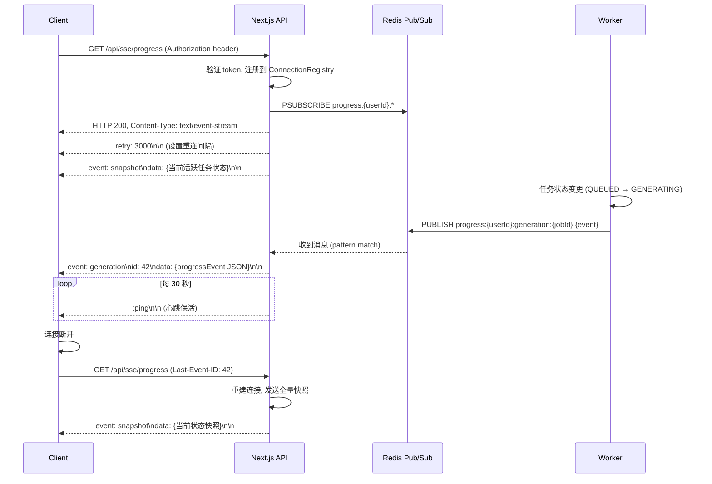

# Design Document: Realtime Progress Push

## Overview

本设计实现基于 Server-Sent Events (SSE) 的实时进度推送系统，用于替代前端轮询机制。核心思路是利用 Redis Pub/Sub 作为 Worker 进程和 API 进程之间的跨进程通信桥梁：

- **Worker 进程**：任务执行过程中通过 Redis PUBLISH 发布进度事件
- **API 进程**：维护 SSE 长连接，通过 Redis SUBSCRIBE 接收事件并实时推送到客户端
- **客户端**：使用 EventSource API 接收实时事件，同时保留低频轮询作为降级方案

该方案不影响现有轮询 API 功能，SSE 作为增强手段叠加在现有架构之上。

## Architecture

```mermaid
graph TB
    subgraph Client["客户端 (Browser)"]
        ES[EventSource]
        ZS[Zustand Store]
        PH[Polling Hook - 降级]
        ES --> ZS
        PH --> ZS
    end

    subgraph API["API 进程 (Next.js App Router)"]
        SSE_ROUTE["/api/sse/progress<br/>Route Handler"]
        CR[Connection Registry<br/>Map userId → Set connections]
        RS[Redis Subscriber<br/>per-user channel]
        SSE_ROUTE --> CR
        RS --> SSE_ROUTE
    end

    subgraph Worker["Worker 进程 (npx tsx)"]
        GW[generate-video Worker]
        PW[parse-video Worker]
        CW[generate-character Worker]
        MW[merge-video Worker]
        PP[ProgressPublisher 模块]
        GW --> PP
        PW --> PP
        CW --> PP
        MW --> PP
    end

    subgraph Redis["Redis"]
        PS[Pub/Sub Channels<br/>progress:{userId}:{taskType}:{taskId}]
    end

    PP -->|PUBLISH| PS
    PS -->|SUBSCRIBE pattern| RS
    SSE_ROUTE -->|SSE stream| ES
    PH -->|HTTP GET /api/polling| API
```

### 数据流



## Components and Interfaces

### 1. ProgressPublisher（Worker 侧发布模块）

```typescript
// src/lib/progress-publisher.ts
interface ProgressPublisher {
  /**
   * 发布进度事件到 Redis Pub/Sub
   * @param userId - 目标用户 ID
   * @param taskType - 任务类型 (generation | parse | character | merge | chain)
   * @param taskId - 任务/项目 ID
   * @param event - 进度事件负载
   */
  publish(userId: string, taskType: TaskType, taskId: string, event: ProgressEventPayload): Promise<void>
}

type TaskType = 'generation' | 'parse' | 'character' | 'merge' | 'chain'

interface ProgressEventPayload {
  taskId: string
  taskType: TaskType
  eventType: string  // 如 'state_change', 'progress_update', 'completed', 'failed', 'chain_group_failed'
  timestamp: string  // ISO 8601
  progress?: number  // 0-100
  estimatedRemainingSeconds?: number
  stage?: string
  metadata?: Record<string, unknown>
}
```

**设计决策**：使用现有的 `redis` 实例（`src/lib/redis.ts`）的 `publish` 方法。由于 ioredis 的 publish 不需要独立连接（只有 subscribe 需要），Worker 进程可以直接复用已有连接。

### 2. SSE Route Handler（API 侧 SSE 端点）

```typescript
// src/app/api/sse/progress/route.ts
// Next.js App Router Route Handler，返回 ReadableStream 实现 SSE

export async function GET(request: Request): Promise<Response>
```

**职责**：
- 验证请求中的 Authorization token
- 创建独立的 Redis subscriber 连接（每用户共享一个 subscriber）
- 返回 ReadableStream，推送 SSE 格式事件
- 管理心跳定时器（30s 间隔）
- 连接关闭时清理资源（取消订阅、移除注册）

**设计决策**：使用 Next.js Route Handler 的 `new Response(stream)` 模式，配合 `ReadableStream` 和 `TransformStream` 实现流式响应。每个用户创建一个共享的 Redis PSUBSCRIBE 连接，多个同用户的 SSE 连接共享该订阅。

### 3. ConnectionRegistry（连接注册表）

```typescript
// src/lib/sse/connection-registry.ts
interface ConnectionRegistry {
  /** 注册新连接，返回 connectionId。超过上限时淘汰最旧连接 */
  register(userId: string, controller: ReadableStreamDefaultController): string

  /** 注销连接 */
  unregister(userId: string, connectionId: string): void

  /** 向某用户的所有连接广播事件 */
  broadcast(userId: string, sseMessage: string): void

  /** 获取用户当前活跃连接数 */
  getConnectionCount(userId: string): number

  /** 获取全局连接总数 */
  getTotalConnections(): number

  /** 是否超过全局连接上限 */
  isAtCapacity(): boolean
}
```

**设计决策**：
- 使用进程内 `Map<string, Map<string, ConnectionEntry>>` 存储（userId → connectionId → entry）
- 每用户最多 5 个连接，第 6 个会淘汰最旧的
- 全局上限默认 1000 连接，超限返回 503
- 连接最长存活 30 分钟，到期发送 reconnect 事件后关闭

### 4. SSE Event Serializer（事件序列化器）

```typescript
// src/lib/sse/event-serializer.ts
interface SSEEventSerializer {
  /** 将 ProgressEvent 序列化为 SSE 格式字符串 */
  serialize(event: ProgressEventPayload, eventId: number): string

  /** 序列化心跳 */
  serializeHeartbeat(): string

  /** 序列化重试指令 */
  serializeRetry(ms: number): string

  /** 序列化快照事件 */
  serializeSnapshot(tasks: ProgressEventPayload[], eventId: number): string
}
```

**输出格式示例**：
```
event: generation
id: 42
data: {"taskId":"job-123","taskType":"generation","eventType":"state_change","timestamp":"2024-01-01T00:00:00Z","stage":"GENERATING","progress":50}

```

### 5. 客户端 SSE Hook（前端集成）

```typescript
// src/hooks/use-sse-progress.ts
interface UseSSEProgressOptions {
  /** 是否启用 SSE（用于 feature flag 控制） */
  enabled?: boolean
  /** 轮询降级间隔 (ms)，SSE 在线时使用的低频轮询间隔 */
  fallbackInterval?: number
  /** 高频轮询间隔 (ms)，SSE 不可用时使用 */
  activePollingInterval?: number
}

interface UseSSEProgressReturn {
  /** SSE 连接是否活跃 */
  isConnected: boolean
  /** 最新的进度事件（按 taskId 索引） */
  progressMap: Map<string, ProgressEventPayload>
  /** 手动重连 */
  reconnect(): void
}
```

**设计决策**：
- 使用浏览器原生 `EventSource` API（自带重连机制）
- SSE 连接成功后，将轮询间隔降低为 60 秒（安全网）
- SSE 断开超过 10 秒未恢复，恢复高频轮询（3-5 秒）
- 进度数据写入 Zustand store，UI 组件从 store 读取

### 6. Redis Subscriber Manager（API 侧订阅管理）

```typescript
// src/lib/sse/redis-subscriber.ts
interface RedisSubscriberManager {
  /** 为用户订阅进度频道（如已存在则复用） */
  subscribe(userId: string, onMessage: (event: ProgressEventPayload) => void): void

  /** 取消用户订阅（当该用户无活跃连接时） */
  unsubscribe(userId: string): void

  /** 获取当前活跃订阅数 */
  getActiveSubscriptionCount(): number
}
```

**设计决策**：
- 创建独立的 ioredis 实例用于 PSUBSCRIBE（Redis 要求 subscribe 模式下连接不能执行其他命令）
- 同一用户的多个 SSE 连接共享一个 Redis 订阅，通过 ConnectionRegistry 广播
- 用户所有连接关闭后才取消 Redis 订阅

## Data Models

### Progress_Event（进度事件结构）

```typescript
interface ProgressEvent {
  // 必填字段
  taskId: string                    // 任务唯一标识
  taskType: TaskType                // 'generation' | 'parse' | 'character' | 'merge' | 'chain'
  eventType: string                 // 'state_change' | 'progress_update' | 'completed' | 'failed' | 'chain_group_failed'
  timestamp: string                 // ISO 8601 格式时间戳

  // 可选字段
  progress?: number                 // 0-100，当前进度百分比
  estimatedRemainingSeconds?: number // 预估剩余时间（秒）
  stage?: string                    // 当前阶段描述（如 QUEUED, SUBMITTED, GENERATING）
  metadata?: Record<string, unknown> // 扩展元数据
}

// 链式生成扩展字段（通过 metadata 传递）
interface ChainMetadata {
  totalGroups: number               // 总组数 M
  currentGroup: number              // 当前组序号 (1-based)
  completedGroups: number           // 已完成组数
  currentJobStatus?: string         // 当前组的 GenerationJob 状态
}
```

### Connection_Registry 数据结构

```typescript
interface ConnectionEntry {
  connectionId: string              // 唯一连接标识（UUID）
  controller: ReadableStreamDefaultController // 流控制器
  createdAt: number                 // 连接创建时间戳（ms）
  lastActiveAt: number              // 最后活跃时间戳（ms）
  eventCounter: number              // 事件计数器（用于生成递增 id）
}

// 内存存储结构
// Map<userId, Map<connectionId, ConnectionEntry>>
```

### Redis Pub/Sub Channel 命名

| 频道模式 | 示例 | 用途 |
|---------|------|------|
| `progress:{userId}:generation:{jobId}` | `progress:user123:generation:job456` | 单个生成任务进度 |
| `progress:{userId}:parse:{taskId}` | `progress:user123:parse:task789` | 解析任务进度 |
| `progress:{userId}:character:{taskId}` | `progress:user123:character:char001` | 人物形象生成进度 |
| `progress:{userId}:merge:{taskId}` | `progress:user123:merge:merge002` | 合并导出进度 |
| `progress:{userId}:chain:{projectId}` | `progress:user123:chain:proj003` | 链式生成整体进度 |

**订阅模式**：API 进程使用 `PSUBSCRIBE progress:{userId}:*` 订阅某用户的所有进度频道。

### SSE 消息格式

```
retry: 3000

event: generation
id: 1
data: {"taskId":"job-123","taskType":"generation","eventType":"state_change","timestamp":"2024-01-15T10:30:00Z","stage":"GENERATING","progress":45,"estimatedRemainingSeconds":120}

:ping

event: chain
id: 2
data: {"taskId":"proj-001","taskType":"chain","eventType":"progress_update","timestamp":"2024-01-15T10:30:05Z","progress":33,"metadata":{"totalGroups":3,"currentGroup":2,"completedGroups":1,"currentJobStatus":"GENERATING"}}

```

## Correctness Properties

*A property is a characteristic or behavior that should hold true across all valid executions of a system—essentially, a formal statement about what the system should do. Properties serve as the bridge between human-readable specifications and machine-verifiable correctness guarantees.*

### Property 1: Connection Registry 注册/注销不变式

*For any* sequence of register and unregister operations on a ConnectionRegistry, the connection count for a userId SHALL always equal the number of registered connections minus the number of unregistered connections (never negative, never exceeding the per-user limit of 5).

**Validates: Requirements 1.2, 1.5, 7.1, 7.3, 7.4**

### Property 2: 广播完整性

*For any* userId with N active connections (1 ≤ N ≤ 5), when a Progress_Event is broadcast to that userId, all N connections SHALL receive the same serialized event message.

**Validates: Requirements 7.2**

### Property 3: Event ID 单调递增

*For any* single SSE connection, the sequence of event `id` values SHALL be strictly monotonically increasing (each id > previous id).

**Validates: Requirements 3.3**

### Property 4: Progress_Event 结构完整性

*For any* valid ProgressEventPayload, the serialized SSE message SHALL contain a valid JSON string in the `data` field that includes all required fields (taskId, taskType, eventType, timestamp), and when the `progress` field is present, its value SHALL be between 0 and 100 inclusive.

**Validates: Requirements 6.1, 6.2, 6.4**

### Property 5: SSE 序列化 Round-Trip

*For any* valid ProgressEventPayload, serializing it to SSE format and then parsing the `data` field back as JSON SHALL produce an object equivalent to the original payload.

**Validates: Requirements 6.4**

### Property 6: Channel 路由正确性

*For any* userId, taskType, and taskId combination, the derived Redis Pub/Sub channel name SHALL match the pattern `progress:{userId}:{taskType}:{taskId}`, and subscribing to pattern `progress:{userId}:*` SHALL match all channels for that user.

**Validates: Requirements 1.3, 4.1, 4.3, 4.4, 4.5**

### Property 7: 链式生成进度一致性

*For any* Chain_Generation with M groups where the N-th group completes (1 ≤ N ≤ M), the published Progress_Event SHALL satisfy: if N < M then `currentGroup = N+1` and `completedGroups = N`; if N === M then `eventType = 'completed'` and `completedGroups = M`.

**Validates: Requirements 5.1, 5.2, 5.4**

### Property 8: 每用户连接数上限不变式

*For any* sequence of connection registration attempts for a single userId, the ConnectionRegistry SHALL never contain more than 5 active connections for that userId. If a 6th registration is attempted, the oldest connection (by createdAt) SHALL be evicted first.

**Validates: Requirements 7.4**

### Property 9: 终态事件映射正确性

*For any* task reaching a terminal state, if the state is SUCCEEDED then the eventType SHALL be `completed`, and if the state is FAILED then the eventType SHALL be `failed`.

**Validates: Requirements 6.3**

## Error Handling

### 连接层错误

| 场景 | 处理策略 |
|------|----------|
| Token 无效/过期 | 返回 HTTP 401，不建立连接 |
| 全局连接数超限 | 返回 HTTP 503，客户端降级为轮询 |
| 流写入失败（客户端已断开） | 捕获异常，清理连接注册和 Redis 订阅 |
| 心跳发送失败 | 标记连接为 stale，90 秒后强制清理 |
| 连接超时（30 分钟） | 发送 `event: reconnect` 事件后关闭，客户端自动重连 |

### Redis 层错误

| 场景 | 处理策略 |
|------|----------|
| Redis 订阅连接断开 | ioredis 自动重连，重连后重新 PSUBSCRIBE |
| Redis PUBLISH 失败（Worker 侧） | 记录错误日志，不阻塞任务执行（进度推送是增强功能） |
| Redis 消息解析失败 | 记录错误日志，丢弃该消息，不影响后续消息 |

### 客户端错误

| 场景 | 处理策略 |
|------|----------|
| EventSource onerror | 依赖浏览器内置重连（retry: 3000ms） |
| 重连后状态丢失 | 服务端发送全量快照恢复状态 |
| SSE 连续 10 秒不可用 | 自动恢复高频轮询（3-5 秒） |
| SSE 重新可用 | 降低轮询频率到 60 秒 |

### Worker 侧容错

`ProgressPublisher.publish()` 使用 fire-and-forget 模式：
- 发布失败只记录 warn 日志，不抛出异常
- 不会阻塞或影响任务本身的执行流程
- 进度推送是"尽力而为"（best-effort），最终一致性由轮询兜底

## Testing Strategy

### Property-Based Testing (PBT)

使用 `fast-check` 库（项目已安装），每个 property 测试最少运行 100 次迭代。

**适用的 property 测试**：
- ConnectionRegistry 的注册/注销/计数不变式（Property 1, 8）
- 广播完整性（Property 2）
- Event ID 单调递增（Property 3）
- ProgressEvent 结构验证（Property 4）
- SSE 序列化 Round-Trip（Property 5）
- Channel 名称路由逻辑（Property 6）
- 链式生成进度计算逻辑（Property 7）
- 终态事件映射（Property 9）

**PBT 测试标签格式**：
```
// Feature: realtime-progress-push, Property 5: SSE 序列化 Round-Trip
```

### Unit Tests（示例和边界测试）

- SSE Route Handler 返回正确的 HTTP headers（Content-Type, Cache-Control）
- 无效 token 返回 401
- retry 字段值为 3000
- 心跳格式为 `:ping\n\n`
- 最大连接时长 30 分钟后发送 reconnect 事件
- 全局连接超限时返回 503
- 客户端 hook 在 SSE 连接后降低轮询频率
- 客户端 hook 在 SSE 断连 10 秒后恢复高频轮询

### Integration Tests

- Worker 发布事件 → Redis → API 订阅接收 → SSE 推送到客户端（端到端）
- 多用户隔离：用户 A 的事件不会推送给用户 B
- 重连后发送正确的状态快照
- Redis 连接中断后自动恢复订阅
- 轮询 API 在 SSE 启用/禁用时均正常工作
