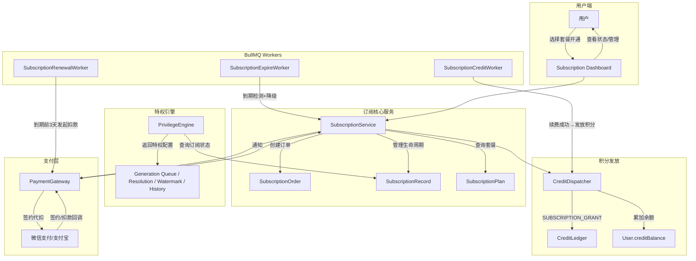
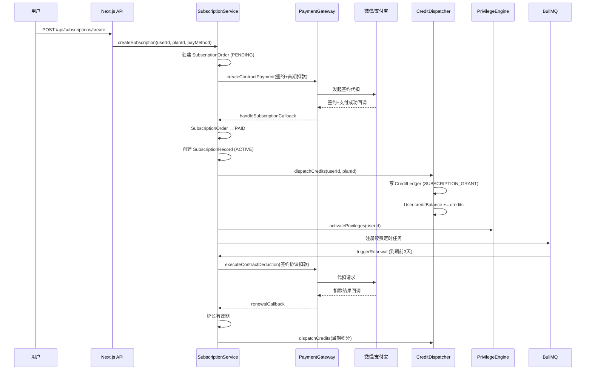
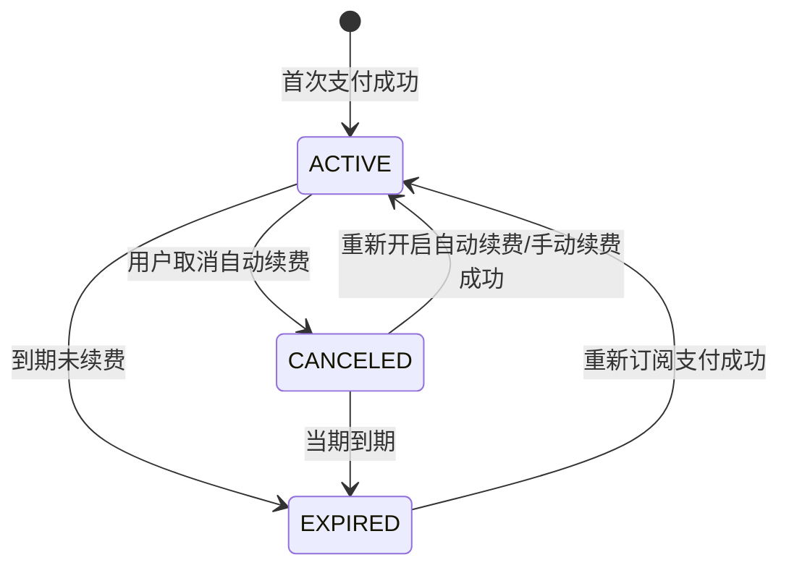

# Design Document: Subscription Membership (订阅制会员体系)

## Overview

在现有一次性积分包购买体系（Package + PackageOrder + CreditLedger）基础上，新增订阅制会员系统。系统通过月卡/年卡套餐为用户提供每月自动到账积分与会员特权（优先队列、1080p、去水印、30天版本历史），并与微信/支付宝签约代扣对接实现自动续费。

核心设计原则：
- **积分体系兼容**：会员积分直接累加到 `User.creditBalance`，与购买积分合并消费，不区分来源
- **订阅与积分包并存**：用户可同时拥有有效订阅和通过积分包购买的额外积分
- **状态机驱动**：订阅生命周期通过 ACTIVE → CANCELED → EXPIRED 状态机管理
- **BullMQ 定时任务**：到期检测、自动续费扣款、重试逻辑均由 Worker 异步处理
- **特权即时生效/撤销**：订阅激活/到期时特权实时切换，无延迟

## High-Level Design



### 核心流程时序



## Architecture

### 系统分层

```
┌──────────────────────────────────────────────────────────┐
│  Presentation Layer (Next.js Pages + Zustand Store)       │
│  - /subscription (套餐展示+开通)                           │
│  - /dashboard/subscription (会员管理页)                    │
├──────────────────────────────────────────────────────────┤
│  API Layer (Next.js App Router API Routes)                 │
│  - /api/subscriptions/*                                   │
│  - /api/payments/{channel}/subscription-callback          │
├──────────────────────────────────────────────────────────┤
│  Service Layer                                            │
│  - SubscriptionService (订阅生命周期管理)                   │
│  - CreditDispatcher (积分发放)                             │
│  - PrivilegeEngine (特权判定)                              │
│  - PaymentGateway (签约代扣扩展)                           │
├──────────────────────────────────────────────────────────┤
│  Worker Layer (BullMQ)                                    │
│  - subscription-renewal-worker (续费扣款)                  │
│  - subscription-expire-worker (到期检测)                   │
│  - subscription-credit-worker (积分发放)                   │
├──────────────────────────────────────────────────────────┤
│  Data Layer (Prisma + SQLite)                             │
│  - SubscriptionPlan / SubscriptionRecord / SubscriptionOrder │
│  - CreditLedger (扩展 SUBSCRIPTION_GRANT action)           │
├──────────────────────────────────────────────────────────┤
│  Infrastructure                                           │
│  - Redis (BullMQ 队列 + 分布式锁)                          │
│  - 微信支付/支付宝 (签约代扣 API)                           │
└──────────────────────────────────────────────────────────┘
```

### 关键设计决策

| 决策点 | 方案 | 理由 |
|--------|------|------|
| 积分合并 vs 分账户 | 合并到 `User.creditBalance` | 简化消费逻辑，用户无感知，符合需求 |
| 续费调度 | BullMQ Repeatable + Delayed Job | 复用现有 Worker 基础设施，可靠性高 |
| 签约代扣 | 扩展 IPaymentGateway 接口 | 复用现有支付网关抽象，统一回调处理 |
| 特权判定 | 运行时查询 SubscriptionRecord | 无缓存，保证实时性；订阅用户量级可控 |
| 状态管理 | 前端 Zustand store | 与项目现有状态管理一致 |
| 年卡奖励积分 | 首月一次性发放全部奖励 | 简化逻辑，避免分月发放复杂度 |

## Components and Interfaces

### 1. SubscriptionService（订阅核心服务）

```typescript
// src/lib/subscription-service.ts

interface CreateSubscriptionInput {
  userId: string
  planId: string
  payMethod: 'wechat' | 'alipay'
  enableAutoRenewal: boolean
}

interface SubscriptionService {
  /** 创建订阅订单并发起签约支付 */
  createSubscription(input: CreateSubscriptionInput): Promise<{
    order: SubscriptionOrder
    paymentParams: PaymentResult
  }>

  /** 处理签约+支付成功回调 */
  handleSubscriptionPaymentCallback(callbackData: SubscriptionCallbackData): Promise<void>

  /** 处理续费扣款结果回调 */
  handleRenewalCallback(callbackData: SubscriptionCallbackData): Promise<void>

  /** 取消订阅（关闭自动续费） */
  cancelSubscription(userId: string, recordId: string): Promise<void>

  /** 手动续费 */
  manualRenew(userId: string, recordId: string, payMethod: PaymentChannel): Promise<{
    order: SubscriptionOrder
    paymentParams: PaymentResult
  }>

  /** 到期处理：状态设为 EXPIRED，撤销特权 */
  expireSubscription(recordId: string): Promise<void>

  /** 发起自动续费扣款 */
  triggerAutoRenewal(recordId: string): Promise<void>

  /** 重试续费扣款（失败后24h重试） */
  retryRenewal(recordId: string): Promise<void>

  /** 查询用户当前有效订阅 */
  getActiveSubscription(userId: string): Promise<SubscriptionRecord | null>

  /** 查询用户订阅历史 */
  getSubscriptionHistory(userId: string, page: number, pageSize: number): Promise<PaginatedResult<SubscriptionRecord>>
}
```

### 2. CreditDispatcher（积分发放服务）

```typescript
// src/lib/credit-dispatcher.ts

interface CreditDispatcher {
  /**
   * 发放订阅积分
   * - 月卡：500积分
   * - 年卡：500积分 + 按比例分摊的额外奖励积分（首月一次性发放全部1000积分奖励）
   * 
   * 幂等性：按 subscriptionOrderId 检查是否已存在 SUBSCRIPTION_GRANT 流水
   */
  dispatchSubscriptionCredits(
    userId: string,
    planId: string,
    subscriptionOrderId: string,
    isFirstMonth: boolean
  ): Promise<number> // 返回实际发放积分数

  /**
   * 计算当期应发放积分数
   * 纯函数，用于计算不同套餐和期数的积分额度
   */
  calculateCreditsToDispatch(
    planType: 'monthly' | 'yearly',
    isFirstMonth: boolean
  ): number
}
```

### 3. PrivilegeEngine（特权引擎）

```typescript
// src/lib/privilege-engine.ts

interface UserPrivileges {
  /** 生成队列优先级 (1=会员高优先, 5=普通) */
  queuePriority: number
  /** 允许的最大分辨率列表 */
  allowedResolutions: string[]
  /** 是否添加水印 */
  watermarkEnabled: boolean
  /** 版本历史保留天数 */
  historyRetentionDays: number
  /** 是否为活跃会员 */
  isActiveMember: boolean
}

interface PrivilegeEngine {
  /**
   * 获取用户当前特权配置
   * 查询 SubscriptionRecord 状态，返回对应特权
   */
  getUserPrivileges(userId: string): Promise<UserPrivileges>

  /**
   * 纯函数：根据订阅状态确定特权
   * 可用于属性测试
   */
  determinePrivileges(isActiveSubscriber: boolean): UserPrivileges
}
```

### 4. PaymentGateway 扩展（签约代扣）

```typescript
// src/services/payment/types.ts 扩展

interface CreateContractPaymentParams {
  orderNo: string
  amount: number
  description: string
  channel: PaymentChannel
  notifyUrl: string
  /** 签约场景：订阅周期代扣 */
  contractConfig: {
    /** 计费周期类型 */
    periodType: 'MONTH' | 'YEAR'
    /** 计费周期数量 */
    periodCount: number
    /** 单次扣款上限（分） */
    singleLimit: number
    /** 签约到期时间 */
    contractExpireTime: Date
  }
}

interface ContractDeductionParams {
  /** 签约协议编号 */
  contractId: string
  /** 扣款订单号 */
  orderNo: string
  /** 扣款金额（分） */
  amount: number
  /** 扣款描述 */
  description: string
}

interface IPaymentGateway {
  // ... 原有方法保留

  /** 创建签约+首期扣款（首次订阅开通） */
  createContractPayment(params: CreateContractPaymentParams): Promise<PaymentResult & { contractId?: string }>

  /** 通过签约协议发起代扣（自动续费） */
  executeContractDeduction(params: ContractDeductionParams): Promise<PaymentResult>

  /** 解除签约协议（取消订阅） */
  cancelContract(contractId: string): Promise<{ success: boolean }>

  /** 验证签约代扣回调 */
  verifyContractCallback(body: unknown, headers: Record<string, string>): Promise<SubscriptionCallbackData>
}
```

### 5. BullMQ 队列定义

```typescript
// src/lib/queue.ts 新增队列

/** 订阅续费队列：到期前3天触发扣款 */
export const subscriptionRenewalQueue = lazyQueue('subscription-renewal', {
  attempts: 2,
  backoff: { type: 'exponential', delay: 10000 },
  removeOnComplete: 50,
  removeOnFail: 100,
})

/** 订阅到期检测队列：每小时扫描到期订阅 */
export const subscriptionExpireQueue = lazyQueue('subscription-expire', {
  attempts: 2,
  backoff: { type: 'fixed', delay: 5000 },
  removeOnComplete: 50,
  removeOnFail: 100,
})
```

### 6. 前端 Zustand Store

```typescript
// src/stores/subscription-store.ts

interface SubscriptionState {
  /** 当前订阅记录 */
  currentSubscription: SubscriptionRecord | null
  /** 套餐列表 */
  plans: SubscriptionPlan[]
  /** 支付历史 */
  paymentHistory: SubscriptionOrder[]
  /** 用户特权 */
  privileges: UserPrivileges | null
  /** 加载状态 */
  loading: boolean

  /** Actions */
  fetchPlans: () => Promise<void>
  fetchCurrentSubscription: () => Promise<void>
  fetchPrivileges: () => Promise<void>
  createSubscription: (planId: string, payMethod: PaymentChannel, enableAutoRenewal: boolean) => Promise<PaymentResult>
  cancelSubscription: () => Promise<void>
  manualRenew: (payMethod: PaymentChannel) => Promise<PaymentResult>
}
```

## Data Models

### Prisma Schema 新增模型

```prisma
// ========================
// 订阅套餐定义表（种子数据）
// ========================
model SubscriptionPlan {
  id              String   @id @default(cuid())
  name            String   // 月卡会员、年卡会员
  type            String   // monthly | yearly
  price           Int      // 价格（分）：月卡2990，年卡24900
  monthlyCredits  Int      @map("monthly_credits") // 每月到账积分：500
  bonusCredits    Int      @default(0) @map("bonus_credits") // 额外奖励积分（年卡1000）
  description     String?
  privileges      String   // JSON: 特权描述列表
  sortOrder       Int      @default(0) @map("sort_order")
  isActive        Boolean  @default(true) @map("is_active")
  createdAt       DateTime @default(now()) @map("created_at")

  records SubscriptionRecord[]
  orders  SubscriptionOrder[]

  @@map("subscription_plans")
}

// ========================
// 用户订阅记录表
// ========================
model SubscriptionRecord {
  id              String    @id @default(cuid())
  userId          String    @map("user_id")
  planId          String    @map("plan_id")
  status          String    @default("ACTIVE") // ACTIVE | CANCELED | EXPIRED
  renewalType     String    @default("AUTO") @map("renewal_type") // AUTO | MANUAL | CANCELED
  contractId      String?   @map("contract_id") // 支付平台签约协议编号
  payMethod       String    @map("pay_method") // wechat | alipay
  startDate       DateTime  @map("start_date") // 订阅开始日期
  endDate         DateTime  @map("end_date") // 当期到期日期
  lastRenewalDate DateTime? @map("last_renewal_date") // 最近一次续费日期
  totalCreditsGranted Int   @default(0) @map("total_credits_granted") // 累计已发放积分
  createdAt       DateTime  @default(now()) @map("created_at")
  updatedAt       DateTime  @updatedAt @map("updated_at")

  user   User               @relation(fields: [userId], references: [id])
  plan   SubscriptionPlan   @relation(fields: [planId], references: [id])
  orders SubscriptionOrder[]

  @@index([userId])
  @@index([status])
  @@index([endDate])
  @@map("subscription_records")
}

// ========================
// 订阅订单表
// ========================
model SubscriptionOrder {
  id            String    @id @default(cuid())
  userId        String    @map("user_id")
  planId        String    @map("plan_id")
  recordId      String?   @map("record_id") // 续费时关联已有记录
  type          String    // FIRST_SUBSCRIBE | RENEWAL | MANUAL_RENEWAL
  amount        Int       // 支付金额（分）
  credits       Int       // 本次应发放积分
  status        String    @default("PENDING") // PENDING | PAID | FAILED | EXPIRED
  payMethod     String    @map("pay_method") // wechat | alipay
  transactionId String?   @map("transaction_id") // 支付平台交易号
  contractId    String?   @map("contract_id") // 签约协议编号
  paidAt        DateTime? @map("paid_at")
  expireAt      DateTime  @map("expire_at") // 订单超时时间（30分钟）
  failReason    String?   @map("fail_reason") // 扣款失败原因
  retryCount    Int       @default(0) @map("retry_count") // 扣款重试次数
  createdAt     DateTime  @default(now()) @map("created_at")
  updatedAt     DateTime  @updatedAt @map("updated_at")

  user   User               @relation(fields: [userId], references: [id])
  plan   SubscriptionPlan   @relation(fields: [planId], references: [id])
  record SubscriptionRecord? @relation(fields: [recordId], references: [id])

  @@index([userId])
  @@index([recordId])
  @@index([status])
  @@map("subscription_orders")
}
```

### User 模型关联扩展

```prisma
model User {
  // ... 现有字段保留
  subscriptionRecords SubscriptionRecord[]
  subscriptionOrders  SubscriptionOrder[]
}
```

### CreditLedger action 扩展

```
现有: RESERVE | CHARGE | REFUND | TOPUP | ADMIN_ADJUST
新增: SUBSCRIPTION_GRANT  (订阅积分发放)
```

CreditLedger 新增 `subscriptionOrderId` 可空字段，关联订阅订单：

```prisma
model CreditLedger {
  // ... 现有字段保留
  subscriptionOrderId String? @map("subscription_order_id") // 订阅积分发放关联
  subscriptionOrder   SubscriptionOrder? @relation(fields: [subscriptionOrderId], references: [id])
}
```

### 订阅状态机



### 种子数据

| Plan | Type | Price | Monthly Credits | Bonus Credits |
|------|------|-------|-----------------|---------------|
| 月卡会员 | monthly | 2990 (29.9元) | 500 | 0 |
| 年卡会员 | yearly | 24900 (249元) | 500 | 1000 |

## Correctness Properties

*A property is a characteristic or behavior that should hold true across all valid executions of a system-essentially, a formal statement about what the system should do. Properties serve as the bridge between human-readable specifications and machine-verifiable correctness guarantees.*

### Property 1: Active subscription grants full member privileges

*For any* user with a SubscriptionRecord where status is ACTIVE (regardless of plan type, renewalType, or remaining days), the PrivilegeEngine SHALL return: queuePriority=1, allowedResolutions includes '1080p', watermarkEnabled=false, historyRetentionDays=30, isActiveMember=true.

**Validates: Requirements 2.4, 6.3, 7.1, 7.2, 7.3, 7.4**

### Property 2: Non-active subscription returns default privileges

*For any* user without an ACTIVE SubscriptionRecord (status is EXPIRED, CANCELED with endDate < now, or no record at all), the PrivilegeEngine SHALL return: queuePriority=5, allowedResolutions excludes '1080p' (max '720p'), watermarkEnabled=true, historyRetentionDays=7, isActiveMember=false.

**Validates: Requirements 5.2, 7.5**

### Property 3: Credit dispatch calculation correctness

*For any* plan type and activation context, the CreditDispatcher.calculateCreditsToDispatch function SHALL return:
- Monthly plan (any period): exactly 500 credits
- Yearly plan (first month): exactly 500 + 1000 = 1500 credits
- Yearly plan (subsequent months): exactly 500 credits

**Validates: Requirements 2.3, 3.4, 4.4**

### Property 4: Period extension preserves correct duration

*For any* successful renewal (auto or manual), the SubscriptionRecord.endDate SHALL be extended by exactly:
- Monthly plan: 30 days from current endDate
- Yearly plan: 365 days from current endDate

The new endDate must always be strictly greater than the old endDate.

**Validates: Requirements 3.3, 4.3**

### Property 5: Expiration condition triggers state transition

*For any* SubscriptionRecord where endDate < current time AND no successful renewal order exists for the current period, the subscription status SHALL become EXPIRED. This holds regardless of plan type or previous renewalType.

**Validates: Requirements 5.1, 6.4**

### Property 6: Credit dispatch ledger consistency (round-trip)

*For any* subscription credit dispatch of amount N to user U with subscriptionOrderId S:
1. A CreditLedger entry SHALL exist with action='SUBSCRIPTION_GRANT', amount=N, userId=U, subscriptionOrderId=S
2. User.creditBalance SHALL increase by exactly N
3. CreditLedger.balanceAfter SHALL equal the new User.creditBalance

**Validates: Requirements 8.1, 8.2**

### Property 7: Pending subscription order expiration

*For any* SubscriptionOrder with status='PENDING' and expireAt < current time, the order status SHALL become 'EXPIRED'. Orders in any other status (PAID, FAILED, already EXPIRED) SHALL NOT be modified.

**Validates: Requirements 2.5**

### Property 8: Cancellation sets renewal type

*For any* cancellation event (user-initiated or payment platform contract dissolution callback) on an ACTIVE or AUTO-renewal subscription, the SubscriptionRecord.renewalType SHALL become 'CANCELED'. The subscription status SHALL remain ACTIVE if endDate > now (privileges preserved until expiry).

**Validates: Requirements 6.1, 9.5**

### Property 9: Payment callback maps to correct order status

*For any* subscription payment/deduction callback:
- Success callback → SubscriptionOrder.status = 'PAID'
- Failure callback → SubscriptionOrder.status = 'FAILED'

This mapping is deterministic and holds for both first-subscribe and renewal orders.

**Validates: Requirements 9.4**

### Property 10: Expiration preserves credit balance

*For any* subscription expiration event (status transitioning to EXPIRED), the User.creditBalance before the event SHALL equal User.creditBalance after the event. No credits are deducted upon subscription expiry.

**Validates: Requirements 5.3**

## Error Handling

### 支付异常

| 场景 | 处理策略 |
|------|---------|
| 签约支付超时（30分钟） | SubscriptionOrder → EXPIRED，BullMQ 延迟任务触发 |
| 自动扣款失败 | 24小时后重试一次（retryCount+1），通过 BullMQ delayed job 实现 |
| 重试扣款仍失败 | 发送通知（Notification type=SUBSCRIPTION_RENEWAL_FAILED），提示手动续费 |
| 回调金额不一致 | 标记订单为 REQUIRES_MANUAL_REVIEW，人工介入 |
| 签约解除回调 | 设置 renewalType=CANCELED，不影响当期权益 |

### 积分发放异常

| 场景 | 处理策略 |
|------|---------|
| 积分发放幂等 | 按 subscriptionOrderId 检查已存在的 SUBSCRIPTION_GRANT 流水，重复回调不双重发放 |
| 事务失败 | 通过 Redis 分布式锁 + Prisma 事务保证原子性，复用 `withCreditLock` 模式 |
| 发放后回滚 | 不支持；一旦支付成功+积分到账，无回退路径（人工处理） |

### 状态一致性

| 场景 | 处理策略 |
|------|---------|
| Worker 崩溃导致到期未处理 | SubscriptionExpireWorker 每小时全量扫描，兜底处理遗漏 |
| 续费 Worker 崩溃 | BullMQ attempts=2 自动重试，重试间隔指数退避 |
| 多次回调幂等 | 订单状态非 PENDING 时直接跳过（同 PackageOrder 模式） |
| 并发取消+续费 | 通过 Redis 分布式锁串行化同一用户的订阅操作 |

### API 错误码

| 错误码 | 场景 | HTTP Status |
|--------|------|-------------|
| SUBSCRIPTION_NOT_FOUND | 订阅记录不存在 | 404 |
| SUBSCRIPTION_ALREADY_ACTIVE | 用户已有活跃订阅 | 409 |
| SUBSCRIPTION_CANNOT_CANCEL | 非 ACTIVE/AUTO 状态无法取消 | 400 |
| PLAN_NOT_FOUND | 套餐不存在或已下架 | 404 |
| PAYMENT_CONTRACT_FAILED | 签约代扣创建失败 | 502 |
| RENEWAL_IN_PROGRESS | 续费正在处理中（防重复） | 409 |

## Testing Strategy

### 属性测试 (Property-Based Testing)

使用 **fast-check** 库实现属性测试，每个属性最少运行 100 次迭代。

**测试文件**: `tests/properties/subscription-membership.property.test.ts`

每个属性测试通过注释关联设计文档属性：
```typescript
// Feature: subscription-membership, Property 1: Active subscription grants full member privileges
```

属性测试覆盖范围：
- Property 1-2: PrivilegeEngine.determinePrivileges 纯函数（status → privileges 映射）
- Property 3: CreditDispatcher.calculateCreditsToDispatch 纯函数（plan + context → credits）
- Property 4: 计费周期延长纯函数（planType → extension days）
- Property 5: 到期判定纯函数（endDate + renewalStatus → shouldExpire）
- Property 6: 积分发放账本一致性（dispatch → ledger + balance 不变量）
- Property 7: 订单过期判定（status + expireAt → shouldExpire）
- Property 8: 取消操作状态转换
- Property 9: 回调结果映射
- Property 10: 到期不扣积分

### 单元测试 (Unit Tests)

**测试文件**: `tests/unit/subscription-service.test.ts`

重点覆盖：
- SubscriptionService.createSubscription：正常流程、套餐不存在、已有订阅冲突
- handleSubscriptionPaymentCallback：幂等处理、金额不一致、重复回调
- cancelSubscription：正常取消、已取消不重复操作、非法状态
- expireSubscription：正常到期、特权撤销、积分不变
- triggerAutoRenewal：正常扣款、签约协议不存在

### 集成测试 (Integration Tests)

**测试文件**: `tests/integration/subscription-flow.test.ts`

端到端流程：
- 首次订阅开通 → 支付回调 → 积分到账 → 特权生效
- 自动续费触发 → 扣款成功 → 有效期延长 → 积分发放
- 取消订阅 → 当期特权保留 → 到期降级
- 手动续费 → 恢复 ACTIVE → 特权恢复

### Worker 测试

**测试文件**: `tests/unit/subscription-workers.test.ts`

- SubscriptionRenewalWorker：到期前3天触发、重试逻辑
- SubscriptionExpireWorker：批量扫描、状态转换
- 错误处理与 BullMQ 重试行为

