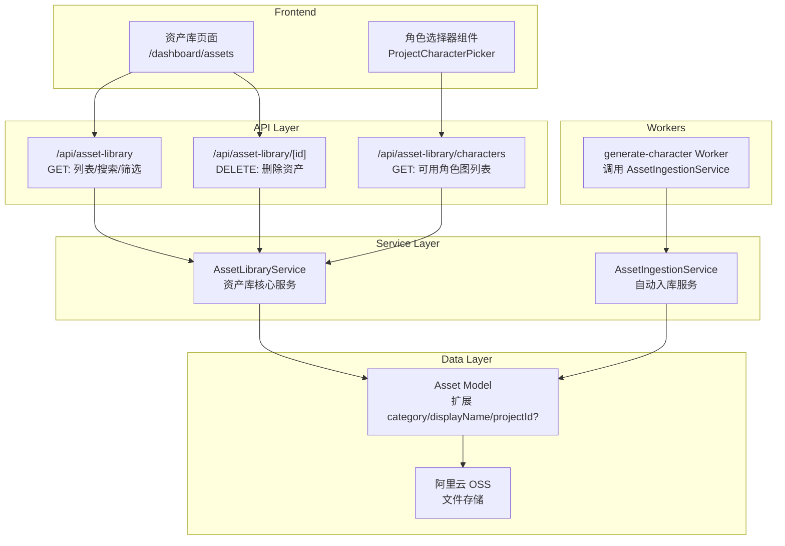

# Design Document: 用户资产库 (User Asset Library)

## Overview

用户资产库为平台提供一个用户级别的资产管理系统，将视频解析生成的人物形象图（Seedream 角色参考图）自动存入用户资产库，支持多种资产分类（角色图、素材、音频），实现跨项目复用。

**核心设计目标：**
- 在不破坏现有项目级 Asset 数据和功能的前提下，扩展 Asset 模型支持用户级跨项目管理
- 自动将 Seedream 生成的角色图入库，降低用户操作成本
- 提供高效的分类筛选、关键字搜索和分页浏览能力

**关键设计决策：**
1. **新增 `category` 字段** 而非修改 `type` 字段：现有 `type`（CHARACTER_IMAGE / UPLOADED_IMAGE / AI_GENERATED）是系统内部分类，新的 `category`（CHARACTER / MATERIAL / AUDIO）是资产库的用户级分类，两者正交互补
2. **`projectId` 改为可选**：通过 Prisma migration 将 `projectId` 从必填改为可选，现有数据保持不变（均有 projectId），新增的用户级资产可不绑定项目
3. **引用式复用**：跨项目复用角色图时共享同一 OSS URL，不复制文件

## Architecture



## Components and Interfaces

### 1. AssetLibraryService (`src/lib/asset-library-service.ts`)

资产库核心查询和管理服务。

```typescript
// 查询参数
interface AssetLibraryQuery {
  userId: string
  category?: 'CHARACTER' | 'MATERIAL' | 'AUDIO'
  keyword?: string
  page?: number       // 默认 1
  pageSize?: number   // 默认 20，最大 100
}

// 分页响应
interface PaginatedAssets {
  items: AssetLibraryItem[]
  total: number
  page: number
  pageSize: number
  totalPages: number
}

// 单条资产展示数据
interface AssetLibraryItem {
  id: string
  displayName: string
  category: 'CHARACTER' | 'MATERIAL' | 'AUDIO'
  type: string
  url: string
  thumbUrl: string | null
  projectName: string | null
  fileSize: number | null
  createdAt: string
}

// 分类统计
interface CategoryCounts {
  CHARACTER: number
  MATERIAL: number
  AUDIO: number
  total: number
}

// 核心方法
function listAssets(query: AssetLibraryQuery): Promise<PaginatedAssets>
function getCategoryCounts(userId: string): Promise<CategoryCounts>
function deleteAsset(assetId: string, userId: string): Promise<void>
function getCharacterAssets(userId: string): Promise<AssetLibraryItem[]>
```

### 2. AssetIngestionService (`src/lib/asset-ingestion-service.ts`)

负责自动将生成的角色图入库。

```typescript
interface IngestCharacterImageParams {
  userId: string
  projectId: string
  characterId: string
  characterName: string
  imageUrl: string
  thumbUrl?: string
}

// 核心方法：自动入库角色图（upsert 语义）
function ingestCharacterImage(params: IngestCharacterImageParams): Promise<Asset>
```

### 3. API Routes

| 路由 | 方法 | 说明 |
|------|------|------|
| `/api/asset-library` | GET | 资产列表（支持分类筛选、关键字搜索、分页） |
| `/api/asset-library/[id]` | DELETE | 删除资产 |
| `/api/asset-library/characters` | GET | 获取用户 CHARACTER 类型资产（供角色选择器） |
| `/api/asset-library/counts` | GET | 获取各分类资产数量 |

### 4. Frontend Components

| 组件 | 路径 | 说明 |
|------|------|------|
| `AssetLibraryPage` | `src/app/dashboard/assets/page.tsx` | 资产库主页面 |
| `AssetGrid` | `src/components/asset-library/asset-grid.tsx` | 资产网格列表 |
| `AssetFilterBar` | `src/components/asset-library/asset-filter-bar.tsx` | 分类 Tab + 搜索框 |
| `ProjectCharacterPicker` | `src/components/project/character-picker.tsx` | 项目中角色图选择器 |

### 5. Zustand Store

```typescript
// src/stores/asset-library-store.ts
interface AssetLibraryState {
  // 查询条件
  category: 'CHARACTER' | 'MATERIAL' | 'AUDIO' | null
  keyword: string
  page: number
  pageSize: number
  // Actions
  setCategory: (category: string | null) => void
  setKeyword: (keyword: string) => void
  setPage: (page: number) => void
  reset: () => void
}
```

## Data Models

### Asset Model 扩展（Prisma Schema 变更）

```prisma
model Asset {
  id           String    @id @default(cuid())
  projectId    String?   @map("project_id")        // ← 从必填改为可选
  userId       String    @map("user_id")
  type         String                               // 保持不变: CHARACTER_IMAGE | UPLOADED_IMAGE | AI_GENERATED
  category     String?   @map("category")           // 新增: CHARACTER | MATERIAL | AUDIO（资产库分类）
  displayName  String?   @map("display_name")       // 新增: 资产显示名称（用于搜索和展示）
  url          String
  thumbUrl     String?   @map("thumb_url")
  fileName     String?   @map("file_name")
  fileSize     Int?      @map("file_size")
  isCharImage  Boolean   @default(false) @map("is_char_image")
  sortOrder    Int       @default(0) @map("sort_order")
  status       String    @default("PENDING")
  rejectReason String?   @map("reject_reason")
  expiresAt    DateTime? @map("expires_at")
  createdAt    DateTime  @default(now()) @map("created_at")

  project    Project?    @relation(fields: [projectId], references: [id], onDelete: Cascade)
  shotAssets ShotAsset[]

  @@index([projectId])
  @@index([userId])                                 // 新增: 按用户查询索引
  @@index([userId, category])                       // 新增: 按用户+分类复合索引
  @@map("assets")
}
```

### 迁移策略

1. **Schema Migration**：
   - `projectId` 从 `String` 改为 `String?`（SQLite 中即去掉 NOT NULL 约束）
   - 新增 `category` 字段（可选 String，允许渐进式迁移）
   - 新增 `displayName` 字段（可选 String）
   - 新增 `@@index([userId])` 和 `@@index([userId, category])` 索引

2. **数据迁移脚本**（migration seed）：
   - 现有 `type = 'CHARACTER_IMAGE'` 的记录：设 `category = 'CHARACTER'`，`displayName` 从 `fileName` 提取
   - 现有 `type = 'UPLOADED_IMAGE'` 的记录：设 `category = 'MATERIAL'`
   - 现有 `type = 'AI_GENERATED'` 的记录：设 `category = 'MATERIAL'`

3. **向后兼容**：
   - 现有的项目级 Asset 查询（`where: { projectId }`）不受影响
   - `project` 关系改为可选（`Project?`），现有的级联删除逻辑保留
   - 现有 ShotAsset 关联不受影响

## Correctness Properties

*A property is a characteristic or behavior that should hold true across all valid executions of a system—essentially, a formal statement about what the system should do. Properties serve as the bridge between human-readable specifications and machine-verifiable correctness guarantees.*

### Property 1: 自动入库创建完整记录

*For any* valid character generation result (userId, projectId, characterName, imageUrl), calling the ingestion function SHALL produce an Asset record with: non-null userId matching the input, category = 'CHARACTER', displayName derived from characterName, url matching the input imageUrl, and status = 'UPLOADED'.

**Validates: Requirements 1.1, 1.2**

### Property 2: 再生成的 Upsert 语义

*For any* character that has an existing CHARACTER asset in the library, regenerating the character image SHALL result in exactly one CHARACTER asset for that character (not duplicates), with the URL updated to the new image URL.

**Validates: Requirements 1.3**

### Property 3: 分类枚举约束

*For any* asset in the asset library, its category field SHALL be exactly one of: 'CHARACTER', 'MATERIAL', or 'AUDIO'. Any attempt to create an asset with a category value outside this set SHALL be rejected.

**Validates: Requirements 2.1, 2.2**

### Property 4: 搜索与筛选正确性

*For any* combination of (userId, category filter, keyword), the query results SHALL satisfy: (1) all returned assets belong to the specified userId, (2) if category is specified, all returned assets have that category, (3) if keyword is non-empty, all returned assets' displayName contains the keyword case-insensitively, (4) no asset matching all criteria is excluded from results. When keyword is empty, it is equivalent to no keyword filter.

**Validates: Requirements 2.4, 5.1, 5.2, 5.3, 7.5**

### Property 5: URL 引用复用不复制

*For any* CHARACTER asset reused across N projects, all project Characters referencing it SHALL share the identical OSS URL string, and the OSS object count for that URL SHALL remain 1.

**Validates: Requirements 3.3**

### Property 6: 分页正确性

*For any* asset list of size N and page size P, the pagination SHALL satisfy: (1) totalPages = ceil(N / P), (2) each page (except possibly the last) contains exactly P items, (3) the last page contains N mod P items (or P if evenly divisible), (4) items are sorted by createdAt descending, (5) the union of all pages equals the full result set with no duplicates or omissions.

**Validates: Requirements 4.1, 4.3, 4.4**

### Property 7: 删除移除记录

*For any* existing asset owned by the requesting user, after successful deletion, the asset SHALL no longer appear in any subsequent query results, and the total asset count for that user SHALL decrease by exactly 1.

**Validates: Requirements 6.2**

### Property 8: 安全删除保留被引用文件

*For any* CHARACTER asset being deleted, if there exists at least one Character record in any project whose imageUrl equals the asset's url, THEN the OSS file at that URL SHALL NOT be deleted. If no Character references the URL, the OSS file MAY be deleted.

**Validates: Requirements 6.3**

### Property 9: 用户数据隔离

*For any* two distinct users A and B, user A's asset library queries SHALL never return assets owned by user B, and user A's delete requests for assets owned by user B SHALL always return 403 Forbidden.

**Validates: Requirements 6.4, 7.5**

### Property 10: 分类计数准确性

*For any* user with assets in the library, the category counts returned by getCategoryCounts SHALL equal the actual count of assets per category for that user in the database.

**Validates: Requirements 8.3**

## Error Handling

| 场景 | 处理策略 |
|------|----------|
| Seedream 生成失败 | 不创建 Asset 记录，Character.avatarStatus 设为 FAILED，记录错误日志，允许用户手动重试 |
| 入库时 DB 写入失败 | 事务回滚，重试 Worker 任务（BullMQ 内置重试机制） |
| 删除不存在的资产 | 返回 404 Not Found |
| 删除非本人资产 | 返回 403 Forbidden，不暴露资产是否存在 |
| 搜索关键词过长 | Zod 校验限制最大 100 字符，超长返回 400 |
| 分页参数非法 | Zod 校验：page >= 1, pageSize 1-100，非法返回 400 |
| OSS 文件删除失败 | 记录错误日志，DB 记录仍然删除（文件孤立问题通过定期清理任务兜底） |
| 并发入库同一角色图 | 使用 upsert 语义避免重复记录，幂等安全 |

## Testing Strategy

### 属性测试 (Property-Based Testing)

使用 **fast-check** 库（项目已安装 v4.8.0），对核心服务层逻辑进行属性测试。

**配置要求：**
- 每个属性测试运行最少 100 次迭代
- 每个测试标注对应的设计属性编号
- 标注格式：`// Feature: user-asset-library, Property {N}: {description}`

**测试文件：** `src/lib/__tests__/asset-library-service.property.test.ts`

**覆盖属性：**
- Property 3: 分类枚举约束
- Property 4: 搜索与筛选正确性
- Property 6: 分页正确性
- Property 7: 删除移除记录
- Property 9: 用户数据隔离
- Property 10: 分类计数准确性

### 单元测试 (Unit Tests)

**测试文件：** `src/lib/__tests__/asset-library-service.test.ts`

| 测试场景 | 对应需求 |
|----------|----------|
| 自动入库创建完整 Asset 记录 | 1.1, 1.2 |
| 再生成 upsert 更新而非新增 | 1.3 |
| 生成失败不创建记录 | 1.4 |
| 复用角色图时 URL 一致 | 3.3 |
| 删除时检查引用保留 OSS 文件 | 6.3 |
| 跨用户访问返回 403 | 6.4 |
| displayName 从 characterName/fileName 派生 | 7.3 |

### 集成测试 (Integration Tests)

**测试文件：** `src/lib/__tests__/asset-library-service.integration.test.ts`

| 测试场景 | 对应需求 |
|----------|----------|
| generate-character Worker 完成后 Asset 记录存在 | 1.1 |
| 现有项目级查询在 migration 后仍正常工作 | 7.4 |
| API 路由鉴权和参数校验端到端验证 | 全局 |
