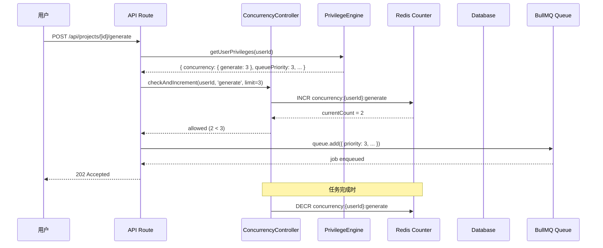
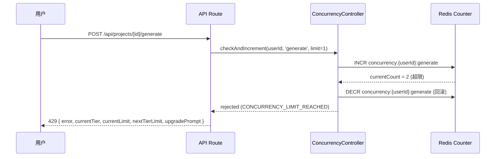

# Design Document: User Concurrency Control (基于用户等级的并发控制)

## Overview

在订阅会员体系（SubscriptionPlan → SubscriptionRecord → PrivilegeEngine）基础上，新增并发控制子系统。系统根据用户当前订阅等级（FREE / MONTHLY / YEARLY）在三种任务类型（解析 parse、生成 generate、合并 merge）上施加差异化的并发限制、队列优先级、以及生成模式（链式 vs 并行）。

核心设计原则：
- **特权引擎扩展**：并发配置作为 `UserPrivileges` 接口的新字段返回，与现有 queuePriority / allowedResolutions 等特权统一查询
- **Redis 快路径 + DB 真相源**：并发计数使用 Redis 原子计数器做入队前快速校验，数据库为最终一致性真相源，定时对账修复漂移
- **入队前门控**：任务入队前在 API 层同步校验并发额度，超限直接拒绝（HTTP 429），不允许超额入队后再回退
- **生成编排差异化**：FREE 走现有链式串行、MONTHLY 限 3 路并行、YEARLY 全量并行，且并行模式复用 `withCreditLock` 原子冻结

## Architecture

### 系统分层

```
┌──────────────────────────────────────────────────────────┐
│  API Layer (Next.js Route Handlers)                       │
│  - /api/projects/[id]/parse → 入队前并发检查              │
│  - /api/projects/[id]/generate → 入队前并发检查 + 编排    │
│  - /api/projects/[id]/export → 入队前并发检查             │
├──────────────────────────────────────────────────────────┤
│  Concurrency Control Layer                                │
│  - ConcurrencyController (入队前检查 + 计数增减)          │
│  - PriorityScheduler (BullMQ priority 字段设置)           │
│  - GenerationOrchestrator (链式/并行模式编排)             │
├──────────────────────────────────────────────────────────┤
│  Privilege Engine (扩展)                                  │
│  - getUserPrivileges → 返回含并发配置的完整特权           │
│  - getConcurrencyConfig → 纯函数: tier → limits          │
├──────────────────────────────────────────────────────────┤
│  Worker Layer (BullMQ)                                    │
│  - 现有 Workers 不变（parse/generate/merge）              │
│  - concurrency-reconcile-worker (定时对账)                │
├──────────────────────────────────────────────────────────┤
│  Data Layer                                               │
│  - Redis: concurrency:{userId}:{taskType} 原子计数器      │
│  - SQLite/Prisma: GenerationJob/Project status 真相源     │
└──────────────────────────────────────────────────────────┘
```

### 并发控制流程



### 超限拒绝流程



### 关键设计决策

| 决策点 | 方案 | 理由 |
|--------|------|------|
| 计数实现 | Redis INCR/DECR 原子操作 | O(1) 性能，天然原子，无锁竞争 |
| 真相源 | 数据库 status 字段 | Redis 崩溃/重启时可从 DB 重建 |
| 对账策略 | 每 5 分钟定时对账 | 修复 Worker 崩溃导致的计数泄漏，频率兼顾实时性与性能 |
| YEARLY generate 限制 | Infinity（无上限） | 全量并行，限制由 BullMQ Worker concurrency 自然限流 |
| 并行模式积分冻结 | 复用 withCreditLock 单次事务 | 与现有链式一键生成积分冻结一致，保证原子性 |
| 检查位置 | API Route 层（入队前） | 在消耗任何资源之前拒绝，UX 友好且避免无效入队 |

## Components and Interfaces

### 1. ConcurrencyController（并发控制器）

```typescript
// src/lib/concurrency-controller.ts

/** 任务类型定义 */
type TaskType = 'parse' | 'generate' | 'merge'

/** 并发检查结果 */
interface ConcurrencyCheckResult {
  allowed: boolean
  currentCount: number
  limit: number
}

/** 并发拒绝响应体 */
interface ConcurrencyRejectionResponse {
  error: string
  code: 'CONCURRENCY_LIMIT_REACHED'
  currentTier: 'FREE' | 'MONTHLY' | 'YEARLY'
  currentLimit: number
  nextTierLimit: number | 'unlimited'
  upgradePrompt: {
    nextTier: string
    benefit: string
  }
}

interface ConcurrencyController {
  /**
   * 原子检查并递增并发计数
   * 使用 Redis INCR → 检查是否超限 → 超限则回滚 DECR
   *
   * @returns allowed=true 时计数已递增；allowed=false 时计数已回滚
   */
  checkAndIncrement(userId: string, taskType: TaskType, limit: number): Promise<ConcurrencyCheckResult>

  /**
   * 递减并发计数（任务完成/失败/取消时调用）
   * 使用 Redis DECR，确保不低于 0
   */
  decrement(userId: string, taskType: TaskType): Promise<void>

  /**
   * 获取用户当前各类型活跃任务数（从数据库查询，真相源）
   */
  getActiveTaskCountsFromDB(userId: string): Promise<Record<TaskType, number>>

  /**
   * 对账：从数据库重建 Redis 计数器
   * 修复 Worker 崩溃/Redis 重启导致的计数漂移
   */
  reconcile(userId: string): Promise<void>

  /**
   * 批量对账：扫描所有有活跃任务的用户，逐一对账
   */
  reconcileAll(): Promise<void>

  /**
   * 构建并发超限拒绝响应
   */
  buildRejectionResponse(
    currentTier: 'FREE' | 'MONTHLY' | 'YEARLY',
    taskType: TaskType,
    currentLimit: number
  ): ConcurrencyRejectionResponse
}
```

### 2. PriorityScheduler（优先级调度器）

```typescript
// src/lib/priority-scheduler.ts

/**
 * 根据用户等级返回 BullMQ job priority 值
 * 纯函数，可用于属性测试
 *
 * BullMQ priority: 数值越小优先级越高
 * - YEARLY: 1 (最高)
 * - MONTHLY: 3
 * - FREE: 5 (最低)
 */
function getQueuePriority(tier: 'FREE' | 'MONTHLY' | 'YEARLY'): number

/**
 * 为 BullMQ job 添加 priority 的包装函数
 * 在 queue.add() 时设置 opts.priority
 */
function scheduleWithPriority(
  queue: Queue,
  jobName: string,
  data: Record<string, unknown>,
  tier: 'FREE' | 'MONTHLY' | 'YEARLY',
  additionalOpts?: Partial<JobsOptions>
): Promise<Job>
```

### 3. PrivilegeEngine 扩展（并发配置）

```typescript
// src/lib/privilege-engine.ts 扩展

/** 用户等级枚举 */
type UserTier = 'FREE' | 'MONTHLY' | 'YEARLY'

/** 并发配置 */
interface ConcurrencyConfig {
  /** 解析并发限制 */
  parse: number
  /** 生成并发限制 (Infinity 表示无限制) */
  generate: number
  /** 合并并发限制 */
  merge: number
}

/** 扩展后的 UserPrivileges */
interface UserPrivileges {
  // 现有字段
  queuePriority: number
  allowedResolutions: string[]
  watermarkEnabled: boolean
  historyRetentionDays: number
  isActiveMember: boolean
  // 新增字段
  tier: UserTier
  concurrency: ConcurrencyConfig
  generationMode: 'chain' | 'parallel'
}

/**
 * 纯函数：根据用户等级返回并发配置
 * 可用于属性测试
 */
function getConcurrencyConfig(tier: UserTier): ConcurrencyConfig

/**
 * 纯函数：根据用户等级确定生成模式
 */
function getGenerationMode(tier: UserTier): 'chain' | 'parallel'

/**
 * 纯函数：根据用户等级确定用户等级
 * 查询 SubscriptionRecord + SubscriptionPlan.type 映射
 */
function determineTier(subscriptionStatus: string | null, planType: string | null): UserTier
```

### 4. GenerationOrchestrator（生成编排器）

```typescript
// src/lib/generation-orchestrator.ts

interface OrchestrationResult {
  mode: 'chain' | 'parallel'
  enqueuedGroups: number
  totalGroups: number
  totalCost: number
  jobs: Array<{ id: string; groupIndex: number; status: string }>
}

interface GenerationOrchestrator {
  /**
   * 根据用户等级编排一键生成
   * - FREE: 链式串行（仅入队第一组，chainMode=true）
   * - MONTHLY: 并行入队 min(totalGroups, 3) 组（chainMode=false）
   * - YEARLY: 全量并行入队（chainMode=false）
   *
   * 共同逻辑：
   * 1. 并发检查（生成类型）
   * 2. 积分总额计算 + 余额校验
   * 3. withCreditLock 原子冻结全部积分
   * 4. 按模式入队
   */
  orchestrateGeneration(params: {
    userId: string
    projectId: string
    groups: ShotGroupWithShots[]
    resolution: string
    aspectRatio: string
    tier: UserTier
    concurrencyLimit: number
  }): Promise<OrchestrationResult>

  /**
   * 计算并行模式下应同时入队的组数
   * 纯函数：min(totalGroups, concurrencyLimit)
   */
  calculateParallelBatchSize(totalGroups: number, concurrencyLimit: number): number
}
```

### 5. Redis Key 设计

```typescript
// Redis key 模式

/** 用户并发计数器 key */
// concurrency:{userId}:{taskType}
// 例如: concurrency:user123:generate → 当前活跃生成任务数

/** TTL: 不设置过期（由对账保证一致性） */
// 对账会清理孤立 key

/** Lua 脚本：原子 check-and-increment */
const CHECK_AND_INCREMENT_SCRIPT = `
  local key = KEYS[1]
  local limit = tonumber(ARGV[1])
  local current = redis.call('INCR', key)
  if current > limit then
    redis.call('DECR', key)
    return {0, current - 1}  -- rejected, return original count
  end
  return {1, current}  -- allowed, return new count
`

/** Lua 脚本：安全 decrement（不低于 0） */
const SAFE_DECREMENT_SCRIPT = `
  local key = KEYS[1]
  local current = tonumber(redis.call('GET', key) or '0')
  if current > 0 then
    return redis.call('DECR', key)
  end
  return 0
`
```

## Data Models

### 无新增 Prisma 模型

本特性不需要新增数据库表。并发计数通过 Redis 计数器实现，真相源来自现有模型的 status 字段：

| 任务类型 | 数据源 | 活跃状态 |
|---------|--------|---------|
| parse | `Project` | status IN ('DOWNLOADING', 'PARSING') |
| generate | `GenerationJob` | status IN ('QUEUED', 'GENERATING', 'SUBMITTED', 'CREDIT_RESERVED') |
| merge | `Project` | exportStatus IN ('MERGING') |

### UserPrivileges 接口扩展

在 `PrivilegeEngine` 返回的 `UserPrivileges` 中新增字段：

```typescript
// 新增字段
tier: UserTier           // 'FREE' | 'MONTHLY' | 'YEARLY'
concurrency: {
  parse: number          // FREE=1, MONTHLY=2, YEARLY=5
  generate: number       // FREE=1, MONTHLY=3, YEARLY=Infinity
  merge: number          // FREE=1, MONTHLY=1, YEARLY=2
}
generationMode: 'chain' | 'parallel'  // FREE=chain, MONTHLY/YEARLY=parallel
```

### 并发配置常量

```typescript
// src/constants/concurrency.ts

export const CONCURRENCY_LIMITS: Record<UserTier, ConcurrencyConfig> = {
  FREE:    { parse: 1, generate: 1, merge: 1 },
  MONTHLY: { parse: 2, generate: 3, merge: 1 },
  YEARLY:  { parse: 5, generate: Infinity, merge: 2 },
}

export const QUEUE_PRIORITIES: Record<UserTier, number> = {
  FREE: 5,
  MONTHLY: 3,
  YEARLY: 1,
}

export const GENERATION_MODES: Record<UserTier, 'chain' | 'parallel'> = {
  FREE: 'chain',
  MONTHLY: 'parallel',
  YEARLY: 'parallel',
}
```

### 并行模式下的 GenerationJob 差异

| 字段 | Chain Mode (FREE) | Parallel Mode (MONTHLY/YEARLY) |
|------|-------------------|-------------------------------|
| chainMode | true | false |
| status (入队时) | 第一组 QUEUED，其余 CREATED | 全部 QUEUED |
| 入队行为 | 仅第一组入 BullMQ | 批量入 BullMQ |
| 续接触发 | Worker 完成后触发下一组 | 无续接，各自独立完成 |

## Correctness Properties

*A property is a characteristic or behavior that should hold true across all valid executions of a system—essentially, a formal statement about what the system should do. Properties serve as the bridge between human-readable specifications and machine-verifiable correctness guarantees.*

### Property 1: Concurrency limit configuration correctness

*For any* valid (UserTier, TaskType) pair, `getConcurrencyConfig(tier)[taskType]` SHALL return the correct limit value: FREE=(parse:1, generate:1, merge:1), MONTHLY=(parse:2, generate:3, merge:1), YEARLY=(parse:5, generate:Infinity, merge:2).

**Validates: Requirements 1.1, 1.2, 1.3**

### Property 2: Queue priority mapping correctness

*For any* valid UserTier, `getQueuePriority(tier)` SHALL return: YEARLY=1, MONTHLY=3, FREE=5. The returned value is always a positive integer in the range [1, 5].

**Validates: Requirements 2.1, 2.2, 2.3**

### Property 3: Active task counting correctness

*For any* set of user tasks with mixed statuses and a given task type, `countActiveTasks(tasks, taskType)` SHALL return the count of tasks whose status is in the active status set for that type (parse: [QUEUED, PARSING]; generate: [QUEUED, GENERATING, SUBMITTED, CREDIT_RESERVED]; merge: [MERGING]).

**Validates: Requirements 3.1, 3.2, 3.3**

### Property 4: Concurrency admission decision

*For any* (activeCount, limit) pair where both are non-negative integers: if activeCount >= limit, then the enqueue request SHALL be rejected; if activeCount < limit, then the enqueue request SHALL be allowed. This bidirectional property holds regardless of task type or user tier.

**Validates: Requirements 3.4, 3.5**

### Property 5: Generation mode and batch size determination

*For any* UserTier and positive group count N: FREE tier SHALL enqueue exactly 1 group (chain mode); MONTHLY tier SHALL enqueue exactly min(N, 3) groups (parallel mode); YEARLY tier SHALL enqueue exactly N groups (parallel mode). The sum of initial enqueue + subsequent triggered groups must equal N for all tiers.

**Validates: Requirements 4.1, 4.2, 4.3**

### Property 6: Parallel mode job flag invariant

*For any* job created under parallel mode (MONTHLY or YEARLY tier), the job data SHALL have chainMode=false. Conversely, for any job created under chain mode (FREE tier), the first enqueued job SHALL have chainMode=true.

**Validates: Requirements 4.5, 4.6**

### Property 7: Total credit cost is sum of group costs

*For any* list of shot groups with non-negative durations and a valid resolution, the totalCreditCost SHALL equal the sum of `estimateGroupCreditCost(group.duration, resolution)` for each group. This holds regardless of generation mode (chain or parallel).

**Validates: Requirements 5.1**

### Property 8: Credit insufficiency rejection

*For any* user with creditBalance < totalRequiredCost (where totalRequiredCost > 0), the generation request SHALL be rejected with error code INSUFFICIENT_CREDITS. The response SHALL include the required amount and available balance.

**Validates: Requirements 5.2**

### Property 9: Isolated refund for failed parallel groups

*For any* subset of groups that fail during parallel-mode generation, each failed group's reserved credits SHALL be refunded independently. The refund of group G SHALL NOT affect the credit reservations of other groups that are still in progress or succeeded.

**Validates: Requirements 5.4**

### Property 10: Terminal state decrements active count

*For any* task transitioning to a terminal state (SUCCEEDED, FAILED, CANCELED), the concurrency counter for the corresponding (userId, taskType) pair SHALL decrease by exactly 1 (or remain at 0 if already 0). Non-terminal state transitions SHALL NOT affect the counter.

**Validates: Requirements 6.1**

### Property 11: Reconciliation corrects Redis counter

*For any* (userId, taskType) pair where the Redis counter value differs from the database-derived active count, after reconciliation the Redis counter SHALL equal the database count. This holds regardless of whether the initial mismatch was positive (counter too high) or negative (counter too low).

**Validates: Requirements 6.3, 6.4**

### Property 12: Rejection response contains upgrade information

*For any* concurrency rejection event, the API response SHALL contain: (1) the user's current tier, (2) the current limit for the task type, (3) the next tier's limit for comparison, and (4) a structured upgrade prompt with benefit description. The next tier's limit SHALL always be strictly greater than the current tier's limit (or "unlimited").

**Validates: Requirements 7.1, 7.3**

## Error Handling

### 并发检查异常

| 场景 | 处理策略 |
|------|---------|
| Redis 不可达 | 降级到数据库直接查询计数，性能降低但保证正确性 |
| Redis 计数为负 | reconcile 时重置为 DB 真实值，同时记录告警日志 |
| 并发 INCR 后 API 崩溃（计数已+1但任务未入队） | 定时对账修复：DB 无对应活跃任务 → 递减 |
| 并行入队部分失败 | 已入队的不回滚，未入队的在后续触发时补入（类似链式续接） |

### 积分冻结异常

| 场景 | 处理策略 |
|------|---------|
| 并行冻结事务失败 | 整体拒绝，返回 500；无部分冻结（事务原子性保证） |
| 并行模式单组失败 | 仅退还该组积分（现有 refundCredits 逻辑），其他组不受影响 |
| withCreditLock 超时 | 抛错，返回 HTTP 503，建议用户稍后重试 |

### 状态一致性

| 场景 | 处理策略 |
|------|---------|
| Worker 崩溃未递减计数 | 定时对账 Worker（每 5 分钟）从 DB 重建 Redis 计数 |
| 对账期间新任务入队 | Redis INCR 原子操作，与 SET 重建不冲突（对账用 Lua 脚本原子读 DB + 写 Redis） |
| YEARLY 用户大量并行入队 | BullMQ Worker concurrency 自然限流，不会撑爆；积分为真实约束 |

### API 错误码

| 错误码 | 场景 | HTTP Status |
|--------|------|-------------|
| CONCURRENCY_LIMIT_REACHED | 用户活跃任务数达到等级上限 | 429 |
| INSUFFICIENT_CREDITS | 余额不足以覆盖全部组的积分消耗 | 402 |
| GENERATION_IN_PROGRESS | 项目已有生成任务进行中（幂等拒绝） | 409 |
| CONCURRENCY_SERVICE_UNAVAILABLE | Redis 降级且 DB 查询也失败 | 503 |

## Testing Strategy

### 属性测试 (Property-Based Testing)

使用 **fast-check** 库实现属性测试，每个属性最少运行 100 次迭代。

**测试文件**: `src/__tests__/properties/concurrency-control.property.test.ts`

每个属性测试通过注释关联设计文档属性：
```typescript
// Feature: user-concurrency-control, Property 1: Concurrency limit configuration correctness
```

属性测试覆盖范围：
- Property 1: `getConcurrencyConfig` 纯函数（tier × taskType → limit 映射）
- Property 2: `getQueuePriority` 纯函数（tier → priority 映射）
- Property 3: `countActiveTasks` 纯函数（tasks[] × taskType → count 过滤逻辑）
- Property 4: `shouldRejectEnqueue` 纯函数（activeCount × limit → boolean 决策）
- Property 5: `calculateParallelBatchSize` + `getGenerationMode` 纯函数（tier × groupCount → enqueuedCount）
- Property 6: 模式→chainMode 标志映射
- Property 7: `calculateTotalCost` 累加不变量（sum 正确性）
- Property 8: 余额不足判定（balance < cost → rejection）
- Property 9: 隔离退款不变量（其他组余额不受影响）
- Property 10: 终态转换递减属性
- Property 11: 对账后一致性
- Property 12: 拒绝响应结构完整性

### 单元测试 (Unit Tests)

**测试文件**: `src/__tests__/unit/concurrency-controller.test.ts`

重点覆盖：
- ConcurrencyController.checkAndIncrement：正常放行、超限拒绝、边界值（恰好等于限制时拒绝）
- ConcurrencyController.decrement：正常递减、计数为 0 时不变为负
- ConcurrencyController.reconcile：修复正偏差（Redis > DB）、修复负偏差（Redis < DB）
- PriorityScheduler.scheduleWithPriority：三种 tier 的 priority 正确设置
- GenerationOrchestrator：FREE 链式、MONTHLY 限并行、YEARLY 全并行
- buildRejectionResponse：各 tier 的升级提示正确生成

### 集成测试 (Integration Tests)

**测试文件**: `src/__tests__/integration/concurrency-flow.test.ts`

端到端流程：
- 并发入队 → 超限拒绝 → 任务完成 → 额度释放 → 再次入队成功
- 并行模式生成 → 部分组失败 → 仅失败组退款 → 成功组正常扣费
- Worker 崩溃模拟 → 对账修复计数 → 后续入队正常
- 订阅升级 → 特权刷新 → 新限制即时生效

### Worker 测试

**测试文件**: `src/__tests__/unit/concurrency-reconcile-worker.test.ts`

- 对账 Worker 定时扫描正确性
- 计数修复逻辑（正偏差/负偏差/零偏差）
- 异常 Redis 连接时的降级行为
