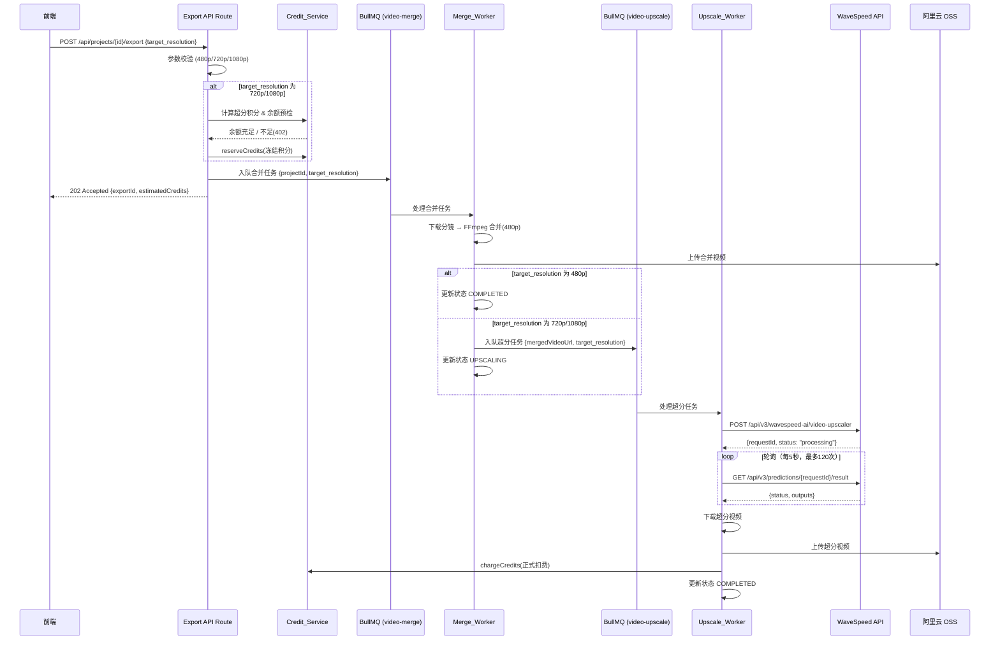
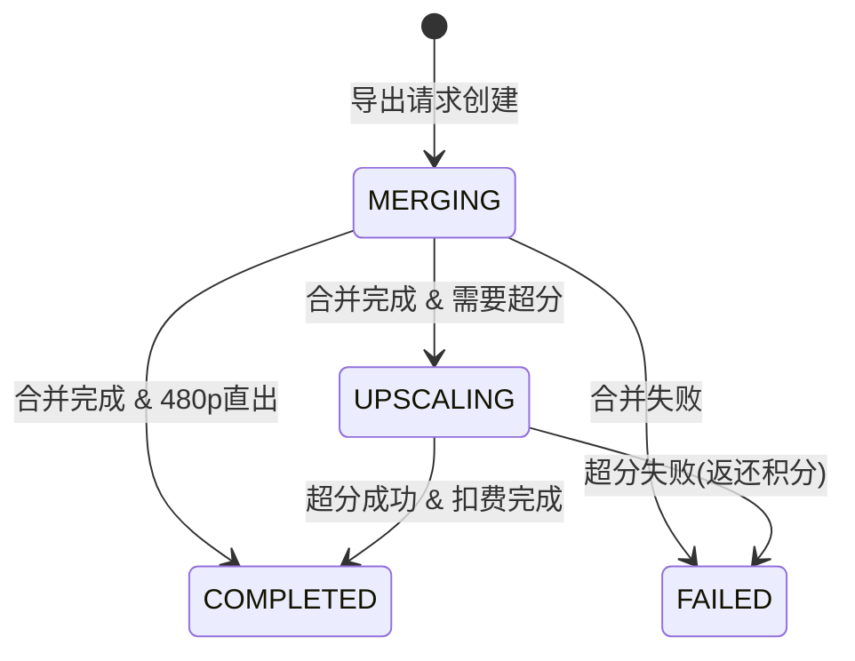

# Design Document: 视频导出超分（Video Export Upscale）

## Overview

本设计实现视频导出阶段的分辨率选择与 AI 超分功能。核心思路：

1. 视频生成阶段统一使用 480p 分辨率（降低 Seedance 生成成本）
2. 导出时用户选择目标分辨率（480p / 720p / 1080p）
3. 选择高分辨率时，合并完成后调用 WaveSpeed AI Video Upscaler API 对 480p 源视频超分
4. 采用「冻结→扣费」积分模型，确保超分失败时用户积分可退还

整体流程为：导出请求 → 积分预检/冻结 → 合并（480p） → 超分（可选） → 上传 OSS → 扣费/完成。

### 设计决策

- **WaveSpeed 标准版 Video Upscaler**：对比 Pro/Ultimate/FlashVSR 版本，标准版性价比最高（$0.025/5s @1080p），处理速度适中，画质满足产品需求。
- **异步 Worker 架构**：超分耗时长（约 5-10s 处理 1s 视频），必须异步执行。新增独立的 `video-upscale` BullMQ 队列和 `Upscale_Worker`，与 `Merge_Worker` 解耦。
- **轮询而非 Webhook**：WaveSpeed 支持 webhook，但为简化部署（无需公网回调地址）且与现有 Seedance 轮询模式一致，采用 Worker 内轮询。
- **积分公式调整**：需求明确 720p 每秒 1 积分、1080p 每秒 2 积分，与现有生成阶段的 `estimateCreditCost`（720p ×1.5）公式独立，新增专用函数 `estimateUpscaleCreditCost`。

## Architecture



### 状态流转



## Components and Interfaces

### 1. Export API Route (`/api/projects/[id]/export`)

导出入口接口，负责参数校验、积分预检/冻结、入队合并任务。

```typescript
// POST /api/projects/[id]/export
interface ExportRequestBody {
  target_resolution: '480p' | '720p' | '1080p'
}

interface ExportResponse {
  exportId: string          // 导出任务 ID
  status: 'MERGING'
  targetResolution: string
  estimatedCredits: number  // 预估消耗积分（480p 为 0）
  currentBalance: number    // 当前余额（扣除冻结后）
}
```

### 2. WaveSpeed API 客户端 (`src/lib/wavespeed.ts`)

封装 WaveSpeed AI Video Upscaler REST API 调用。

```typescript
/**
 * WaveSpeed AI Video Upscaler API 客户端
 * 
 * API 端点：
 * - 提交任务: POST https://api.wavespeed.ai/api/v3/wavespeed-ai/video-upscaler
 * - 查询结果: GET https://api.wavespeed.ai/api/v3/predictions/{requestId}/result
 */

interface WaveSpeedSubmitParams {
  video: string                               // 视频公开 URL
  target_resolution: '720p' | '1080p'         // 目标分辨率
}

interface WaveSpeedSubmitResponse {
  code: number
  message: string
  data: {
    id: string           // requestId，用于轮询结果
    status: string       // created | processing
    model: string
    outputs: string[]    // 初始为空
  }
}

interface WaveSpeedResultResponse {
  code: number
  message: string
  data: {
    id: string
    status: 'created' | 'processing' | 'completed' | 'failed'
    outputs: string[]    // completed 时包含超分视频 URL
    error: string        // failed 时的错误信息
  }
}

// 导出函数
export async function submitUpscaleTask(params: WaveSpeedSubmitParams): Promise<{ requestId: string }>
export async function getUpscaleResult(requestId: string): Promise<WaveSpeedResultResponse['data']>
```

### 3. Upscale Worker (`src/workers/upscale-video.ts`)

独立的 BullMQ Worker，处理 `video-upscale` 队列任务。

```typescript
interface VideoUpscaleJobData {
  projectId: string
  userId: string
  mergedVideoOssUrl: string     // 合并视频的 OSS 公开 URL
  targetResolution: '720p' | '1080p'
  reservedCredits: number       // 冻结的积分数
  jobId: string                 // BullMQ job ID，用于幂等性
  videoDuration: number         // 视频时长（秒）
}
```

### 4. 超分积分计算 (`src/lib/credit-service.ts` 扩展)

```typescript
/**
 * 计算超分导出积分消耗
 * 720p: ceil(duration × 1) 积分
 * 1080p: ceil(duration × 2) 积分
 * 480p: 0 积分（免费）
 */
export function estimateUpscaleCreditCost(
  duration: number, 
  targetResolution: string
): number
```

### 5. 视频超分队列 (`src/lib/queue.ts` 扩展)

```typescript
export const videoUpscaleQueue = lazyQueue('video-upscale', {
  attempts: 1,          // 不由 BullMQ 自动重试（Worker 内部实现精细重试）
  removeOnComplete: 50,
  removeOnFail: 100,
})
```

### 6. Merge Worker 改造

现有 `merge-video.ts` 需改造：
- 合并统一以 480p 输出
- 合并完成后根据 `target_resolution` 决定是否入队超分任务
- 新增 `target_resolution` 字段到 `VideoMergeJobData`

## Data Models

### 项目表 (Project) 扩展

在现有 `Project` 模型上扩展导出状态追踪字段：

```prisma
model Project {
  // ... 现有字段 ...
  
  // 导出超分相关字段
  exportStatus       String?  @map("export_status")        // MERGING | UPSCALING | COMPLETED | FAILED
  exportResolution   String?  @map("export_resolution")    // 480p | 720p | 1080p
  exportVideoUrl     String?  @map("export_video_url")     // 最终导出视频 URL
  exportError        String?  @map("export_error")         // 导出失败原因
  exportCreatedAt    DateTime? @map("export_created_at")   // 导出任务创建时间
}
```

### 积分流水表 (CreditLedger) 复用

复用现有 `CreditLedger` 模型，通过 `projectId` 关联超分积分流水：
- `action: 'RESERVE'` — 冻结超分积分
- `action: 'CHARGE'` — 超分成功后正式扣除
- `action: 'REFUND'` — 超分失败时返还

### WaveSpeed API 环境变量

```env
# WaveSpeed AI Video Upscaler API
WAVESPEED_API_KEY=your_api_key_here
WAVESPEED_API_BASE_URL=https://api.wavespeed.ai/api/v3
```


## Correctness Properties

*A property is a characteristic or behavior that should hold true across all valid executions of a system-essentially, a formal statement about what the system should do. Properties serve as the bridge between human-readable specifications and machine-verifiable correctness guarantees.*

### Property 1: 超分积分计算公式正确性

*For any* 正数视频时长 duration 和任意分辨率档位 resolution，`estimateUpscaleCreditCost(duration, resolution)` 的返回值应满足：
- 当 resolution 为 "480p" 时，返回值为 0
- 当 resolution 为 "720p" 时，返回值等于 `Math.ceil(duration × 1)`
- 当 resolution 为 "1080p" 时，返回值等于 `Math.ceil(duration × 2)`
- 返回值始终为非负整数

**Validates: Requirements 2.2, 7.1, 7.2, 7.3**

### Property 2: 非法分辨率参数拒绝

*For any* 字符串 s，若 s 不在集合 {"480p", "720p", "1080p"} 中，则导出请求参数校验应返回拒绝（400 错误），且不产生任何副作用（无队列入队、无积分变动）。

**Validates: Requirements 1.2**

### Property 3: 余额不足时拒绝导出

*For any* 用户余额 balance 和超分积分消耗 cost，当 balance < cost 且 cost > 0 时，导出预检应拒绝请求（402 错误），且不产生积分冻结流水。

**Validates: Requirements 2.3**

### Property 4: 扣费幂等性

*For any* 导出任务（由 projectId 标识），无论 `chargeCreditsTx` 被调用多少次（≥1），用户积分余额的最终变动量应恰好等于一次扣费额度，且 `CHARGE` 类型流水记录恰好一条。

**Validates: Requirements 4.4, 5.4**

### Property 5: 退款幂等性

*For any* 导出任务（由 projectId 标识），无论 `refundCredits` 被调用多少次（≥1），若之前存在对应的 `RESERVE` 冻结记录，则用户积分余额的最终变动量应恰好等于一次退款额度，且 `REFUND` 类型流水记录恰好一条。

**Validates: Requirements 4.5, 4.6**

## Error Handling

### API 层错误

| 错误场景 | HTTP 状态码 | 错误码 | 说明 |
|---------|-----------|--------|------|
| target_resolution 缺失或非法 | 400 | INVALID_RESOLUTION | 返回合法取值列表 |
| 积分余额不足 | 402 | INSUFFICIENT_CREDITS | 返回所需积分和当前余额 |
| 项目不存在或不属于当前用户 | 404 | PROJECT_NOT_FOUND | — |
| 项目未处于可导出状态 | 409 | INVALID_PROJECT_STATE | 项目必须为 EXPORTED 或包含已生成分镜 |
| 已有进行中的导出任务 | 409 | EXPORT_IN_PROGRESS | 防止重复导出 |

### Worker 层错误处理

| 错误场景 | 处理策略 | 积分处理 |
|---------|---------|---------|
| WaveSpeed API 5xx | 指数退避重试 3 次（2s, 4s, 8s） | 重试期间不动积分 |
| WaveSpeed API 429 | 等待 30s 后重试 1 次 | 重试期间不动积分 |
| WaveSpeed 返回 failed | 立即终止，标记失败 | REFUND 返还冻结积分 |
| 轮询超时（120 次/10 分钟） | 终止，标记超时失败 | REFUND 返还冻结积分 |
| 超分视频下载失败 | 重试 2 次（间隔 5s） | 全部失败后 REFUND |
| 超分视频上传 OSS 失败 | 重试 2 次（间隔 5s） | 全部失败后 REFUND |
| WAVESPEED_API_KEY 未配置 | 启动时抛错，不入队 | 冻结前校验，不冻结 |

### 关键原则

1. **绝不丢积分**：任何超分失败场景都必须返还冻结积分，无静默吞没
2. **绝不重复扣费**：通过 projectId 幂等键保证 CHARGE 恰好一次
3. **绝不静默降级**：不存在"超分失败但静默返回 480p 版本"的 fallback 行为——失败就是失败，用户看到明确的失败状态和退款
4. **快速失败优先**：API Key 未配置、余额不足等可提前判断的错误在入队前拦截

## Testing Strategy

### 属性测试（Property-Based Testing）

使用 `fast-check` 库（项目已安装），对 Correctness Properties 中定义的 5 个属性编写 PBT 测试。

- 每个属性测试至少运行 100 次迭代
- 测试标签格式：`Feature: video-export-upscale, Property {number}: {title}`
- 重点覆盖：
  - 积分计算纯函数（Property 1）：生成随机 duration（0.01~600s），验证公式
  - 参数校验（Property 2）：生成随机字符串，验证拒绝逻辑
  - 余额预检（Property 3）：生成随机 balance/cost 组合
  - 扣费/退款幂等性（Property 4, 5）：使用 mock 数据库验证多次调用

### 单元测试

- Export API Route 的请求/响应处理
- WaveSpeed 客户端的请求构造和响应解析
- 状态转移逻辑的正确性
- 超分配置常量（轮询间隔、超时次数、重试策略）

### 集成测试

- 完整导出流程（480p 直出）
- 完整导出流程（720p/1080p 含超分）
- 积分冻结 → 扣费 / 退款的完整事务链路
- Merge Worker → Upscale Worker 的队列联动
- WaveSpeed API Mock 的端到端流程

### 配置

```typescript
// vitest.config.ts 中现有配置已满足
// fast-check 已在 devDependencies 中（^4.8.0）
// 测试命令：pnpm test (vitest run)
```
