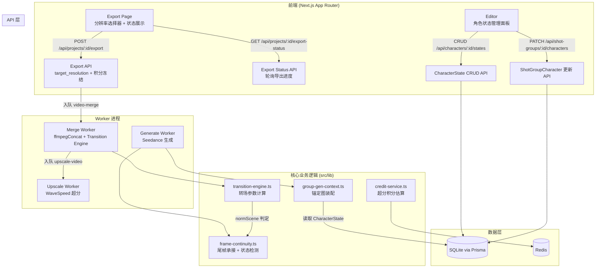
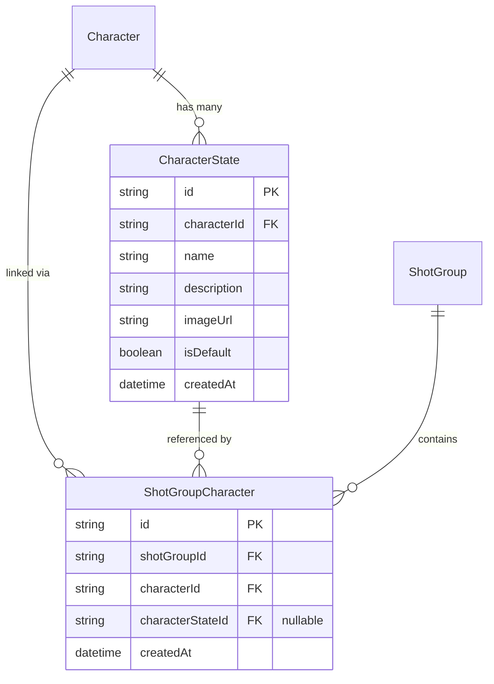

# Design Document: Video Quality Enhancements

## Overview

本设计覆盖三个互相独立但共同提升成片质量的功能模块：

1. **超分前端适配**：补全导出页面的分辨率选择器 UI，包括积分消耗预估、余额校验、超分状态展示。后端超分能力（WaveSpeed API + Upscale Worker）已完整实现，本模块仅涉及前端交互层。
2. **视频转场优化**：在 Merge Worker 的 `ffmpegConcat` 函数中引入 Transition Engine，根据相邻分镜组的场景关系自动插入 crossfade/fade-to-black 视觉过渡和 acrossfade 音频过渡。
3. **人物状态管理**：引入 CharacterState 数据模型，支持一个角色拥有多个造型状态（换装/换发型），分镜组可指定使用特定状态的锚定图，并在状态切换时跳过尾帧承接。

三个模块可独立开发与上线，互不阻塞。

## Architecture



### 模块边界

| 模块 | 涉及文件 | 职责 |
|------|----------|------|
| 超分前端 | `src/app/dashboard/project/[id]/export/`, `src/components/export/` | UI 交互、轮询 |
| 转场引擎 | `src/lib/transition-engine.ts`, `src/workers/merge-video.ts` | 转场参数计算、FFmpeg filter 生成 |
| 人物状态 | `prisma/schema.prisma`, `src/lib/group-gen-context.ts`, `src/lib/frame-continuity.ts`, `src/app/api/characters/` | 数据模型、锚定图装配、承接判断 |

## Components and Interfaces

### 1. Transition Engine (`src/lib/transition-engine.ts`)

纯函数模块，负责根据分镜组序列计算转场参数，不直接调用 FFmpeg。

```typescript
/** 转场类型 */
export type TransitionType = 'crossfade' | 'fade' | 'none'

/** 单个转场配置 */
export interface TransitionConfig {
  type: TransitionType
  duration: number          // 过渡时长（秒）
  offsetA: number           // 前一段的过渡起始偏移（从尾部倒数）
  offsetB: number           // 后一段的过渡起始偏移（从头部正数）
}

/** 分镜组转场输入 */
export interface SegmentInfo {
  groupIndex: number
  duration: number          // 该段视频时长（秒）
  scene: string | null      // 场景名（由 normScene 规范化后比较）
}

/** 转场计划：N 个段产生 N-1 个转场配置 */
export interface TransitionPlan {
  transitions: TransitionConfig[]   // 长度 = segments.length - 1
  totalDuration: number             // 合并后视频总时长
}

/**
 * 根据分镜组序列计算转场计划
 * - 同场景：crossfade，默认 0.4s
 * - 跨场景：fade-to-black，默认 0.7s
 * - 短段跳过：duration < 2 × transitionDuration 时改为 none
 * - 单段：无转场
 */
export function computeTransitionPlan(segments: SegmentInfo[]): TransitionPlan

/**
 * 根据转场计划生成 FFmpeg xfade/acrossfade filter 链
 * 返回可直接拼接到 -filter_complex 参数的 filter 字符串
 */
export function buildTransitionFilters(
  segments: SegmentInfo[],
  plan: TransitionPlan
): { videoFilter: string; audioFilter: string }
```

### 2. Export Page 组件增强

```typescript
// src/components/export/ResolutionSelector.tsx
interface ResolutionSelectorProps {
  totalDuration: number         // 视频总时长（秒）
  onSelect: (resolution: '480p' | '720p' | '1080p') => void
  selectedResolution: '480p' | '720p' | '1080p'
  creditBalance: number | null  // 用户当前余额（加载中为 null）
}

// src/components/export/ExportStatusDisplay.tsx
interface ExportStatusDisplayProps {
  status: 'MERGING' | 'UPSCALING' | 'COMPLETED' | 'FAILED'
  resolution?: string
  videoUrl?: string
  errorMessage?: string
  refundedCredits?: number
  onRetry: () => void
}
```

### 3. CharacterState API

```typescript
// POST /api/characters/:characterId/states
interface CreateCharacterStateBody {
  name: string
  description?: string
  imageUrl?: string
}

// PATCH /api/characters/:characterId/states/:stateId
interface UpdateCharacterStateBody {
  name?: string
  description?: string
  imageUrl?: string
  isDefault?: boolean
}

// DELETE /api/characters/:characterId/states/:stateId
// 返回 409 如果是唯一默认状态

// PATCH /api/shot-groups/:shotGroupId/characters/:characterId
interface UpdateShotGroupCharacterBody {
  characterStateId: string | null  // null = 使用默认
}
```

### 4. 改造 buildGroupGenReference

在 `src/lib/group-gen-context.ts` 中扩展锚定图解析逻辑：

```typescript
// 伪代码：锚定图来源决策
function resolveAnchorImage(link: ShotGroupCharacter): string | null {
  if (link.characterStateId) {
    const state = await getCharacterState(link.characterStateId)
    if (state?.imageUrl) return state.imageUrl    // 使用状态锚定图
    // 状态存在但无图 → 回退
  }
  return link.character.imageUrl                  // 默认锚定图
}
```

### 5. 改造 applySameSceneContinuation

在 `src/lib/frame-continuity.ts` 中增加状态切换检测：

```typescript
// 新增参数
interface ApplySameSceneContinuationParams {
  // ...existing
  /** 前一组的角色状态映射 Map<characterId, characterStateId | null> */
  prevCharacterStates?: Map<string, string | null>
  /** 当前组的角色状态映射 */
  currentCharacterStates?: Map<string, string | null>
}

// 在同场景判定后、应用承接前，检测状态切换
// 如果任何共享角色的 characterStateId 不同 → 跳过承接
```

## Data Models

### CharacterState 表（新增）

```prisma
model CharacterState {
  id          String   @id @default(cuid())
  characterId String   @map("character_id")
  name        String                          // 状态名称（如"职业装"、"休闲装"）
  description String?                         // 状态描述
  imageUrl    String?  @map("image_url")      // 该状态的锚定图 URL
  isDefault   Boolean  @default(false) @map("is_default")
  createdAt   DateTime @default(now()) @map("created_at")
  updatedAt   DateTime @updatedAt @map("updated_at")

  character Character @relation(fields: [characterId], references: [id], onDelete: Cascade)

  @@index([characterId])
  @@map("character_states")
}
```

### ShotGroupCharacter 表变更

```prisma
model ShotGroupCharacter {
  id               String   @id @default(cuid())
  shotGroupId      String   @map("shot_group_id")
  characterId      String   @map("character_id")
  characterStateId String?  @map("character_state_id")  // 新增：可空，指向 CharacterState
  createdAt        DateTime @default(now()) @map("created_at")

  shotGroup      ShotGroup      @relation(fields: [shotGroupId], references: [id], onDelete: Cascade)
  character      Character      @relation(fields: [characterId], references: [id], onDelete: Cascade)
  characterState CharacterState? @relation(fields: [characterStateId], references: [id], onDelete: SetNull)

  @@unique([shotGroupId, characterId])
  @@index([shotGroupId])
  @@index([characterId])
  @@map("shot_group_characters")
}
```

### Character 表变更

```prisma
model Character {
  // ...existing fields
  states CharacterState[]  // 新增反向关系
}
```

### ER 关系图



## Correctness Properties

*A property is a characteristic or behavior that should hold true across all valid executions of a system—essentially, a formal statement about what the system should do. Properties serve as the bridge between human-readable specifications and machine-verifiable correctness guarantees.*

### Property 1: 超分积分计算公式

*For any* 正数视频时长 `duration`，`estimateUpscaleCreditCost(duration, '480p')` 应始终等于 0，`estimateUpscaleCreditCost(duration, '720p')` 应等于 `Math.ceil(duration * 1)`，`estimateUpscaleCreditCost(duration, '1080p')` 应等于 `Math.ceil(duration * 2)`。

**Validates: Requirements 1.2**

### Property 2: 积分不足阻断导出

*For any* 用户余额 `balance` 和目标消耗 `cost`，当 `balance < cost` 时，导出按钮应被禁用且展示积分不足提示。

**Validates: Requirements 1.5**

### Property 3: 同场景 crossfade 时长约束

*For any* 相邻两个满足 `normScene(a.scene) === normScene(b.scene)` 且时长均 ≥ 2 × transitionDuration 的分镜组，`computeTransitionPlan` 应输出类型为 `crossfade` 且时长在 [0.3, 0.5] 秒范围内的转场配置。

**Validates: Requirements 3.1**

### Property 4: 转场重叠分配

*For any* 转场配置 `TransitionConfig`，`offsetA + offsetB` 应等于 `duration`，确保过渡时长从前后两段各取一半的重叠。

**Validates: Requirements 3.3**

### Property 5: 跨场景 fade 时长约束

*For any* 相邻两个满足 `normScene(a.scene) !== normScene(b.scene)` 且时长均 ≥ 2 × transitionDuration 的分镜组，`computeTransitionPlan` 应输出类型为 `fade` 且时长在 [0.5, 1.0] 秒范围内的转场配置。

**Validates: Requirements 4.1**

### Property 6: 跨场景时长大于同场景时长

*For any* `TransitionPlan` 中同时包含同场景和跨场景转场的配置，所有跨场景转场的 `duration` 应严格大于所有同场景转场的 `duration`。

**Validates: Requirements 4.3**

### Property 7: 音视频转场同步

*For any* 转场计划中类型不为 `none` 的转场配置，应同时生成对应的 acrossfade 音频过渡，且音频过渡时长与视觉过渡时长相等。

**Validates: Requirements 5.1, 5.2**

### Property 8: 短段跳过转场

*For any* 分镜组序列中某段视频时长 `d < 2 × transitionDuration`，该段与其相邻段之间的转场类型应为 `none`（硬拼接）。

**Validates: Requirements 6.1**

### Property 9: 合并总时长不变量

*For any* 分镜组序列和对应转场计划，`plan.totalDuration` 应等于 `sum(segments.map(s => s.duration)) - sum(plan.transitions.filter(t => t.type !== 'none').map(t => t.duration))`。

**Validates: Requirements 6.2**

### Property 10: 角色默认状态唯一性

*For any* Character，在任何状态创建/更新操作之后，该角色最多有一个 `isDefault === true` 的 CharacterState 记录。且当角色首次创建状态时，该状态的 `isDefault` 必然为 `true`。

**Validates: Requirements 7.3, 7.4**

### Property 11: 锚定图来源解析

*For any* ShotGroupCharacter 关联记录，当 `characterStateId` 非空且对应 CharacterState 的 `imageUrl` 非空时，`buildGroupGenReference` 应使用 `CharacterState.imageUrl` 作为锚定图；否则应回退使用 `Character.imageUrl`。

**Validates: Requirements 8.2, 8.3, 8.4**

### Property 12: 状态切换跳过尾帧承接

*For any* 相邻两个同场景 ShotGroup，如果任何共享角色的 `characterStateId` 在两组间不同（包括一方为空一方非空），则 `applySameSceneContinuation` 应返回 `applied: false`；如果所有共享角色的 `characterStateId` 相同，则应遵循现有场景规则正常判断。

**Validates: Requirements 9.1, 9.2**

### Property 13: 状态删除级联置空

*For any* 被删除的 CharacterState，所有引用该状态的 `ShotGroupCharacter.characterStateId` 在删除后应为 `null`。

**Validates: Requirements 10.4**

### Property 14: 默认状态删除保护

*For any* Character 的唯一且 `isDefault === true` 的 CharacterState，尝试删除该状态时系统应拒绝操作并返回错误。

**Validates: Requirements 10.5**

## Error Handling

### 超分前端适配

| 场景 | 处理策略 |
|------|----------|
| 积分余额查询失败 | Toast 提示网络错误，Resolution_Selector 保持可交互但禁用非免费档位 |
| 导出 API 返回 403（积分不足） | 刷新余额展示，禁用按钮，展示明确的积分差额提示 |
| 轮询状态接口超时 | 继续下次轮询，不中断 UI 展示；连续 3 次失败后展示"连接异常"提示 |
| 超分失败（FAILED 状态） | 展示失败原因 + 已退还积分数 + 重试按钮（重试重新冻结积分） |

### 转场引擎

| 场景 | 处理策略 |
|------|----------|
| 某段视频 ffprobe 获取时长失败 | 该段 duration 设为 0，跳过相关转场（退化为硬拼接） |
| FFmpeg xfade filter 执行失败 | 回退到无转场的 concat 合并（已有逻辑），不中断整体合并 |
| 所有段时长过短导致全部转场被跳过 | 正常硬拼接，等同于现有行为 |

### 人物状态管理

| 场景 | 处理策略 |
|------|----------|
| 创建状态时上传锚定图失败 | 创建状态记录成功（imageUrl 为空），用户可后续补传 |
| 删除被引用的状态 | Prisma onDelete: SetNull 级联置空，前端刷新受影响组的状态选择器 |
| 生成时 CharacterState 已被删除 | characterStateId 已被 SetNull，自动回退到 Character.imageUrl（向后兼容） |
| buildGroupGenReference 查询状态失败 | 回退使用 Character.imageUrl，不中断生成流程 |

## Testing Strategy

### 属性测试（Property-Based Testing）

本功能适合属性测试的原因：
- 转场引擎包含大量纯函数计算（时长计算、filter 构建、约束检查）
- 积分公式、锚定图解析、状态唯一性都是可通过 input 变化验证的通用属性
- 输入空间大（时长为连续值、段数可变、场景组合多样）

**PBT 库**: fast-check（项目已配置）
**最低迭代次数**: 100
**文件命名**: `*.property.test.ts`

每个属性测试必须标注对应设计属性：
```typescript
// Tag: Feature: video-quality-enhancements, Property 9: 合并总时长不变量
```

### 属性测试覆盖

| Property # | 测试目标 | 生成策略 |
|-----------|----------|----------|
| 1 | estimateUpscaleCreditCost | 生成随机正浮点数 duration |
| 3, 5, 6 | computeTransitionPlan 转场类型和时长 | 生成随机 SegmentInfo[] 含不同 scene 组合 |
| 4 | 重叠分配 | 生成随机 TransitionConfig |
| 7 | 音视频同步 | 复用 computeTransitionPlan 输出验证 filter 构建 |
| 8 | 短段跳过 | 生成含短时长段的序列 |
| 9 | 总时长不变量 | 生成随机段序列，验证数学等式 |
| 10 | 默认状态唯一性 | 生成随机操作序列（create/setDefault） |
| 11 | 锚定图解析 | 生成随机 CharacterState + ShotGroupCharacter 组合 |
| 12 | 状态切换承接 | 生成随机相邻组角色状态配置 |

### 单元测试

| 模块 | 覆盖内容 |
|------|----------|
| ResolutionSelector 组件 | 默认选中 480p、积分标签渲染、禁用态 |
| ExportStatusDisplay 组件 | 四种状态的 UI 渲染（MERGING/UPSCALING/COMPLETED/FAILED） |
| CharacterState CRUD API | 创建首个状态自动 isDefault、删除保护、级联置空 |
| buildTransitionFilters | 正确生成 xfade/acrossfade filter 字符串 |
| applySameSceneContinuation | 状态切换跳过承接的边界情况 |

### 集成测试

| 场景 | 验证点 |
|------|--------|
| 完整导出流程（480p） | Export API → Merge Worker → 无超分 → COMPLETED |
| 超分导出流程（1080p） | Export API → 积分冻结 → Merge → Upscale → COMPLETED |
| FFmpeg 转场合并 | 实际执行 ffmpeg 合并含转场的 2-3 段视频，验证输出文件可播放 |
| 角色状态切换后生成 | 修改 characterStateId → 重新生成 → 验证使用正确锚定图 |

### 测试不覆盖（人工验证）

- 转场视觉效果的主观质量（需人眼评审）
- 音频过渡的听感平滑度
- 超分后画质提升的视觉效果
- 编辑器 UI 交互的整体流畅度
