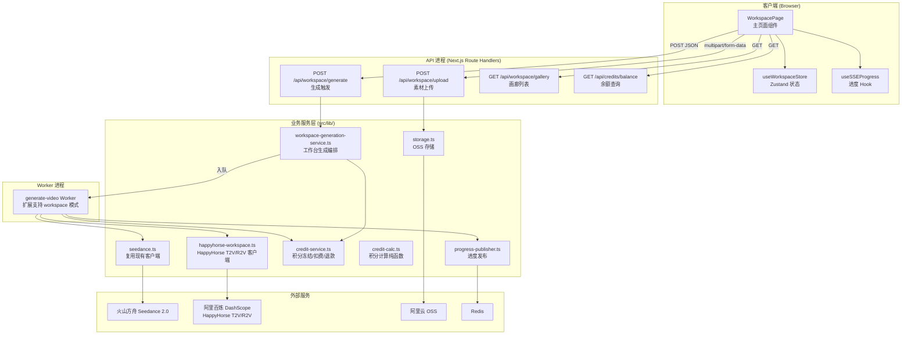

# Design Document: Workspace Generation

## Overview

工作台生成（Workspace Generation）是面向快速单次视频生成的核心功能模块，与现有「分镜工厂」（长视频逐组重绘）互补。用户在工作台页面输入 prompt、上传参考素材、选择模型（Seedance 2.0 / HappyHorse）、配置参数后一键触发视频生成。

**核心设计决策：**

1. **不走分镜组模型**：工作台生成直接创建 `GenerationJob`（`shotId=null`，`shotGroupId=null`），不涉及 ShotGroup / Shot 表
2. **自动创建 Workspace Project**：每次生成自动创建 `Project`（engine 字段区分引擎），用于归档和历史查询
3. **HappyHorse 使用 T2V/R2V 模式**：工作台模式下 HappyHorse 使用文生视频（T2V）或参考图生视频（R2V），而非现有的 V-Edit 模式
4. **Seedance 全模态输入**：工作台模式支持 text + reference_image + reference_audio 全部输入模态
5. **复用 SSE 实时进度基础设施**：通过现有 `useSSEProgress` Hook + `sse-progress-store` 推送生成进度
6. **积分写操作经 Redis 锁串行化**：与现有生成流程一致，使用 `withCreditLock` 保证并发安全

## Architecture



### 生成流程时序

```mermaid
sequenceDiagram
    participant C as 客户端
    participant API as POST /api/workspace/generate
    participant DB as Prisma/SQLite
    participant Q as BullMQ Queue
    participant W as generate-video Worker
    participant AI as AI Service (Seedance/HappyHorse)
    participant SSE as SSE → Client

    C->>API: 生成请求 {prompt, assets, model, params}
    API->>API: 认证 + 参数校验 (Zod)
    API->>DB: 查询用户余额
    API->>API: 计算预估积分
    alt 余额不足
        API-->>C: 402 INSUFFICIENT_CREDITS
    end
    API->>DB: 创建 Project (engine, aspectRatio)
    API->>DB: 创建 GenerationJob (status=CREATED)
    API->>API: reserveCredits (withCreditLock)
    API->>DB: 更新 Job status=QUEUED
    API->>Q: 入队 generate-video {jobId, mode:'workspace'}
    API-->>C: 200 {jobId, projectId}

    W->>DB: 读取 Job + Project
    W->>SSE: publishStateChange('GENERATING', 10%)
    W->>AI: 创建生成任务
    W->>SSE: publishStateChange('GENERATING', 30%)
    
    loop 轮询直到终态
        W->>AI: 查询任务状态
        W->>SSE: publishStateChange('GENERATING', progress%)
    end

    alt 生成成功
        W->>W: 下载视频 → 转存 OSS
        W->>DB: 更新 Job (SUCCEEDED, resultVideoUrl)
        W->>DB: 更新 Project (videoUrl, coverUrl, status=EDITABLE)
        W->>API: chargeCredits (withCreditLock)
        W->>SSE: publishCompleted
    else 生成失败
        W->>DB: 更新 Job (FAILED, errorMessage)
        W->>API: refundCredits (withCreditLock)
        W->>SSE: publishFailed
    end


## Components and Interfaces

### 1. WorkspacePage 前端组件

工作台页面重构为多个子组件协作：

```
WorkspacePage (Server Component 壳)
└── WorkspaceClient ('use client')
    ├── PromptInput          # 多行文本 + @ 引用
    ├── AssetUploader        # 参考素材上传管理
    ├── ModelSelector        # 模型选择卡片
    ├── ParamBar             # 参数行（比例/分辨率/时长/数量）
    ├── CreditEstimate       # 积分预估展示
    ├── GenerateButton       # 生成触发按钮
    ├── ProgressOverlay      # 生成进度浮层
    ├── InspirationStrip     # 灵感模板横向滚动
    └── ResultGallery        # 结果画廊（发现/我的作品）
```

### 2. useWorkspaceStore（Zustand 状态仓库）

```typescript
// src/stores/workspace-store.ts
interface WorkspaceState {
  /** Prompt 文本 */
  prompt: string
  /** 已上传参考素材列表 */
  assets: WorkspaceAsset[]
  /** 当前选中模型 */
  model: 'seedance' | 'happyhorse'
  /** 画面比例 */
  aspectRatio: '16:9' | '9:16' | '1:1'
  /** 生成时长（秒） */
  duration: number
  /** 分辨率（固定 720p） */
  resolution: '720p'
  /** 生成状态 */
  generateStatus: 'idle' | 'submitting' | 'generating' | 'completed' | 'failed'
  /** 当前生成任务 ID */
  currentJobId: string | null
  /** 用户积分余额 */
  creditBalance: number

  // Actions
  setPrompt: (text: string) => void
  addAsset: (asset: WorkspaceAsset) => void
  removeAsset: (id: string) => void
  setModel: (model: 'seedance' | 'happyhorse') => void
  setAspectRatio: (ratio: '16:9' | '9:16' | '1:1') => void
  setDuration: (seconds: number) => void
  setGenerateStatus: (status: WorkspaceState['generateStatus']) => void
  setCurrentJobId: (jobId: string | null) => void
  setCreditBalance: (balance: number) => void
  insertAssetReference: (cursorPos: number, assetName: string) => void
  reset: () => void
}

interface WorkspaceAsset {
  id: string              // 客户端临时 ID
  fileName: string
  fileSize: number
  type: 'image' | 'video' | 'audio'
  mimeType: string
  ossUrl: string          // 上传完成后的 OSS 公网 URL
  thumbUrl?: string       // 缩略图（图片/视频有）
  uploadProgress: number  // 0-100
  status: 'uploading' | 'uploaded' | 'failed'
}
```

### 3. POST /api/workspace/generate（生成触发 API）

```typescript
// src/app/api/workspace/generate/route.ts

/** 请求体 Schema (Zod v4 校验) */
const GenerateRequestSchema = z.object({
  prompt: z.string().min(1, 'prompt 不能为空').max(2500, '最多 2500 字符'),
  model: z.enum(['seedance', 'happyhorse']),
  aspectRatio: z.enum(['16:9', '9:16', '1:1']),
  duration: z.number().int().min(3).max(15),
  resolution: z.literal('720p'),
  /** 参考素材 OSS URL 列表（最多 12 个） */
  assetUrls: z.array(z.string().url()).max(12).default([]),
  /** 素材类型映射 { url: 'image'|'video'|'audio' } */
  assetTypes: z.record(z.string(), z.enum(['image', 'video', 'audio'])).default({}),
})

/** 响应体 */
interface GenerateResponse {
  jobId: string
  projectId: string
  estimatedCost: number
}

/** 错误响应 */
// 402: { error: 'INSUFFICIENT_CREDITS', balance: number, required: number }
// 429: { error: 'CONCURRENT_LIMIT', message: string }
// 400: { error: 'VALIDATION_ERROR', details: ZodIssue[] }
```

**处理流程：**
1. 认证校验（中间件注入 `x-user-id`）
2. Zod 参数校验
3. 时长范围校验（Seedance: 4-15s, HappyHorse: 3-15s）
4. 余额预检（`getBalance` → 比较 `estimatedCost`）
5. 创建 Project（`status='GENERATING'`, `engine=model`）
6. 创建 GenerationJob（`shotId=null`, `shotGroupId=null`, `engine=model`）
7. 冻结积分（`reserveCredits` via `withCreditLock`）
8. 入队 BullMQ（`generate-video` 队列，payload 含 `mode: 'workspace'`）
9. 返回 `{ jobId, projectId, estimatedCost }`

### 4. POST /api/workspace/upload（素材上传 API）

```typescript
// src/app/api/workspace/upload/route.ts
// 扩展现有 /api/upload-image 路由，支持视频和音频

/** 文件限制常量 */
const FILE_LIMITS = {
  image: { maxSize: 10 * 1024 * 1024, types: ['image/jpeg', 'image/png', 'image/webp'] },
  video: { maxSize: 100 * 1024 * 1024, types: ['video/mp4', 'video/quicktime', 'video/webm'] },
  audio: { maxSize: 20 * 1024 * 1024, types: ['audio/mpeg', 'audio/wav', 'audio/aac'] },
}

/** 响应体 */
interface UploadResponse {
  url: string       // OSS 公网 URL
  thumbUrl?: string // 缩略图 URL（图片/视频）
  type: 'image' | 'video' | 'audio'
  fileSize: number
}
```

### 5. GET /api/workspace/gallery（画廊列表 API）

```typescript
// src/app/api/workspace/gallery/route.ts

/** 查询参数 */
interface GalleryQuery {
  tab: 'discover' | 'my'  // 发现 / 我的作品
  page?: number            // 从 1 开始，默认 1
  pageSize?: number        // 默认 12
}

/** 响应体 */
interface GalleryResponse {
  items: GalleryItem[]
  total: number
  hasMore: boolean
}

interface GalleryItem {
  id: string              // GenerationJob ID
  projectId: string
  videoUrl: string        // 鉴权代理路径
  coverUrl?: string       // 封面缩略图
  prompt: string          // prompt 快照
  model: 'seedance' | 'happyhorse'
  duration: number
  aspectRatio: string
  createdAt: string       // ISO 8601
}
```

### 6. happyhorse-workspace.ts（HappyHorse T2V/R2V 客户端）

```typescript
// src/lib/happyhorse-workspace.ts
/**
 * HappyHorse 工作台模式客户端
 * T2V (文生视频): 纯文本 prompt → 视频
 * R2V (参考生视频): 参考图 + prompt → 视频（使用 [Image N] 语法）
 */

const HAPPYHORSE_T2V_MODEL = 'happyhorse-1.0-t2v'
const HAPPYHORSE_R2V_MODEL = 'happyhorse-1.0-r2v'

export interface HappyHorseWorkspaceParams {
  prompt: string
  duration: number           // 3-15 秒
  aspectRatio: string        // '16:9' | '9:16' | '1:1'
  resolution: '720P'
  referenceImages?: string[] // R2V 模式参考图 URL (1-9 张)
}

/** 构建 T2V 请求体（纯函数，可测） */
export function buildT2VRequestBody(params: HappyHorseWorkspaceParams): object

/** 构建 R2V 请求体（纯函数，可测） */
export function buildR2VRequestBody(params: HappyHorseWorkspaceParams): object

/** 创建工作台 HappyHorse 任务（自动判断 T2V 或 R2V） */
export async function createHappyHorseWorkspaceTask(
  params: HappyHorseWorkspaceParams
): Promise<{ taskId: string }>

/** 查询任务状态（复用现有 getHappyHorseTaskStatus） */
export { getHappyHorseTaskStatus } from './happyhorse'
```

**模式判断逻辑：**
- 无参考图 → T2V 模式（`happyhorse-1.0-t2v`）
- 有参考图 → R2V 模式（`happyhorse-1.0-r2v`），prompt 中使用 `[Image N]` 引用

### 7. workspace-generation-service.ts（生成编排服务）

```typescript
// src/lib/workspace-generation-service.ts
/**
 * 工作台生成编排服务
 * 负责创建 Project + Job、冻结积分、入队任务
 */

export interface WorkspaceGenerateInput {
  userId: string
  prompt: string
  model: 'seedance' | 'happyhorse'
  aspectRatio: string
  duration: number
  resolution: string
  assetUrls: string[]
  assetTypes: Record<string, 'image' | 'video' | 'audio'>
}

export interface WorkspaceGenerateResult {
  jobId: string
  projectId: string
  estimatedCost: number
}

/**
 * 执行工作台生成编排：
 * 1. 计算积分预估
 * 2. 创建 Project (type=workspace)
 * 3. 创建 GenerationJob
 * 4. 冻结积分
 * 5. 入队 BullMQ
 */
export async function executeWorkspaceGeneration(
  input: WorkspaceGenerateInput
): Promise<WorkspaceGenerateResult>
```

### 8. generate-video Worker 扩展

现有 `generate-video.ts` Worker 扩展支持 `mode: 'workspace'` 的任务：

```typescript
// Worker payload 扩展
interface GenerateVideoPayload {
  // 现有字段...
  mode?: 'workspace'  // 新增：工作台模式标记
  workspaceData?: {
    assetUrls: string[]
    assetTypes: Record<string, 'image' | 'video' | 'audio'>
  }
}
```

**工作台模式 Worker 处理逻辑：**
1. 读取 GenerationJob + Project
2. 发布进度事件 (`publishStateChange`)
3. 根据 engine 字段分发：
   - `seedance` → 调用 `createSeedanceTask`（text + reference_image + reference_audio）
   - `happyhorse` → 调用 `createHappyHorseWorkspaceTask`（T2V 或 R2V）
4. 轮询任务状态，持续发布进度
5. 成功：下载视频 → 转存 OSS → 更新 DB → 正式扣费 → 发布 completed
6. 失败：更新 DB → 退款 → 发布 failed

## Data Models

### Workspace 相关数据流转

工作台模式不新增数据库模型，复用现有 Project + GenerationJob + Asset + CreditLedger：

| 模型 | 工作台用法 | 关键字段 |
|------|-----------|---------|
| **Project** | 每次生成自动创建 | `engine='seedance'\|'happyhorse'`, `status='GENERATING'→'EDITABLE'`, `aspectRatio`, `duration` |
| **GenerationJob** | 关联到 Project，无 Shot/ShotGroup | `shotId=null`, `shotGroupId=null`, `engine`, `promptSnapshot`, `resultVideoUrl` |
| **Asset** | 参考素材（可选绑定 Project） | `category='MATERIAL'`, `type='UPLOADED_IMAGE'`, `userId` |
| **CreditLedger** | 积分流水 | `jobId`, `action='RESERVE'\|'CHARGE'\|'REFUND'` |

### 请求体构建（纯函数数据模型）

#### Seedance 工作台请求体

```typescript
interface SeedanceWorkspaceRequest {
  model: 'doubao-seedance-2-0-260128'
  content: Array<
    | { type: 'text'; text: string }
    | { type: 'image_url'; image_url: { url: string }; role: 'reference_image' }
    | { type: 'audio_url'; audio_url: { url: string }; role: 'reference_audio' }
  >
  resolution: '720p'
  ratio: '16:9' | '9:16' | '1:1'
  duration: number  // 4-15
  generate_audio: true
  watermark: false
}
```

#### HappyHorse T2V 请求体

```typescript
interface HappyHorseT2VRequest {
  model: 'happyhorse-1.0-t2v'
  input: {
    prompt: string
  }
  parameters: {
    resolution: '720P'
    ratio: '16:9' | '9:16' | '1:1'
    duration: number  // 3-15
    watermark: false
  }
}
```

#### HappyHorse R2V 请求体

```typescript
interface HappyHorseR2VRequest {
  model: 'happyhorse-1.0-r2v'
  input: {
    prompt: string  // 含 [Image N] 引用
    media: Array<{ type: 'reference_image'; url: string }>  // 1-9 张
  }
  parameters: {
    resolution: '720P'
    ratio: '16:9' | '9:16' | '1:1'
    duration: number  // 3-15
    watermark: false
  }
}
```

### 积分计算模型

| 模型 | 公式（720P） | 示例(5s) | 示例(10s) | 示例(15s) |
|------|-------------|----------|-----------|-----------|
| Seedance 2.0 | `ceil(duration × 1.5)` | 8 | 15 | 23 |
| HappyHorse T2V/R2V | `ceil((duration + min(duration, 15)) × 1.5)` | 15 | 30 | 45 |

**设计决策**：HappyHorse 在工作台模式下虽然是 T2V/R2V（只收输出费用），但平台侧积分预估仍沿用统一公式以覆盖成本 + 利润空间。实际扣费在生成完成后按 API 返回的 usage 数据结算。

### 画廊查询 SQL 逻辑

```sql
-- 「我的作品」Tab：查询当前用户的工作台生成结果
SELECT gj.*, p.coverUrl, p.aspectRatio
FROM generation_jobs gj
JOIN projects p ON gj.project_id = p.id
WHERE gj.user_id = :userId
  AND gj.shot_id IS NULL          -- 排除分镜工厂的任务
  AND gj.shot_group_id IS NULL    -- 排除分镜工厂的任务
  AND gj.status = 'SUCCEEDED'
ORDER BY gj.created_at DESC
LIMIT :pageSize OFFSET :offset

-- 「发现」Tab：查询公开优质作品（后续可加 is_featured 标记）
SELECT gj.*, p.coverUrl, p.aspectRatio
FROM generation_jobs gj
JOIN projects p ON gj.project_id = p.id
WHERE gj.status = 'SUCCEEDED'
  AND gj.shot_id IS NULL
  AND gj.shot_group_id IS NULL
ORDER BY gj.created_at DESC
LIMIT :pageSize OFFSET :offset
```


## Correctness Properties

*A property is a characteristic or behavior that should hold true across all valid executions of a system—essentially, a formal statement about what the system should do. Properties serve as the bridge between human-readable specifications and machine-verifiable correctness guarantees.*

### Property 1: Prompt 长度校验

*For any* 字符串 s，当 `s.length <= 2500` 时 `validatePromptLength(s)` 返回 true；当 `s.length > 2500` 时返回 false。校验函数的判定边界精确位于 2500 字符。

**Validates: Requirements 1.1**

### Property 2: 素材引用插入正确性

*For any* 原始文本 text、合法光标位置 cursorPos（0 ≤ cursorPos ≤ text.length）和非空素材名称 assetName，调用 `insertAssetReference(text, cursorPos, assetName)` 后的结果字符串应满足：
- 结果长度 = 原始长度 + `@${assetName}` 的长度
- 结果在 cursorPos 位置包含 `@${assetName}` 子串
- 结果的前缀（0..cursorPos）等于原始文本的前缀
- 结果的后缀等于原始文本从 cursorPos 开始的后缀

**Validates: Requirements 1.3**

### Property 3: 文件校验（类型 + 大小）

*For any* MIME type 字符串和文件大小值，`validateFile(mimeType, fileSize)` 函数应满足：
- 当 mimeType 在允许列表中且 fileSize ≤ 对应类型上限时返回 `{ valid: true }`
- 当 mimeType 不在允许列表中时返回 `{ valid: false, reason: string }`（reason 包含实际 mimeType）
- 当 fileSize 超出上限时返回 `{ valid: false, reason: string }`（reason 包含文件名和大小限制）

**Validates: Requirements 2.1, 2.4, 2.5**

### Property 4: 素材列表上限不变式

*For any* 操作序列（添加/删除素材），素材列表的长度应始终满足 `0 ≤ length ≤ 12`。当列表长度已为 12 时，添加操作应被拒绝（返回 false），列表不变。

**Validates: Requirements 2.2, 2.7, 2.8**

### Property 5: 积分预估计算正确性

*For any* 有效参数组合 (model, duration, resolution='720p')：
- 当 model='seedance' 且 duration ∈ [4,15] 时，`estimateWorkspaceCost(model, duration)` === `Math.ceil(duration * 1.5)`
- 当 model='happyhorse' 且 duration ∈ [3,15] 时，`estimateWorkspaceCost(model, duration)` === `Math.ceil((duration + Math.min(duration, 15)) * 1.5)`
- 返回值始终为正整数

**Validates: Requirements 5.1, 5.2, 5.3**

### Property 6: 生成请求体构建完整性

*For any* 有效的工作台生成参数组合 (prompt, model, aspectRatio, duration, assetUrls, assetTypes)：
- 当 model='seedance' 时，`buildSeedanceWorkspaceRequest(params)` 输出的 content 数组应包含 prompt 文本项，图片类素材对应 `image_url` 项（role=reference_image），音频类素材对应 `audio_url` 项（role=reference_audio）
- 当 model='happyhorse' 且无参考图时，`buildHappyHorseWorkspaceRequest(params)` 应使用 T2V 模型 ID
- 当 model='happyhorse' 且有参考图时，应使用 R2V 模型 ID 且 media 数组包含所有参考图

**Validates: Requirements 6.1, 6.2, 6.3**

### Property 7: 画廊排序不变式

*For any* 画廊查询返回的作品列表 items（长度 > 1），对于所有相邻项 items[i] 和 items[i+1]，应满足 `items[i].createdAt >= items[i+1].createdAt`（时间倒序）。

**Validates: Requirements 8.6, 9.1**

### Property 8: 模型-时长参数联动

*For any* 模型类型 model，`getDurationOptions(model)` 返回的时长数组应满足：
- 当 model='seedance' 时，返回 [4, 5, 8, 10, 15]
- 当 model='happyhorse' 时，返回 [3, 5, 8, 10, 15]
- 返回数组中所有元素应为正整数且严格递增

**Validates: Requirements 3.3, 3.4, 4.3, 4.4, 4.5**


## Error Handling

### API 层错误

| HTTP 状态码 | 错误码 | 场景 | 处理方式 |
|------------|--------|------|---------|
| 400 | VALIDATION_ERROR | 参数校验失败（Zod） | 返回 ZodIssue 详情 |
| 400 | INVALID_DURATION | 时长超出模型允许范围 | 返回具体允许范围 |
| 400 | PROMPT_EMPTY | Prompt 为空 | 前端已禁用，兜底拦截 |
| 401 | UNAUTHORIZED | 未认证/Token 过期 | 引导重新登录 |
| 402 | INSUFFICIENT_CREDITS | 余额不足 | 返回 balance + required，前端引导充值 |
| 429 | CONCURRENT_LIMIT | 并发生成超限 | 返回排队提示 |
| 500 | INTERNAL_ERROR | 服务端异常 | 记录日志，返回通用错误 |

### Worker 层错误

| 场景 | 处理策略 | 积分处理 |
|------|---------|---------|
| AI API 创建任务失败 | 标记 Job FAILED，BullMQ 可重试 | 退款 `refundCredits` |
| AI API 轮询超时（10min） | 标记 Job FAILED + errorCode=TIMEOUT | 退款 |
| AI 返回生成失败 | 标记 Job FAILED + 记录 errorMessage | 退款 |
| 视频下载转存 OSS 失败 | 标记 Job FAILED，可重试 | 退款 |
| Redis 发布进度失败 | 仅记录 warn，不影响主流程 | 无影响（best-effort） |

### 前端错误处理

| 场景 | 处理方式 |
|------|---------|
| 文件上传失败 | Toast 提示具体错误，素材标记为 failed 可重传 |
| 生成请求 402 | Toast + 弹出充值引导弹窗 |
| 生成请求 429 | Toast 提示排队中，建议稍后重试 |
| 生成请求 5xx | Toast 展示错误详情 + 重试按钮 |
| SSE 连接断开 | 自动重连（EventSource 内建），10s 未恢复则恢复高频轮询 |
| 画廊加载失败 | 展示重试按钮，不阻塞其他功能 |

### 积分安全保证

```
RESERVE → (成功) → CHARGE    // 正常流程
RESERVE → (失败) → REFUND    // 失败退款
```

- **不允许欠费**：API 入口预检余额，Worker 内 `reserveCredits` 二次校验
- **不重复扣费**：`chargeCredits` 幂等（按 jobId 查找已有 CHARGE 记录则跳过）
- **不重复退款**：`refundCredits` 幂等（按 jobId 查找已有 REFUND 记录则跳过）
- **跨进程安全**：所有积分写操作经 `withCreditLock` Redis 全局锁串行化

## Testing Strategy

### Property-Based Testing (PBT)

使用 `fast-check` 库，每个 property 测试运行 **≥100 次迭代**。

**PBT 测试文件**：`src/__tests__/workspace-generation.property.test.ts`

**覆盖的属性：**

| Property | 测试目标 | Generator 策略 |
|----------|---------|---------------|
| Property 1 | `validatePromptLength` | `fc.string({ maxLength: 5000 })` |
| Property 2 | `insertAssetReference` | `fc.string()` × `fc.nat()` × `fc.string({ minLength: 1 })` |
| Property 3 | `validateFile` | `fc.string()` (MIME) × `fc.nat()` (size) |
| Property 4 | 素材列表操作 | `fc.array(fc.oneof(fc.constant('add'), fc.constant('remove')))` |
| Property 5 | `estimateWorkspaceCost` | `fc.oneof(fc.constant('seedance'), fc.constant('happyhorse'))` × `fc.integer({min:3,max:15})` |
| Property 6 | `buildSeedanceWorkspaceRequest` / `buildHappyHorseWorkspaceRequest` | 随机参数组合 |
| Property 7 | 画廊排序 | `fc.array(fc.date())` |
| Property 8 | `getDurationOptions` | `fc.oneof(fc.constant('seedance'), fc.constant('happyhorse'))` |

**PBT 测试标签格式：**
```typescript
// Feature: workspace-generation, Property 5: 积分预估计算正确性
```

### Unit Tests（示例和边界测试）

**文件**：`src/__tests__/workspace-generation.test.ts`

覆盖场景：
- 默认模型为 Seedance 2.0（Requirements 3.1）
- 默认比例为 16:9（Requirements 4.1）
- 默认时长为 5s（Requirements 4.4, 4.5）
- 固定分辨率 720P（Requirements 4.2）
- 固定数量 1 个（Requirements 4.6）
- 空 prompt 禁用生成按钮（Requirements 6.9）
- 402 响应映射到充值引导（Requirements 6.6）
- 429 响应映射到排队提示（Requirements 6.7）
- 灵感模板 ≥ 6 个（Requirements 10.3）
- 无历史作品时展示空状态（Requirements 9.4）
- HappyHorse 有参考图时使用 R2V 模型（Requirements 6.3）
- HappyHorse 无参考图时使用 T2V 模型（Requirements 6.3）
- 素材上传第 13 个被拒绝（Requirements 2.8）
- 文件类型不支持时错误消息含文件名（Requirements 2.5）

### Integration Tests

- 完整生成流程：API → Queue → Worker → SSE → 结果入库
- 积分流水完整性：RESERVE → CHARGE（成功）或 REFUND（失败）
- 画廊分页加载正确性
- SSE 进度事件接收与 store 更新
- HappyHorse T2V/R2V 真实 API 调用（需 DASHSCOPE_API_KEY）
- Seedance 真实 API 调用（需 SEEDANCE_API_KEY）
