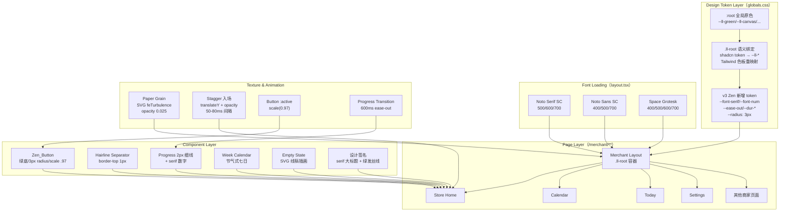

# Design Document: zen-editorial-ui-overhaul

## Overview

商家端（`/merchant/**`）全方位 UI 改造，基于已确认的 v3「东方禅意编辑式」原型（原研哉×Apple 留白克制方向），从七个维度重塑视觉体验：

1. **字体体系** — Noto Serif SC（标题）+ Noto Sans SC（正文）+ Space Grotesk（数字）
2. **图标体系** — lucide-react strokeWidth 1.5，移除功能性 emoji
3. **插画体系** — unDraw/DrawKit SVG 单色线稿（#00754A），空态/引导场景
4. **背景纹理** — 暖奶油 #F4F2ED + SVG feTurbulence 噪点 opacity 0.025
5. **动效体系** — 纯 CSS（--ease-out/--ease-spring），stagger 入场 + button scale + progress transition
6. **组件风格** — 去卡片化（hairline separator）+ Zen_Button + 3px radius
7. **色彩统一** — 消灭 orange/amber 硬编码，统一 --ll-* 语义变量

设计方向锚定参考：`design-demos/home-v3-zen-full.html`

### 核心约束

- 所有改造限定在 `.ll-root` 作用域内，不污染 `/dashboard` 的 `--cine-*` 暗色体系
- 不引入任何 JavaScript 动画库（禁止 framer-motion/motion）
- 对比度达 WCAG AA 标准（正文 ≥4.5:1，大字 ≥3:1）
- 渐进式迁移，旧样式标记 warning 但不阻断部署

---

## Architecture

### 系统架构图



### 层次结构

```
globals.css（Token 层）
├── :root — 全局原色定义（--ll-green/--ll-canvas/...不变）
├── .ll-root — v3 Zen token 覆盖
│   ├── shadcn 变量重映射（--primary → #00754A, --radius → 3px）
│   ├── Tailwind 色板重映射（orange→green, amber→gold）
│   ├── 字体变量（--font-serif/--font-sans/--font-num）
│   ├── 动效变量（--ease-out/--ease-spring/--dur-*）
│   └── 纹理伪元素（::after noise grain）
└── [data-surface="studio"] — 视频重塑端（不受影响）

layout.tsx（字体加载 + 容器）
├── next/font/google 加载三字体
├── .ll-root 容器包裹
├── Header（serif 门店名）
└── Bottom Nav（lucide strokeWidth 1.5）

Page Components
├── Store Home — 主改造页面
│   ├── Hero 今日任务（签名细节）
│   ├── Progress（2px 细线 + Space Grotesk）
│   ├── Week Calendar（节气式七日）
│   ├── Empty State（SVG 插画）
│   └── Content Sections（hairline 分隔）
└── 其他页面 — 统一风格继承
```

---

## Components and Interfaces

### 1. Design Token 扩展（globals.css）

在现有 `.ll-root` 块内新增 v3 Zen 专属 token：

```css
.ll-root {
  /* ── 字体 ── */
  --font-serif: var(--font-noto-serif-sc), 'Noto Serif SC', serif;
  --font-sans: var(--font-noto-sans-sc), 'Noto Sans SC', -apple-system, sans-serif;
  --font-num: var(--font-space-grotesk), 'Space Grotesk', sans-serif;

  /* ── 字阶 ── */
  --text-hero: 29px;          /* 大标题 serif */
  --text-title: 17px;         /* 页面/章节标题 serif */
  --text-body: 14px;          /* 正文 sans */
  --text-aux: 11px;           /* 辅助文字 sans */

  /* ── 动效曲线 ── */
  --ease-out: cubic-bezier(.16, 1, .3, 1);
  --ease-spring: cubic-bezier(.23, 1.4, .32, 1);
  --dur-fast: 150ms;
  --dur-base: 300ms;
  --dur-slow: 600ms;

  /* ── 画布升级 ── */
  --ll-canvas: #F4F2ED;        /* 从 #F2F0EB 升级 */
  --ll-green-deep: #0E3A2A;   /* 按下态深绿 */

  /* ── 圆角降级 ── */
  --radius: 0.1875rem;         /* 3px（从 14px 降至极克制） */
}
```

### 2. 字体加载（layout.tsx）

```typescript
import { Noto_Serif_SC, Noto_Sans_SC } from 'next/font/google'
import localFont from 'next/font/local'
// 或 import { Space_Grotesk } from 'next/font/google'

const notoSerif = Noto_Serif_SC({
  subsets: ['latin'],
  weight: ['500', '600', '700'],
  variable: '--font-noto-serif-sc',
  display: 'swap',
})

const notoSans = Noto_Sans_SC({
  subsets: ['latin'],
  weight: ['400', '500', '700'],
  variable: '--font-noto-sans-sc',
  display: 'swap',
})

const spaceGrotesk = Space_Grotesk({
  subsets: ['latin'],
  weight: ['400', '500', '600', '700'],
  variable: '--font-space-grotesk',
  display: 'swap',
})
```

### 3. 纸质噪点纹理（伪元素）

```css
.ll-root::after {
  content: "";
  position: fixed;
  inset: 0;
  pointer-events: none;
  z-index: 50;
  opacity: 0.025;
  background-image: url("data:image/svg+xml,%3Csvg xmlns='http://www.w3.org/2000/svg'%3E%3Cfilter id='n'%3E%3CfeTurbulence type='fractalNoise' baseFrequency='0.75' numOctaves='4' stitchTiles='stitch'/%3E%3C/filter%3E%3Crect width='100%25' height='100%25' filter='url(%23n)'/%3E%3C/svg%3E");
}
```

### 4. Zen_Button 组件规范

```typescript
interface ZenButtonProps {
  variant: 'primary' | 'ghost'
  children: React.ReactNode
  onClick?: () => void
  disabled?: boolean
  fullWidth?: boolean
  className?: string
}
```

**Primary 样式**:
- `background: var(--ll-green)` (#00754A)
- `color: #FFFFFF`
- `border-radius: 3px`
- `padding: 16px`
- `font-size: 15px; font-weight: 500; letter-spacing: .04em`
- `:active → background: var(--ll-green-deep) + transform: scale(0.97)`
- `transition: background 150ms, transform 80ms`

**Ghost 样式**:
- `background: transparent`
- `color: var(--ll-text-2)`
- `border-bottom: 1px solid var(--ll-hair)`
- `:active → color: var(--ll-green)`

### 5. Stagger 入场动效

```css
/* 通用入场动画类 */
.zen-reveal {
  opacity: 0;
  transform: translateY(14px);
  animation: zen-revealIn var(--dur-slow) var(--ease-out) forwards;
}

@keyframes zen-revealIn {
  to { opacity: 1; transform: translateY(0); }
}

/* 子元素延迟（50ms 间隔，7 档足够覆盖一屏内容） */
.zen-reveal:nth-child(1) { animation-delay: 0ms; }
.zen-reveal:nth-child(2) { animation-delay: 60ms; }
.zen-reveal:nth-child(3) { animation-delay: 120ms; }
.zen-reveal:nth-child(4) { animation-delay: 180ms; }
.zen-reveal:nth-child(5) { animation-delay: 240ms; }
.zen-reveal:nth-child(6) { animation-delay: 300ms; }
.zen-reveal:nth-child(7) { animation-delay: 360ms; }
```

### 6. Hairline Separator 模式

替代 shadcn Card 的包裹方式：

```tsx
// Before（现有）
<Card className="border-amber-200 bg-gradient-to-br ...">
  <CardHeader>...</CardHeader>
  <CardContent>...</CardContent>
</Card>

// After（v3 Zen）
<section className="py-6 border-t border-[var(--ll-hair)]">
  <h3 className="font-[var(--font-serif)] text-[17px] font-semibold">...</h3>
  <div className="mt-4">...</div>
</section>
```

### 7. 进度条改造

```tsx
// 2px 细线进度条
<div className="flex items-center gap-4">
  <span className="font-[var(--font-num)] text-2xl font-semibold text-[var(--ll-green)] tabular-nums">
    {captured}<small className="text-sm text-[var(--ll-text-3)] font-normal ml-0.5">/{total}</small>
  </span>
  <div className="flex-1 h-[2px] bg-[var(--ll-hair)] rounded-[1px] relative">
    <div
      className="absolute inset-y-0 left-0 bg-[var(--ll-green)] rounded-[1px] transition-[width]"
      style={{ width: `${percent}%`, transitionDuration: '600ms', transitionTimingFunction: 'var(--ease-out)' }}
    />
  </div>
</div>
```

### 8. 周计划节气式七日

```tsx
// 节气式布局：竖向排列（星期标签 → 状态圆点 → 目标文字）
<div className="flex justify-between py-1">
  {days.map((day, i) => (
    <div key={i} className="flex flex-col items-center gap-2 flex-1">
      <span className="text-[10px] text-[var(--ll-text-3)]">{day.label}</span>
      {/* 状态圆点 */}
      {day.isCompleted && (
        <span className="w-[7px] h-[7px] rounded-full bg-[var(--ll-green)]" />
      )}
      {day.isToday && (
        <span className="w-[10px] h-[10px] rounded-full border-[1.5px] border-[var(--ll-green)] animate-pulse" />
      )}
      {day.isFuture && (
        <span className="w-[7px] h-[7px] rounded-full border border-[var(--ll-text-3)]" />
      )}
      <span className="text-[10px] text-[var(--ll-text-3)] leading-tight text-center">
        {day.goalText}
      </span>
    </div>
  ))}
</div>
```

### 9. 空态插画组件

```tsx
interface EmptyStateProps {
  illustration: 'cooking' | 'checklist' | 'upload' | 'video'
  title: string
  description: string
}

// 使用方式
<EmptyState
  illustration="video"
  title="开始你的第一条视频"
  description="完成今日拍摄任务，系统会自动帮你生成多个版本的短视频"
/>
```

SVG 插画存放：`public/illustrations/{name}.svg`，主色统一为 #00754A。

### 10. 设计签名 — 120% 精致细节

```tsx
// 今日任务 Hero 区域
<div className="zen-reveal">
  {/* Kicker 文字 + 绿发丝线 */}
  <div className="flex items-center gap-2 mb-3.5">
    <span className="w-6 h-[1.5px] bg-[var(--ll-green)]" />
    <span className="text-xs tracking-[.1em] text-[var(--ll-green)] font-medium">
      今日任务
    </span>
  </div>
  {/* 大标题 + 左侧绿色 border */}
  <h2 className="font-[var(--font-serif)] text-[29px] font-semibold leading-[1.38] pl-4 border-l-2 border-[var(--ll-green)]" style={{ textWrap: 'balance' }}>
    {briefTitle}
  </h2>
</div>
```

### 11. Bottom Nav 改造

```tsx
// 选中态：仅变色，不加粗 strokeWidth
<Icon className={`h-6 w-6 ${active ? 'text-[var(--ll-green)]' : 'text-[var(--ll-text-3)]'}`} strokeWidth={1.5} />
<span className={`text-xs ${active ? 'font-semibold text-[var(--ll-green)]' : 'font-normal text-[var(--ll-text-3)]'}`}>
  {label}
</span>
```

底部导航背景：`backdrop-filter: blur(16px); background: rgba(244,242,237,.88); border-top: 1px solid var(--ll-hair)`

---

## Data Models

本特性为纯前端 UI 改造，不涉及数据库 schema 变更。涉及的「数据模型」是 CSS Design Token 结构：

### Token 层级模型

```typescript
/** v3 Zen Design Token 完整结构 */
interface ZenDesignTokens {
  // 字体
  fonts: {
    serif: string      // --font-serif → Noto Serif SC
    sans: string       // --font-sans → Noto Sans SC
    num: string        // --font-num → Space Grotesk
  }
  // 字阶（px）
  typeScale: {
    hero: 29
    title: 17
    body: 14
    aux: 11
  }
  // 色彩（仅 .ll-root 内生效的覆盖/新增）
  colors: {
    canvas: '#F4F2ED'       // 升级后的画布底色
    greenDeep: '#0E3A2A'    // 按钮按下态
    hair: 'rgba(26,23,20,.09)' // 发丝线
  }
  // 动效
  motion: {
    easeOut: 'cubic-bezier(.16,1,.3,1)'
    easeSpring: 'cubic-bezier(.23,1.4,.32,1)'
    durFast: '150ms'
    durBase: '300ms'
    durSlow: '600ms'
  }
  // 圆角
  radius: '3px'  // 从 14px 降级
}
```

### 插画资源清单

```typescript
/** public/illustrations/ 目录下的 SVG 插画 */
type IllustrationName =
  | 'empty-video'      // 无成片时的空态
  | 'empty-calendar'   // 无内容计划
  | 'onboarding-shoot' // 首次拍摄引导
  | 'onboarding-upload'// 首次上传引导
  | 'milestone'        // 里程碑达成
```

---

## Error Handling

### 字体加载失败降级

| 场景 | 降级策略 |
|------|----------|
| Noto Serif SC 加载失败 | 回退到系统 serif（`font-display: swap` 保证文字可见） |
| Noto Sans SC 加载失败 | 回退到 `-apple-system, sans-serif` |
| Space Grotesk 加载失败 | 数字回退到 Noto Sans SC（视觉差异可接受） |

### 噪点纹理渲染异常

- 纹理使用 `pointer-events: none` + 高 z-index 但不拦截交互
- 若 SVG data URI 渲染失败（极端情况），画面退回纯色 `#F4F2ED`，无功能影响

### CSS 变量缺失

- 所有新增 token 在 `.ll-root` 中定义，若组件在 `.ll-root` 外渲染则使用 CSS fallback：
  ```css
  color: var(--ll-green, #00754A);
  ```

### 渐进式迁移兜底

- 旧 orange/amber 硬编码色值通过 `.ll-root` Tailwind 色板重映射已覆盖（现有机制）
- 新代码使用 `--ll-*` 显式引用
- CSS lint 规则检测残留硬编码色值，报 warning 不阻断

### 动效降级

- 遵循 `prefers-reduced-motion: reduce` 媒体查询，关闭非必要动画：
  ```css
  @media (prefers-reduced-motion: reduce) {
    .zen-reveal { animation: none; opacity: 1; transform: none; }
    .ll-root::after { display: none; } /* 关闭纹理动画 */
  }
```

---

## Correctness Properties

### Property 1: 作用域隔离不变性

**Validates: Requirements 13.1, 13.2, 13.4**

所有 v3 Zen 风格 token（--font-serif, --font-num, --ease-out, --radius:3px, 噪点纹理）仅在 `.ll-root` 容器内生效。对于任何 `/dashboard/**` 页面内的 DOM 元素 E，`getComputedStyle(E)` 读取的 `--radius` 值始终为 `12px`（非 3px），且不存在 `.ll-root::after` 噪点伪元素。

### Property 2: 对比度 WCAG AA 达标

**Validates: Requirements 15.1, 15.2, 15.3**

对于商家端 `.ll-root` 内所有 foreground/background 组合：
- 白字(#FFFFFF) on 绿底(#00754A)：对比度 ≥ 4.5:1
- 主文字(rgba(0,0,0,.87)) on 画布(#F4F2ED)：对比度 ≥ 4.5:1
- 次文字(rgba(0,0,0,.58)) on 画布(#F4F2ED)：对比度 ≥ 4.5:1

### Property 3: 字体变量可解析

**Validates: Requirements 1.1, 1.2**

在 `.ll-root` 容器内，CSS 变量 `--font-serif`、`--font-sans`、`--font-num` 的计算值均为非空字符串且包含目标字体族名（Noto Serif SC / Noto Sans SC / Space Grotesk）。

---

## Testing Strategy

### 为什么跳过 Property-Based Testing

本特性为纯 UI 渲染/样式改造——涉及 CSS token 定义、字体加载、动画效果、组件视觉风格变更。这些属于**UI rendering and layout**类别，不存在有意义的"对所有输入 X，属性 P(X) 成立"的通用属性。PBT 不适用于此场景。

### 测试方案

#### 1. 视觉回归测试（Playwright Screenshot）

| 测试页面 | 验证要点 |
|----------|----------|
| 门店首页（有数据） | 签名细节、进度条、周计划、按钮风格 |
| 门店首页（空态） | SVG 插画展示、serif 标题、无渐变 |
| 日历页 | 节气式七日布局 |
| 底部导航 | lucide 图标 strokeWidth、选中态 |
| Header | serif 门店名、磨砂玻璃背景 |

**实现方式**: Playwright 截图 before/after 存档，人工目视比对确认。

#### 2. 对比度验证（WCAG AA）

| 组合 | 预期比值 | 验证工具 |
|------|---------|----------|
| 白字 #FFFFFF on 绿底 #00754A | ≥4.5:1（实际≈4.8:1）| WebAIM Contrast Checker |
| 主文字 rgba(0,0,0,.87) on #F4F2ED | ≥4.5:1 | WebAIM |
| 次文字 rgba(0,0,0,.58) on #F4F2ED | ≥4.5:1 | WebAIM |
| 三级文字 rgba(0,0,0,.40) on #F4F2ED | ≥3:1（大字）| WebAIM |

#### 3. CSS Token 单元测试

- 验证 `.ll-root` 内 `--radius` 计算值为 `3px`
- 验证 `--font-serif` / `--font-num` 变量已声明
- 验证 `--ease-out` / `--dur-slow` 变量存在

**工具**: Playwright `page.evaluate(getComputedStyle(...))` 读取计算后的 CSS 变量值。

#### 4. 字体加载验证

- DevTools Network 面板确认 Noto Serif SC / Noto Sans SC / Space Grotesk woff2 文件下载
- `document.fonts.check('600 16px "Noto Serif SC"')` 返回 `true`

#### 5. 作用域隔离验证

- 访问 `/dashboard` 确认 `--radius` 仍为 `12px`（非 3px）
- 确认 `/dashboard` 无噪点纹理
- 确认 `--cine-*` 变量在 `/dashboard` 正常生效

#### 6. 动效验证

- `prefers-reduced-motion: reduce` 时确认无动画
- 入场 stagger 总时长不超过 700ms（7×80ms + 300ms base = 860ms max，实际 7×60ms + 600ms = 1020ms → 控制子元素 ≤5 个）

#### 7. Lint / 静态检查

- 新增 ESLint 规则或 stylelint 规则检测商家端组件中的 `orange-*`/`amber-*` 硬编码
- 检测 `strokeWidth` 非 1.5 的 lucide 图标使用
- 检测功能性 emoji（排除行业/品类数据）

---

## 改造实施顺序

### Phase 0 · Token 与字体基建（半天）

1. `globals.css` 在 `.ll-root` 追加 v3 token（字体变量、动效曲线、圆角降级、画布升级）
2. `layout.tsx` 通过 `next/font/google` 加载 Noto Serif SC + Space Grotesk
3. `.ll-root::after` 追加噪点纹理伪元素
4. `--radius` 从 `0.875rem` 改为 `0.1875rem`

### Phase 1 · 门店首页核心改造（1 天）

1. 今日任务 Hero 区（签名细节 + serif 标题 + 2px 进度条 + Zen_Button）
2. 周计划改为节气式七日布局
3. 移除所有 emoji 功能图标 → lucide strokeWidth 1.5
4. 删除渐变背景（`from-orange-50 to-amber-50` → 纯色）
5. Card 包裹 → Hairline Separator 模式

### Phase 2 · 全局组件改造（1 天）

1. Bottom Nav 改造（blur 背景、strokeWidth 1.5、选中态）
2. Header 改造（serif 门店名）
3. 空态页面换 SVG 插画
4. 按钮系统统一（Zen_Button primary/ghost）
5. 入场 stagger 动效类

### Phase 3 · 全页面推广 + QA（1.5 天）

1. 日历页、今日任务页、会员页、设置页同步风格
2. 色彩硬编码最终清理（配合 lint 规则）
3. WCAG AA 对比度全量验证
4. Playwright 截图 before/after 存档
5. `prefers-reduced-motion` 降级验证
