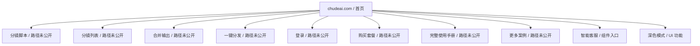
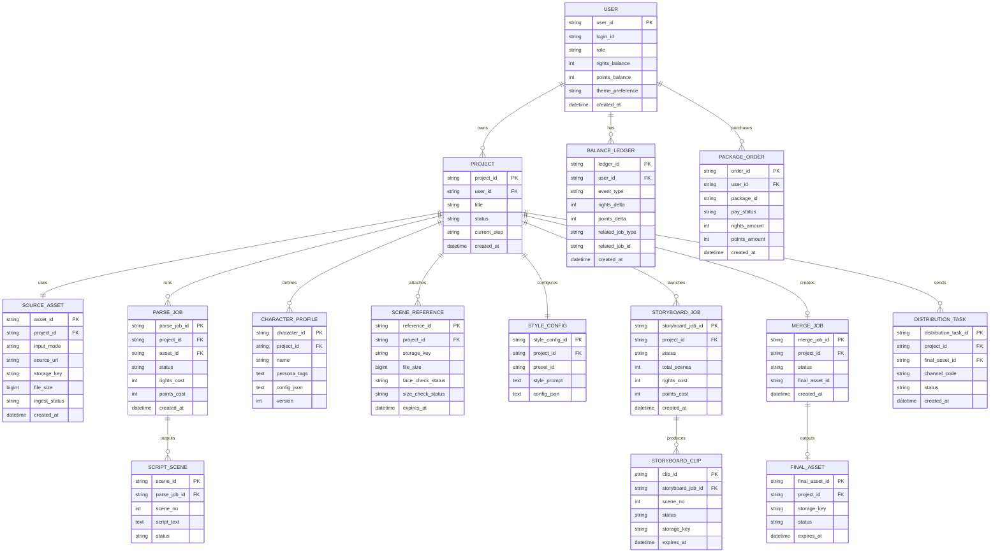
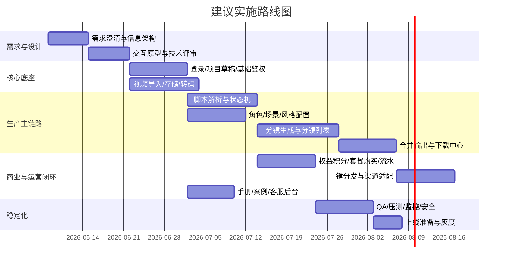

# chudeai.com 深度研究报告与产品需求文档

## 执行摘要

`chudeai.com` 将自己定位为“楚得智能生产引擎（CD Agent）”，公开首页直接呈现的是一个围绕“AI 视频重塑生产”展开的工作台式产品，而不只是普通营销落地页。首页可确认的主流程从“上传视频”开始，依次经过“AI 解析”“确认形象”“场景参考”“设置画面风格”“生成视频”“合并输出”，最终指向“完整视频下载”；同时页面明确强调其使用了 `Seedance 2.0` 模型，并提供“分镜脚本”“分镜列表”“合并输出”“一键分发”“登录”等导航入口。citeturn0search0turn21search0

从公开文本可穷尽拆解出的能力，至少包括：视频导入、脚本解析、角色/形象设定、场景参考、画面风格设置、AI 分镜视频生成、分镜列表管理、合并输出、完整视频下载、套餐充值、案例库、完整使用手册、深色模式、智能客服，以及与生产链路相绑定的积分/权益体系。首页还明确披露了关键业务约束：解析脚本、生成形象、生成视频都会消耗“权益或积分”，且“权益优先”；积分不足时需要前往“购买套餐”页；分镜视频与合并视频会在 14 天后自动清理；参考素材不支持含真人脸，且上传素材大小不得超过 30M。citeturn0search0

需要特别说明的是：本报告严格只以 `chudeai.com` 为唯一来源。经过多轮站内限定检索，检索词覆盖首页模块名、手册、套餐、条款、注册、关于页面等，但公开可稳定发现并可归因的 URL 仍然只有首页根路径，其他导航项的**精确 path 未在公开可抓取结果中暴露**。因此，本文把内容分成三层：**已证实**、**高概率推定**、**未公开/需授权**。其中 PRD、数据模型、接口与实现路线会尽量做成可落地版本，但凡首页未公开披露的细节，都会显式标注。citeturn0search0turn2search0turn6search0turn15search0turn19search0turn24search0turn25search0

## 研究范围与证据边界

本研究只使用 `chudeai.com` 官方站点内容。就公开抓取结果看，站内限定检索在不同关键词下都回指首页根地址，未稳定发现可独立索引的二级页面 URL；这意味着首页既是产品展示入口，也是当前唯一可公开稳定归档的证据页。citeturn0search0turn2search0turn6search0turn15search0turn19search0turn24search0turn25search0

下表列出本报告实际使用到的**精确 URL**。由于其余导航项只暴露了文案入口、未暴露精确路径，所以无法在“精确 URL”层面继续外扩；这部分统一标记为“未公开/需授权”。

| 类型 | 精确 URL | 状态 | 说明 |
|---|---|---:|---|
| 已确认公开页面 | `https://chudeai.com/` | 已确认 | 公开首页，承载品牌、导航、创作流程、案例、注意事项、客服入口等全部已证实内容 |
| 其他导航入口 | `未公开/需授权` | 未确认 | “分镜脚本 / 分镜列表 / 合并输出 / 一键分发 / 登录 / 购买套餐 / 完整使用手册 / 更多案例 / 智能客服”的**精确 URL 未在公开可抓取结果中暴露** |

需要再说明一层方法论边界：由于公开抓取结果未稳定返回可嵌入截图资产，本报告中的“可视化展示”优先采用 Mermaid 图与 ASCII 线框图替代。凡涉及页面截图、二级页静态图、渠道 Logo 等无法从公开结果直接抽取的内容，均标记为“未取得/未公开”。这不是对站点不存在该内容的判断，而是对**公开证据可见性**的诚实说明。

## 站点范围与站点地图

基于首页公开文本，`chudeai.com` 的站点范围可以概括为一套面向短视频与 IP 化内容生产的 AI 工作流平台：用户先导入原始视频，再让系统自动解析脚本，随后配置人物/形象、参考场景与画面风格，接着批量生成分镜视频，最后执行合并输出与下载；同时产品用多个案例类别证明这种工作流适合口播 IP、说车、短剧网红、高端探店、体育解说、装修探房、农村生活、美食探店等内容形态。citeturn0search0turn21search0

从“公开可见入口”角度看，站点更像“首页 + 工作台导航 + 营销/帮助入口”的混合体。它公开暴露了创作流程按钮、案例展示、手册与客服入口，也暴露了登录和付费入口，但没有在当前公开检索中发现独立索引的“隐私政策”“用户协议”“关于我们”“注册”等 URL。citeturn0search0turn24search0turn25search0

下表中的“入口”与“状态”均以首页公开文本为依据；凡未能确认精确路径的，均保守处理为“路径未公开”。

| 发现的公开入口 | 精确 URL / 路径 | 证据状态 | 公开可确认内容 |
|---|---|---|---|
| 首页 | `https://chudeai.com/` | 已证实 | 品牌、主流程、案例、付费规则、限制说明、客服入口 |
| 分镜脚本 | `路径未公开` | 已发现入口 | 顶部导航中出现，推测为脚本/项目工作台 |
| 分镜列表 | `路径未公开` | 已发现入口 | 顶部导航中出现，推测为已生成分镜任务/素材列表 |
| 合并输出 | `路径未公开` | 已发现入口 | 顶部导航与主流程均出现，指向成片合并 |
| 一键分发 | `路径未公开` | 已发现入口 | 顶部导航中出现，目标渠道未公开 |
| 登录 | `路径未公开` | 已发现入口 | 顶部导航中出现；未看到独立“注册”入口 |
| 购买套餐 | `路径未公开` | 已发现入口 | 首页注意事项直接提及，作为余额不足时的跳转页 |
| 完整使用手册 | `路径未公开` | 已发现入口 | 主流程区存在“查看完整使用手册”链接 |
| 更多案例 | `路径未公开` | 已发现入口 | 案例区存在“查看更多案例”链接 |
| 智能客服 | `路径未公开/组件` | 已发现入口 | 页面存在客服入口，形态可能为浮层或嵌入式组件 |

下图是**基于首页文案入口**整理的站点地图；这是一张“发现地图”，不是已验证 URL 的爬虫清单。citeturn0search0turn21search0



## 功能清单与产品分析

以下内容对首页公开暴露出来的能力做“穷尽式拆解”。表内凡标注为“已证实”的能力，均能直接从首页公开文本中找到对应文案；凡标注为“推定”的部分，都是为了形成完整 PRD 而基于公开流程补出的产品能力，并不代表站点已经公开实现。citeturn0search0turn21search0

| 模块 | 已证实功能 | 子功能拆解 | 用户角色 | 输入 | 输出 | 校验/约束 | 异常/边界 | 集成/依赖 | 证据状态 |
|---|---|---|---|---|---|---|---|---|---|
| 品牌与定位 | CD Agent、AI Video Workflow、AI 视频重塑生产引擎 | 品牌露出、价值主张、模型卖点 | 游客、潜在客户 | 无 | 品牌认知、转化意图 | 无公开校验 | 卖点文案不足以替代 demo 说明 | Seedance 2.0 | 已证实 |
| 顶部导航 | 首页、分镜脚本、分镜列表、合并输出、一键分发、登录 | 信息架构、模块切换 | 游客、登录用户 | 点击导航 | 页面/视图切换 | 路径未公开 | 二级页 exact URL 未公开 | 前端路由、鉴权 | 已证实 |
| 主题能力 | 深色模式 | 主题切换、主题状态持久化（推定） | 游客、登录用户 | 主题切换操作 | 浅色/深色 UI | 无公开规则 | 主题状态是否跨会话保存未公开 | 本地存储或用户偏好保存 | 已证实 + 推定 |
| 创作入口 | 上传视频、解析脚本、清空重来、使用说明 | 项目创建、源视频导入、重置项目、就地帮助 | 游客或登录用户（是否强制登录未公开） | 视频链接或本地文件 | 待解析源素材、项目草稿 | 支持“链接或本地文件” | 链接失效、上传中断、误点清空 | 文件存储、转码、帮助文档 | 已证实 + 推定 |
| AI 解析 | 自动解析脚本 | 语音/画面解析、脚本切段、任务提交、状态轮询（推定） | 登录创作者 | 源视频、解析命令 | 脚本文本、分镜草稿 | 会消耗权益或积分，权益优先 | 余额不足、解析失败、内容不清晰 | 模型推理、任务队列、计费 | 已证实 + 推定 |
| 形象确认 | 确认形象、人物角色设定 | 角色设定、形象预览、参数编辑（推定） | 登录创作者 | 角色设定参数、可能的参考素材 | 角色配置 | 生成形象会消耗权益或积分 | 余额不足、生成失败 | 模型推理、资产存储、计费 | 已证实 + 推定 |
| 场景参考 | 场景参考 | 上传参考图、参考素材管理（推定） | 登录创作者 | 参考素材 | 场景参考数据 | 不支持含真人脸；素材 ≤30M | 真人脸检测拦截、超限拒绝 | 内容安全、对象存储 | 已证实 |
| 风格设置 | 设置画面风格 | 风格模板、自定义风格参数（推定） | 登录创作者 | 风格参数 | 风格配置 | 规则未公开 | 风格与角色/场景冲突 | 风格模板、模型参数 | 已证实 + 推定 |
| 视频生成 | 生成视频、AI 分镜视频生成 | 单镜头生成、批量分镜生成、进度显示（推定） | 登录创作者、付费用户 | 脚本、角色、场景、风格 | 分镜视频 | 生成视频消耗权益或积分 | 余额不足、队列超时、失败重试 | 模型推理、队列、计费 | 已证实 + 推定 |
| 分镜列表 | 分镜列表导航 | 分镜任务浏览、筛选、预览、重试、下载（推定） | 登录创作者 | 项目维度筛选 | 分镜清单 | 规则未公开 | 部分分镜失败、状态不一致 | 列表服务、状态机 | 已发现入口 + 推定 |
| 合并输出 | 合并输出、完整视频下载 | 分镜选择、排序、合并渲染、最终下载 | 登录创作者 | 选中分镜、合并规则（推定） | 完整视频下载 | 分镜视频、合并视频 14 天后自动清理 | 合并失败、过期无法下载 | 渲染服务、对象存储、下载鉴权 | 已证实 + 推定 |
| 一键分发 | 一键分发导航 | 渠道映射、账号绑定、任务投递（推定） | 登录创作者、运营 | 目标视频、渠道配置 | 分发任务 | 渠道与规范未公开 | 渠道登录失效、平台拒审 | 第三方内容平台 API | 已发现入口 + 推定 |
| 计费与套餐 | 权益/积分体系、购买套餐 | 余额查看、扣费顺序、充值下单、记录查询（推定） | 付费用户 | 充值操作、任务提交 | 扣费记录、余额变化 | 权益优先；积分不足需充值 | 扣费失败、余额不足、支付异常 | 订单系统、支付通道 | 已证实 + 推定 |
| 教育内容 | 使用说明、完整使用手册 | 内联说明、完整手册页、FAQ（推定） | 游客、登录用户 | 点击查看 | 指南内容 | 手册 URL 未公开 | 文档更新滞后 | CMS 或帮助中心 | 已证实 + 推定 |
| 案例展示 | 原视频/生成效果、多个案例类型、查看更多案例 | 案例卡、前后对比、分类浏览、详情页（推定） | 游客、潜在客户 | 点击案例 | 观看案例对比 | 规则未公开 | 资源加载失败 | 媒体播放、CMS | 已证实 + 推定 |
| 客服支持 | 智能客服 | 在线咨询、工单/转人工（推定） | 游客、登录用户 | 文本提问 | 问答/服务支持 | 规则未公开 | 高峰期排队、知识库命中不足 | 客服系统 | 已证实 + 推定 |

首页的案例分类非常关键，因为它们揭示了产品当前对外主打的场景：口播 IP、试驾说车、短剧网红、高端探店、体育解说、装修探房、农村生活、美食探店。这说明产品的目标并不是抽象的“通用视频生成”，而更像是**面向短视频人格化内容的重塑与批量化生产**。citeturn0search0

首页也暴露了三个重要业务规则，直接影响产品设计。第一，脚本解析、形象生成、视频生成是三个可计费环节，因此后台至少需要有更细粒度的任务与账务流水。第二，分镜视频和合并视频存在 14 天可下载窗口，说明需要对象存储生命周期、过期提示、下载提醒和清理任务。第三，参考素材不能含真人脸，且大小有限制，这意味着内容安全校验发生在“参考素材”入口而不是最终下载阶段。citeturn0search0

同时，公开内容里也存在若干歧义，以下是最需要产品与研发澄清的几项：

| 主题 | 公开信息 | 可能解释 A | 可能解释 B | 建议处理 |
|---|---|---|---|---|
| 登录但未见注册 | 导航出现“登录”，未见“注册” | 注册包含在登录流中 | 平台采取邀请制/私域开通 | 在 PRD 中把注册定义为“未公开”，登录作为已发现入口 |
| “真人口播效果”与“参考素材不支持真人脸” | 案例强调可还原真人口播效果，但参考素材禁止真人脸 | 原始输入视频可是真人，参考图仅限制补充素材 | 所谓“真人口播效果”是风格拟真，而非真人脸复刻 | 需要明确“源视频”和“参考素材”的合规边界 |
| 一键分发 | 仅看到导航名称 | 分发到短视频平台 | 分发到站内或私域渠道 | PRD 中先抽象成渠道适配层，不预设平台名称 |
| 分镜列表 | 仅看到导航名称 | 列的是项目下的镜头片段 | 列的是所有生成任务与状态 | 设计时兼容“项目视图 + 全局视图” |
| 使用手册 | 看到“查看完整使用手册” | 独立帮助页 | 弹窗/文档内嵌页 | 以帮助中心页抽象，URL 待定 |

## PRD 功能需求

以下 PRD 以首页公开流程为事实基座，再补齐一个可实施的产品规范。功能优先级采用 `P0 / P1 / P2`，复杂度采用 `低 / 中 / 高`；复杂度评价综合考虑了鉴权、文件处理、模型异步任务、计费、生命周期管理以及第三方平台联动。首页公开流程与规则是这些需求的唯一事实依据。citeturn0search0turn21search0

先给出优先级与复杂度对照表，便于快速判断研发投入重点：

| 功能 | 优先级 | 复杂度 | 原因 |
|---|---|---|---|
| 视频导入与项目初始化 | P0 | 中 | 是全部生产链路入口，含文件处理与草稿状态管理 |
| 脚本解析 | P0 | 高 | 涉及模型异步任务、计费、失败重试 |
| 形象/角色设定 | P0 | 中高 | 涉及资产管理、角色参数、合规边界 |
| 场景参考校验 | P0 | 中 | 需做人脸合规校验与文件大小限制 |
| 画面风格设置 | P0 | 中 | 与后续生成参数直接耦合 |
| AI 分镜视频生成 | P0 | 高 | 核心价值模块，涉及队列、计费、状态机 |
| 合并输出与下载 | P0 | 高 | 涉及渲染、对象存储、TTL 生命周期 |
| 计费/套餐/权益 | P0 | 高 | 直接影响商业闭环与任务执行权限 |
| 分镜列表 | P1 | 中 | 是生产效率入口，但依赖上游生成链路 |
| 登录/鉴权 | P1 | 中 | 重要但公开站未暴露完整注册模型 |
| 一键分发 | P1 | 高 | 对外部渠道依赖强、规范差异大 |
| 使用手册/案例/客服 | P2 | 低中 | 转化与支持价值高，但不阻塞核心生产 |
| 深色模式 | P2 | 低 | 可提升体验，但非核心商业链路 |

下面给出详细功能需求定义。为避免表格失控，“Mock API”列只放核心接口路径；更完整的请求/响应 schema 放在表后。  

| ID | 功能 | 描述 | 验收标准 | 优先级 | 依赖 | Mock API |
|---|---|---|---|---|---|---|
| FR-HOME | 首页与导航 | 展示品牌、导航、案例、工作流入口、手册和客服入口 | 首页可渲染核心价值主张；导航可见；案例区、注意事项、客服入口可见；深色模式可切换 | P1 | 前端路由、CMS | `GET /api/v1/public/home` |
| FR-AUTH | 登录鉴权 | 允许用户进入受保护的创作工作台 | 未登录用户访问受保护资源时被引导登录；登录成功可恢复上次目标页；会话可过期并安全退出 | P1 | 身份系统、会话管理 | `POST /api/v1/auth/login` |
| FR-PROJ | 项目初始化 | 创建一个视频重塑项目草稿 | 用户点击上传后系统创建项目；项目保存源视频、当前步骤和状态；“清空重来”需要二次确认 | P0 | 鉴权、项目服务 | `POST /api/v1/projects` |
| FR-UPLOAD | 视频导入 | 支持视频链接或本地文件两种导入方式 | 输入合法 URL 或成功上传文件后，系统产生源素材记录；失败时给出明确错误；断点续传/重试可恢复（建议） | P0 | 文件存储、转码 | `POST /api/v1/projects/{id}/sources` |
| FR-PARSE | AI 解析脚本 | 从源视频中自动生成脚本/分镜草稿 | 可异步提交解析任务；任务状态至少包含排队/运行/成功/失败；成功后可产出结构化脚本；提交时执行扣费检查 | P0 | 模型服务、队列、计费 | `POST /api/v1/projects/{id}/parse-jobs` |
| FR-CHAR | 形象与角色设定 | 配置人物角色或形象参数 | 用户可填写/编辑角色设定；系统保存角色版本；若涉及形象生成则需在提交前校验余额 | P0 | 角色服务、计费 | `PATCH /api/v1/projects/{id}/character` |
| FR-REF | 场景参考 | 上传并管理场景参考素材 | 上传成功后生成参考素材记录；若文件大于 30M 必须拒绝；若检测到真人脸必须拒绝；拒绝原因需可读 | P0 | 内容审核、对象存储 | `POST /api/v1/projects/{id}/references` |
| FR-STYLE | 画面风格设置 | 选择或配置视频风格参数 | 用户能保存风格配置；生成任务读取最近一次已保存配置；风格缺失时阻止进入生成步骤 | P0 | 配置服务 | `PATCH /api/v1/projects/{id}/style` |
| FR-GEN | AI 分镜视频生成 | 根据脚本、角色、场景和风格生成分镜视频 | 可发起批量生成；每个分镜有独立状态；失败的分镜可单独重试；提交时执行权益/积分扣费逻辑 | P0 | 模型推理、队列、计费、存储 | `POST /api/v1/projects/{id}/storyboard-jobs` |
| FR-LIST | 分镜列表管理 | 浏览、筛选、预览、重试与下载分镜 | 列表可按项目或状态查看；点击可进入预览；支持重试失败任务；支持下载单个分镜 | P1 | 列表服务、下载服务 | `GET /api/v1/projects/{id}/storyboard-clips` |
| FR-MERGE | 合并输出 | 选择分镜生成完整视频 | 可选中多个已成功分镜并发起合并；合并成功后可下载成片；无可用分镜时不可合并 | P0 | 渲染服务、对象存储 | `POST /api/v1/projects/{id}/merge-jobs` |
| FR-DOWNLOAD | 下载与生命周期 | 提供安全下载和过期管理 | 分镜视频与合并视频都具备下载入口；到期前需提示；14 天后自动失效并返回明确错误文案 | P0 | 存储生命周期、签名 URL | `GET /api/v1/assets/{id}/download-url` |
| FR-DIST | 一键分发 | 将最终视频投递到外部分发渠道 | 用户可配置渠道；分发任务可查看状态；渠道鉴权失效时给出可恢复指引；渠道列表可配置化 | P1 | 第三方平台适配 | `POST /api/v1/projects/{id}/distribution-jobs` |
| FR-BILL | 权益/积分与套餐 | 展示余额、执行扣费、支持充值购买 | 解析脚本、形象生成、视频生成都会检查余额；扣费顺序为权益优先；余额不足时跳转购买套餐 | P0 | 账务系统、订单系统 | `GET /api/v1/me/balance` / `POST /api/v1/billing/checkout-sessions` |
| FR-HELP | 使用说明与手册 | 提供简版说明和完整手册 | 页面存在就地说明；完整手册可打开；手册应与实际步骤一致 | P2 | CMS/帮助中心 | `GET /api/v1/help/manual` |
| FR-CASE | 案例展示 | 呈现原视频与生成效果对比 | 案例列表可浏览；至少支持“原视频/生成效果”双态查看；更多案例入口存在 | P2 | CMS、媒体播放 | `GET /api/v1/public/cases` |
| FR-CS | 智能客服 | 支持售前/售后咨询 | 首页可打开客服；常见问题能命中；无法命中时可转人工或提交工单（建议） | P2 | 客服系统 | `POST /api/v1/support/conversations` |

下面给出一个**建议性的 Mock API 合同**。这些接口不是公开站点披露的真实接口，而是基于公开业务流程抽出来的合理后端边界。

| Endpoint | Method | Request Schema 摘要 | Response Schema 摘要 | 说明 |
|---|---|---|---|---|
| `/api/v1/public/home` | GET | 无 | `{brand, hero, navItems, workflowSteps, cases, notices}` | 首页公开内容聚合 |
| `/api/v1/auth/login` | POST | `{loginId, passwordOrCode, captchaToken?}` | `{user, accessToken, refreshToken, redirectTo}` | 登录 |
| `/api/v1/projects` | POST | `{title?, sourceType: "upload"|"url"}` | `{projectId, status:"draft", currentStep}` | 创建项目 |
| `/api/v1/projects/{id}/sources` | POST | `{inputMode, sourceUrl?, fileToken?, fileName?, fileSize?}` | `{assetId, ingestStatus, playableUrl?, validationErrors[]}` | 导入源视频 |
| `/api/v1/projects/{id}/parse-jobs` | POST | `{assetId, language:"zh-CN", chargeConfirm:true}` | `{jobId, status:"queued", debited:{rights,points}}` | 脚本解析 |
| `/api/v1/projects/{id}/character` | PATCH | `{name?, personaTags[], avatarPrompt?, tone?, notes?}` | `{characterId, version, savedAt}` | 角色/形象设置 |
| `/api/v1/projects/{id}/references` | POST | `{fileToken, fileName, fileSize}` | `{referenceId, faceCheck:"pass"|"reject", sizeCheck:"pass"|"reject", reason?}` | 场景参考上传 |
| `/api/v1/projects/{id}/style` | PATCH | `{presetId?, stylePrompt?, aspectRatio?, visualTags[]}` | `{styleConfigId, saved:true}` | 风格设置 |
| `/api/v1/projects/{id}/storyboard-jobs` | POST | `{scriptVersionId, characterId, styleConfigId, referenceIds[], scenes[]}` | `{jobId, totalScenes, status:"queued"}` | 分镜生成 |
| `/api/v1/projects/{id}/storyboard-clips` | GET | `?status=&page=` | `{items:[{clipId, sceneNo, status, previewUrl?, expiresAt}], pageInfo}` | 分镜列表 |
| `/api/v1/projects/{id}/merge-jobs` | POST | `{clipIds[], title?, outputSpec?}` | `{mergeJobId, status:"queued", finalAssetId?}` | 合并输出 |
| `/api/v1/assets/{id}/download-url` | GET | 无 | `{assetId, downloadUrl?, expiresAt, availability:"active"|"expired"}` | 安全下载 |
| `/api/v1/projects/{id}/distribution-jobs` | POST | `{finalAssetId, channels:[{channelCode, accountId}]}` | `{distributionJobId, channelStatuses[]}` | 一键分发 |
| `/api/v1/me/balance` | GET | 无 | `{rightsBalance, pointsBalance, billingPolicy:"rights_first"}` | 余额与扣费顺序 |
| `/api/v1/billing/checkout-sessions` | POST | `{packageId, payMethod}` | `{checkoutSessionId, payUrl}` | 购买套餐 |
| `/api/v1/help/manual` | GET | 无 | `{title, sections:[...], updatedAt}` | 完整使用手册 |
| `/api/v1/public/cases` | GET | `?category=&page=` | `{items:[{caseId, category, beforeMedia, afterMedia, summary}]}` | 案例库 |
| `/api/v1/support/conversations` | POST | `{topic, message, contact?}` | `{conversationId, channel:"bot"|"human", status}` | 客服入口 |

如果要把首页公开规则直接写成验收条款，则最不可妥协的四条是：其一，源视频导入必须至少支持“本地上传”和“链接导入”两种模式；其二，参考素材若检测到真人脸或发现大于 30M，必须拒绝并可解释；其三，解析脚本、形象生成、视频生成都属于计费节点，扣费策略是“权益优先”；其四，分镜视频与合并视频必须带有 14 天到期逻辑。citeturn0search0

## 非功能需求与数据模型

公开首页没有给出正式的 SLA、并发、权限模型和数据库结构，但它给出的业务链路已经足够推导出一套合理的非功能要求。原因很直接：这里不是简单的信息站，而是一个包含上传、解析、生成、合并、下载、收费、清理和客服的生产型系统。特别是“权益/积分计费”和“14 天自动清理”两条规则，决定了系统必须具备可靠账务、可恢复异步任务、时间驱动资产生命周期与可审计日志。citeturn0search0

建议性的非功能需求如下：

| 维度 | 建议要求 | 设计理由 |
|---|---|---|
| 性能 | 首页首屏可交互建议 ≤ 2.5s；任务提交接口建议 ≤ 2s 返回任务号；长耗时任务统一异步 | 首页兼具营销与工作台功能，首屏和任务提交都不能卡顿 |
| 可扩展性 | 解析、生成、合并拆分为异步任务队列；支持水平扩容 worker | 公开流程天然是多阶段异步生成链 |
| 可用性 | 任务状态必须可追踪；失败必须可重试；扣费和任务状态必须幂等 | 计费发生在长耗时任务前后，必须防重复扣费 |
| 安全性 | 受保护资源需要鉴权；下载需签名 URL；上传文件做病毒/格式校验；参考图做人脸合规检测 | 首页暴露登录、下载与真人脸限制 |
| 隐私 | 用户上传视频、参考素材、角色设定都应最小化采集；下载链接短时有效；日志脱敏 | 涉及用户媒体资产与商业内容 |
| 无障碍 | 保底支持键盘导航、焦点可见、文本对比度达标；深色模式不应破坏可读性 | 首页明确存在深色模式 |
| 国际化 | 当前公开仅观察到简体中文；默认 `zh-CN`；多语言能力未公开 | 站点文案全部为中文 |
| 备份 | 元数据每日备份；对象存储可做冷备，但前台资产按 14 天 TTL 失效；恢复策略区分“备份保留”与“用户可见保留” | 首页明确前台下载资产 14 天后自动清理 |
| 监控 | 监控上传成功率、解析成功率、生成成功率、合并成功率、下载成功率、余额异常、清理任务成功率 | 这些都是公开流程里的关键节点 |
| 合规 | 对“真人脸参考图”禁用规则做审计；对生成失败/拒绝原因保留结构化记录 | 首页明确披露了参考素材合规限制 |

下面的数据模型是依据公开工作流推导出的**建议 ER 模型**，用于支撑上传、解析、角色设定、分镜生成、合并输出、分发和账务。其逻辑依据来自首页暴露出的流程步骤、计费点和资产过期规则。citeturn0search0



为便于数据库落地，下面再给出关键表设计摘要：

| 实体 | 关键字段 | 说明 |
|---|---|---|
| `users` | `user_id`, `login_id`, `role`, `rights_balance`, `points_balance`, `theme_preference` | 登录、余额、主题偏好 |
| `projects` | `project_id`, `user_id`, `status`, `current_step`, `title` | 创作项目主表 |
| `source_assets` | `input_mode`, `source_url`, `storage_key`, `file_size`, `ingest_status` | 源视频导入 |
| `parse_jobs` | `status`, `rights_cost`, `points_cost`, `error_code` | 解析脚本任务 |
| `script_scenes` | `scene_no`, `script_text`, `duration?`, `status` | 解析后的分镜脚本 |
| `character_profiles` | `name`, `persona_tags`, `config_json`, `version` | 角色/形象配置 |
| `scene_references` | `file_size`, `face_check_status`, `size_check_status`, `storage_key` | 参考素材与合规校验 |
| `style_configs` | `preset_id`, `style_prompt`, `config_json` | 风格配置 |
| `storyboard_jobs` | `status`, `total_scenes`, `rights_cost`, `points_cost` | 批量分镜生成任务 |
| `storyboard_clips` | `scene_no`, `status`, `storage_key`, `expires_at` | 分镜视频资产 |
| `merge_jobs` | `status`, `final_asset_id`, `error_code` | 合并任务 |
| `final_assets` | `storage_key`, `status`, `expires_at` | 完整视频资产 |
| `distribution_tasks` | `channel_code`, `status`, `response_payload` | 一键分发任务 |
| `balance_ledgers` | `event_type`, `rights_delta`, `points_delta`, `related_job_id` | 权益/积分流水 |
| `package_orders` | `package_id`, `pay_status`, `rights_amount`, `points_amount` | 购买套餐 |

## 用户故事、线框与测试计划

从首页公开内容出发，可以提炼出三类核心用户：第一类是浏览案例与手册的**游客/潜在客户**；第二类是使用上传、解析、生成、合并能力的**创作者**；第三类是围绕余额、客服和可能的渠道分发开展工作的**付费用户/运营型用户**。主页同时展示了案例、帮助、客服与完整生产链路，这意味着产品既承担获客转化，也承担实际创作工作台的职责。citeturn0search0

先给出关键用户故事与用例：

| 用例 | 前置条件 | 主流程 | 后置条件 | 备选流/异常流 |
|---|---|---|---|---|
| 访客了解产品能力 | 无 | 进入首页 → 浏览品牌定位 → 查看案例对比 → 查看使用手册 → 决定登录或咨询客服 | 用户理解产品价值与主要场景 | 若案例加载失败，则展示文本摘要；若手册不可访问，则引导客服 |
| 导入视频并解析脚本 | 已进入工作台；是否必须登录未公开 | 创建项目 → 选择链接/本地文件 → 上传成功 → 点击解析脚本 → 查看解析状态 | 生成脚本/分镜草稿 | 链接失效、上传失败、余额不足、解析失败 |
| 配置角色与场景 | 已有项目与解析结果 | 设置人物角色 → 上传场景参考 → 设置画面风格 → 保存配置 | 项目拥有完整生成参数 | 参考图含真人脸、文件超 30M、风格配置缺失 |
| 生成分镜视频 | 已有脚本、角色、参考、风格 | 发起 AI 分镜视频生成 → 轮询状态 → 查看分镜列表 → 预览单个分镜 | 产生可下载分镜视频 | 单个分镜失败可重试；余额不足阻塞生成 |
| 合并输出并下载完整视频 | 至少有一个成功分镜 | 选择分镜 → 发起合并 → 合并成功 → 下载完整视频 | 获得成片下载链接 | 合并失败、素材过期、下载失效 |
| 充值后继续创作 | 当前积分不足 | 触发任务前检查余额 → 系统提示去购买套餐 → 完成支付 → 返回继续提交 | 余额更新、任务可继续 | 订单支付失败、到账延迟、重复支付拦截 |
| 一键分发成片 | 已有最终视频 | 选择分发渠道 → 发起分发任务 → 查看各渠道状态 | 成片被投递到目标渠道 | 账号鉴权失效、渠道拒绝、素材规格不符 |
| 寻求帮助或售后 | 任意阶段 | 打开智能客服 → 提问 → 获取答案或转人工 | 问题得到解决或形成工单 | 机器人未命中意图，需要人工接入 |

公开首页对应的 UI 组件同样可以做成穷尽拆解：顶部导航、深色模式开关、核心价值主张区、主创作 Stepper、视频上传卡片、解析与清空按钮、使用说明入口、角色与场景配置区域、画面风格区、案例卡片区、注意事项区、智能客服入口。citeturn0search0

基于这些公开元素，可以给出两张建议性线框。它们不是对现有二级页面的截图复刻，而是对首页公开功能的产品化展开。

**线框建议 A：首页/创作工作台混合页**

```text
+----------------------------------------------------------------------------------+
| Logo/CD Agent | 首页 | 分镜脚本 | 分镜列表 | 合并输出 | 一键分发 | 登录 | 深色模式 |
+----------------------------------------------------------------------------------+
| 楚得智能 AI视频重塑生产引擎                                 [查看完整使用手册]     |
| 搭载 Seedance 2.0 模型 · 极致视听体验                                           |
+----------------------------------------------------------------------------------+
| Step 1 上传视频 | Step 2 AI解析 | Step 3 确认形象 | Step 4 场景参考 | Step 5 风格 |
| Step 6 生成视频 | Step 7 合并输出                                                 |
+----------------------------------------------------------------------------------+
| [上传视频：拖拽区/本地文件] [或输入视频链接__________________________________] |
| [解析脚本]   [清空重来]                                                           |
+----------------------------------------------------------------------------------+
| 人物角色设定面板 | 场景参考上传 | 画面风格设置                                    |
| - 角色名称      | - 上传参考图 | - 风格模板                                      |
| - 人设标签      | - 校验结果   | - 自定义风格参数                                |
+----------------------------------------------------------------------------------+
| 注意事项：权益优先 / 积分不足去购买套餐 / 素材限制 / 14天自动清理                |
+----------------------------------------------------------------------------------+
| 案例展示：原视频 vs 生成效果 卡片流                                               |
+----------------------------------------------------------------------------------+
| 智能客服入口                                                                       |
+----------------------------------------------------------------------------------+
```

**线框建议 B：分镜列表与合并输出页**

```text
+----------------------------------------------------------------------------------+
| Logo/CD Agent | 分镜列表 | 合并输出 | 下载中心 | 余额/权益 | 用户头像             |
+----------------------------------------------------------------------------------+
| 项目：xxxxxxxxxx       状态筛选：[全部][生成中][成功][失败]      搜索 [_____]     |
+----------------------------------------------------------------------------------+
| 场景#1 | 缩略图 | 状态：成功 | [预览] [重试] [下载] [勾选合并]                    |
| 场景#2 | 缩略图 | 状态：失败 | [查看原因] [重试]                                  |
| 场景#3 | 缩略图 | 状态：成功 | [预览] [下载] [勾选合并]                           |
+----------------------------------------------------------------------------------+
| 已选分镜：3 个   输出规格：[1080p ▼]   [开始合并]                                 |
+----------------------------------------------------------------------------------+
| 合并结果：状态 / 预计完成时间 / 下载按钮 / 到期时间（14天）                       |
+----------------------------------------------------------------------------------+
```

针对 QA 与测试，建议采用“业务闭环 + 状态机 + 账务 + 生命周期”四层测试法。原因在于这个产品最大的风险不是单页 UI，而是**长任务、多资产、扣费与过期清理之间的一致性**。首页明确指出的付费节点和到期策略，决定了测试必须覆盖金额、任务状态与回滚。citeturn0search0

| 测试域 | 核心测试点 | QA 通过标准 | 核心指标 |
|---|---|---|---|
| 首页展示 | 导航、案例、手册、客服、深色模式是否可见 | 首屏关键模块完整呈现，无阻断错误 | 首屏可交互时间、JS 错误率 |
| 登录鉴权 | 未登录重定向、会话续期、退出登录 | 受保护资源不可越权访问 | 登录成功率、会话异常率 |
| 视频导入 | 链接导入、本地上传、失败重试 | 两种导入模式都可稳定形成源素材 | 上传成功率、导入平均耗时 |
| 脚本解析 | 任务提交、状态流转、失败重试、重复提交幂等 | 无重复任务、无重复扣费 | 解析成功率、平均排队时长 |
| 参考素材校验 | 真人脸检测、30M 限制、拒绝原因可读 | 非法素材被准确拒绝 | 拒绝准确率、误拦截率 |
| 角色/风格配置 | 配置保存、版本覆盖、缺失拦截 | 配置变更即时生效 | 保存成功率 |
| 分镜生成 | 批量生成、子任务状态、单镜头重试 | 失败可重试且不重复扣费 | 生成成功率、平均渲染时长 |
| 分镜列表 | 状态筛选、预览、下载、排序 | 状态与实际资产一致 | 列表加载耗时、状态一致性 |
| 合并输出 | 多分镜合并、失败恢复、下载链接 | 合并成功可下载 | 合并成功率、下载完成率 |
| 生命周期管理 | 14 天提示、到期不可下载、清理任务执行 | 到期行为符合规则 | 过期清理成功率、过期误删率 |
| 计费系统 | 权益优先、积分不足跳转、流水一致性 | 扣费顺序正确、流水可追踪 | 账实一致率、支付成功率 |
| 分发系统 | 渠道鉴权、投递状态、失败回执 | 渠道错误可解释 | 渠道成功率、退回率 |
| 安全与合规 | 权限、签名 URL、日志脱敏 | 无越权、无明文敏感信息 | 漏洞数、签名过期准确率 |

建议把下面这些指标纳入发布门槛：解析成功率、分镜生成成功率、合并成功率、下载成功率、账务一致率、客服首次响应时长、过期清理成功率、参考素材拒绝准确率。前五项决定业务闭环是否真实可用，后三项决定平台规则是否被稳定执行。

## 实施路线、工时估算与风险

如果把 `chudeai.com` 公开展示的产品做成一版可商用、可扩展、可审计的正式系统，一个较稳妥的实施路线应该是“先打通创作主链路，再闭合计费与生命周期，最后补齐分发、帮助和运营能力”。原因很明确：首页公开价值主要集中在“输入原始视频 → 自动化再生产 → 下载与分发”，所以研发路线必须优先服务这个闭环。citeturn0search0turn21search0

建议的人力与粗略工时如下，这里采用“人周”而不是自然周。若多人并行，可显著缩短日历时间。

| 工作流 | 角色配置 | 估算人周 |
|---|---|---:|
| 需求澄清、信息架构、原型 | PM/BA + 设计 | 4–6 |
| 首页/工作台前端框架、导航、深色模式 | 前端 | 3–5 |
| 登录、会话、项目草稿、基础鉴权 | 前后端 | 4–6 |
| 视频导入、对象存储、转码接入 | 前后端 + DevOps | 5–7 |
| 脚本解析、任务队列、状态机 | 后端 + AI 工程 | 6–9 |
| 角色/场景/风格配置与校验 | 前后端 | 4–6 |
| 参考素材人脸/大小限制校验 | 后端 + AI 工程 | 3–5 |
| 分镜视频生成、重试、预览 | 后端 + AI 工程 + 前端 | 7–10 |
| 分镜列表、项目视图、下载 | 前后端 | 4–6 |
| 合并输出、成片下载、TTL 清理 | 后端 + DevOps | 5–8 |
| 权益/积分、套餐购买、账务流水 | 后端 + 支付集成 | 6–8 |
| 一键分发渠道抽象与适配 | 后端 + 前端 | 5–8 |
| 手册、案例、客服、运营配置 | 前端 + CMS/客服集成 | 3–5 |
| 测试、压测、安全、观测、上线 | QA + DevOps + 全员修复 | 6–9 |

**总量级建议**：约 `52–78 人周`。若按一个小型跨职能团队并行推进，日历周期大约可控制在 `10–14 周`。

下面给出建议性的 Gantt 时间线，假设项目从 `2026-06-08` 启动：



最后给出风险、假设与开放问题。这一部分对落地最关键，因为首页公开证据虽然足够勾勒产品框架，但仍不足以唯一确定全部实现方式。citeturn0search0turn24search0turn25search0

| 类型 | 项目 | 说明 |
|---|---|---|
| 风险 | 公开信息密度不足 | 当前公开稳定可确认的 URL 只有首页，二级页 exact path、注册流、条款页、支付说明都未公开 |
| 风险 | 合规边界模糊 | “真人口播效果”与“参考素材不支持真人脸”并存，若源视频与参考图规则不同，必须制度化说明 |
| 风险 | 账务与任务一致性 | 解析、形象、生成都是扣费点，若失败补偿逻辑不清，极易引发投诉 |
| 风险 | TTL 与用户心智冲突 | 14 天自动清理需要强提醒，否则用户可能误以为资产永久保存 |
| 风险 | 分发渠道不确定 | “一键分发”入口已出现，但渠道名单与规范完全未公开，实现难度可能高于首页预期 |
| 假设 | 首页流程即核心业务链 | 以首页 Stepper 作为系统主路径，不额外假设复杂协作编辑能力 |
| 假设 | 产品主语种为简体中文 | 公开页面仅观察到中文文案 |
| 假设 | 付费模式以权益/积分为核心 | 首页明确暴露此点，可作为账务设计依据 |
| 开放问题 | 登录是否包含注册 | 需要产品或运营给出真实获客/开通路径 |
| 开放问题 | 视频导入支持哪些链接来源 | 平台兼容范围未公开 |
| 开放问题 | 一键分发到底对接哪些平台 | 渠道、素材规格、鉴权方式均未公开 |
| 开放问题 | 案例详情与手册 URL | 入口已见，精确路径未公开 |
| 开放问题 | 失败任务是否退款/返还权益 | 公开信息未说明 |
| 开放问题 | 团队协作与多项目权限 | 未观察到团队、成员、组织级能力 |
| 开放问题 | 隐私政策与用户协议 | 本次公开检索未发现独立可索引页面 |

综合来看，`chudeai.com` 已公开展示出一个非常清晰的产品骨架：它并不是“泛 AI 视频站点”，而是一条面向短视频人格化内容生产的纵深工作流，核心竞争点在于“从原始视频到结构化分镜，再到风格化重制与合并交付”的完整链条。真正影响成败的不是首页卖点，而是后台是否能把**异步任务、合规校验、权益/积分扣费、资产过期清理、下载与分发**这些复杂机制严格一致地串起来。基于公开证据，本报告已尽可能把这些需求补形成一份可执行 PRD；但凡精确 URL、渠道名单、注册机制、支付细则、手册详情和合规边界未被公开披露之处，均应在立项前作为一类阻断问题优先澄清。citeturn0search0turn21search0turn24search0turn25search0