# 本地生活 AI 营销平台 — 用户旅程 / 状态机 / 数据流 / 交互 / 功能模块

> **文档状态**：📗 活文档（持续维护，当前有效）
> **用途/说明**：商家平台用户旅程/状态机/数据流活文档，仓库权威现状文档之一
> **权威来源**：本仓库权威文档为 `AGENTS.md` + `docs/local-life-user-journey.md`
> **最后校准**：2026-07-11

> 依据：`docs/AI本地生活营销平台改造实施方案.md`（设计意图）
> 校准：对照仓库实际代码（`src/app/merchant`、`src/app/api`、`src/lib`、`src/workers`、`prisma/schema.prisma`）
> 范围：第一阶段餐饮 MVP；含「设计 vs 现状」差距标注
> 维护：本文档为活文档，随实现推进同步更新

---

## 0. 一句话定位

把"不会策划 / 不会拍 / 不会剪 / 不会写文案 / 不会持续运营"的餐饮商家，
通过 AI 接管为一条闭环：**问诊 → 门店画像 → 7 天内容日历 → 每日拍摄任务 → 素材上传质检 → 一键生成 3 版视频 → 文案+封面+字幕 → 合规检查 → 导出 → 数据回填 → 复盘反哺下一轮**。

核心理念（实施方案 §20）：不是给商家一个"视频编辑器"，而是让商家完成"今天的营销任务"。
核心对象由「项目驱动」转为「门店经营驱动」：`Store / ContentPlan / ContentBrief / ShotTask / VideoVariant / PublishMetric`。

---

## 1. 功能模块图

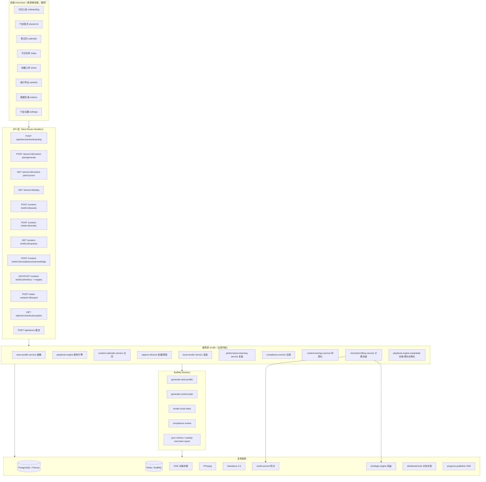

---

## 2. 用户旅程图

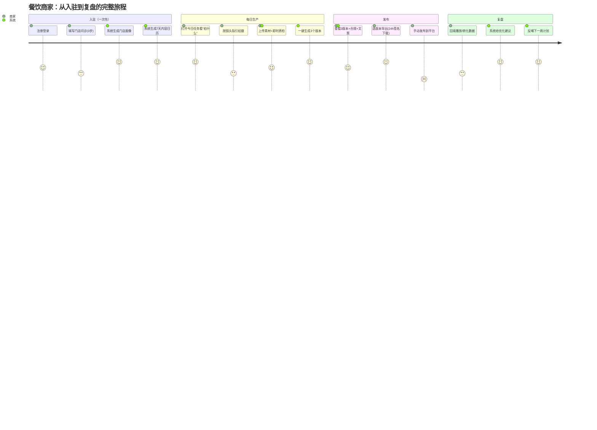

### 2.1 路由路径（实际）

```text
/login
  → /merchant                                （Server Component 重定向）
      → 无商家：/merchant/onboarding
      → 有门店：/merchant/stores/{storeId}
          → /merchant/stores/{storeId}/calendar          周计划
          → /merchant/stores/{storeId}/today             今日任务
          → /merchant/stores/{storeId}/briefs/{briefId}/shoot     拍摄上传
          → /merchant/stores/{storeId}/briefs/{briefId}/variants  成片/合规/文案/导出
          → /merchant/stores/{storeId}/briefs/{briefId}/metrics   数据回填/复盘
          → /merchant/stores/{storeId}/settings          门店设置
      AI 视频重绘后端能力保留（/api/projects/*），Inhot 四模式通过创作中心接入
```

### 2.2 5 步线性主操作（实施方案 §20 / Req 15.4）

```text
看今日任务 → 拍 → 传 → 一键生成 → 导出/看效果
```

---

## 3. 状态机

### 3.1 ContentBrief 状态机（核心对象，ContentBriefStatus）

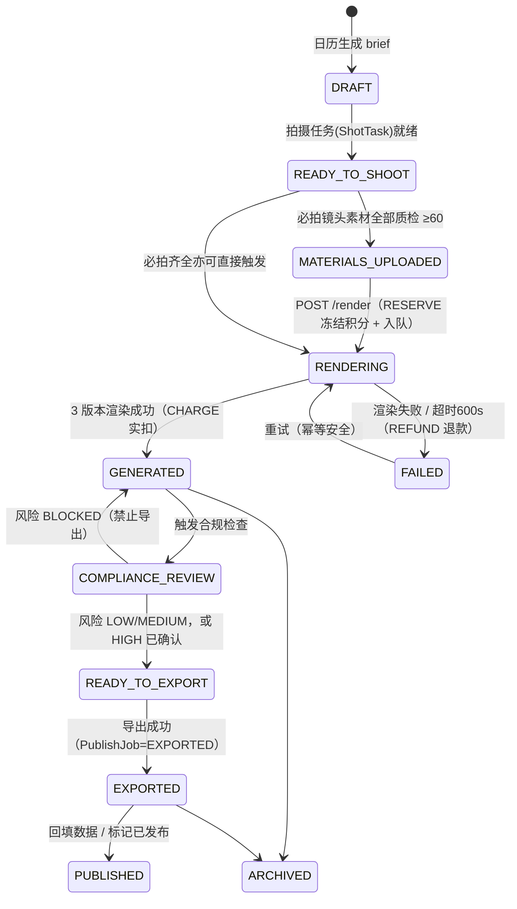

> 说明：实际渲染计费在 `local-render-service` 内完成——成功置 GENERATED 同事务 CHARGE（差额自动退回），失败置 FAILED 并幂等 REFUND。合规检查由 `render-local-video` worker 在生成后对每个 variant 调用 `compliance-service`。

### 3.2 ShotTask / RawAsset 质检状态

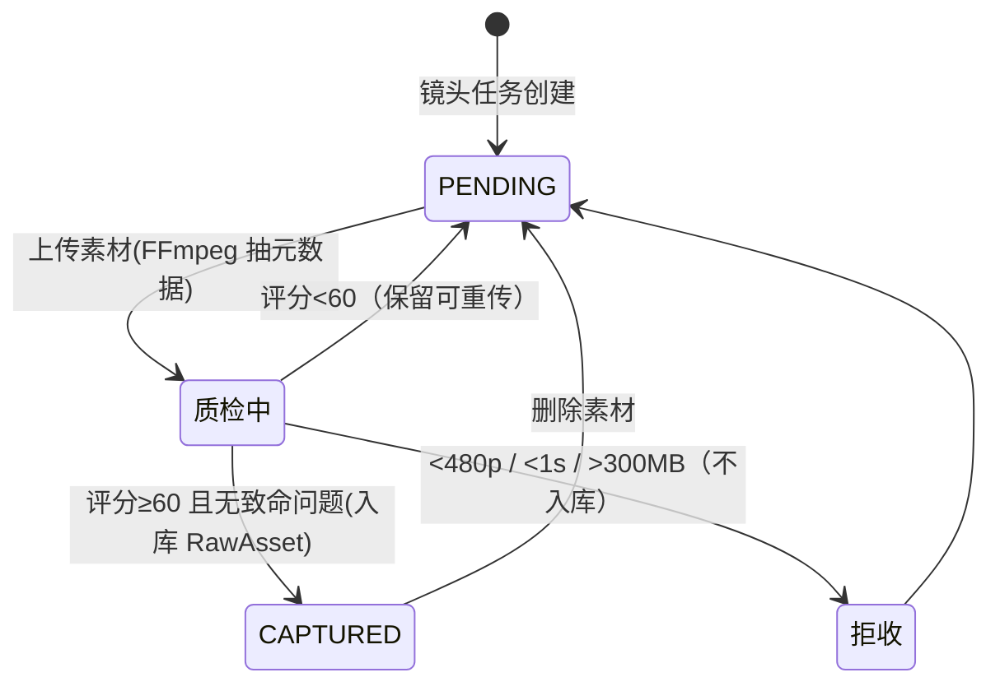

质检维度（capture-director / Req 6.2）：竖屏 9:16、短边≥720p、时长达标、文件 1B~300MB、亮度>15、需口播则需音轨。

### 3.3 合规风险等级 → 导出门控（ComplianceRiskLevel）

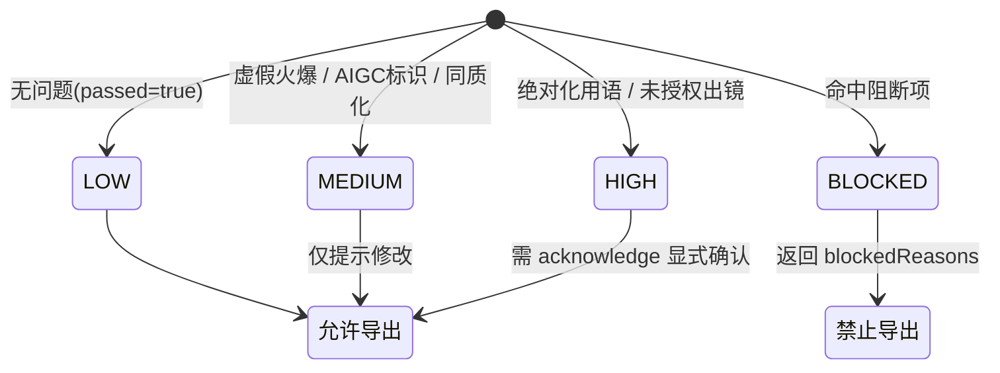

### 3.4 PublishJob 状态（导出/发布任务）

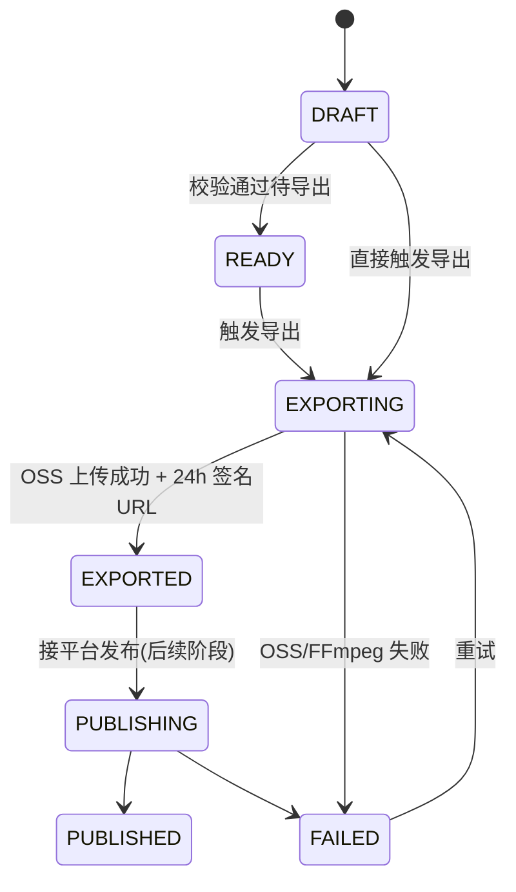

---

## 4. 数据流转图

### 4.1 全链路数据流

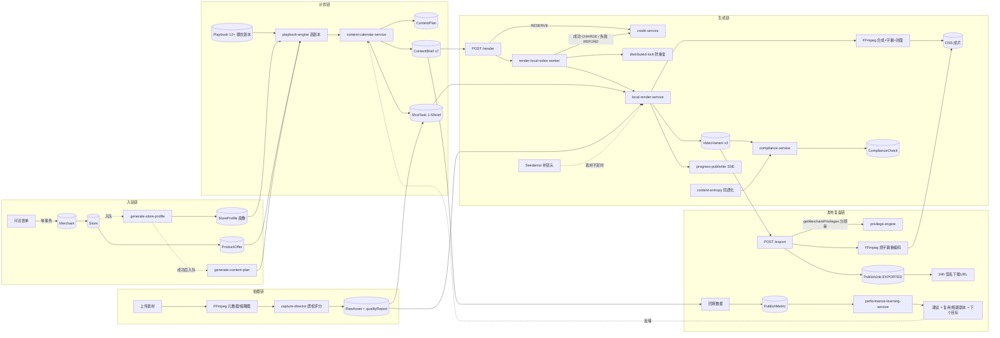

### 4.2 计费 / 权益横切（merchant-billing-unification 收敛后）

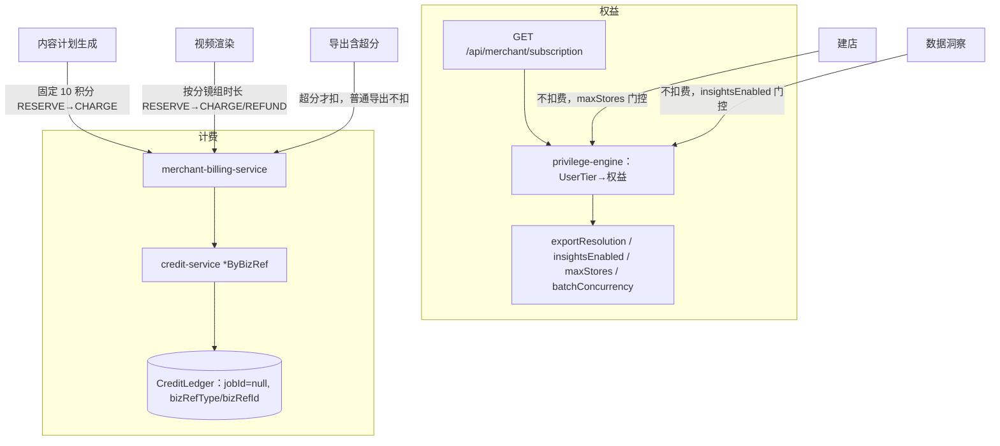

要点：
- 会员权益统一由 `UserTier`（FREE/MONTHLY/YEARLY）映射，不再用旧的 Merchant_Tier（FREE/BASIC/GROWTH/AGENCY）。
- 所有商家积分流水 `jobId` 恒为 null，以 `(bizRefType, bizRefId)` 关联挂账并作幂等键，杜绝 `credit_ledger_job_id_fkey` 外键违约。
- 写积分全部经 `withCreditLock` 全局锁串行化。

---

## 5. 关键交互时序图

### 5.1 入驻 → 画像 → 日历

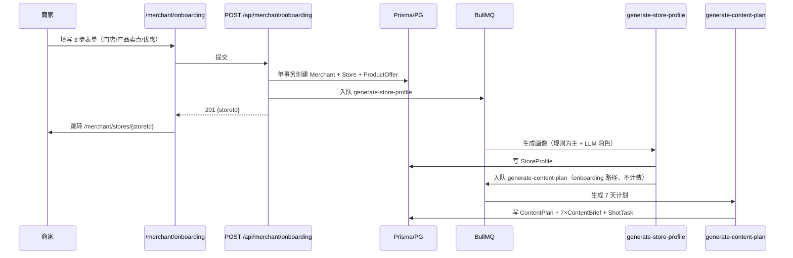

### 5.2 上传 → 一键生成（含计费 / 锁 / SSE）

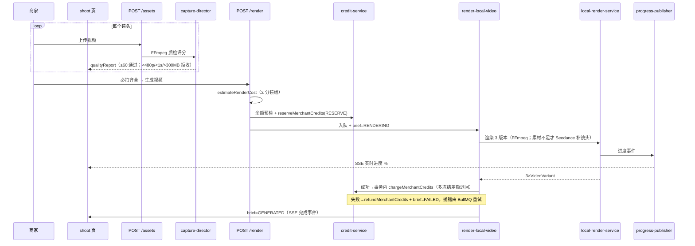

> SSE 实现：前端 `useSSEProgress` Hook 用原生 `EventSource` 连接**全局端点** `/api/sse/progress?token={briefId}`（EventSource 不支持自定义 header，鉴权 token 走 query param），而非每个 brief 独立的 `/render/stream`。Worker 经 `progress-publisher`（Redis Pub/Sub）发布进度，SSE 端点订阅后转推；断连超 10s 自动降级为 3-5s 高频轮询。

### 5.3 合规 → 导出 → 复盘

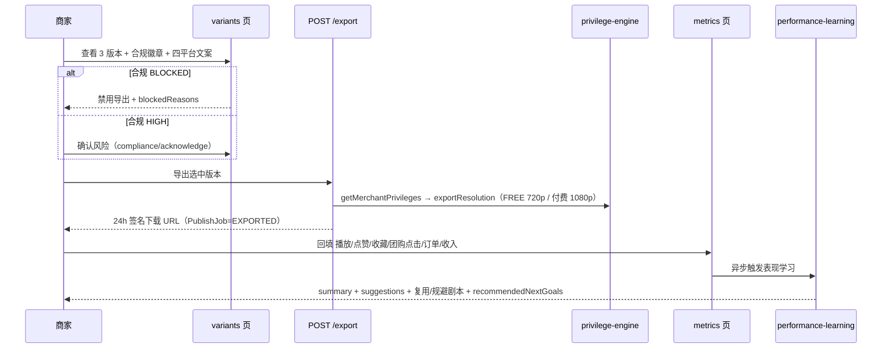

### 5.4 导出 → 数据回填 → 复盘反哺

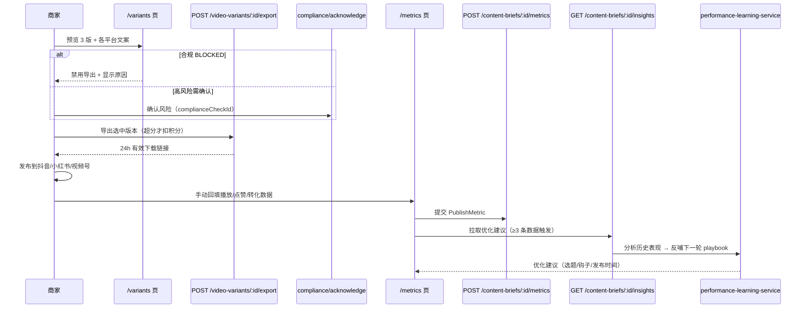

---

## 6. 设计 vs 现状差距清单

> 校准方式：逐一核对 `src/app/merchant` 实际页面文件 + 全站 `<Link>`/`router.push` 入口可达性。
> 原始结论：后端服务与 API 基本齐全，闭环「后半段」（成片导出→数据复盘）在前端无任何入口，等于断链。
> **更新（已全部修复）：成片导出 / 数据复盘 / Brief 详情 / 日历点击 / 门店画像展示 / 会员升级充值 / 首页拍摄入口 七处问题均已接通，闭环完整可达。**

### 6.1 功能模块可达性矩阵

| 功能模块 | 后端服务/API | 前端页面 | 入口可达 | 状态 |
|---|---|---|---|---|
| 问诊入驻 | onboarding API + generate-store-profile | `/merchant/onboarding` | ✅ stores 列表/空态均有入口 | 通 |
| 门店首页 | stores/:id 聚合 | `/merchant/stores/[storeId]` | ✅ 列表点击进入 | 通 |
| 周日历 | content-plan/current | `/calendar` | ✅ 首页多处「查看周计划」 | 通 |
| 今日任务 | stores/:id/today | `/today` | ✅ 底部导航 | 通 |
| 拍摄上传 | assets 上传 + capture-director 质检 | `/briefs/[briefId]/shoot` | ✅ today 页「开始拍摄」 | 通 |
| **成片导出** | variants + export API（齐全） | `/briefs/[briefId]/variants` | ✅ 总览页/首页/shoot 完成后均可达 | **已接通** |
| **数据复盘** | metrics + insights API（齐全） | `/briefs/[briefId]/metrics` | ✅ 总览页/首页/variants 导出后可达 | **已接通** |
| **Brief 详情** | content-briefs/:id（API 有） | `briefs/[briefId]/page.tsx` | ✅ 已新增页面，日历点击进入 | **已补齐** |
| 门店设置 | settings API | `/settings` | ✅ 底部导航 | 通 |
| 门店画像展示 | StoreProfile + `GET /stores/:id/profile` + `profile/regenerate` | `/settings` 内画像卡 | ✅ 设置页展示+重新生成 | **已接通** |
| 会员升级/积分充值 | subscriptions/plans·create + packages + orders（真实支付网关） | `/membership` | ✅ 设置页/首页会员卡入口 | **已接通** |

### 6.2 关键断点（按严重度排序，状态已更新）

1. ~~**成片导出页 `/variants` 是孤儿页**~~ ✅ **已修复**
   - 页面代码完整（SWR 拉 variants、导出、合规徽章、高风险确认全有）。
   - 现已接通：`shoot` 渲染完成后展示「查看成片并导出」CTA；brief 总览页「成片导出」卡；首页最佳视频卡「查看成片」按钮。

2. ~~**数据复盘页 `/metrics` 是孤儿页**~~ ✅ **已修复**
   - 现已接通：`/variants` 导出成功后「发布后来回填数据」卡；brief 总览页「数据复盘」卡；首页最佳视频卡「数据复盘」按钮。

3. ~~**Brief 详情页缺失 → 404**~~ ✅ **已修复**
   - 已新增 `briefs/[briefId]/page.tsx` 作为 brief 总览（任务进度 + 三个子页入口 shoot/variants/metrics，按状态门控）。

4. ~~**周日历项不可点击进 brief**~~ ✅ **已修复**
   - `calendar` 每个日卡已包 `<Link>` → brief 总览页。

5. ~~**门店画像（StoreProfile）前端零展示**~~ ✅ **已修复**
   - `settings` 页新增「AI 门店画像」卡：展示内容定位/推荐人设/视觉风格/钩子词/做与不做/违禁词/CTA + aiSummary，并提供「重新生成」（POST `/profile/regenerate`）。

6. ~~**会员升级 / 积分充值无页面**~~ ✅ **已修复**
   - 新增 `/membership` 页：会员套餐（`/api/subscriptions/plans` + `create`）与积分充值（`/api/packages` + `orders`）双 tab，对接真实微信 Native 扫码 / 支付宝跳转网关，支付由后端回调入账。
   - 入口：`settings` 页「会员与积分」卡 + 首页底部会员卡点击进入。

7. ~~**首页「开始拍摄」跳日历，逻辑别扭**~~ ✅ **已修复**
   - 今日任务卡「开始拍摄」改为直达当日 brief 的 `/shoot` 页。

### 6.3 接通断链实施进度

**已全部实施：**

1. ✅ 新增 `briefs/[briefId]/page.tsx` brief 总览页：任务信息 + 拍摄进度 + 三步入口卡，按状态门控子页可达性。解决原 404。
2. ✅ `shoot` 页：监听 SSE 完成事件刷新状态，渲染完成后展示「查看成片并导出」CTA → `/variants`。
3. ✅ `/variants` 页：导出成功后「发布后来回填数据」卡 → `/metrics`。
4. ✅ 入口补全：`calendar` 日卡 `<Link>` → 总览页；首页最佳视频卡「查看成片」「数据复盘」按钮。
5. ✅ `settings` 页新增「AI 门店画像」展示卡 + 重新生成。
6. ✅ 新增 `/membership` 会员与积分页（真实订阅/订单接口 + 真实支付网关），入口在 settings 卡 + 首页会员卡。
7. ✅ 首页「开始拍摄」改为直达当日 brief 的 `/shoot`。

> 验证：dev 编译通过，所有改动 `get_diagnostics` 干净；Playwright 实测——日历可点进总览页、总览页状态门控正确、`/membership` 真实拉取会员套餐（月卡¥30/季卡¥80/年卡¥249）与积分套餐（体验¥10/基础¥30/专业¥60/企业¥200）、settings 画像卡完整渲染真实画像数据。
>
> 计费安全：会员升级与积分充值全程走真实支付网关（微信 Native 扫码 / 支付宝跳转），到账由后端支付回调（`/api/payments/{channel}/subscription-callback`）处理，前端不直接改余额。
