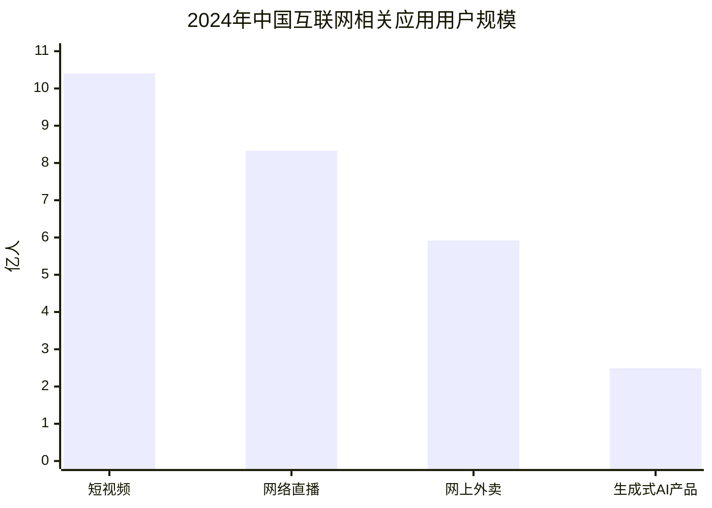
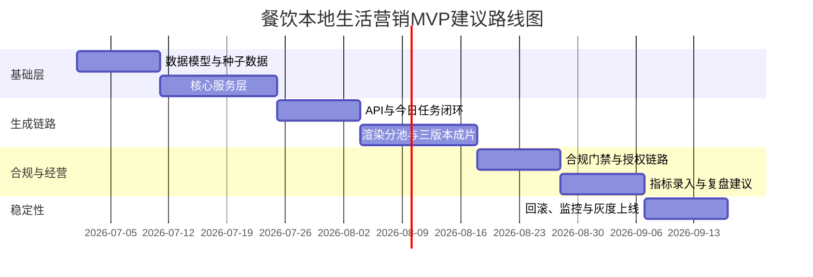

# AI本地生活营销平台改造方案深度可行性研究报告

## 执行摘要

我审阅的原方案不是一个“从零做新产品”的提案，而是一份比较清晰的“旧能力复用 + 上层业务重构”改造方案：保留现有 AI 视频解析、分镜、生成、合并、队列、积分、订阅、OSS、版本历史等底层能力，把原有“AI 视频重绘 SaaS”改造成“面向餐饮门店的 AI 内容经营系统”，并将 MVP 范围限定在餐饮行业，核心闭环是“商家问诊—门店画像—内容日历—今日拍摄—自动成片—合规检查—导出/发布—数据复盘—下一轮优化”。从产品切口、能力复用逻辑和落地顺序看，这个方向总体**可行**，而且优于“推倒重来”方案。fileciteturn0file0

但这份原方案当前最大的问题，不在“技术能不能做”，而在“做出来后会不会真被商家持续使用”。公开数据表明，中国短视频用户已达 10.40 亿、网络直播用户 8.33 亿、网上外卖用户 5.92 亿，线下服务消费的网络化、智能化水平仍在提升；与此同时，短视频内容真实性、营销标注、AI 生成标识、平台审核责任、外卖商家真实性和消费者权益，正在被持续强化监管。也就是说，市场窗口是存在的，但“低门槛做内容”与“高要求做合规、做真实、做差异化”必须同时成立，不能只押注 AI 生成效率。citeturn21view0turn20view0turn24view0turn24view1turn25view0turn29view1

综合多轮交叉验证，我给出的优先级排序如下。**最高优先级**是把产品对象彻底从“视频项目”切成“门店经营任务”，并把“今日任务页 + 素材质检 + 三版本成片 + 合规门禁”做成真正的一条主路径；**第二优先级**是把“真实性治理”前置，包括商家资质、套餐有效期、顾客/员工出镜授权、AI 生成镜头追踪、短视频内容标签与导出前风险校验；**第三优先级**是把“数据复盘”从手工记账升级为“可解释的下一条建议”，而不是只做一个指标录入表单；**第四优先级**才是平台发布自动化，因为原方案自己也承认第一阶段不应强行接全平台接口，而且 Next.js Route Handlers、BullMQ worker、Prisma 增量建模路径，已经足够支撑一个“导出优先”的 MVP。fileciteturn0file0 citeturn16view3turn16view2turn17view3turn13view0turn13view2

我的结论不是“这份方案很好，直接开干”，而是：**这份方案适合作为 MVP 蓝图，但必须从“AI 代替商家做视频”修正为“AI 帮商家完成真实内容经营任务”，并把合规、真实性、素材质量和经营反馈作为一等公民。**如果按这个方向优化，使用现有栈做一个 8 到 12 周的餐饮 MVP 是现实的；如果仍以“自动批量出片”为主、以“平台增长黑盒”为卖点，短期可能能生成视频，长期很容易卡在商家留存、平台审核、同质化和运营回报证明上。fileciteturn0file0 citeturn24view1turn25view0turn29view1turn20view1

## 原方案审阅与核心判断

原方案的强项在于边界清晰。它明确提出“不推倒重来”，保留现有视频解析、分镜、生成、合并、队列、积分、订阅、OSS、版本历史、并发控制等底层模块；明确第一个行业只做餐饮；明确 MVP 不追求多行业、不追求复杂 BI、不追求全平台自动发布；明确前台主界面应围绕“今天拍什么、怎么拍、一键生成、导出/发布、看效果”五件事，不把复杂分镜参数暴露给普通商家。这些判断是成熟的，因为它们同时收缩了技术风险、产品教育成本和首期交付面。fileciteturn0file0

原方案还做对了一件更重要的事：它已经意识到核心对象要从旧系统的 `Project / Shot / Generation / Export` 迁移为 `Store / ContentPlan / ContentBrief / ShotTask / VideoVariant / PublishMetric`。这不是字段层面的改名，而是业务心智的迁移。用户不是来“做一个视频项目”，而是来“完成今天这家店的营销任务”；这点如果不成立，改再多服务名和页面结构也只是旧产品换皮。fileciteturn0file0

不过，原方案也存在三个明显缺口。第一，它把“合规检查”列入 MVP，但对“真实性基础设施”定义还不够完整，例如门店资质、优惠生效时间、价格证明、顾客出镜可追溯性、AI 镜头占比、平台标签导出要求，尚未形成一个可审计的数据链。第二，它提出“手动录入或简单同步指标”，但没有区分“内容指标”“到店转化指标”“套餐核销指标”三类口径，后续复盘会很容易失真。第三，它强调复用旧的视频生成能力，但还没有把“真实素材优先”写成系统级约束，只是作为渲染策略建议存在，这对本地生活场景是一个关键差异。fileciteturn0file0 citeturn24view0turn24view1turn25view0turn29view1

从工程结构看，原方案选择的 Web 后台 + worker 异步架构是对的。当前栈包含 Next.js App Router、Prisma、PostgreSQL、BullMQ、Redis、OSS、FFmpeg、JWT/Cookie、Zod、Vitest、Docker，这天然适合“前台轻引导 + 后台异步渲染 + 数据任务编排”的模式。Next.js 的 Route Handlers 适合生成新的 API 路由和未来 webhook，对应原方案里新增的 `/api/merchant/onboarding`、`/api/stores/...`、`/api/content-briefs/...` 等接口设计；Prisma 支持在保持既有数据的前提下通过 migration 同步 schema，并用关系模型和 JSON/JSONB 承载较灵活的营销结构体；BullMQ 的 Queue、Worker、QueueEvents、FlowProducer 组合，则天然适合内容计划生成、渲染、合规扫描和指标同步这类异步作业。citeturn16view3turn13view0turn13view2turn16view0turn13view1turn16view2

下面这张图可以概括我对原方案的理解：底层能力尽量不动，但在其上方建立一个新的“经营任务壳层”，而不是继续强化“创作者工具壳层”。这一点，是方案成败的分水岭。fileciteturn0file0

## 多轮交叉验证与结果

我把可行性验证拆成了六轮，不是为了“多做表格”，而是为了避免只从技术视角得出乐观结论。因为这类平台升级常见的问题是：工程能上线，但经营不闭环；内容能生成，但平台不买账；商家愿意尝试，但无法持续复用。以下六轮验证分别检查需求承接、技术兼容、性能边界、合规安全、成本结构和运维可控性。相关判断基于你提供的原方案、现有技术栈官方文档、CNNIC 报告，以及 2026 年以来网信与市场监管侧的最新治理信号。fileciteturn0file0 citeturn20view0turn21view0turn24view0turn24view1turn25view0turn29view1turn16view3turn13view0turn13view2turn17view3

### 交叉验证结果总表

| 验证维度 | 关键问题 | 结论 | 结论性质 |
| --- | --- | --- | --- |
| 需求承接 | 商家是否真的需要“经营任务型 AI”，而不是另一个剪辑器 | **成立**，但前提是显著降低策划与拍摄门槛 | 市场可行 |
| 技术兼容 | 现有栈能否增量承载新领域模型与流程 | **成立**，适合增量改造，不适合大爆炸重写 | 工程可行 |
| 性能边界 | 真实素材上传、FFmpeg 渲染、队列并发是否能控 | **成立但需分池**，CPU 作业不能靠单 worker 高并发硬顶 | 有条件可行 |
| 安全与合规 | AI 内容、短视频标签、出镜授权、商家真实性是否能满足最新要求 | **风险高但可治理**，必须前置设计 | 合规可行但要求高 |
| 成本结构 | 会不会因为 AI 补镜头/多版本生成导致边际成本失控 | **可控**，前提是真实素材优先，AI 只补缺口 | 经济可行 |
| 运维与回滚 | 上线后发生审核失败、生成失败、指标失真，系统能否回退 | **当前不足**，需补可观测与回滚机制 | 需补强 |

这张表不是结论本身，更重要的是背后的判断依据。

从**需求承接**看，市场并不缺“会剪视频的人”，真正稀缺的是“懂本地生活转化、能持续产出真实内容、又不增加门店太多运营负担的工作流”。CNNIC 第 55 次报告显示，2024 年 12 月中国短视频用户规模 10.40 亿，占网民 93.8%；网络直播用户 8.33 亿；网上外卖用户 5.92 亿，占网民 53.4%。第 57 次报告进一步指出，2025 年数字消费总额保持高位，线下服务消费的网络化智能化水平持续提高，数字点餐等服务正在影响更广的人群。这说明“同城内容—到店消费—复购沉淀”链条是真实存在的，不是概念想象。citeturn21view0turn20view0

从**技术兼容**看，原方案所需新增能力基本都能建立在现有栈之上，而不必大规模替换基础设施。Next.js 的 Route Handlers 支持用标准 Request/Response API 创建自定义请求处理器，也支持 CORS 和接收第三方 webhook，因此未来即使逐步接入平台回调，也不需要改框架；Prisma Migrate 明确支持在 schema 演进时保持数据库与 Prisma schema 同步并维护既有数据，Prisma relation/JSON 文档也能覆盖你方案里大量的门店画像、剧本结构、平台文案和任务规则对象；PostgreSQL 的 JSONB 映射让这些“半结构化营销配置”不必一开始就过度范式化。citeturn16view3turn13view0turn13view2turn16view0

从**性能边界**看，原方案对 BullMQ 的使用方向正确，但默认并发策略需要修正。BullMQ 官方文档说明，worker 适合处理异步 jobs；其并发优势主要来自 Node.js 事件循环对 IO-heavy 任务的利用，而不是 CPU-heavy 任务的魔法提速。对于视频渲染、字幕烧录、封面生成、镜头裁切这类重 FFmpeg 任务，提高单 worker 本地 concurrency 反而可能降低总吞吐；更合适的方式是把“上传解析/计划生成/文案生成”和“FFmpeg 渲染/AI 补镜头”拆成不同队列与不同 worker 池，前者可以提高并发，后者应该靠多 worker 或多机横向扩展。citeturn16view2turn17view0turn17view3

从**媒体处理能力**看，FFmpeg 足够胜任第一阶段需求。官方文档显示，FFmpeg 支持字幕流处理、手动流映射和复杂 filtergraph；这足以覆盖你方案里需要的字幕烧录、镜头拼接、素材选择、封面抽帧和简单 overlay/转场，不需要引入更重的视频工作流平台。也就是说，“第一阶段不追求复杂卡点和复杂特效”的判断非常正确，因为你当前栈完全能把“15–25 秒竖屏 MP4 + 烧录字幕 + 简单封面标题”做稳。citeturn14view0turn13view3

从**安全与合规**看，这一项是最容易被低估的。2026 年 5 月，中央网信办已明确要求网站平台提供 6 类短视频“必选标签”，并把内容标注设置为发布必经环节，12 家平台先行先试且包括美团；同月发布的答记者问进一步指出，虚构演绎、营销种草、AI 生成、转载和个人观点都要进入统一标签体系。2026 年 4 月，中央网信办启动“清朗·整治 AI 应用乱象”专项行动，重点点名未履行备案登记、训练数据来源合规、生成合成内容标识落实不到位、未经授权换脸拟声、假冒他人、虚假不实信息、AI 水军等问题。你方案里的 `ComplianceCheck`、`ConsentRecord`、`isAiGenerated` 等设计方向是对的，但粒度还不够，必须把它们从“提示性模块”升级为“导出前门禁系统”。citeturn24view0turn24view1turn25view0

从**成本结构**看，原方案“真实素材剪辑 > 真实素材 + AI 补文案/字幕/封面 > AI 补镜头 > 纯 AI 视频”的优先级是正确的，这几乎决定了模型成本能否可控。CNNIC 2025 生成式 AI 报告指出，生成式 AI 在生活服务中的主要应用之一就是内容创作，且视频模型已被用于短视频、短剧创作与营销广告等场景；但同一份报告也强调内容安全隐患。换句话说，AI 可以降本提效，但不应该成为所有镜头和所有内容的默认来源。只要保持“真实素材优先，AI 只补缺口”，MVP 成本大概率可控；如果把 AI 当成主要镜头来源，成本和审核风险会同时抬升。citeturn33view1turn33view2

从**运维与回滚**看，当前方案最欠缺的不是 worker，而是“失败时怎么办”的机制。你已经要求任务失败退款、释放额度，这是必要的；但还不够。视频链路至少需要作业幂等、阶段性产物保存、同 brief 多次渲染的版本隔离、OSS 过期清理、违规导出阻断日志、以及“把上一个可导出版本回滚为主推版本”的能力。否则生产中的典型问题会是：视频生成失败、合规复核失败、商家误操作覆盖、人工数据录错，没有一个能被平滑兜底。fileciteturn0file0

## 基于行业证据的真实需求与痛点

先看一个最基本的事实：你选“餐饮本地生活”做第一阶段，并不是拍脑袋。根据 CNNIC 第 55 次报告，短视频用户渗透率 93.8%，网上外卖用户渗透率 53.4%，这意味着用户决策和消费触点已经广泛在线化；而第 57 次报告又指出，线下服务消费的网络化、智能化水平在继续抬升，数字点餐等服务已经不只是便利工具，也在影响消费触达。换句话说，门店内容经营不是“可有可无的营销外挂”，而是越来越接近经营基础设施。citeturn21view0turn20view0

下面这张图把与你方案最相关的四类用户规模放在一起。它不能直接证明“商家一定需要你的产品”，但它能证明：如果产品能把门店内容转化为低门槛日常动作，背后的流量面和消费面是足够大的。数据来自 CNNIC 第 55 次报告。citeturn21view0

在这样的背景下，我把真实需求与痛点归纳为五类，并按优先级排序。

### 高优先级痛点

第一类痛点是**不会持续策划与执行**。你原方案对这一点判断很准：很多门店不是没有素材，而是不知道今天该拍什么、怎么拍、拍几秒、先拍门头还是拍出餐、今天应该做促销还是做信任背书。对于这类用户，一个通用剪辑器帮助不大，真正有价值的是“每天给出一个低认知负担的经营任务”。这正是为什么你的 `Today` 页面和 `ShotTask` 设计应该成为产品中心，而不是附属页面。fileciteturn0file0

第二类痛点是**真实素材质量不稳定**。门店随手拍摄的素材常见问题包括竖屏比例不对、时长不足、画面过暗、抖动明显、需要口播却没有可用音轨。BullMQ 和 FFmpeg 可以处理生成问题，但无法从坏素材中创造出可信的门店真实感。因此“素材质检”在本地生活场景不是 nice to have，而是决定成片上限的前置环节。原方案把质检放在 `capture-director`，这个方向对，但应该提升到运营主线，而不只是上传后的附加评分。fileciteturn0file0

第三类痛点是**商家要的是到店和转化，不是纯播放量**。原方案已经把 `views / likes / comments / shares / saves / messages / orders / redemptions / revenueCents` 放进数据模型，这比很多内容工具都更接近经营真实。但如果前台仍然把“视频生成成功”当成完成标志，商家会停留在内容生产心智，而不是经营闭环心智。真正的需求不是“帮我做出 3 个视频版本”，而是“这一条发完后，下一条该继续推套餐、推老板人设，还是推环境氛围”。fileciteturn0file0

### 中优先级痛点

第四类痛点是**内容同质化与平台信任成本**。中央网信办在 2026 年明确把“含有营销信息”“含有 AI 生成内容”“内容为个人观点”等纳入短视频必选标签，并要求新增和存量内容都逐步补标；这意味着“真假难辨、营销伪装成真实记录”的红利窗口正在收窄。你的方案里提出 `content-entropy-service` 和基础同质化检测，这不是锦上添花，而是避免门店内容被平台和用户快速审美疲劳的重要措施。citeturn24view0turn24view1

第五类痛点是**商家真实性与权益风险**。2026 年市场监管与平台治理中，一个很强的信号是对“幽灵外卖”、资质造假、转单和可追溯性的高压执法；市场监管总局同月又公开就《外卖平台补贴行为规范十条》征求意见，目的之一是遏制外卖行业“内卷式”竞争。对你的产品而言，这意味着内容系统不能只会生成“低价引流”，还要能承载套餐规则、有效期、核销口径和门店真实资质信息，否则内容越强，经营风险越大。citeturn29view1turn9search3

### 需求与痛点优先级清单

| 优先级 | 真实需求或痛点 | 证据来源 |
| --- | --- | --- |
| 最高 | 需要“今天拍什么、怎么拍”的任务型引导，而不是复杂编辑器 | 原方案产品原则与页面设计 fileciteturn0file0 |
| 最高 | 需要以真实素材为主的自动成片，降低内容连续产出门槛 | 原方案渲染优先级与餐饮 MVP 范围 fileciteturn0file0 |
| 高 | 需要面向到店、团购、核销的经营复盘，而不是只有播放量 | 原方案 `PublishMetric` 与复盘设计 fileciteturn0file0 |
| 高 | 需要显式处理营销标签、AI 标签、真实性标签 | CAC 2026 短视频标注要求 citeturn24view0turn24view1 |
| 高 | 需要处理 AI 数据合规、换脸拟声、标识与虚假信息风险 | CAC 2026 AI 专项整治 citeturn25view0 |
| 中 | 需要避免只靠低价补贴竞争，建立信任和差异化内容 | 市场监管总局征求意见与外卖监管趋势 citeturn29view1turn9search3 |
| 中 | 需要把内容工具嵌进高频互联网场景，而不是另造孤岛工具 | CNNIC 对短视频、外卖、数字消费与线下服务网络化数据 citeturn21view0turn20view0 |

这张清单里面，真正最容易被忽视的是第一项。因为很多团队会把“AI 自动生成 3 个版本”当成产品高潮，但对门店老板来说，高潮其实是“今天照着拍 4 个镜头，20 分钟后拿到能发的内容”。如果这件事建立不起来，AI 再强也只是一个偶尔打开的软件；如果这件事建立起来，后面的复盘、订阅、门店扩展、服务商管理才有可能自然发生。fileciteturn0file0

## 方案优化建议

下面的优化建议不是泛泛而谈，而是围绕“怎样让这个 MVP 更像经营系统，而不只是带经营名词的视频工具”来展开。为便于决策，我把每项建议都写成“预期收益—实施难度—估算成本—时间范围”的格式。由于你尚未提供真实预算、团队规模和现有日志数据，我采用了一个保守假设：现有项目已有可运行生产基础，团队配置约为 2 名后端/全栈、1 名前端、1 名多媒体/AI 方向工程师、0.5 名测试与 0.5 名产品设计共享；下表中的成本为**方向性人周估算**，不是采购报价。估算基于你提供的原方案范围与现有栈可复用程度。fileciteturn0file0 citeturn13view0turn16view3turn16view2turn17view3

### 优化建议总表

| 优化项 | 建议内容 | 预期收益 | 实施难度 | 估算成本 | 时间范围 |
| --- | --- | --- | --- | --- | --- |
| 门店经营主路径固化 | 首页只保留“今日任务、待生成、待导出、复盘建议”，弱化项目式入口 | 大幅降低上手门槛，提高首日完成率 | 低 | 2–3 人周 | 1 周 |
| 问诊改为最小必填 + 渐进补全 | 首次只填店名、品类、商圈、客单、主打、优惠；其他字段后补 | 提高 onboarding 完成率，减少流失 | 低 | 2–3 人周 | 1 周 |
| 真实性基础设施 | 新增门店资质、套餐有效期、价格证明、出镜授权、AI 镜头追踪五类数据 | 显著降低合规与客诉风险 | 中 | 3–4 人周 | 2 周 |
| 拍摄任务模板升级 | 每个镜头任务增加“为什么拍、拍坏了会怎样、可替代镜头” | 提高素材可用率，减少返工 | 低 | 2–3 人周 | 1 周 |
| 渲染链路分池 | 文案计划/数据任务与 FFmpeg/AI 渲染任务分离队列与 worker 池 | 防止渲染拥塞拖死全站响应 | 中 | 3–5 人周 | 2 周 |
| 三版本策略再定义 | 从“促销/氛围/老板口播”扩成“转化优先/真实信任/老板背书” | 视频区分更贴近门店经营目标 | 中 | 2–3 人周 | 1 周 |
| 合规门禁前置 | 导出前必须完成标签判断、AI 标识提示、授权校验、禁词审查 | 避免违规导出与错误内容传播 | 中 | 3–4 人周 | 2 周 |
| 复盘升级为下一条建议 | 指标录入后输出“原因—证据—下一条动作”，而不是空泛建议 | 建立经营闭环，提高续费价值 | 中 | 3–4 人周 | 2 周 |
| 内容反同质化升级 | 除标题/文案相似度外，加入“连续同目标、连续同镜头、连续同 CTA”检查 | 减少疲劳内容，提高长期表现 | 中 | 2–3 人周 | 1–2 周 |
| 回滚与可观测性 | 每次渲染保留版本快照、错误分类、额度回退、可导出版本回滚 | 稳定性提升，降低生产事故损失 | 中 | 3–4 人周 | 2 周 |

这些优化项里，我认为最值得提前强调的是“**真实性基础设施**”。因为从 2026 年监管环境看，短视频和 AI 内容治理已经不再只是文案违禁词问题，而是整个内容生命周期的标识、来源、授权、真实性和可追责问题。你方案里已经有 `ConsentRecord`、`ComplianceCheck`、`isAiGenerated`，但建议继续加三类字段：`storeQualificationSnapshot`、`offerEvidenceSnapshot`、`aiSegmentCount/aiSegmentDurationRatio`。前两者帮助你证明门店和优惠是真实可核验的，后一类则让“是否需要显著 AI 提示”从模糊判断变为可计算条件。fileciteturn0file0 citeturn24view0turn24view1turn25view0

第二个关键优化是“**三版本策略重定义**”。原方案的 `PROMOTION / ATMOSPHERE / OWNER_TALKING` 已经是一个不错的起点，但在本地生活场景里，真正关键的不是形式差异，而是转化任务差异。我建议将前台展示名改为：`转化优先版`、`真实信任版`、`老板背书版`。这样商家一眼就能理解三条视频分别对应“今天想拉新”“今天想建立信任”“今天想做人格化背书”哪一种经营目的，而不是把“氛围感”误解成一个审美标签。这个调整几乎不增加底层技术难度，但会明显提升用户对系统建议的理解度。fileciteturn0file0

第三个关键优化是“**复盘输出结构**”。原方案当前的复盘建议示例是“封面点击可能偏弱”“下次建议突出价格”“建议周五再发一次相似结构”等，这个方向没问题，但还不够“可执行”。我建议变成固定三段式：`发生了什么`、`可能为什么`、`下一条具体怎么做`。例如，“这条播放高但团购点击低；原因可能是前三秒吸引力强但价格/套餐呈现太晚；下一条继续用同一钩子，但把套餐信息提前到第 4–6 秒，并把 CTA 改为‘到店/团购入口’。”这样的建议才像经营系统，不像智能评语。fileciteturn0file0

### 当前状态与优化后预期指标

下表不是“承诺值”，而是建议你在 MVP 阶段采用的目标级指标，用来判断本轮改造有没有真正改善产品可用性。这里的“当前状态”基于原方案设计而不是线上实测数据，所以应理解为“目前方案默认状态”；“优化后目标”是我建议纳入里程碑验收的目标线。fileciteturn0file0

| 维度 | 当前方案状态 | 优化后目标 |
| --- | --- | --- |
| 首次上手 | 问诊字段较多，计划一次性生成 | 首次问诊控制在 5 分钟内，非必填项后补 |
| 今日任务完成 | 依赖商家理解镜头说明 | 必拍镜头只保留 3–5 个，缺口镜头给可替代方案 |
| 生成链路 | 渲染与其他任务共池风险较高 | 计划/文案/渲染拆分队列，渲染失败不阻塞其他流程 |
| 成片逻辑 | 已有三版本，但价值命名偏技术 | 三版本映射不同经营目标，前台更易理解 |
| 合规能力 | 以禁词和提示为主 | 导出前做标签、授权、AI 镜头、资质、同质化门禁 |
| 复盘能力 | 以指标保存与建议生成为主 | 输出“现象—原因—动作”的可执行建议 |
| 运营韧性 | 仅有失败退款思路 | 加入版本快照、错误分类、可导出版本回滚 |

## 风险与注意事项

这类改造最大的误区，是把风险只理解成“技术延期”。实际上，真正高概率且高损失的风险，更多来自内容真实性、经营口径、平台治理和门店流程错配。

### 风险矩阵

| 风险 | 概率 | 影响 | 触发迹象 | 缓解措施 |
| --- | --- | --- | --- | --- |
| 商家上传素材长期不达标 | 高 | 高 | 竖屏不足、镜头抖动、口播无音轨、反复返工 | 强化拍摄任务模板、上传前提示、坏素材自动拦截 |
| AI 内容/营销标签不规范 | 高 | 高 | 导出后被平台限流、投诉、人工审核失败 | 导出前强制标签判断，记录 AI 镜头来源与占比 |
| 顾客或员工出镜授权不完整 | 中 | 高 | 顾客投诉、门店不敢发、内部争议 | 授权模板标准化、到期提醒、无授权默认禁用相关镜头 |
| 套餐/价格信息失真 | 中 | 高 | 优惠过期、团购核销冲突、差评上升 | offer 快照、有效期校验、价格证据留存 |
| BullMQ 与 FFmpeg 作业互相挤占 | 中 | 中高 | 渲染高峰时 API 变慢、任务堆积 | 队列分池、限流、独立 worker 资源配额 |
| 过度依赖 AI 补镜头导致成本失控 | 中 | 中高 | 每条视频都触发 AI 生成、单位成本上升 | 把 AI 补镜头设为“素材缺口兜底”，非默认 |
| 指标手工录入失真 | 高 | 中 | 复盘建议不可信、商家认为系统“瞎建议” | 区分内容指标/到店指标/核销指标，做异常值提醒 |
| 内容快速同质化 | 中高 | 中高 | 连续同模板、用户疲劳、平台表现下滑 | 扩展剧本库、加入节奏与 CTA 轮换规则 |
| 自动发布预期过高 | 中 | 中 | 商家误以为系统已能稳定发全平台 | 前台明确“导出优先、自动发布后续开放” |
| 外卖/本地生活监管变化 | 中 | 高 | 新要求覆盖标签、资质、补贴、商家审核 | 合规规则配置化，不写死在单个 service 里 |

这张风险矩阵里，最需要特别注意的是“**资质、授权、价格、AI 标识四条线必须统一**”。因为 2026 年监管环境已经明确释放出两个信号：一是短视频内容的真实性与营销属性正在被标准化标注；二是本地生活尤其外卖场景中的平台审核、商家真实性与竞争秩序正在被强化治理。你的系统如果能在内部先把这四条线打通，它就不是一个单纯的视频工具，而是一个“内容经营与风险控制一体化工具”；反过来，如果它只输出视频而不管理这些约束，后续一旦规模化，风险会比普通内容工具更集中。citeturn24view0turn24view1turn25view0turn29view1turn9search3

另一个常被忽视的注意点，是**不要把“自动发布”当成第一阶段用户价值的证明**。原方案自己已经非常清楚地写了“第一阶段如果没有真实平台发布接口，可以先只实现导出和发布文案，不要强行接全平台 API”。这个判断我完全赞同。对餐饮门店 MVP 来说，真正要证明的不是“能不能自动发到平台”，而是“能不能让一个不会策划、不会拍、不会剪的店主，一周内持续产出 3–5 条真实可用内容，并知道下一条怎么优化”。只要这个闭环跑通，平台自动化是放大量级的问题；闭环跑不通，自动发布只会把低质量内容更快地送出去。fileciteturn0file0

## 推荐实施路线图与验收里程碑

我建议你在原有“阶段 1 到阶段 7”的执行顺序上，再加一层“业务验收视角”：每个阶段不是只看代码完成，而是看是否缩短了“商家从登录到完成一次营销任务”的路径。也就是说，路线图要同时服务工程推进与业务闭环。fileciteturn0file0

### 里程碑建议表

| 里程碑 | 主要产出 | 验收标准 |
| --- | --- | --- |
| 数据底座完成 | Merchant / Store / Profile / Offer / Brief / Variant / Metric / Compliance 等模型与种子剧本 | 迁移成功，旧数据不受影响，能 seed 出可用餐饮剧本 |
| 经营任务闭环跑通 | 门店问诊、画像、7 天计划、今日任务、镜头上传 | 新商家能在单次会话内生成当天拍摄任务 |
| 成片闭环跑通 | 3 段以上真实素材生成 3 个视频版本 | 视频可播放、有字幕、有封面、可写入版本历史 |
| 合规门禁上线 | 禁词、标签、授权、AI 镜头、同质化检查 | 中高风险内容不可无提示导出，阻断链路可审计 |
| 复盘闭环形成 | 手工录入指标并输出下一条建议 | 系统能给出可执行的下条建议，而非空泛评语 |
| 稳定性达标 | 失败退款、版本回滚、作业监控、OSS 生命周期 | 出现生成失败/合规失败时可恢复到最近可导出版本 |

我建议把最终验收从“功能表单打勾”改成一个**必须演示通过的端到端剧本**。你其实已经在原方案里给出了测试门店“阿强砂锅饭”的示例，这很好。建议正式验收时固定使用这一类门店脚本，要求演示完整链路：新用户登录、门店入驻、生成计划、打开今日任务、上传 3–5 个真实镜头、生成 3 个版本、完成合规检查、导出、录入指标、得到下一条建议。只要这条链路在普通人操作下顺畅跑通，MVP 就不是 PPT。fileciteturn0file0

这里还有一个很重要的实现建议：**灰度上线要按门店类型做，而不是按随机用户做。**先选 10–20 家“素材意愿高、店长配合度高、优惠结构简单”的餐饮门店试运行，比一开始混入太多咖啡、烘焙、夜宵、火锅等不同经营节奏的店要稳得多。你原方案虽然都属于餐饮，但实际上这些子品类的出镜结构和 CTA 节奏并不相同。建议先从“快餐/小吃/饮品”三类切入，再扩到高客单或强社交型店型。这个是实施策略优化，不一定要写进代码，但对验证结果很关键。fileciteturn0file0

## 仍需用户补充的信息

你已经提供了非常完整的产品蓝图，但要把“深入分析”进一步提升到“更贴近真实业务与成本测算”，仍然缺少一些决定性信息。我建议补充信息也按优先级来，而不是一次索取所有资料。

### 高优先级补充信息

| 信息项 | 为什么关键 | 若缺失会影响什么 |
| --- | --- | --- |
| 当前线上用户与使用日志 | 判断旧能力真实复用率、生成成本与热点链路 | 无法精确估算迁移收益与成本 |
| 现有视频生成成功率与平均耗时 | 验证能否承接本地生活高频生成 | 无法设定合理 SLA |
| 现有 OSS/Redis/Postgres 成本 | 评估新增素材与多版本存储压力 | 成本测算只能做方向性估算 |
| 是否已有真实餐饮商家试用对象 | 验证“今日任务”是否真能被执行 | 需求痛点只能做公开证据替代 |
| 是否允许访谈/群访 5–10 个商家 | 校验问诊字段与操作路径是否过重 | 无法完成一手需求交叉验证 |
| 当前视频重绘链路是否依赖外部商用模型配额 | 评估 AI 补镜头边际成本与配额上限 | 成本和容量风险无法精确判断 |

### 中优先级补充信息

| 信息项 | 为什么关键 |
| --- | --- |
| 团队人数、角色与迭代节奏 | 决定是否能按 8–12 周节奏落 MVP |
| 是否已有后台运营人员/代运营团队 | 决定是否要先做服务商后台而非纯商家端 |
| 是否已有门店资质/优惠核销/团购数据来源 | 决定真实性和转化链如何落地 |
| 是否有平台侧数据采集能力或第三方 SaaS 连接能力 | 决定复盘是先人工录入还是半自动同步 |
| 目标市场城市与客群层级 | 影响剧本库、价格表达和门店拍摄模板 |
| 订阅与额度当前实现细节 | 影响是否能快速接入新 plan key 与退款逻辑 |

如果这些信息短期内拿不到，也并不意味着不能开工。只是届时更适合按“**先做封闭试点版**”推进：用真实门店素材 + 手动录指标 + 导出优先 + 平台文案生成，先验证“经营任务化”本身是否成立。等到门店连续使用和转化反馈稳定后，再考虑平台自动发布、服务商多店管理和更复杂的 BI。这个节奏，也和你原方案“不要一开始做多行业、不要一开始接全平台 API、不要把复杂参数暴露给商家”的原则是一致的。fileciteturn0file0