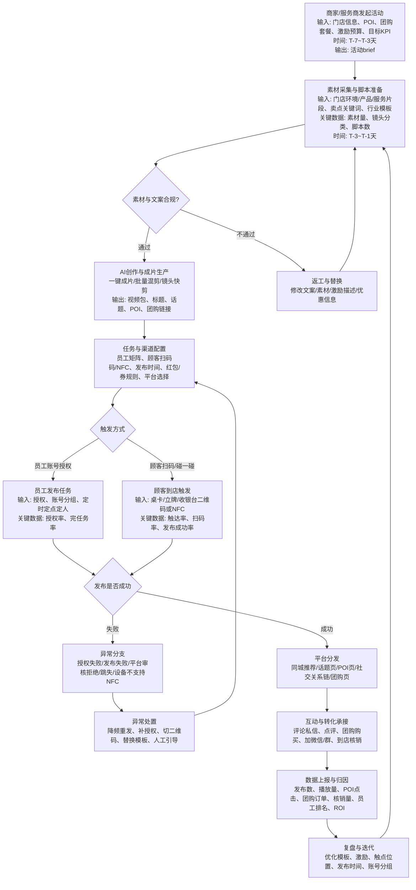
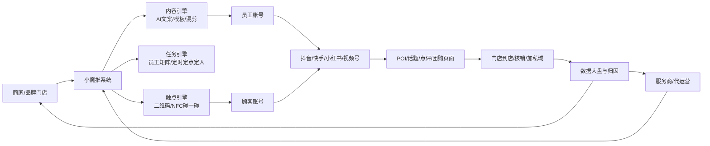
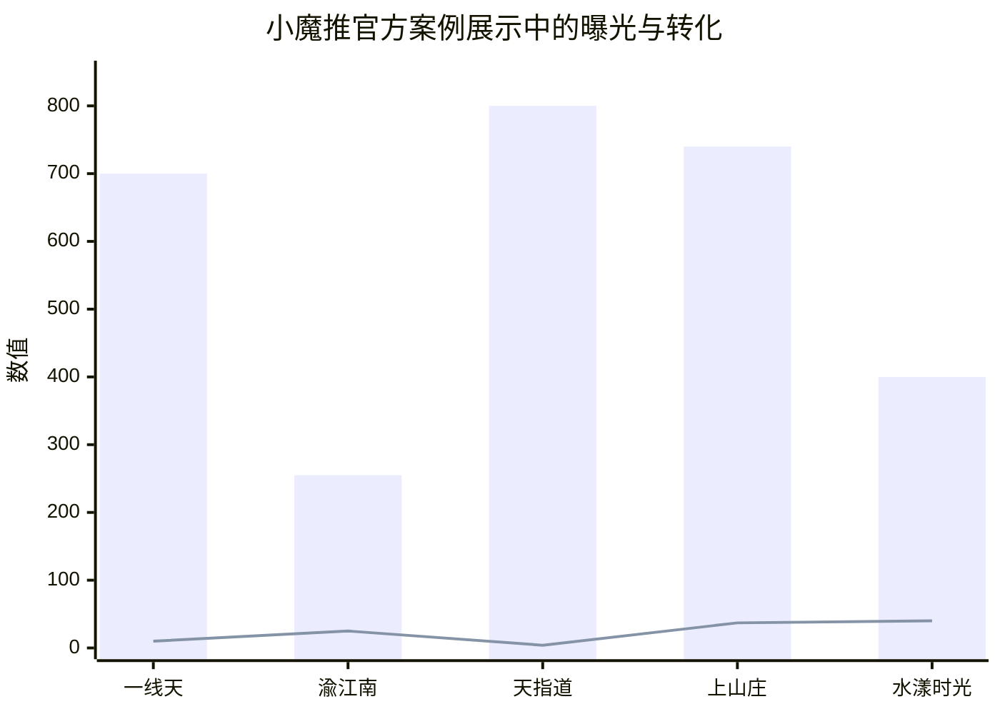

# 小魔推业务流程深度研究报告

## 执行摘要

小魔推的本质，不是单一的“AI 剪辑工具”，而是一个把**线下到店流量、内容生产、账号分发、同城曝光、团购转化与私域沉淀**串成闭环的本地生活营销系统。公开资料显示，它既有“短视频裂变获客系统”的服务市场版本，也在近两年进一步强化了“AI 矩阵营销”“碰一碰/NFC 触发发布”“评论私信管理”“多平台分发”“红包激励”等能力；其典型场景是：商家先在后台配置素材、文案、POI、团购与激励规则，再通过顾客扫码/碰一碰或员工授权发布，把内容分发到抖音、快手、小红书、视频号等平台，最后把曝光导向团购购买、到店核销、点评与私域运营。citeturn0search0turn0search3turn5view0turn6view0turn23view0

从竞品视角看，小魔推最强的并不是“内容 AI”本身，而是把**发布动作前移到门店现场**，并通过**极低操作门槛**把顾客与员工都变成内容分发节点。其业务流程可归纳为：活动策划 → 素材与模板配置 → 成片和任务包生产 → 线下触点触发发布 → 平台分发与同城推荐 → 团购/POI/点评/私域承接 → 数据归因与下一轮优化。这个链条里，真正决定 ROI 的是三件事：一是线下触点转化率，二是内容去同质化能力，三是订单与核销级别的归因能力。公开案例里，小魔推反复强调“扫码/碰一碰发布”“员工矩阵”“POI 挂载”“团购转化”和“数据大盘”，这说明它的增长逻辑是**以线下现有客流撬动线上公域，再以线上转化反哺门店经营**。citeturn2view2turn2view4turn20view1turn21view0turn18search1turn18search4

但它的上限和风险也非常清晰。批量混剪、多账号矩阵、评价引导、红包激励、私信自动化，都天然处在平台治理、广告合规、促销合规、个人信息授权合规的交叉地带。官方法规与平台文档明确要求：个人信息处理要有明确同意、告知和最小必要原则；有奖销售要公开奖项、条件、概率、兑奖方式并遵守金额上限；商业宣传不得利用虚构交易或评价误导消费者；平台授权和能力调用应基于正式登录授权、scope 与 access_token。对竞品设计而言，这意味着下一代替代方案不能只追求“更多账号、更多视频”，而要把**授权留痕、反同质化、真实评价边界、订单级归因和合规引擎**做成系统内核。citeturn9view0turn13view0turn13view1turn13view2turn18search2turn18search5

## 研究设计

本报告研究对象为**“小魔推”及其典型实现形态**，即服务于实体门店/本地生活商家的**短视频裂变获客、矩阵营销、扫码/碰一碰发布、团购/点评/私域联动工具**。时间范围按照你的要求，以**近三年公开资料为主**，重点覆盖 2023–2026 年可以公开访问到的产品页、官方案例、官方/准官方平台条目与法规政策。citeturn0search0turn0search1turn2view3turn2view4turn23view0

信息来源按优先级排序如下：第一层是**抖音开放平台/抖音生活服务开放平台/官方法规**，用于确认产品在公开平台上的定位、授权边界、团购与 POI 能力、服务市场属性以及法律边界；第二层是**小魔推/餐赞官方页面与官方案例**，用于还原其产品能力、典型流程、案例口径与功能模块；第三层是**经授权转载或第三方测评/代理页**，用于补足近期版本功能与市场话术，但这部分仅作为辅助证据，不作为单独的事实基石。抖音服务市场同时明确表示，其本质是服务撮合平台，商业合作后果由商户与服务商双方承担，因此读这些资料时必须把“官方平台展示”与“平台为其背书”区分开。citeturn15search5turn7search4turn0search0turn2view2turn22search4

方法上，本报告采用“**业务流程逆向拆解**”框架：先从产品定位与公开能力页出发，重建“商家如何发起活动—系统如何生成内容—顾客/员工如何触发分发—平台如何承接—如何形成到店与复购”的链路，再将每个环节映射成模块、KPI、风险点与可替代设计。凡是公开资料没有明示的技术实现、数据口径或接口细节，均标注为**“未公开/需验证”**，同时给出较合理的工程假设与验证方法。citeturn6view0turn6view2turn18search1turn18search2turn9view0

## 业务流程全景

从公开描述看，小魔推的业务形态可以被概括为“**SaaS 工具 + 渠道服务商 + 门店活动运营**”的组合。抖音服务市场上公开存在两个相关条目：一个是“小魔推_短视频获客系统”，定位为实体商家短视频裂变推广工具、定制版、面议；另一个是“小魔推”，提供 30 次裂变额度、7 天服务周期的体验型条目。与此同时，官方案例又反复以“服务商为商家打造活动”的口径叙述，这说明它不是单纯按软件售卖，而更像“工具许可 + 运营交付 + 渠道代理”的服务体系。citeturn0search0turn0search3turn3search3turn3search5

### 业务流程图

上图中的每个节点，都能在公开资料里找到对应能力支撑。商家在前端会准备门店素材、卖点、活动和 POI/团购信息；系统侧提供 AI 文案、脚本模板、批量成片、员工矩阵管理与多平台发布；线下侧通过二维码或 NFC“碰一碰”桌卡、立牌、前台/收银位触发；承接侧则连接点评、团购、加私域、Wi‑Fi 等门店经营动作。公开材料还显示，活动可以设置“即领红包、延迟发放、定时发放”等激励规则，且当活动更新时，碰一碰物料“无需更换，仅需后台重新激活”。citeturn6view0turn6view2turn2view2turn20view1turn21view0turn23view0

### 参与者关系图

这张关系图对应的核心商业逻辑是：**小魔推并不直接创造需求，而是把既有门店客流、员工账号资源和平台本地流量机制重新组织起来。**因此，竞品若只做“内容生成”或“账号发布”，往往只能替代其中一段；真正与其正面竞争，需要同时覆盖**内容、触点、分发、承接、归因**五个层面。citeturn5view0turn6view0turn23view0turn18search4

### 关键业务节点与实操含义

| 阶段 | 主要输入 | 主要输出 | 关键数据点 | 典型时间节点 | 关键依赖 |
|---|---|---|---|---|---|
| 活动策划 | 门店目标、团购、预算、行业模板 | 活动 brief、激励规则 | CAC 目标、发布目标、核销目标 | T-7~T-3 天 | POI、团购商品、门店经营计划 |
| 素材准备 | 门店实拍、产品/服务片段、关键词 | 素材库、镜头分类、脚本池 | 素材覆盖率、可复用率 | T-3~T-1 天 | 商家配合、运营标准化 |
| 成片生产 | 模板、AI 文案、标签、POI | 视频包、标题包、话题包 | 成片量、差异化率、过审率 | T-1 天 | 模板质量、反同质化设计 |
| 线下触发 | 桌卡/立牌/NFC/二维码、店员引导 | 扫码/碰一碰访问、授权或发布 | 触达率、扫码率、发布成功率 | 到店现场 | 物料位置、员工引导、设备兼容 |
| 平台分发 | 已发布视频或图文、POI、话题 | 同城曝光、POI 热度、互动 | 播放量、互动率、POI 点击率 | 发布后 0–72 小时 | 平台审核、内容质量、账号健康 |
| 转化承接 | 评论/私信、团购页、点评页、企业微信 | 下单、到店、加私域、评价 | 下单率、核销率、加微率、复购率 | 1–14 天 | 团购产品力、私域 SOP、客服响应 |
| 复盘优化 | 数据大盘、员工排名、订单对账 | 新模板、新激励、新节奏 | ROI、单条获客成本、员工贡献度 | 周复盘/月复盘 | 数据归因能力、跨系统打通 |

表中的时间节点与 KPI 是对公开流程的可执行化抽象，而不是小魔推官方明示的统一运维标准；公开资料能支持的是它确实具备活动配置、模板化生产、员工矩阵、扫码/碰一碰、多平台跳转、点评、团购与数据大盘这些环节。citeturn2view4turn2view2turn23view0turn18search1

### 官方案例展示中的规模感

下面这个图表，使用的是小魔推官方页面披露的案例口径。需要特别说明：这些数字混用了“话题总播放”“话题曝光”“视频播放量”“团购转化单量”等不同统计口径，因此**只能用于理解其打法规模，不宜直接做财务可比分析**。citeturn5view2turn5view4

从这些案例可以看出，小魔推的典型玩法不是“依赖一条爆款视频”，而是依赖**多条内容 + 多触点触发 + 多账号扩散**形成总体曝光。官方案例页展示过单日扫码发布 8700+ 条、单项目话题播放 400 万到 800 万级、团购转化 400 单到 4000 单级的项目，这种数据结构本身就反映出它是一类“铺量型获客系统”。citeturn5view2turn5view4

## 模块拆解

下表按你指定的八个模块拆解，并将“功能、实现、KPI、问题、对策、替代方案”放在同一张执行表里。凡是公开资料未明确说明的实现方式，均标注为“推断”或“未公开/需验证”。

| 模块 | 功能描述 | 实现方式 | 核心 KPI | 常见问题 | 对策 | 可替代方案 | 依据 |
|---|---|---|---|---|---|---|---|
| 素材采集 | 采集门店环境、服务过程、产品细节、优惠信息，形成可批量复用素材库 | 运营侧建立行业镜头清单、门店拍摄 SOP；系统侧支持手机直传、镜头分类、脚本模板调用；连锁门店可共享活动素材但独立 POI | 素材覆盖率、可复用率、素材更新频次、门店参与率 | 拍摄杂乱、镜头不可复用、门店不配合 | 建“门头/环境/服务/产品/优惠/用户反馈”六类镜头池；以周为单位补素材 | 外包拍摄、达人探店素材、自建素材中台 | citeturn2view4turn6view0turn6view2 |
| AI 混剪 / 一键成片 | 批量生成适配同城营销的视频内容，降低剪辑门槛 | 官方公开有“一键成片、批量混剪、镜头快剪”；推断底层是模板引擎 + 变量替换 + 镜头规则 + 文案/字幕/贴片自动组合；部分页面宣称引入大模型文案、图生视频、文生图能力 | 成片量、成片时长分布、过审率、完播率、差异化率 | 同质化、低质感、优惠贴片突兀 | 做模板 AB 版、镜头分层随机、贴片位置/时长优化、敏感词检测 | 剪映企业版 + 自建脚本引擎；易媒助手类混剪 | citeturn2view4turn2view2turn21view2turn23view0 |
| 批量发布 / 矩阵管理 | 统一管理多账号、多门店、多任务的发布节奏 | 官方页面公开“多账号统一管理，视频任务定时定点定人”“轻松管理 1000 个矩阵账号”；员工矩阵支持账号排名、KPI、激励政策 | 授权率、任务完成率、按时发布率、账号活跃率、员工贡献度 | 账号分散、权限混乱、员工执行差 | 按门店/岗位/平台分组；设门店与个人双 KPI；异常账号限频与熔断 | 易媒助手、蚁小二、企业自建多账号后台 | citeturn6view0turn2view4turn16search0turn16search1 |
| 扫码发布 / 授权机制 | 让顾客或员工通过极低门槛完成内容发布、点评或跳转团购 | 官方路径有二维码扫码与 NFC“碰一碰”；员工侧更可能是正式授权流程，抖音开放平台公开采用 OAuth、scope 与 access_token；多平台的具体授权细节未公开/需验证 | 扫码率、碰一碰触发率、授权成功率、发布成功率、跳失率 | 顾客怕麻烦、NFC 兼容性差、授权失败 | 桌卡位前置到收银台/餐桌；NFC+二维码双模；授权失败回落到二维码或图文页 | 纯二维码 H5、企业微信活码、门店小程序码 | citeturn20view1turn23view0turn18search2turn18search5 |
| 活动裂变机制 | 通过红包、折扣券、加赠、抽奖等方式提升参与和二次传播 | 官方公开有“发布即领红包、延迟发放、定时发放”；案例中常见“发视频领微信现金红包”“获赠服务时长/折扣券”；这在法律上属于有奖销售或促销，要公开条件与规则 | 参与率、二次传播率、核销率、单次激励成本、ROI | 薅羊毛、作弊、只领奖不转化 | 绑定订单/到店行为后发放；延迟二次奖励；黑名单；奖励分层 | 会员积分、优惠券、抽奖、加赠服务 | citeturn23view0turn21view0turn21view2turn13view0turn13view1turn13view2 |
| 数据统计 / 归因 | 统计发布、曝光、互动、POI 点击、订单、核销、员工贡献，并用于复盘 | 官方公开“数据大盘”“视频管理”“评论私信管理”；更完整的订单核销归因，推断需要复用生活服务开放平台的 POI、团购核销、订单查询、对账接口；具体映射模型未公开/需验证 | 播放量、互动率、POI 点击率、下单率、核销率、单客成本、员工 ROI | 平台数据回流不全、无法精确对单、口径混乱 | 建统一事件模型；以二维码/NFC/员工码/门店码为主键；POI/订单二次对账 | 抖音来客 + CRM + BI、自建数据仓库 | citeturn2view4turn18search1turn18search4 |
| 自动化客服 / 私信 | 统一处理评论私信，承接意向客户，缩短从曝光到成交的响应时间 | 官方页面公开“对矩阵下所有账号的视频评论、私信进行回复和管理”；行业相近工具常以关键词回复、默认回复、AI 回复实现 | 首响时长、线索转化率、加微率、私信回复率 | 话术过强、误判、平台骚扰风险 | 关键词 + 人工兜底；高意向 leads 转人工；敏感词与频控 | 智能评论助手、获客宝、超级管家 | citeturn2view4turn15search2turn15search3turn15search4 |
| 风控与合规 | 控制授权、内容、评价、促销、隐私与账号健康风险 | 需要把平台授权边界、广告法、个保法、促销规定前置进系统；公开资料未见小魔推完整规则引擎，属于补强空间 | 过审率、异常率、封禁率、投诉率、合规工单关闭率 | 文案夸大、同质化、评价诱导、奖项公示不足、个人信息告知不足 | 上线内容审核、奖励规则公示、授权留痕、撤回同意机制、评价真实性校验 | 自建合规中台、接第三方风控服务 | citeturn9view0turn13view0turn12search0turn12search1turn18search2 |

## 技术与运营实现

### 素材处理与视频生成逻辑

公开资料能确定的是，小魔推至少提供三类内容生产能力：**一键成片、批量混剪、镜头快剪**；它还公开强调“AI 文案”“热门脚本模板”“手机直传”“自动挂载标题、话题和门店 POI”。在一个 2025 年官方案例里，霜叶红项目进一步把这一逻辑展开成更具体的生产过程：员工只需要拍摄服务关键环节，上传后台后，系统会按素材分类随机组合；视频结构采用“痛点引入 → 服务展示 → 优惠引导”，时长控制在约 20 秒，并固定嵌入团购贴片。citeturn2view4turn6view0turn21view1turn21view2

如果把这些公开能力翻译成工程实现，小魔推最可能采用的是“**素材标签化 + 模板化编排 + 变量填充 + 多版本导出**”的生产管线。也就是说，系统并不一定需要真正“理解”所有视频内容，而是先将素材按门头、环境、菜品/服务、用户反馈、优惠信息等维度归类，再将文案、字幕、贴片、POI、话题作为变量注入模板中，最后通过镜头顺序随机化、时长规则、转场组合与音画配置，导出多个差异化版本。这个实现路径与其公开宣称的“镜头快剪”“热门脚本镜头直接套用”“自动组合拼接”“AI 文案生成”是吻合的，但**具体的去重策略、相似度阈值、审核预检算法并未公开，需验证**。citeturn6view2turn21view2turn23view0turn2view2

对竞品设计而言，这个模块的关键不是“能不能批量出片”，而是“**能否批量出片而不过度同质化**”。小魔推官方案例把“不同账号发布差异化内容，以避免同质化限流”直接写了出来，说明它已经意识到这一问题；但从公开材料看，它更偏运营话术，未披露真正的反同质化机制。因此，如果你要做竞品，一个更强的实现方向是增加**素材排重、镜头互斥、口播逻辑树、字幕微变体、区域热词实时注入、账号画像约束**，把“多版本”从随机堆叠升级成“结构性差异化”。现阶段，这部分仍属于**未公开/需验证**。citeturn21view2turn7search1

### 账号管理策略与发布节奏

公开页面已经明确：小魔推支持“多账号统一管理，视频任务定时定点定人”，并且能做员工账号统一管理、查看排名、制定 KPI 与激励政策；另一篇官方文章则声称“轻松管理 1000 个矩阵账号，1 个人就能完成矩阵营销工作”。从产品逻辑看，这意味着它至少已经具备**账号分组、任务下发、发布计划、绩效看板**四项基础能力。citeturn6view0turn2view4

在运营上，小魔推的矩阵并不是单一来源，而是三层结构叠加：第一层是**官方/品牌内容**，用于统一主张和素材模板；第二层是**员工矩阵**，用于稳定、可控、高频的内容分发；第三层是**顾客/现场用户触发的 UGC 分发**，用于把线下客流转换为新增曝光。霜叶红案例明确写到“员工 + 用户全员营销”，并声称话题曝光里一部分来自员工账号、一部分来自用户自发传播；这恰恰说明它的矩阵策略不是传统 MCN 的“精细运营少数大号”，而是更接近**大量中小号的密集合唱**。citeturn21view1turn21view2

公开资料没有披露统一的发布节奏标准，但从其案例口径可以反推出一个事实：它擅长的是**短周期高密度铺量**。比如官方案例页中有“700 条视频”“1300 条视频”“单日扫码发布 8700+ 条”等表述；另一篇文章则写到“一次最高 2000 条”的批量生成能力。因此较合理的运营推断是：小魔推会把活动期拆成“预热—爆发—余热”三个窗口，在爆发期用大量差异化内容和线下物料强刺激刷出同城热度，再用私信、点评、团购和社群承接后链路。至于不同平台的限频、账号冷启动和分时发布参数，公开资料没有明示，属于**未公开/需验证**。citeturn2view4turn5view2turn20view0

### 激励机制设计

激励是小魔推业务流程里最实际、也最容易被低估的一环。它的官方页面已经公开“发布即领红包、延迟发放、定时发放”，案例里又多次出现“扫码发视频领微信现金红包”“发视频可获赠额外服务时长或折扣券”的设计，因此可以确认，小魔推并不是只靠“内容好玩”驱动参与，而是**显性激励**与**即时反馈**并行。citeturn23view0turn21view0turn21view2

从运营执行看，比较可落地的激励链路通常有三种。第一种是**即时激励**，适合新店开业、爆发期冲量，目的是把“看一看”变成“立刻发”；第二种是**延迟二次激励**，官方页面已经公开支持，可用于把“一次发帖”转成“二次复访/复购”；第三种是**非现金激励**，例如加赠服务时长、折扣券、会员权益，这比现金更容易与经营目标绑定。对于竞品而言，最值得复制的不是“红包”本身，而是**按行为质量分层发奖**：比如只扫码不发帖零奖励，发帖过审给基础奖，发帖且完成团购/加微/评价给阶梯奖。这样既降作弊，也更容易把预算压在有效行为上。官方公开资料没有展示小魔推的完整反作弊方案，因此这部分仍需验证。citeturn23view0turn21view0

### 扫码 / 碰一碰 / 授权流程

小魔推当前公开存在两套典型触发方式。第一套是**员工/账号授权矩阵发布**。抖音开放平台公开的授权文档说明，正式的能力调用应基于 OAuth 2.0、scope 和 access_token，授权完成后开发者才能调用用户信息、内容管理、互动管理和平台数据等能力；这为“小魔推如何以较合规的方式接入抖音账号能力”提供了一个标准边界。第二套是**线下二维码/NFC 触发**。官方案例与产品页都明确写到“用户手机轻碰桌卡即可跳转并发布提前编辑好的视频或图文”，并支持点评、加微信/群、团购购买与连 Wi‑Fi。citeturn18search2turn18search5turn20view1turn23view0

真正值得注意的是，这两套机制分别优化了两类不同摩擦。授权矩阵优化的是**持续运营效率**，适合员工/达人/代理分发；扫码或碰一碰优化的是**现场触发效率**，适合把顾客变成传播节点。也因此，小魔推在门店现场很依赖物料位置与导购话术。其旧案例明确提到，二维码会被放在前台收银位置，由收银员在用户下单时一起引导；碰一碰案例则更强调餐桌、休息区、入口、墙面等“高可见、高停留、高动机”的点位。竞品如果只复制二维码，而不解决“何时引导、谁来引导、触发后下一步是什么”，通常效果会打折。citeturn3search7turn20view1turn21view0

### 数据上报与归因方法

小魔推公开描述中已经有“数据大盘”“视频发布情况、播放量、点赞数、评论数、转发数”“员工排名”“评论私信管理”等能力，但并没有公开完整的事件口径说明。要把它做成真正可衡量 ROI 的系统，理论上至少要有五层数据主键：**门店主键、活动主键、触点主键、账号主键、订单主键**。其中门店与订单侧，很可能依赖抖音生活服务开放平台提供的门店关联、POI id、团购核销、订单查询与对账能力；开放文档已经明确，这些能力可以让服务商把自有系统中的门店与抖音 POI 对应起来，并做核销与订单对账。citeturn2view4turn18search1turn18search4

因此，一个较合理的归因实现，会是这样的：线下每个二维码/NFC 物料都带有唯一触点 ID；员工矩阵使用专属推广码；发布成功后记录平台、账号、时间、素材包版本；再将 POI 点击、团购下单、核销、加私域、评价等事件映射回触点与账号维度。这样才可能算出“哪家门店、哪类素材、哪个员工、哪个物料位、哪种激励”最有效。公开资料没有证明小魔推已经把这一套做到订单级，但从其不断强调 POI、团购、数据复盘、员工排名来看，做深入归因是非常自然的下一步。现阶段应标注为**未公开/需验证**。citeturn18search1turn18search4turn2view4

## 风险与合规

### 风险本质

小魔推所在赛道的主要风险，并不来自“AI 生成视频”本身，而来自它把**内容生产、账号分发、现场用户激励、评价引导与私域沉淀**揉到了一起。这会同时碰到平台规则、促销规则、广告规则和个人信息规则。尤其是“发视频领红包”“引导写点评”“员工账号统一管理”“自动回复私信”这些能力，看起来彼此独立，实际上在合规上是联动的。citeturn23view0turn13view0turn18search2turn9view0

### 风险矩阵与缓解建议

| 风险类型 | 触发场景 | 主要后果 | 缓解建议 | 法规/平台依据 |
|---|---|---|---|---|
| 平台风控与账号处罚 | 批量混剪、同模板高频铺量、多账号同步发布、异常自动化操作 | 视频限流、审核拒绝、账号功能受限，严重时封禁；公开资料未见小魔推专项处罚案例，但该风险是批量矩阵工具的天然风险 | 做素材分层、模板 AB 版、发布时间错峰、账号分组限频；优先走正式授权链路；保留发布日志与授权记录 | 抖音开放平台强调正式授权、scope 与 access_token；服务商平台强调平台规则效力。具体反同质化参数未公开，需验证。citeturn18search2turn18search5turn9view4 |
| 用户隐私与授权 | 顾客扫码/碰一碰、员工账号授权、加微信/群、评论私信承接 | 用户投诉、数据合规风险、合作方审计不过 | 在触发页清晰告知处理目的、方式、范围、保存期限；支持撤回同意；按最小必要原则采集；员工授权与顾客触发分开设计 | 个人信息保护法要求合法、正当、必要、公开透明，并要求同意、告知和便捷撤回。citeturn9view0turn12search3 |
| 评价与口碑合规 | 引导顾客去点评平台“提升好评度” | 虚假宣传、平台治理处罚、商誉受损 | 只能引导**真实体验后的自愿评价**，不得脚本化要求统一五星或虚构交易；避免“未体验先评价” | 《规范促销行为暂行规定》要求不得利用虚假商业信息、虚构交易或者评价误导消费者。citeturn13view0 |
| 红包/抽奖/优惠活动合规 | 发视频领红包、抽奖、代金券、折扣券、延迟奖励 | 被认定为有奖销售不规范、被监管处罚、用户争议 | 在页面显著公示参与条件、开奖/到账方式、金额/概率、兑奖时间、限制条件、主办方联系方式；对抽奖上限做系统校验 | 市监总局规定，为推广移动客户端、招揽客户、获取流量而附带提供利益，属于有奖销售；须事先公布规则，抽奖式最高奖不得超过 5 万元，并保存记录两年。citeturn13view0turn13view1turn13view2 |
| 广告与商业宣传 | 视频中宣传疗效、极限词、虚假价格、含糊折扣条件 | 行政处罚、投诉退款、平台审核不过 | 建立行业词库和素材审核；价格/折扣要有基准价与期限；医疗/教育/金融等高敏感行业加人工复核 | 广告法适用于商业广告活动；广告经营者、发布者明知或应知虚假仍发布会被处罚。citeturn12search0turn12search1turn13view0 |
| 渠道与服务交付风险 | 商户把服务市场展示误解为平台背书 | 采购决策失真、售后争议、服务商纠纷 | 采购前审查服务商资质、接口边界、成功案例真实性、退款条款与交付 SLA | 抖音服务市场明确是撮合平台，因商业合作产生的后果由商户与服务商双方承担。citeturn15search5turn7search4 |

### 竞品设计中的合规底线

如果从“替代小魔推”的角度看，最不应该复制的，是把“好评营销”做成灰色操作。小魔推官方页面会使用“提升好评度、翻倍流量”这类业务表达，但法规边界非常明确：你可以引导用户评价，但不能通过虚构交易、虚构评价或误导性的奖励机制制造虚假口碑。一个更稳妥的产品做法，是把“评价”改写成**体验反馈**与**真实晒图激励**，并在系统中加入“必须先完成消费并触发到店记录，才能进入评价引导页”的约束。citeturn23view0turn13view0

另一条底线是授权与数据。小魔推这类系统要想持续经营，不可能长期依赖模糊授权或“半自动”方式；平台公开文档已经给出正式登录授权和能力调用边界。因此，更强的竞品不应把“更多账号”作为唯一卖点，而要把“**透明授权—可撤回授权—权限分层—留痕审计**”作为企业级能力卖点，这反而会更容易打中连锁品牌和中大型服务商。citeturn18search2turn18search5turn18search0

## 竞品与机会

### 竞品对比表

下表把小魔推放在基准位，再选取至少六个相近工具或替代方案。它们并非全部一模一样，但在“内容生成—多账号矩阵—门店获客—私信/评论承接—同城引流”这条价值链上与小魔推存在竞争、替代或互补关系。citeturn15search0turn15search1turn15search2turn15search3turn16search0turn16search1turn17search4

| 产品 | 定位 | 核心功能 | 裂变机制 | 技术亮点 | 价格 / 商业模式 | 目标客户 | 优势 | 劣势 |
|---|---|---|---|---|---|---|---|---|
| 小魔推 | 本地生活短视频裂变获客 / 矩阵营销工具 | AI 文案、模板化成片、批量混剪、员工矩阵、扫码/NFC 碰一碰、点评/团购/加私域、数据大盘 | 顾客到店扫码/碰一碰 + 员工矩阵 + 多平台内容扩散 | 线下触点前置、POI/团购/点评联动、活动物料可复用 | 服务市场有面议定制版，也有 30 次裂变体验版；同时存在服务商交付模式 | 实体门店、连锁、本地生活服务商、地推团队 | 最贴近门店现场、把线下客流直接变成线上分发节点 | 合规与平台风控压力大；公开资料中订单级归因细节不足；较依赖线下执行 | citeturn0search0turn0search3turn23view0 |
| 及时推商家版 | 同城引流系统 | 同城曝光、周边潜客触达 | 以同城分发与投稿曝光为主 | 强调“100% 同城粉丝/曝光”的同城场景 | 12 个月 3980 元 | 需要引流到店的实体商家 | 价格清晰、定位集中在“同城引流” | 内容生产、线下触点、评价/团购联动不如小魔推完整 | citeturn15search0 |
| 抖爱推 | 短视频综合运营系统 | 内容制作、发布、管理、统计 | 更偏企业/矩阵账号运营裂变 | 强调综合运营与低成本获客 | 6 个月 3800 元起 | 企业、矩阵用户 | 覆盖“做内容 + 发内容 + 看数据”的基本闭环 | 线下扫码/NFC 与门店点评/团购场景较弱 | citeturn15search1 |
| 获客宝 | 自动获客转化神器 | 创意视频剪同款、自动私信、线索获取 | 以内容吸粉 + 私信转化为主 | 强调自动私信与大规模线索累计 | 体验版免费；正式版本 999 元起 | 企业商家、重线索行业 | 在线索型业务上转化链较强，评论/私信承接能力更突出 | 弱于门店现场触发与线下用户裂变；偏线上获客 | citeturn15search2 |
| 超级管家 | 企业号私域获客助手 | 流量转粉、私域沉淀、自动获客 | 以企业号内容运营后沉淀私域 | 强调 AI 智能营销与转粉 | 免费体验，企业级付费 | 抖音企业号商家 | 私域沉淀、安全感较强，适合企业号正向经营 | 不是强内容生产或线下触点工具，替代不了“到店扫码发视频” | citeturn15search3 |
| 易媒助手 | 跨平台自媒体矩阵管理 | 70+ 平台管理、批量发布、AI 混剪、评论私信聚合、POI 团购挂载 | 多账号多平台矩阵发布 | 平台覆盖广，团队权限与数据导出成熟 | 官网首页未明示价格，会员制/企业版常见 | 品牌、新媒体团队、MCN、渠道运营 | 平台覆盖最广，适合内容中台与组织化运营 | 不解决门店现场触发与顾客裂变；更像内容分发中台 | citeturn16search0turn16search3 |
| 蚁小二 | 自媒体多平台分发管理 | 多账号一键分发、团队管理、数据分析、私有化/OEM | 平台矩阵分发 | 支持开放平台接入、私有化、品牌定制 | 官网未明示标准价，支持定制与私有化 | 媒体机构、企业团队、渠道商 | 更适合作为底层分发能力或 OEM 能力 | 获客闭环、门店转化与线下引导能力不足 | citeturn16search1turn16search4 |
| 巨量本地推 | 官方生活服务营销投放平台 | 推广短视频、直播间，实现门店获客、团购成单、涨粉 | 广告投放驱动，不是 UGC 裂变 | 官方投放平台，与抖音来客衔接 | 按投放预算计费 | 生活服务商家 | 官方流量工具，确定性强，适合放大成熟内容 | 不能替代小魔推的“顾客/员工现场分发”机制；成本结构不同 | citeturn17search3turn17search4 |

### 可复制点与差异化机会

真正可复制的，不只是小魔推公开展示出来的功能，而是其背后的“经营逻辑”。下面这张表，把可复制点与差异化方向同时列出，便于直接转成产品路线图。citeturn6view0turn23view0turn18search1

| 层面 | 小魔推可复制点 | 更有机会的差异化方向 |
|---|---|---|
| 产品 | 把顾客扫码/碰一碰做成“内容分发入口”，大幅降低参与门槛 | 做成“统一经营触点”，让一个触点可根据用户状态动态分流到发视频、评价、加微、领券、预约，而不是固定落一个动作 |
| 产品 | 员工矩阵任务化，支持定时定点定人和排名 | 引入“账号健康分 + 任务难度分 + 产出质量分”，避免只考核数量 |
| 产品 | 连锁门店共素材、独立 POI | 再往前一步，接 POS/CRM/会员系统，实现“总部内容中台 + 门店经营中台” |
| 运营 | 红包、折扣、加赠等显性激励提升参与率 | 用 LTV 导向的分层激励替代单次红包，优先奖励加微、首单、复购和高客单行为 |
| 运营 | 店内物料位前置到餐桌、收银台、入口，依赖导购话术 | 用摄像头热区、客流路径分析或门店巡检表优化最优触点位，降低对店员口头引导的依赖 |
| 技术 | AI 文案 + 模板化成片 + 批量混剪 | 做“反同质化引擎”，对镜头、字幕、口播、话题、时长、封面做结构性差异化，而不是仅随机拼接 |
| 技术 | 多平台一键发布 | 做“平台策略编排器”，依据平台特性自动调整标题、封面、时长、话题、首评与发布时间 |
| 技术 | 数据大盘 + 员工排名 | 做订单级归因，把曝光、POI 点击、团购下单、核销、评价、私域沉淀统一到一个 ROI 模型 |
| 商业模式 | SaaS + 服务商交付 + 行业案例获客 | 增加“自助版 + 品牌版 + 渠道版 + 私有化版”四层套餐，扩大客群覆盖 |
| 商业模式 | 面向本地生活服务商、地推团队和实体门店 | 向高复购强服务行业深挖，如医美、健身、教育、康养、汽车后市场，把经营 SaaS 能力做厚 |
| 合规 | 借官方开放平台与服务市场获客 | 把“授权留痕、促销规则校验、评价真实性边界、行业敏感词审核”做成卖点，反向建立信任壁垒 |
| 生态 | 支持点评、团购、加微信/群 | 接抖音来客与官方投放工具，形成“内容裂变 + 官方投放放大”的双引擎增长模型 |

如果要把这些机会压缩成一句话，那就是：**小魔推证明了“现场触发式短视频裂变”是成立的，但下一代产品的胜负手，不在于多一个平台入口，而在于把触点、归因、合规和经营深度整合。**citeturn23view0turn17search3turn17search4turn18search1

## 验证计划与参考来源

### 推荐的验证 / 实验计划

公开资料没有披露小魔推各环节的统一基线，因此下面的实验计划采用的是**假设基线**，目的是提供一个可以直接执行的验证框架。样本量为双侧检验、显著性水平 0.05、把握度 0.8 的粗略估算，实际执行时应按你的行业基线重算。

| 实验主题 | 假设 | 核心指标 | 假设基线 | 目标提升 | 粗估样本量 | 预计周期 | 成功判定 |
|---|---|---|---|---|---|---|---|
| NFC 碰一碰 vs 二维码 | NFC 触发比二维码更低摩擦，能提高发布率 | 触点到发布转化率 | 12% | +3 个百分点到 15% | 约 2034 人 / 组 | 2 周 | 提升 ≥ 3pp，且激励成本增幅不超过 15% |
| 即时红包 vs 延迟二次红包 | 延迟二次红包能提高复访/复购，不显著拉低首发率 | 发布到 14 日核销率 | 8% | +2 个百分点到 10% | 约 3210 人 / 组 | 4 周 | 核销率提升显著，单核销成本下降或持平 |
| 20 秒模板 vs 35 秒模板 | 20 秒更适合同城场景，提高完播率与点击 POI | 完播率、POI 点击率 | 完播率 70% | +5 个百分点到 75% | 约 1250 条 / 组 | 1–2 周 | 完播率和 POI 点击率至少一项显著提升，另一项不下降 |
| 现金红包 vs 非现金加赠 | 非现金加赠可降低作弊并提高真实消费意愿 | 发布到首单率 | 6% | +2 个百分点到 8% | 约 2551 人 / 组 | 3 周 | 首单率显著提升，作弊率下降 |
| 排名榜单 + KPI vs 无榜单 | 员工可视化排名能提升任务完成度 | 员工按时发布率 | 25% | +5 个百分点到 30% | 约 1250 次任务 / 组 | 2 周 | 按时发布率提升且账号异常率不升高 |

### 建议时间线

第一阶段应先做**“触点效率”实验**，也就是 NFC vs 二维码、物料位 A/B、导购话术 A/B。这个阶段的目标不是看 GMV，而是先把“到店用户愿不愿意动作”做顺。因为如果扫码率和发布率都起不来，后面再好的内容和激励都很难放大。这个阶段建议 2 周，按门店或时段随机。  

第二阶段做**“内容效率”实验**，重点比较视频时长、模板样式、首帧画面、优惠信息贴片、平台话题写法与发布时间。目标是把“发布成功”进一步转成“播放、完播、POI 点击”。这一阶段建议 1–2 周，以内容包随机。  

第三阶段做**“经营效率”实验**，也就是红包方案、评价引导路径、团购承接路径、评论私信优先级、加微话术。这个阶段才真正看下单、核销、复购和私域沉淀。建议 4 周，因为核销与复购需要更长窗口。  

第四阶段做**“组织效率”实验**，例如员工 KPI、门店经理推动机制、服务商激励、品牌总部共素材 vs 门店自治。这个阶段的目标是把模型从“单店有效”变成“规模可复制”。citeturn6view0turn2view4turn23view0

### 参考来源清单

以下按优先级列出本报告最重要的原始与准原始资料。由于你明确要求 URL，下面以代码格式给出可直接访问的地址。

#### 官方平台与法规

- 抖音开放平台服务市场首页  
  `https://developer.open-douyin.com/service-market/home`

- 小魔推_短视频获客系统  
  `https://developer.open-douyin.com/service-market/market-detail/6995435548512965646`

- 小魔推  
  `https://developer.open-douyin.com/service-market/market-detail/6985160441626448903`

- 生活服务开放平台介绍  
  `https://partner.open-douyin.com/docs/resource/zh-CN/local-life/connect/partner/life-open-platform`

- 到综团购对接方案介绍  
  `https://partner.open-douyin.com/docs/resource/zh-CN/local-life/develop/OpenAPI/comprehensive/in-store-industry/group-buying-integration`

- 抖音登录和授权  
  `https://developer.open-douyin.com/m/docs/resource/zh-CN/dop/ability/user-authorization/`

- 登录与授权  
  `https://developer.open-douyin.com/docs/resource/zh-CN/dop/develop/sdk/mobile-app/permission/overall-permission`

- 服务商入驻协议  
  `https://developer.open-douyin.com/docs/resource/zh-CN/thirdparty/SA/service-provider-protocol`

- 中华人民共和国个人信息保护法  
  `https://www.cac.gov.cn/2021-08/20/c_1631050028355286.htm`

- 中华人民共和国广告法  
  `https://www.npc.gov.cn/npc/c1773/c1848/c21114/c25274/c25277/201905/t20190521_207459.html`

- 规范促销行为暂行规定  
  `https://www.samr.gov.cn/cms_files/filemanager/samr/www/samrnew/samrgkml/nsjg/fgs/202011/W020211127392523016107.pdf`

#### 小魔推 / 餐赞官方页面与案例

- 小魔推 AI 短视频矩阵营销推广工具  
  `https://www.canzan.com/xmt/index.html`

- 小魔推碰一碰  
  `https://www.canzan.com/xman-peng.html`

- 推荐功能页  
  `https://www.canzan.com/xinwen/1566.html`

- 如何借助小魔推玩转矩阵营销  
  `https://www.canzan.com/xinwen/1646.html`

- 小魔推案例总入口  
  `https://www.canzan.com/xmtcase/`

- 霜叶红案例  
  `https://www.canzan.com/xmtcase/97.html`

- 海鲜门店碰一碰案例  
  `https://www.canzan.com/xmtcase/93.html`

- 实体商家碰一碰案例  
  `https://www.canzan.com/xinwen/1963.html`

#### 第三方测评与行业相近工具

- 数英授权发表：小魔推多平台营销  
  `https://www.digitaling.com/articles/1479862.html`

- 及时推商家版  
  `https://developer.open-douyin.com/service-market/market-detail/7182509401763233824`

- 抖爱推  
  `https://developer.open-douyin.com/service-market/market-detail/7223300011717623864`

- 获客宝  
  `https://developer.open-douyin.com/service-market/market-detail/6966929640195740680`

- 超级管家  
  `https://developer.open-douyin.com/service-market/market-detail/7011388803172652040`

- 易媒助手官网  
  `https://yimeizhushou.com/`

- 蚁小二官网  
  `https://www.yixiaoer.cn/`

- 巨量本地推课程介绍  
  `https://school.oceanengine.com/premium/course/7094946924830130183/intro`

整体结论可以压缩成一句话：小魔推已经把“**门店现场触发 × AI 内容生产 × 矩阵分发 × 团购承接**”这条链路跑通了；如果你要做竞品，真正值得赢的方向不是“多一个发布按钮”，而是**更强的归因、更稳的授权、更低的同质化、更可审计的合规和更深的经营系统整合**。citeturn0search0turn23view0turn18search1turn9view0